# Main Layout System

<cite>
**Referenced Files in This Document**
- [layout.tsx](file://src/app/layout.tsx)
- [main-layout.tsx](file://src/components/main-layout.tsx)
- [middleware.ts](file://middleware.ts)
- [auth.ts](file://src/lib/auth.ts)
- [AuthGuard.tsx](file://src/components/AuthGuard.tsx)
- [UserMenu.tsx](file://src/components/UserMenu.tsx)
- [quadrant-left-sidebar.tsx](file://src/components/quadrant-left-sidebar.tsx)
- [task-pool.tsx](file://src/components/task-pool.tsx)
- [chat-wrapper.tsx](file://src/components/chat-wrapper.tsx)
- [plans/page.tsx](file://src/app/plans/page.tsx)
- [globals.css](file://src/app/globals.css)
- [page.tsx](file://src/app/plans/page.tsx)
- [page.tsx](file://src/app/goals/page.tsx)
- [page.tsx](file://src/app/progress/page.tsx)
- [package.json](file://package.json)
- [next.config.ts](file://next.config.ts)
</cite>

## Update Summary
**Changes Made**
- Enhanced drag-and-drop capabilities section with improved collision detection
- Added HTML5 drag-and-drop support documentation
- Updated quadrant sidebar component analysis with new features
- Added task pool component documentation showing complementary drag-and-drop functionality
- Updated dependency analysis to reflect @dnd-kit improvements

## Table of Contents
1. [Introduction](#introduction)
2. [Project Structure](#project-structure)
3. [Core Components](#core-components)
4. [Architecture Overview](#architecture-overview)
5. [Detailed Component Analysis](#detailed-component-analysis)
6. [Enhanced Drag-and-Drop System](#enhanced-drag-and-drop-system)
7. [Dependency Analysis](#dependency-analysis)
8. [Performance Considerations](#performance-considerations)
9. [Troubleshooting Guide](#troubleshooting-guide)
10. [Conclusion](#conclusion)

## Introduction

The Main Layout System is the foundational framework that orchestrates the user interface structure for the Goal Mate application. This system provides a responsive, AI-integrated layout that adapts seamlessly across different screen sizes while maintaining consistent navigation and functionality. The layout system combines traditional web layout patterns with modern AI assistant integration, creating a unified user experience that supports goal management, plan tracking, and progress monitoring.

The system is built around three core pillars: responsive layout architecture, AI assistant integration, and authentication-aware routing. It ensures optimal user experience across desktop, tablet, and mobile devices while providing intelligent assistance through integrated AI capabilities.

**Updated** Enhanced with advanced drag-and-drop capabilities featuring improved collision detection and HTML5 support for seamless task management across the application.

## Project Structure

The layout system follows a modular architecture with clear separation of concerns:

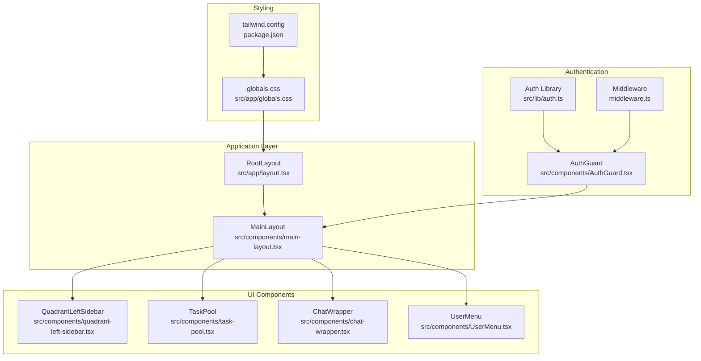

**Diagram sources**
- [layout.tsx:16-30](file://src/app/layout.tsx#L16-L30)
- [main-layout.tsx:12-69](file://src/components/main-layout.tsx#L12-L69)
- [quadrant-left-sidebar.tsx:229-395](file://src/components/quadrant-left-sidebar.tsx#L229-L395)
- [task-pool.tsx:114-264](file://src/components/task-pool.tsx#L114-L264)
- [chat-wrapper.tsx:7-709](file://src/components/chat-wrapper.tsx#L7-L709)

**Section sources**
- [layout.tsx:1-31](file://src/app/layout.tsx#L1-L31)
- [main-layout.tsx:1-69](file://src/components/main-layout.tsx#L1-L69)
- [globals.css:1-380](file://src/app/globals.css#L1-L380)

## Core Components

### Root Layout Container

The Root Layout serves as the primary container that establishes the global application structure and AI integration foundation. It provides essential metadata, viewport configuration, and wraps the entire application with AI assistant capabilities.

Key characteristics:
- **Metadata Management**: Defines application title and description for SEO and browser compatibility
- **Viewport Configuration**: Ensures proper mobile responsiveness and device scaling
- **AI Integration**: Wraps the entire application with CopilotKit for AI assistant functionality
- **Global Styling**: Imports comprehensive CSS framework and theme variables

### Main Layout Architecture

The Main Layout implements a sophisticated three-column responsive design optimized for productivity workflows:

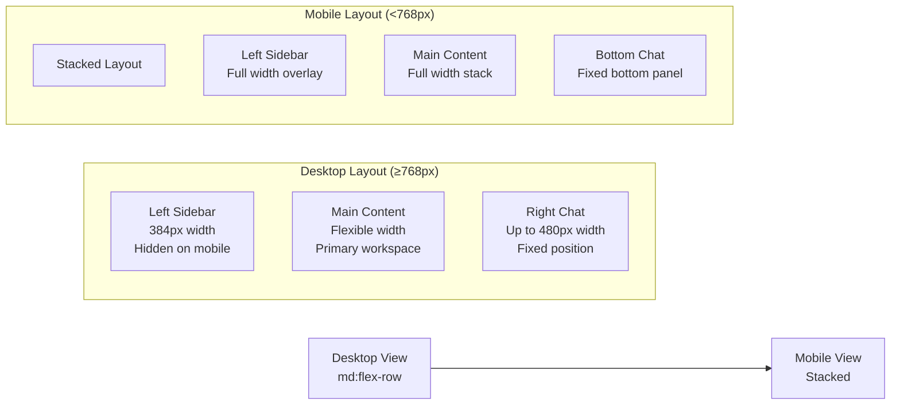

**Diagram sources**
- [main-layout.tsx:14-26](file://src/components/main-layout.tsx#L14-L26)

The layout employs advanced CSS techniques including:
- **Flexbox Grid System**: Utilizes `flex` and `flex-col` for responsive positioning
- **CSS Custom Properties**: Leverages `dvh` units for dynamic viewport height calculations
- **Tailwind Variants**: Implements responsive breakpoints (`md:`, `sm:`) for adaptive behavior
- **Overflow Management**: Carefully manages scroll behavior across different layout modes

### AI Assistant Integration

The Chat Wrapper component provides seamless AI assistant functionality with sophisticated rendering and styling:

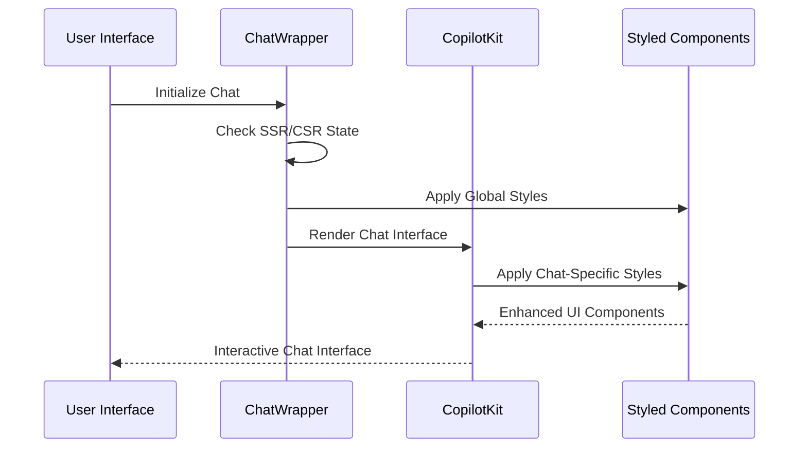

**Diagram sources**
- [chat-wrapper.tsx:7-709](file://src/components/chat-wrapper.tsx#L7-L709)

**Section sources**
- [layout.tsx:16-30](file://src/app/layout.tsx#L16-L30)
- [main-layout.tsx:12-69](file://src/components/main-layout.tsx#L12-L69)
- [chat-wrapper.tsx:7-709](file://src/components/chat-wrapper.tsx#L7-L709)

## Architecture Overview

The Main Layout System operates through a multi-layered architecture that ensures scalability, maintainability, and optimal user experience:

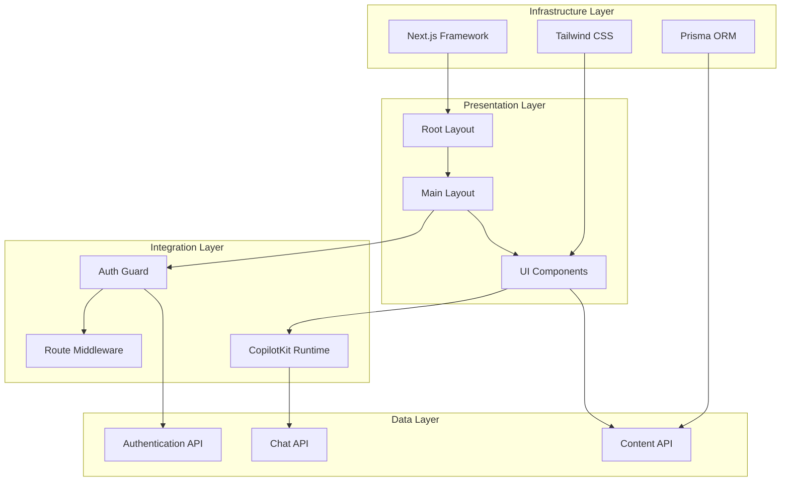

**Diagram sources**
- [layout.tsx:24-26](file://src/app/layout.tsx#L24-L26)
- [AuthGuard.tsx:10-53](file://src/components/AuthGuard.tsx#L10-L53)
- [middleware.ts:3-40](file://middleware.ts#L3-L40)

The architecture emphasizes:
- **Separation of Concerns**: Clear boundaries between presentation, integration, and data layers
- **Asynchronous Operations**: Non-blocking authentication checks and API integrations
- **Responsive Design**: Adaptive layouts that work across all device sizes
- **AI Integration**: Seamless incorporation of AI assistant capabilities

**Section sources**
- [layout.tsx:1-31](file://src/app/layout.tsx#L1-L31)
- [AuthGuard.tsx:1-53](file://src/components/AuthGuard.tsx#L1-L53)
- [middleware.ts:1-40](file://middleware.ts#L1-L40)

## Detailed Component Analysis

### Authentication and Security System

The authentication system provides robust security through multiple layers of protection:

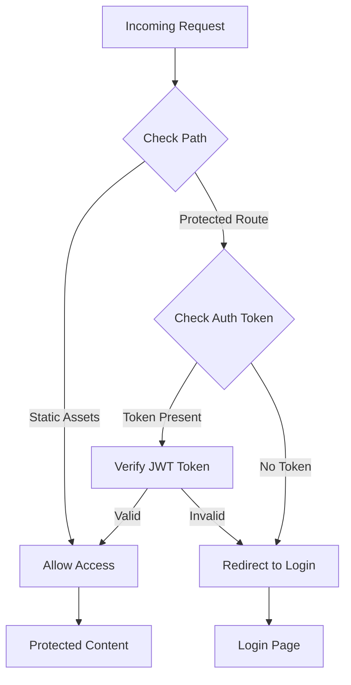

**Diagram sources**
- [middleware.ts:3-40](file://middleware.ts#L3-L40)
- [auth.ts:49-69](file://src/lib/auth.ts#L49-L69)

The system implements:
- **Token-Based Authentication**: Uses JWT tokens stored in cookies for session management
- **Route Protection**: Automatic redirection for unauthenticated users accessing protected routes
- **API Endpoint Security**: Direct 401 responses for unauthorized API requests
- **Client-Side Validation**: Real-time authentication checking through `/api/auth/me` endpoint

### Navigation and User Interface Components

The layout system coordinates multiple UI components that work together to provide a cohesive user experience:

#### Quadrant Left Sidebar

The Quadrant Left Sidebar implements an advanced drag-and-drop interface for task management with enhanced collision detection and HTML5 support:

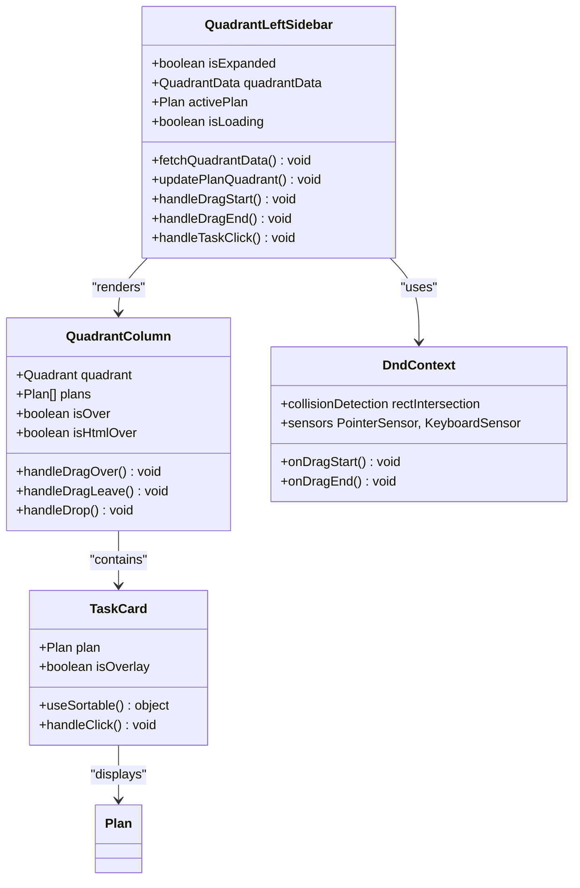

**Diagram sources**
- [quadrant-left-sidebar.tsx:229-395](file://src/components/quadrant-left-sidebar.tsx#L229-L395)
- [quadrant-left-sidebar.tsx:156-227](file://src/components/quadrant-left-sidebar.tsx#L156-L227)
- [quadrant-left-sidebar.tsx:92-148](file://src/components/quadrant-left-sidebar.tsx#L92-L148)
- [quadrant-left-sidebar.tsx:524-546](file://src/components/quadrant-left-sidebar.tsx#L524-L546)

**Updated** Enhanced with HTML5 drag-and-drop support for cross-component task movement and improved collision detection using rectangle intersection algorithms.

#### User Menu System

The User Menu provides comprehensive user account management:

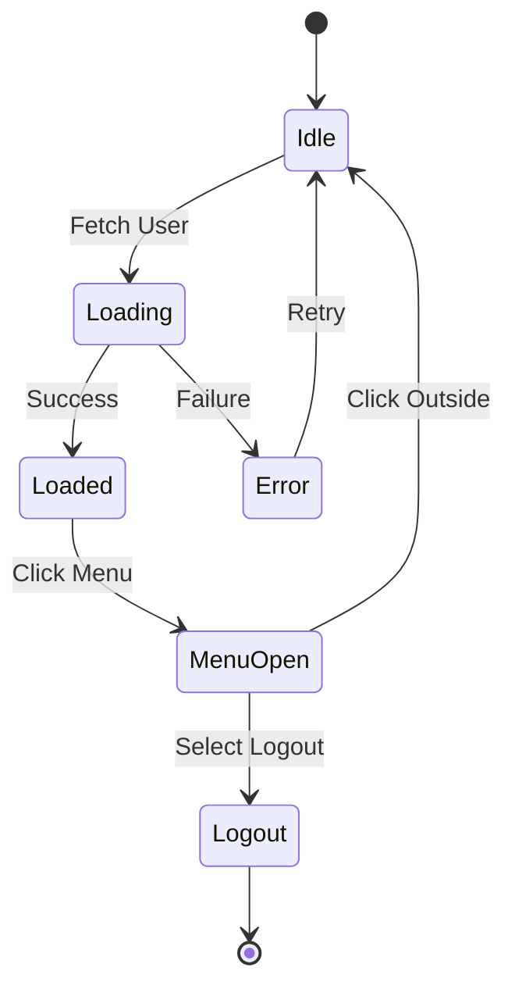

**Diagram sources**
- [UserMenu.tsx:10-104](file://src/components/UserMenu.tsx#L10-L104)

**Section sources**
- [quadrant-left-sidebar.tsx:1-558](file://src/components/quadrant-left-sidebar.tsx#L1-L558)
- [UserMenu.tsx:1-104](file://src/components/UserMenu.tsx#L1-L104)
- [auth.ts:1-69](file://src/lib/auth.ts#L1-L69)

### Responsive Design Implementation

The layout system implements sophisticated responsive design patterns:

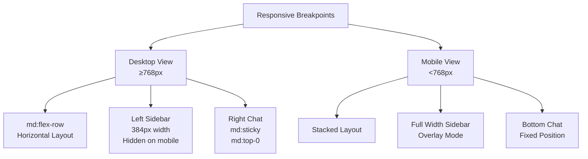

**Diagram sources**
- [main-layout.tsx:14-26](file://src/components/main-layout.tsx#L14-L26)
- [globals.css:359-380](file://src/app/globals.css#L359-L380)

**Section sources**
- [main-layout.tsx:1-69](file://src/components/main-layout.tsx#L1-L69)
- [globals.css:359-380](file://src/app/globals.css#L359-L380)

## Enhanced Drag-and-Drop System

**New Section** The Main Layout System now features an advanced drag-and-drop system that provides seamless task management across multiple components with enhanced collision detection and HTML5 support.

### Advanced Collision Detection

The system implements sophisticated collision detection algorithms to ensure precise task placement:

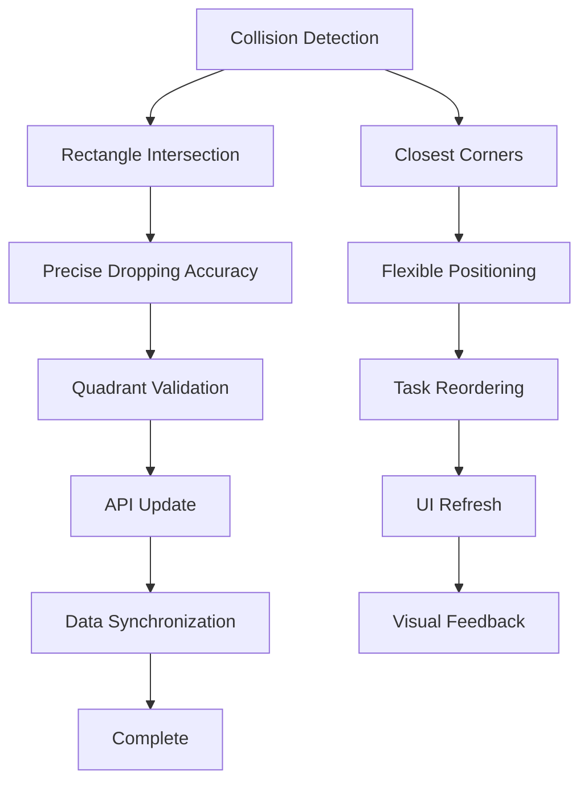

**Diagram sources**
- [quadrant-left-sidebar.tsx:525-526](file://src/components/quadrant-left-sidebar.tsx#L525-L526)
- [task-pool.tsx:229](file://src/components/task-pool.tsx#L229)

### HTML5 Drag-and-Drop Integration

The system supports native HTML5 drag-and-drop for cross-component task movement:

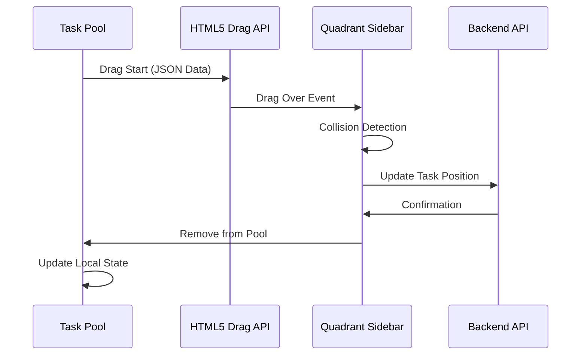

**Diagram sources**
- [quadrant-left-sidebar.tsx:284-310](file://src/components/quadrant-left-sidebar.tsx#L284-L310)
- [plans/page.tsx:66-75](file://src/app/plans/page.tsx#L66-L75)

### Component Coordination

The drag-and-drop system coordinates multiple components for seamless task management:

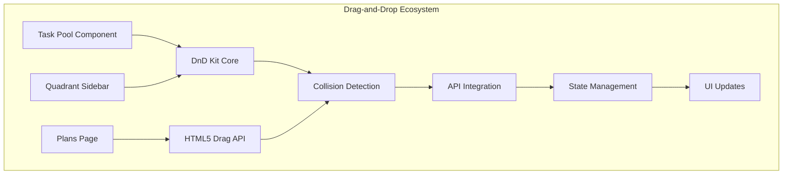

**Diagram sources**
- [task-pool.tsx:114-192](file://src/components/task-pool.tsx#L114-L192)
- [quadrant-left-sidebar.tsx:435-454](file://src/components/quadrant-left-sidebar.tsx#L435-L454)
- [plans/page.tsx:54-98](file://src/app/plans/page.tsx#L54-L98)

**Section sources**
- [quadrant-left-sidebar.tsx:278-310](file://src/components/quadrant-left-sidebar.tsx#L278-L310)
- [task-pool.tsx:114-192](file://src/components/task-pool.tsx#L114-L192)
- [plans/page.tsx:54-98](file://src/app/plans/page.tsx#L54-L98)

## Dependency Analysis

The Main Layout System has well-defined dependencies that support modularity and maintainability:

```mermaid
graph TB
subgraph "External Dependencies"
NextJS[Next.js 15.3.6]
Tailwind[Tailwind CSS 4]
CopilotKit[@copilotkit/react-ui 1.8.13]
DnDKit[@dnd-kit/core 6.3.1]
DnDKitSortable[@dnd-kit/sortable 10.0.0]
DnDKitUtilities[@dnd-kit/utilities 3.2.2]
RadixUI[@radix-ui/react-*]
HTML5[Native HTML5 Drag API]
end
subgraph "Internal Dependencies"
LayoutSystem[Layout System]
AuthSystem[Authentication System]
UIComponents[UI Components]
APIHandlers[API Handlers]
end
subgraph "Development Dependencies"
TypeScript[TypeScript 5]
ESLint[ESLint 9]
Prisma[Prisma 6.8.2]
end
NextJS --> LayoutSystem
Tailwind --> LayoutSystem
CopilotKit --> LayoutSystem
DnDKit --> UIComponents
DnDKitSortable --> UIComponents
DnDKitUtilities --> UIComponents
HTML5 --> UIComponents
RadixUI --> UIComponents
LayoutSystem --> AuthSystem
LayoutSystem --> UIComponents
UIComponents --> APIHandlers
TypeScript --> NextJS
ESLint --> NextJS
Prisma --> APIHandlers
```

**Diagram sources**
- [package.json:16-43](file://package.json#L16-L43)
- [next.config.ts:1-29](file://next.config.ts#L1-29)

**Updated** Enhanced with @dnd-kit/sortable 10.0.0 and @dnd-kit/utilities 3.2.2 for improved drag-and-drop functionality and collision detection.

**Section sources**
- [package.json:1-60](file://package.json#L1-L60)
- [next.config.ts:1-29](file://next.config.ts#L1-L29)

## Performance Considerations

The layout system incorporates several performance optimization strategies:

### Rendering Optimizations

- **Conditional Rendering**: Components only render when necessary based on state changes
- **Lazy Loading**: AI assistant components load after initial page render
- **Memory Management**: Proper cleanup of event listeners and intervals in sidebar component
- **Efficient State Updates**: Minimal re-renders through optimized state management
- **Collision Detection Optimization**: Rectangle intersection algorithm provides efficient collision detection

### Network Performance

- **API Caching**: Automatic data refresh every 30 seconds for quadrant data
- **Efficient Requests**: Batched API calls and proper error handling
- **Optimized Images**: SVG icons and vector graphics for crisp rendering

### Mobile Performance

- **Touch Optimization**: Proper touch event handling for drag-and-drop operations
- **Reduced Animations**: Motion reduction support for accessibility compliance
- **Battery Efficiency**: Minimized background processes and polling intervals
- **HTML5 Performance**: Native drag-and-drop APIs provide optimal mobile performance

### Drag-and-Drop Performance

**New Section** The enhanced drag-and-drop system includes several performance optimizations:
- **Collision Detection Efficiency**: Rectangle intersection algorithm minimizes computational overhead
- **Smooth Animations**: CSS transforms provide hardware-accelerated animations
- **Event Delegation**: Efficient event handling reduces memory footprint
- **State Management**: Optimized state updates prevent unnecessary re-renders

**Section sources**
- [quadrant-left-sidebar.tsx:525-526](file://src/components/quadrant-left-sidebar.tsx#L525-L526)
- [task-pool.tsx:229](file://src/components/task-pool.tsx#L229)

## Troubleshooting Guide

### Common Issues and Solutions

#### Authentication Problems

**Issue**: Users redirected to login despite having valid tokens
**Solution**: Check token validity and expiration in authentication library

**Issue**: API requests failing with 401 errors
**Solution**: Verify middleware configuration and token presence in cookies

#### Layout Rendering Issues

**Issue**: Chat interface not displaying properly on mobile
**Solution**: Verify responsive breakpoint configurations and CSS custom properties

**Issue**: Sidebar not responding to drag operations
**Solution**: Check DnD Kit initialization and sensor configuration

#### Drag-and-Drop Issues

**New Section** Enhanced troubleshooting for drag-and-drop functionality:

**Issue**: Tasks not dropping into quadrants
**Solution**: Verify collision detection configuration and rectangle intersection settings

**Issue**: HTML5 drag-and-drop not working between components
**Solution**: Check dataTransfer API implementation and JSON serialization

**Issue**: Poor drag performance on mobile devices
**Solution**: Adjust activation constraints and pointer sensor settings

**Issue**: Task reordering not working within quadrants
**Solution**: Verify sortable context configuration and item IDs

**Issue**: Drag overlay not appearing correctly
**Solution**: Check DragOverlay component implementation and z-index stacking

#### Performance Issues

**Issue**: Slow page loading times
**Solution**: Review component lazy loading and optimize heavy computations

**Issue**: Memory leaks in sidebar component
**Solution**: Ensure proper cleanup of event listeners and intervals

**Section sources**
- [middleware.ts:19-35](file://middleware.ts#L19-L35)
- [quadrant-left-sidebar.tsx:266-271](file://src/components/quadrant-left-sidebar.tsx#L266-L271)
- [next.config.ts:8-25](file://next.config.ts#L8-L25)
- [quadrant-left-sidebar.tsx:525-526](file://src/components/quadrant-left-sidebar.tsx#L525-L526)
- [task-pool.tsx:229](file://src/components/task-pool.tsx#L229)

## Conclusion

The Main Layout System represents a sophisticated approach to building modern web applications with integrated AI capabilities. Through careful architectural design, the system achieves optimal user experience across all device types while maintaining robust security and performance standards.

Key achievements include:
- **Responsive Design Mastery**: Seamless adaptation between desktop and mobile interfaces
- **AI Integration**: Natural incorporation of AI assistant functionality without disrupting user workflow
- **Security Excellence**: Multi-layered authentication and authorization system
- **Performance Optimization**: Careful consideration of rendering, network, and memory efficiency
- **Drag-and-Drop Excellence**: Advanced collision detection and HTML5 support for seamless task management
- **Maintainability**: Clear component separation and well-defined dependencies

**Updated** The enhanced drag-and-drop system with improved collision detection and HTML5 support provides unprecedented flexibility in task management, allowing users to seamlessly move tasks between different components and quadrants with precise positioning and real-time feedback.

The system serves as a foundation for the Goal Mate application's productivity-focused workflow, enabling users to manage goals, plans, and progress through an intuitive, AI-enhanced interface that adapts to their needs and context while providing powerful drag-and-drop capabilities for efficient task organization.