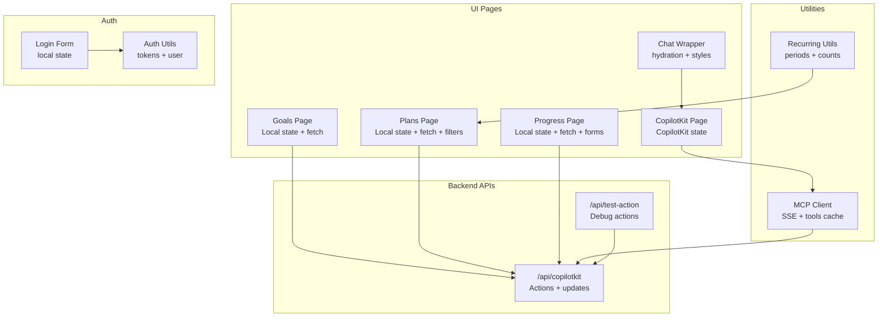
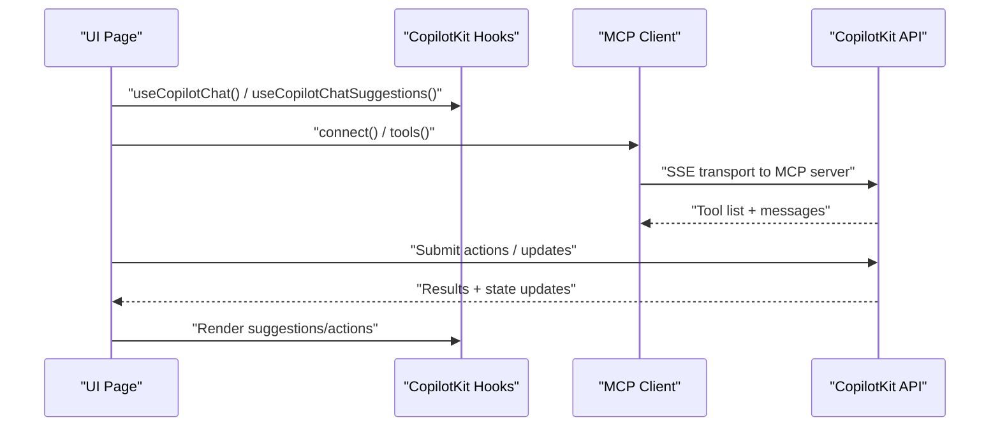
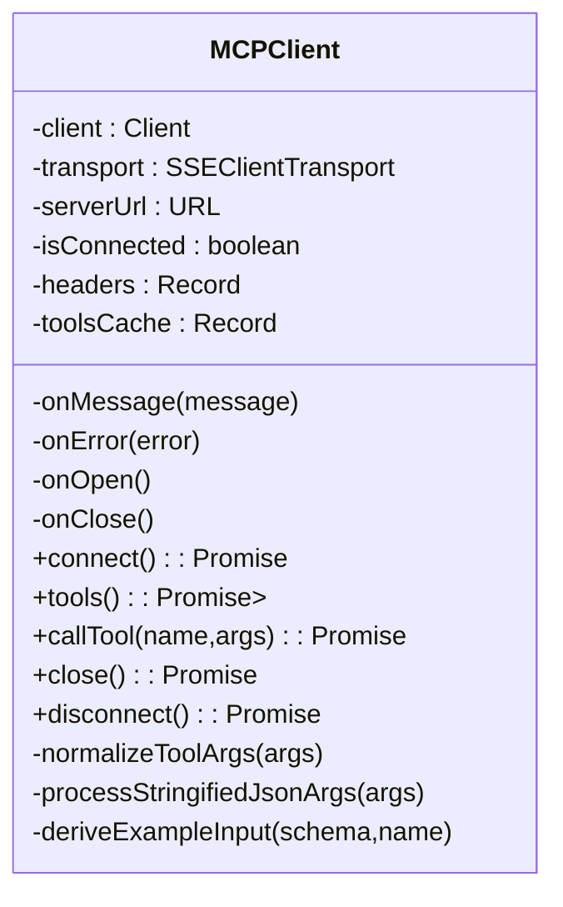
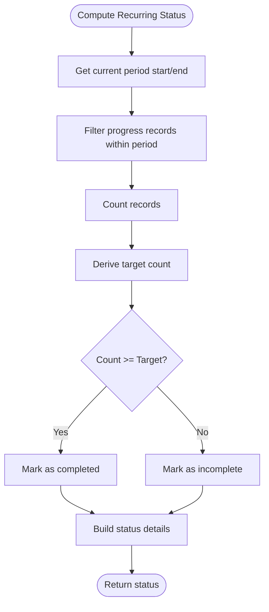
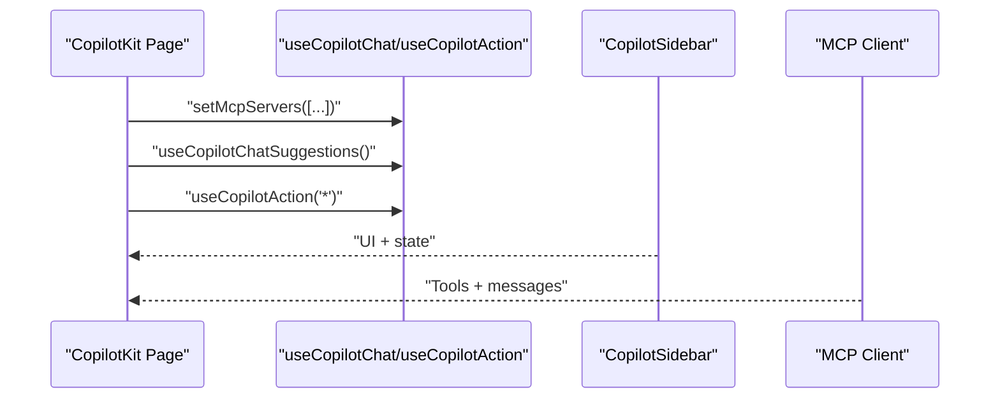
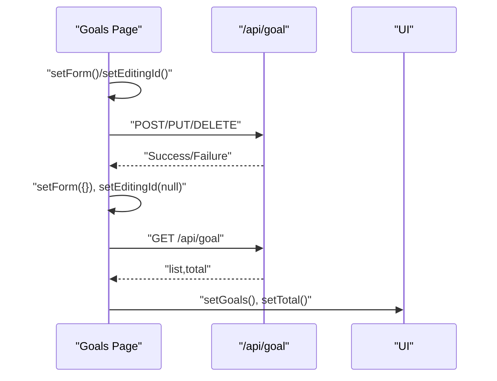
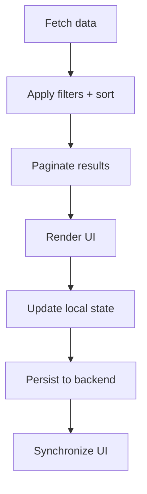
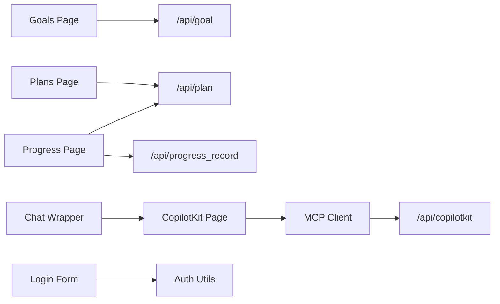

# State Management Patterns

<cite>
**Referenced Files in This Document**
- [mcp-client.ts](file://src/app/utils/mcp-client.ts)
- [recurring-utils.ts](file://src/lib/recurring-utils.ts)
- [chat-wrapper.tsx](file://src/components/chat-wrapper.tsx)
- [page.tsx (CopilotKit)](file://src/app/copilotkit/page.tsx)
- [page.tsx (Goals)](file://src/app/goals/page.tsx)
- [page.tsx (Plans)](file://src/app/plans/page.tsx)
- [page.tsx (Progress)](file://src/app/progress/page.tsx)
- [route.ts (CopilotKit API)](file://src/app/api/copilotkit/route.ts)
- [route.ts (Test Action)](file://src/app/api/test-action/route.ts)
- [auth.ts](file://src/lib/auth.ts)
- [LoginForm.tsx](file://src/components/LoginForm.tsx)
</cite>

## Table of Contents
1. [Introduction](#introduction)
2. [Project Structure](#project-structure)
3. [Core Components](#core-components)
4. [Architecture Overview](#architecture-overview)
5. [Detailed Component Analysis](#detailed-component-analysis)
6. [Dependency Analysis](#dependency-analysis)
7. [Performance Considerations](#performance-considerations)
8. [Troubleshooting Guide](#troubleshooting-guide)
9. [Conclusion](#conclusion)
10. [Appendices](#appendices)

## Introduction
This document explains state management patterns implemented in the client application, focusing on client-side state handling and data fetching strategies. It covers:
- The MCP client implementation for Model Context Protocol integration
- Utility functions for recurring schedule management
- State synchronization patterns, caching strategies, and real-time updates
- Integration with AI assistant state management via CopilotKit
- Form state handling and component state coordination
- Practical examples of state persistence, optimistic updates, and error handling
- Performance optimization techniques, memory management, and debugging approaches

## Project Structure
The state management spans several layers:
- UI pages that own local component state and orchestrate data fetching
- Utilities for recurring schedules and shared helpers
- AI assistant integration via CopilotKit and a custom MCP client
- Authentication utilities and login form state

**Diagram sources**
- [page.tsx (Goals):25-314](file://src/app/goals/page.tsx#L25-L314)
- [page.tsx (Plans):52-807](file://src/app/plans/page.tsx#L52-L807)
- [page.tsx (Progress):35-570](file://src/app/progress/page.tsx#L35-L570)
- [page.tsx (CopilotKit):12-109](file://src/app/copilotkit/page.tsx#L12-L109)
- [chat-wrapper.tsx:7-709](file://src/components/chat-wrapper.tsx#L7-L709)
- [mcp-client.ts:26-449](file://src/app/utils/mcp-client.ts#L26-L449)
- [recurring-utils.ts:1-218](file://src/lib/recurring-utils.ts#L1-L218)
- [route.ts (CopilotKit API):945-988](file://src/app/api/copilotkit/route.ts#L945-L988)
- [route.ts (Test Action):1-29](file://src/app/api/test-action/route.ts#L1-L29)
- [auth.ts:1-69](file://src/lib/auth.ts#L1-L69)
- [LoginForm.tsx:1-48](file://src/components/LoginForm.tsx#L1-L48)

**Section sources**
- [page.tsx (Goals):25-314](file://src/app/goals/page.tsx#L25-L314)
- [page.tsx (Plans):52-807](file://src/app/plans/page.tsx#L52-L807)
- [page.tsx (Progress):35-570](file://src/app/progress/page.tsx#L35-L570)
- [page.tsx (CopilotKit):12-109](file://src/app/copilotkit/page.tsx#L12-L109)
- [chat-wrapper.tsx:7-709](file://src/components/chat-wrapper.tsx#L7-L709)
- [mcp-client.ts:26-449](file://src/app/utils/mcp-client.ts#L26-L449)
- [recurring-utils.ts:1-218](file://src/lib/recurring-utils.ts#L1-L218)
- [route.ts (CopilotKit API):945-988](file://src/app/api/copilotkit/route.ts#L945-L988)
- [route.ts (Test Action):1-29](file://src/app/api/test-action/route.ts#L1-L29)
- [auth.ts:1-69](file://src/lib/auth.ts#L1-L69)
- [LoginForm.tsx:1-48](file://src/components/LoginForm.tsx#L1-L48)

## Core Components
- MCP Client: Implements SSE-based communication with MCP servers, caches tools, and exposes a standardized interface for CopilotKit.
- Recurring Utils: Provides functions to compute current period boundaries, counts, targets, and completion status for recurring tasks.
- UI Pages: Manage local component state, orchestrate data fetching, and coordinate UI updates.
- CopilotKit Integration: Uses CopilotKit’s hooks to manage assistant state, suggestions, and action rendering.
- Authentication Utilities: Provide token creation, verification, and user retrieval for session management.

Key implementation references:
- MCP client initialization, connection, tools caching, and tool execution
- Recurring schedule computation and status derivation
- UI pages’ state machines for forms, filters, pagination, and optimistic updates
- CopilotKit state hooks and sidebar configuration
- Authentication state and login form state

**Section sources**
- [mcp-client.ts:26-449](file://src/app/utils/mcp-client.ts#L26-L449)
- [recurring-utils.ts:1-218](file://src/lib/recurring-utils.ts#L1-L218)
- [page.tsx (Goals):25-314](file://src/app/goals/page.tsx#L25-L314)
- [page.tsx (Plans):52-807](file://src/app/plans/page.tsx#L52-L807)
- [page.tsx (Progress):35-570](file://src/app/progress/page.tsx#L35-L570)
- [page.tsx (CopilotKit):12-109](file://src/app/copilotkit/page.tsx#L12-L109)
- [auth.ts:1-69](file://src/lib/auth.ts#L1-L69)
- [LoginForm.tsx:1-48](file://src/components/LoginForm.tsx#L1-L48)

## Architecture Overview
The client integrates three primary state domains:
- UI state: managed per-page with React hooks, orchestrating data loading, filtering, sorting, pagination, and form submissions.
- AI assistant state: managed by CopilotKit, including chat messages, suggestions, and MCP tool execution.
- MCP protocol state: managed by the custom MCP client, including SSE transport, connection lifecycle, and tools caching.

**Diagram sources**
- [page.tsx (CopilotKit):28-58](file://src/app/copilotkit/page.tsx#L28-L58)
- [mcp-client.ts:94-110](file://src/app/utils/mcp-client.ts#L94-L110)
- [route.ts (CopilotKit API):945-988](file://src/app/api/copilotkit/route.ts#L945-L988)

## Detailed Component Analysis

### MCP Client Implementation
The MCP client encapsulates:
- SSE transport initialization with optional headers
- Connection lifecycle management (open/close)
- Tools discovery with caching to avoid repeated fetches
- Tool execution normalization and JSON parsing
- Event handling for messages, errors, and close events

**Diagram sources**
- [mcp-client.ts:26-449](file://src/app/utils/mcp-client.ts#L26-L449)

**Section sources**
- [mcp-client.ts:26-449](file://src/app/utils/mcp-client.ts#L26-L449)

### Recurring Schedule Management
Recurring schedule utilities compute:
- Current period start/end based on daily/weekly/monthly cycles
- Count of progress records within the current period
- Target completion count derived from plan metadata or heuristics
- Completion status and human-readable status text

**Diagram sources**
- [recurring-utils.ts:19-186](file://src/lib/recurring-utils.ts#L19-L186)

**Section sources**
- [recurring-utils.ts:1-218](file://src/lib/recurring-utils.ts#L1-L218)

### AI Assistant State Management (CopilotKit)
The CopilotKit page demonstrates:
- Managing MCP server endpoints via CopilotKit’s chat state
- Registering catch-all action renders for MCP tool calls
- Configuring chat suggestions and sidebar behavior
- Using a custom input component for improved UX

**Diagram sources**
- [page.tsx (CopilotKit):28-58](file://src/app/copilotkit/page.tsx#L28-L58)
- [chat-wrapper.tsx:7-709](file://src/components/chat-wrapper.tsx#L7-L709)
- [mcp-client.ts:26-449](file://src/app/utils/mcp-client.ts#L26-L449)

**Section sources**
- [page.tsx (CopilotKit):12-109](file://src/app/copilotkit/page.tsx#L12-L109)
- [chat-wrapper.tsx:7-709](file://src/components/chat-wrapper.tsx#L7-L709)

### Form State Handling and Component Coordination
Pages coordinate form state and side effects:
- Goals page: manages form state, edit mode, and CRUD operations with optimistic refresh
- Plans page: maintains form state, filters, sorting, pagination, and recurring task configuration
- Progress page: handles dual view modes (all vs single plan), record editing, and progress updates

**Diagram sources**
- [page.tsx (Goals):38-91](file://src/app/goals/page.tsx#L38-L91)

**Section sources**
- [page.tsx (Goals):25-314](file://src/app/goals/page.tsx#L25-L314)
- [page.tsx (Plans):52-807](file://src/app/plans/page.tsx#L52-L807)
- [page.tsx (Progress):35-570](file://src/app/progress/page.tsx#L35-L570)

### State Synchronization Patterns
- Local state updates are coordinated with backend APIs via controlled fetch calls.
- Filtering, sorting, and pagination are applied locally after fetching larger datasets.
- Recurring task status is computed from stored progress records and plan metadata.
- CopilotKit state is synchronized through hooks and sidebar configuration.

**Diagram sources**
- [page.tsx (Plans):115-163](file://src/app/plans/page.tsx#L115-L163)
- [page.tsx (Progress):52-95](file://src/app/progress/page.tsx#L52-L95)

**Section sources**
- [page.tsx (Plans):115-240](file://src/app/plans/page.tsx#L115-L240)
- [page.tsx (Progress):52-111](file://src/app/progress/page.tsx#L52-L111)

### Data Caching Strategies
- Tools caching in the MCP client avoids repeated tool discovery calls.
- Frontend caching via local state reduces redundant network requests during filtering and pagination.
- Periodic recomputation of recurring task status ensures freshness without recalculating from scratch each render.

**Section sources**
- [mcp-client.ts:115-234](file://src/app/utils/mcp-client.ts#L115-L234)
- [page.tsx (Plans):141-163](file://src/app/plans/page.tsx#L141-L163)
- [recurring-utils.ts:73-186](file://src/lib/recurring-utils.ts#L73-L186)

### Real-Time Updates
- SSE transport in the MCP client enables real-time message delivery.
- UI pages poll or refetch data periodically to reflect backend changes.
- CopilotKit suggestions and action rendering update dynamically as state changes.

**Section sources**
- [mcp-client.ts:94-110](file://src/app/utils/mcp-client.ts#L94-L110)
- [page.tsx (CopilotKit):28-58](file://src/app/copilotkit/page.tsx#L28-L58)

### Practical Examples

#### State Persistence
- Goals page persists form edits by calling the backend and refreshing lists.
- Progress page persists record edits and optionally updates plan progress.

References:
- [page.tsx (Goals):59-91](file://src/app/goals/page.tsx#L59-L91)
- [page.tsx (Progress):113-174](file://src/app/progress/page.tsx#L113-L174)

#### Optimistic Updates
- UI updates immediately upon form submission while awaiting backend confirmation.
- After successful save, UI refreshes to ensure consistency.

References:
- [page.tsx (Goals):59-91](file://src/app/goals/page.tsx#L59-L91)
- [page.tsx (Progress):113-174](file://src/app/progress/page.tsx#L113-L174)

#### Error Handling
- MCP client wraps message handling and connection errors with callbacks.
- UI pages surface errors via alerts and loading states.

References:
- [mcp-client.ts:66-108](file://src/app/utils/mcp-client.ts#L66-L108)
- [page.tsx (Progress):169-173](file://src/app/progress/page.tsx#L169-L173)

## Dependency Analysis
The following diagram highlights key dependencies among components:

**Diagram sources**
- [page.tsx (Goals):38-91](file://src/app/goals/page.tsx#L38-L91)
- [page.tsx (Plans):141-307](file://src/app/plans/page.tsx#L141-L307)
- [page.tsx (Progress):46-174](file://src/app/progress/page.tsx#L46-L174)
- [page.tsx (CopilotKit):28-58](file://src/app/copilotkit/page.tsx#L28-L58)
- [mcp-client.ts:26-449](file://src/app/utils/mcp-client.ts#L26-L449)
- [route.ts (CopilotKit API):945-988](file://src/app/api/copilotkit/route.ts#L945-L988)
- [auth.ts:1-69](file://src/lib/auth.ts#L1-L69)
- [LoginForm.tsx:1-48](file://src/components/LoginForm.tsx#L1-L48)

**Section sources**
- [page.tsx (Goals):38-91](file://src/app/goals/page.tsx#L38-L91)
- [page.tsx (Plans):141-307](file://src/app/plans/page.tsx#L141-L307)
- [page.tsx (Progress):46-174](file://src/app/progress/page.tsx#L46-L174)
- [page.tsx (CopilotKit):28-58](file://src/app/copilotkit/page.tsx#L28-L58)
- [mcp-client.ts:26-449](file://src/app/utils/mcp-client.ts#L26-L449)
- [route.ts (CopilotKit API):945-988](file://src/app/api/copilotkit/route.ts#L945-L988)
- [auth.ts:1-69](file://src/lib/auth.ts#L1-L69)
- [LoginForm.tsx:1-48](file://src/components/LoginForm.tsx#L1-L48)

## Performance Considerations
- Minimize re-renders by consolidating state updates and avoiding unnecessary effect triggers.
- Cache tool lists and fetched datasets to reduce network overhead.
- Apply client-side filtering and sorting on manageable datasets to improve responsiveness.
- Debounce or throttle frequent UI interactions (e.g., search input) to reduce API churn.
- Use pagination to limit the amount of data rendered at once.
- Prefer incremental updates for progress indicators and counters.

## Troubleshooting Guide
Common issues and remedies:
- Hydration mismatches in chat components: The chat wrapper applies fixes and observers to reconcile DOM discrepancies after mount.
- MCP connection failures: Inspect connection logs and error callbacks; ensure headers and URLs are correct.
- Authentication errors: Verify token creation and verification logic; confirm environment variables are set.
- UI state desynchronization: Ensure all state updates occur after successful API responses; implement optimistic updates with rollback on failure.

**Section sources**
- [chat-wrapper.tsx:17-59](file://src/components/chat-wrapper.tsx#L17-L59)
- [mcp-client.ts:78-108](file://src/app/utils/mcp-client.ts#L78-L108)
- [auth.ts:14-33](file://src/lib/auth.ts#L14-L33)
- [LoginForm.tsx:13-40](file://src/components/LoginForm.tsx#L13-L40)

## Conclusion
The client employs a pragmatic, layered state management approach:
- UI pages own local state and orchestrate data fetching with careful synchronization.
- Utilities encapsulate domain logic (e.g., recurring schedules) for reuse.
- CopilotKit integrates AI assistant state seamlessly with custom MCP clients.
- Practical patterns like caching, optimistic updates, and robust error handling ensure a responsive and reliable user experience.

## Appendices

### Choosing State Management Solutions
- For small UI surfaces: React hooks and local state are sufficient.
- For cross-component sharing: CopilotKit hooks and context-like providers.
- For long-lived external connections: Custom clients with caching and retry logic.
- For complex workflows: Consider introducing a dedicated state library only if it simplifies code and reduces bugs.

### Implementing Scalable State Architectures
- Encapsulate side effects behind typed APIs and utilities.
- Keep state normalized and update in predictable batches.
- Use selective reactivity (only subscribe to necessary slices).
- Instrument logging and metrics for state transitions and network calls.