# UI Library Integration

<cite>
**Referenced Files in This Document**
- [components.json](file://components.json)
- [package.json](file://package.json)
- [globals.css](file://src/app/globals.css)
- [utils.ts](file://src/lib/utils.ts)
- [button.tsx](file://src/components/ui/button.tsx)
- [input.tsx](file://src/components/ui/input.tsx)
- [label.tsx](file://src/components/ui/label.tsx)
- [select.tsx](file://src/components/ui/select.tsx)
- [slider.tsx](file://src/components/ui/slider.tsx)
- [card.tsx](file://src/components/ui/card.tsx)
- [table.tsx](file://src/components/ui/table.tsx)
- [textarea.tsx](file://src/components/ui/textarea.tsx)
- [combobox.tsx](file://src/components/ui/combobox.tsx)
- [text-preview.tsx](file://src/components/ui/text-preview.tsx)
- [LoginForm.tsx](file://src/components/LoginForm.tsx)
- [main-layout.tsx](file://src/components/main-layout.tsx)
</cite>

## Table of Contents
1. [Introduction](#introduction)
2. [Project Structure](#project-structure)
3. [Core Components](#core-components)
4. [Architecture Overview](#architecture-overview)
5. [Detailed Component Analysis](#detailed-component-analysis)
6. [Dependency Analysis](#dependency-analysis)
7. [Performance Considerations](#performance-considerations)
8. [Troubleshooting Guide](#troubleshooting-guide)
9. [Conclusion](#conclusion)
10. [Appendices](#appendices)

## Introduction
This document explains how the UI library integrates Radix UI and shadcn/ui components in the project. It covers setup via shadcn/ui configuration, theme and Tailwind configuration, component composition patterns, customization and variant usage, accessibility features, responsive design, and performance considerations. Practical guidance is included for extending components, creating custom variants, and maintaining design consistency across the application.

## Project Structure
The UI system centers around a small set of composable components under src/components/ui. These components wrap Radix UI primitives and apply consistent styling using Tailwind CSS and CSS variables defined in the global stylesheet. Utilities like cn merge Tailwind classes safely, while components expose variants and sizes for consistent usage across the app.

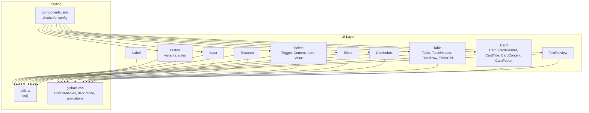

**Diagram sources**
- [button.tsx:1-60](file://src/components/ui/button.tsx#L1-L60)
- [input.tsx:1-22](file://src/components/ui/input.tsx#L1-L22)
- [textarea.tsx:1-19](file://src/components/ui/textarea.tsx#L1-L19)
- [label.tsx:1-25](file://src/components/ui/label.tsx#L1-L25)
- [select.tsx:1-186](file://src/components/ui/select.tsx#L1-L186)
- [slider.tsx:1-28](file://src/components/ui/slider.tsx#L1-L28)
- [combobox.tsx:1-75](file://src/components/ui/combobox.tsx#L1-L75)
- [table.tsx:1-117](file://src/components/ui/table.tsx#L1-L117)
- [card.tsx:1-93](file://src/components/ui/card.tsx#L1-L93)
- [text-preview.tsx:1-241](file://src/components/ui/text-preview.tsx#L1-L241)
- [utils.ts:1-7](file://src/lib/utils.ts#L1-L7)
- [globals.css:1-380](file://src/app/globals.css#L1-L380)
- [components.json:1-21](file://components.json#L1-L21)

**Section sources**
- [components.json:1-21](file://components.json#L1-L21)
- [package.json:16-42](file://package.json#L16-L42)
- [globals.css:1-380](file://src/app/globals.css#L1-L380)
- [utils.ts:1-7](file://src/lib/utils.ts#L1-L7)

## Core Components
This section summarizes the primary UI components and their roles in the system.

- Button: Provides variants (default, destructive, outline, secondary, ghost, link) and sizes (default, sm, lg, icon). Uses Radix Slot for composition and class-variance-authority for variant logic.
- Input: Styled text input with focus-visible ring, aria-invalid support, and dark mode compatibility.
- Textarea: Styled multiline text area with similar focus and invalid states.
- Label: Wraps Radix Label primitive with consistent typography and disabled state handling.
- Select: Composite component wrapping Radix Select primitives (Root, Trigger, Content, Item, Value, Scroll buttons). Supports size and popper positioning.
- Slider: Radix Slider wrapper with minimal styling for track and thumb.
- Card: Semantic layout container with header, title, description, action, content, and footer slots.
- Table: Scrollable table container with semantic head/body/footer/row/cell components and selection states.
- Combobox: Custom composite input with filtering, selection, and optional creation of new values.
- TextPreview: Interactive preview with truncation, tooltip, copy, and link detection.

**Section sources**
- [button.tsx:1-60](file://src/components/ui/button.tsx#L1-L60)
- [input.tsx:1-22](file://src/components/ui/input.tsx#L1-L22)
- [textarea.tsx:1-19](file://src/components/ui/textarea.tsx#L1-L19)
- [label.tsx:1-25](file://src/components/ui/label.tsx#L1-L25)
- [select.tsx:1-186](file://src/components/ui/select.tsx#L1-L186)
- [slider.tsx:1-28](file://src/components/ui/slider.tsx#L1-L28)
- [card.tsx:1-93](file://src/components/ui/card.tsx#L1-L93)
- [table.tsx:1-117](file://src/components/ui/table.tsx#L1-L117)
- [combobox.tsx:1-75](file://src/components/ui/combobox.tsx#L1-L75)
- [text-preview.tsx:1-241](file://src/components/ui/text-preview.tsx#L1-L241)

## Architecture Overview
The UI architecture follows a layered approach:
- Base primitives: Radix UI primitives provide accessible, unstyled foundations.
- Wrappers: shadcn/ui-inspired wrappers add consistent styling and variants.
- Utilities: cn merges Tailwind classes safely; CSS variables define theme tokens.
- Global styles: Tailwind and CSS variables define dark mode, spacing, and animations.

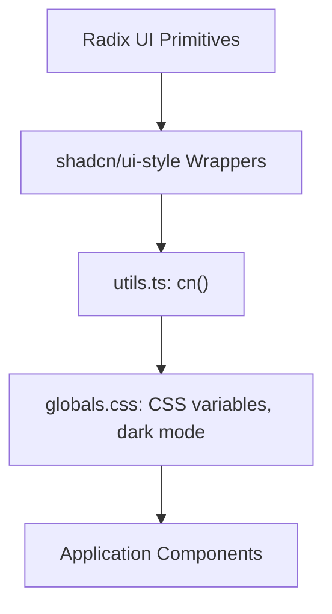

**Diagram sources**
- [button.tsx:1-60](file://src/components/ui/button.tsx#L1-L60)
- [select.tsx:1-186](file://src/components/ui/select.tsx#L1-L186)
- [utils.ts:1-7](file://src/lib/utils.ts#L1-L7)
- [globals.css:1-380](file://src/app/globals.css#L1-L380)

## Detailed Component Analysis

### Button
- Variants and sizes are defined via class-variance-authority and applied through cn.
- Focus-visible ring and aria-invalid states are handled consistently.
- asChild enables composition with links or other elements.

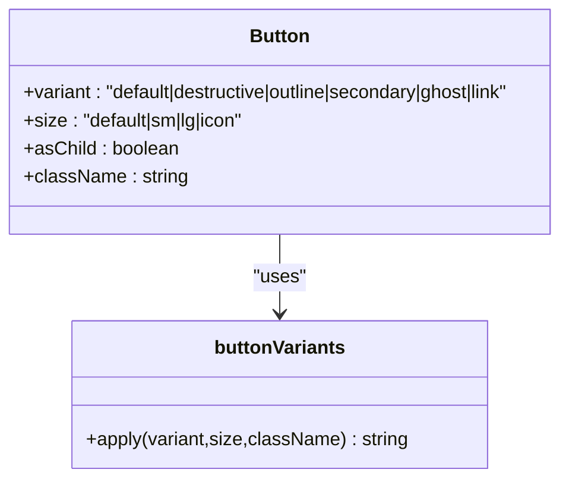

**Diagram sources**
- [button.tsx:7-36](file://src/components/ui/button.tsx#L7-L36)
- [button.tsx:38-57](file://src/components/ui/button.tsx#L38-L57)

**Section sources**
- [button.tsx:1-60](file://src/components/ui/button.tsx#L1-L60)

### Input and Textarea
- Both components apply focus-visible ring, aria-invalid, and dark mode classes.
- They forward props to native inputs/textarea for full compatibility.

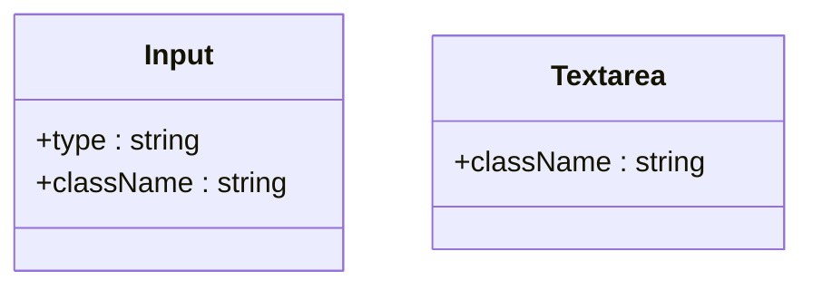

**Diagram sources**
- [input.tsx:5-19](file://src/components/ui/input.tsx#L5-L19)
- [textarea.tsx:5-16](file://src/components/ui/textarea.tsx#L5-L16)

**Section sources**
- [input.tsx:1-22](file://src/components/ui/input.tsx#L1-L22)
- [textarea.tsx:1-19](file://src/components/ui/textarea.tsx#L1-L19)

### Label
- Wraps Radix Label with consistent typography and disabled state handling.

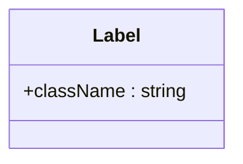

**Diagram sources**
- [label.tsx:8-22](file://src/components/ui/label.tsx#L8-L22)

**Section sources**
- [label.tsx:1-25](file://src/components/ui/label.tsx#L1-L25)

### Select
- Composite component exposing Root, Trigger, Content, Item, Value, Group, Label, Separator, and scroll buttons.
- Supports size and popper positioning; integrates icons from Lucide.

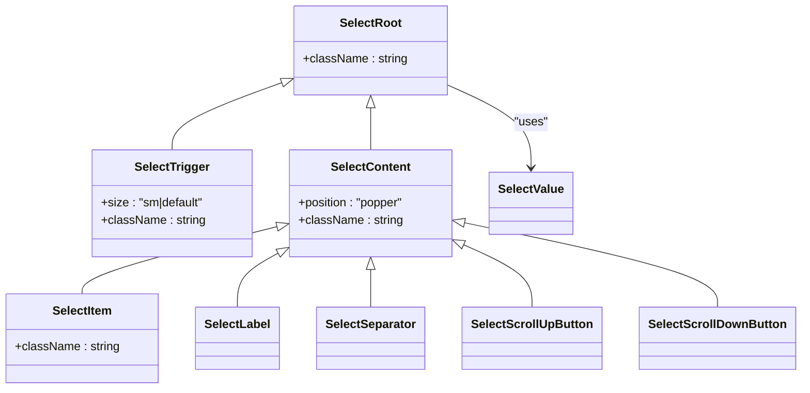

**Diagram sources**
- [select.tsx:9-185](file://src/components/ui/select.tsx#L9-L185)

**Section sources**
- [select.tsx:1-186](file://src/components/ui/select.tsx#L1-L186)

### Slider
- Minimal wrapper around Radix Slider with styled track and thumb.

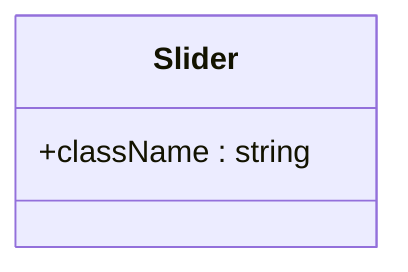

**Diagram sources**
- [slider.tsx:8-25](file://src/components/ui/slider.tsx#L8-L25)

**Section sources**
- [slider.tsx:1-28](file://src/components/ui/slider.tsx#L1-L28)

### Card
- Semantic layout container with header, title, description, action, content, and footer.

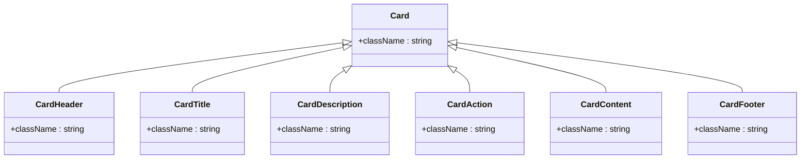

**Diagram sources**
- [card.tsx:5-92](file://src/components/ui/card.tsx#L5-L92)

**Section sources**
- [card.tsx:1-93](file://src/components/ui/card.tsx#L1-L93)

### Table
- Container with scrollable viewport and semantic rows and cells; supports selection and hover states.

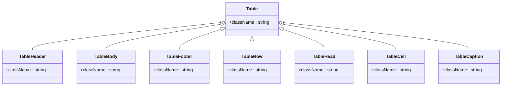

**Diagram sources**
- [table.tsx:7-116](file://src/components/ui/table.tsx#L7-L116)

**Section sources**
- [table.tsx:1-117](file://src/components/ui/table.tsx#L1-L117)

### Combobox
- Custom composite with open state, filtering, selection, and optional creation of new values.

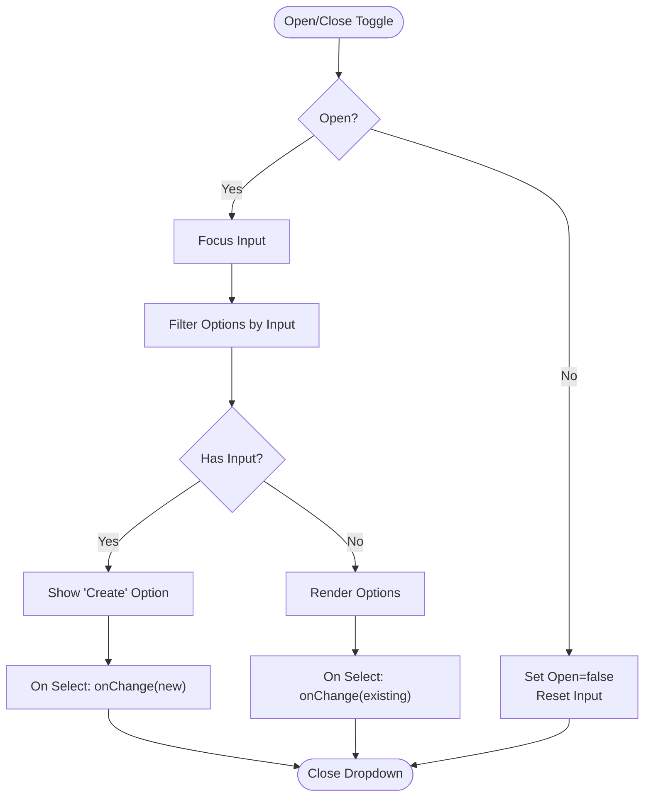

**Diagram sources**
- [combobox.tsx:14-75](file://src/components/ui/combobox.tsx#L14-L75)

**Section sources**
- [combobox.tsx:1-75](file://src/components/ui/combobox.tsx#L1-L75)

### TextPreview
- Interactive preview with truncation, tooltip, copy, and link detection.

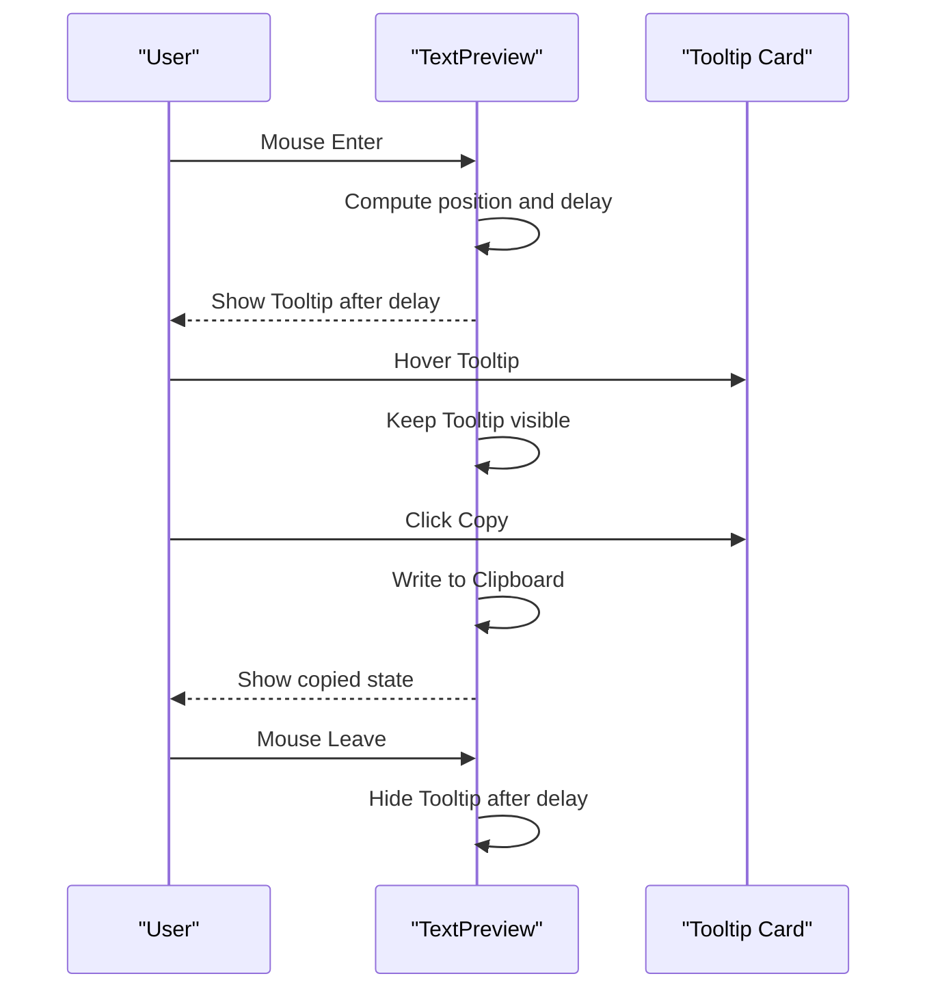

**Diagram sources**
- [text-preview.tsx:14-241](file://src/components/ui/text-preview.tsx#L14-L241)

**Section sources**
- [text-preview.tsx:1-241](file://src/components/ui/text-preview.tsx#L1-L241)

## Dependency Analysis
The UI components depend on:
- Radix UI packages for accessible primitives.
- class-variance-authority and lucide-react for variants and icons.
- Tailwind utilities and CSS variables for styling.
- cn utility for safe class merging.

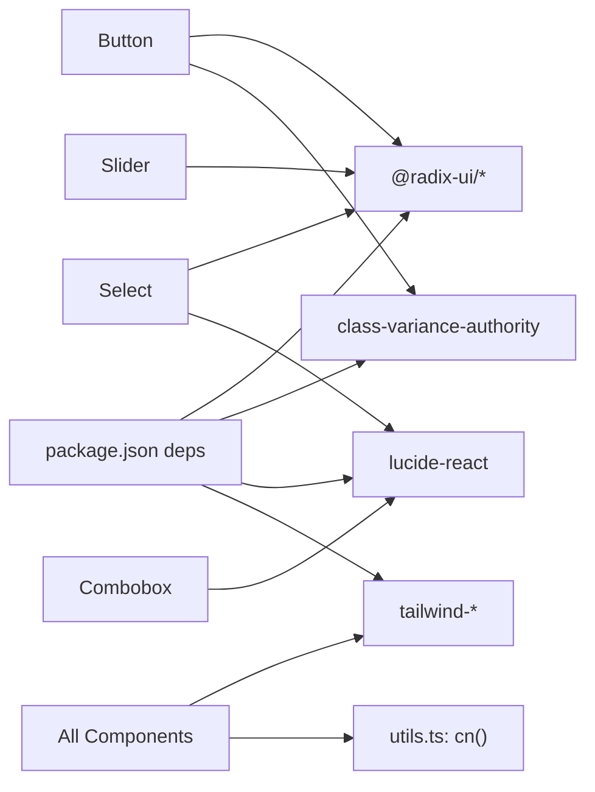

**Diagram sources**
- [package.json:25-35](file://package.json#L25-L35)
- [button.tsx:2-5](file://src/components/ui/button.tsx#L2-L5)
- [select.tsx:3-7](file://src/components/ui/select.tsx#L3-L7)
- [slider.tsx:3-6](file://src/components/ui/slider.tsx#L3-L6)
- [combobox.tsx:3-4](file://src/components/ui/combobox.tsx#L3-L4)
- [utils.ts:1-7](file://src/lib/utils.ts#L1-L7)

**Section sources**
- [package.json:16-42](file://package.json#L16-L42)
- [button.tsx:1-60](file://src/components/ui/button.tsx#L1-L60)
- [select.tsx:1-186](file://src/components/ui/select.tsx#L1-L186)
- [slider.tsx:1-28](file://src/components/ui/slider.tsx#L1-L28)
- [combobox.tsx:1-75](file://src/components/ui/combobox.tsx#L1-L75)
- [utils.ts:1-7](file://src/lib/utils.ts#L1-L7)

## Performance Considerations
- Bundle size: Prefer importing only the necessary Radix UI components and icons. Avoid unused variants or large icon libraries.
- Rendering: Memoize derived data (e.g., filtered options in Combobox) to reduce re-renders.
- CSS: Use CSS variables and Tailwind utilities to minimize runtime style computations.
- Animations: Keep transitions subtle; avoid heavy transforms on frequently animated elements.
- Accessibility: Ensure focus-visible rings and keyboard navigation remain functional across variants.

[No sources needed since this section provides general guidance]

## Troubleshooting Guide
- Focus rings not visible: Verify focus-visible ring classes and ensure the component forwards props to the underlying element.
- Dark mode styles missing: Confirm CSS variables are defined in the global stylesheet and the dark class is toggled appropriately.
- Select dropdown misaligned: Adjust position and popper offsets; ensure portal rendering is intact.
- Combobox filter not working: Ensure controlled state updates and that filtering logic is memoized.

**Section sources**
- [input.tsx:10-16](file://src/components/ui/input.tsx#L10-L16)
- [button.tsx:8-8](file://src/components/ui/button.tsx#L8-L8)
- [select.tsx:58-85](file://src/components/ui/select.tsx#L58-L85)
- [combobox.tsx:17-20](file://src/components/ui/combobox.tsx#L17-L20)

## Conclusion
The UI library integrates Radix UI and shadcn/ui through thin, accessible wrappers that apply consistent styling via Tailwind and CSS variables. Variants and sizes are centralized, enabling predictable customization and composition. The system emphasizes accessibility, responsive behavior, and maintainable design tokens.

[No sources needed since this section summarizes without analyzing specific files]

## Appendices

### Setup and Configuration
- shadcn/ui configuration defines style, RSC/TSX flags, Tailwind settings, aliases, and icon library.
- Tailwind and CSS variables are configured globally; dark mode is supported via CSS custom properties.

**Section sources**
- [components.json:1-21](file://components.json#L1-L21)
- [globals.css:6-44](file://src/app/globals.css#L6-L44)

### Theming and Tokens
- CSS variables define color tokens and radii; dark mode overrides are provided.
- Tailwind layers base styles and applies outline/ring utilities globally.

**Section sources**
- [globals.css:46-118](file://src/app/globals.css#L46-L118)
- [globals.css:120-127](file://src/app/globals.css#L120-L127)

### Component Composition Patterns
- Use asChild to compose Button with links or other elements.
- Wrap Radix primitives to add variants and sizes.
- Forward refs and props to maintain composability.

**Section sources**
- [button.tsx:48-56](file://src/components/ui/button.tsx#L48-L56)
- [select.tsx:12-13](file://src/components/ui/select.tsx#L12-L13)

### Accessibility Features
- Focus-visible rings and ring focus states are applied consistently.
- Labels associate with inputs for screen readers.
- Select components use proper ARIA attributes and keyboard navigation.

**Section sources**
- [button.tsx:8-8](file://src/components/ui/button.tsx#L8-L8)
- [label.tsx:13-21](file://src/components/ui/label.tsx#L13-L21)
- [select.tsx:12-13](file://src/components/ui/select.tsx#L12-L13)

### Responsive Design Implementation
- Utility classes enable responsive behavior (e.g., md-hidden).
- Tables adapt with horizontal scrolling containers.
- Layouts use flex and overflow utilities for mobile and desktop.

**Section sources**
- [globals.css:359-379](file://src/app/globals.css#L359-L379)
- [table.tsx:8-19](file://src/components/ui/table.tsx#L8-L19)
- [main-layout.tsx:13-62](file://src/components/main-layout.tsx#L13-L62)

### Form Integration Examples
- LoginForm demonstrates standard form controls and submit handling.
- Input and Textarea components integrate with form state and validation feedback.

**Section sources**
- [LoginForm.tsx:13-40](file://src/components/LoginForm.tsx#L13-L40)
- [input.tsx:5-19](file://src/components/ui/input.tsx#L5-L19)
- [textarea.tsx:5-16](file://src/components/ui/textarea.tsx#L5-L16)