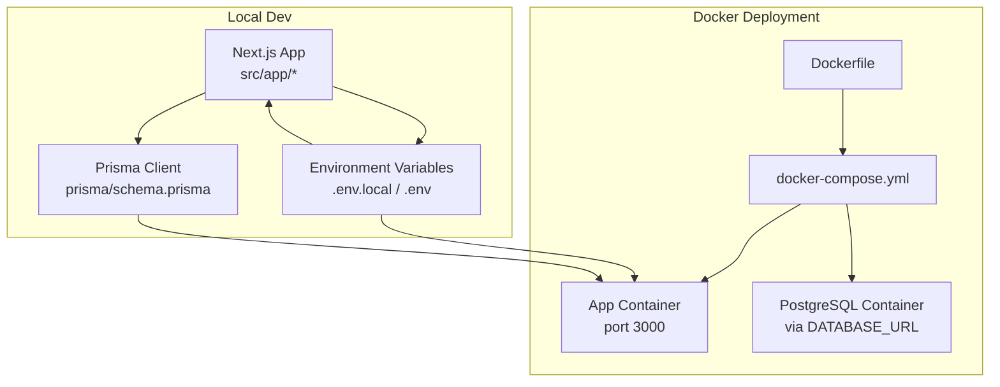
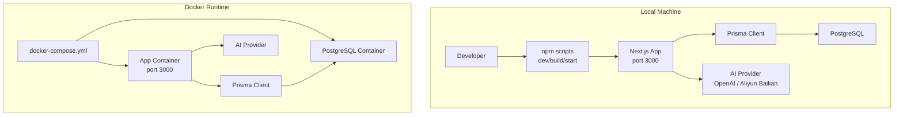
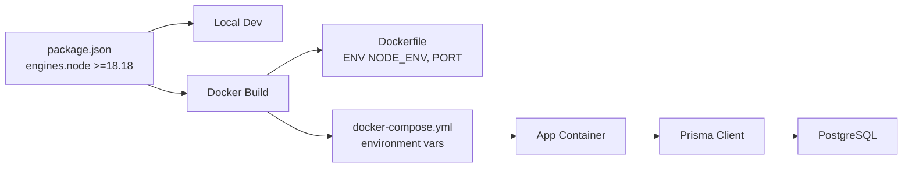

# Getting Started

<cite>
**Referenced Files in This Document**
- [README.md](file://README.md)
- [setup.md](file://setup.md)
- [DEPLOYMENT.md](file://DEPLOYMENT.md)
- [DEPLOY-CHINA.md](file://DEPLOY-CHINA.md)
- [ENV_TEMPLATE.md](file://ENV_TEMPLATE.md)
- [package.json](file://package.json)
- [Dockerfile](file://Dockerfile)
- [docker-compose.yml](file://docker-compose.yml)
- [deploy.sh](file://deploy.sh)
- [deploy-china.sh](file://deploy-china.sh)
- [deploy-direct.sh](file://deploy-direct.sh)
- [prisma/schema.prisma](file://prisma/schema.prisma)
- [next.config.ts](file://next.config.ts)
- [middleware.ts](file://middleware.ts)
</cite>

## Table of Contents
1. [Introduction](#introduction)
2. [Project Structure](#project-structure)
3. [Core Components](#core-components)
4. [Architecture Overview](#architecture-overview)
5. [Detailed Component Analysis](#detailed-component-analysis)
6. [Dependency Analysis](#dependency-analysis)
7. [Performance Considerations](#performance-considerations)
8. [Troubleshooting Guide](#troubleshooting-guide)
9. [Conclusion](#conclusion)
10. [Appendices](#appendices)

## Introduction
Goal Mate is an AI-powered goal and plan management system built with Next.js, CopilotKit, and integrated with Alibaba Cloud Bailian (DeepSeek-R1). It provides a natural language interface to manage goals, plans, progress records, and generate reports. This Getting Started guide helps you set up the project locally and deploy it via Docker, configure environment variables for different AI providers, and verify your installation.

## Project Structure
High-level structure relevant to setup and deployment:
- Frontend and API routes under src/app
- Prisma schema for PostgreSQL modeling
- Dockerfile and docker-compose.yml for containerized deployment
- Deployment scripts for Docker and direct systemd deployments
- Environment templates and deployment guides

**Diagram sources**
- [Dockerfile:1-68](file://Dockerfile#L1-L68)
- [docker-compose.yml:1-56](file://docker-compose.yml#L1-L56)
- [prisma/schema.prisma:1-70](file://prisma/schema.prisma#L1-L70)

**Section sources**
- [README.md:157-174](file://README.md#L157-L174)
- [Dockerfile:1-68](file://Dockerfile#L1-L68)
- [docker-compose.yml:1-56](file://docker-compose.yml#L1-L56)
- [prisma/schema.prisma:1-70](file://prisma/schema.prisma#L1-L70)

## Core Components
- Node.js runtime and package manager for building and running the application
- PostgreSQL database configured via Prisma
- Next.js API routes and CopilotKit integration for AI actions
- Docker and Docker Compose for containerized deployment
- Environment variables controlling AI provider endpoints and authentication

Key prerequisites:
- Node.js version requirement is specified in package.json engines
- Docker Engine and Docker Compose for containerized deployment
- PostgreSQL instance reachable by the application

Verification steps:
- Confirm Node.js version meets requirements
- Verify DATABASE_URL connectivity
- Ensure OPENAI_API_KEY and OPENAI_BASE_URL are set appropriately
- Test health endpoint after startup

**Section sources**
- [package.json:53-55](file://package.json#L53-L55)
- [README.md:125-131](file://README.md#L125-L131)
- [DEPLOYMENT.md:7-12](file://DEPLOYMENT.md#L7-L12)
- [prisma/schema.prisma:11-14](file://prisma/schema.prisma#L11-L14)

## Architecture Overview
End-to-end setup and runtime architecture for local and Docker deployments.

**Diagram sources**
- [Dockerfile:18-21](file://Dockerfile#L18-L21)
- [docker-compose.yml:14-24](file://docker-compose.yml#L14-L24)
- [prisma/schema.prisma:11-14](file://prisma/schema.prisma#L11-L14)

## Detailed Component Analysis

### Local Development Setup
Step-by-step instructions to run the application locally:
1. Configure environment variables
   - Copy the environment template to .env.local and set OPENAI_API_KEY, OPENAI_BASE_URL, DATABASE_URL, AUTH_USERNAME, AUTH_PASSWORD, AUTH_SECRET
   - Reference: [ENV_TEMPLATE.md:5-20](file://ENV_TEMPLATE.md#L5-L20), [README.md:40-54](file://README.md#L40-L54)
2. Install dependencies
   - Run npm install
   - Reference: [README.md:61-65](file://README.md#L61-L65)
3. Initialize database
   - Generate Prisma client and apply migrations
   - References: [README.md:69-75](file://README.md#L69-L75), [setup.md:65-69](file://setup.md#L65-L69)
4. Launch development server
   - Start Next.js dev server
   - Access http://localhost:3000
   - Reference: [README.md:77-83](file://README.md#L77-L83)

Environment variable examples:
- OpenAI (global):
  - OPENAI_API_KEY and OPENAI_BASE_URL=https://api.openai.com/v1
  - Reference: [ENV_TEMPLATE.md:9-11](file://ENV_TEMPLATE.md#L9-L11)
- Aliyun Bailian (China region optimized):
  - OPENAI_API_KEY and OPENAI_BASE_URL=https://dashscope.aliyuncs.com/compatible-mode/v1
  - Reference: [ENV_TEMPLATE.md:13-14](file://ENV_TEMPLATE.md#L13-L14)

Security and validation tips:
- AUTH_SECRET must be at least 32 characters long
- Use strong passwords for AUTH_PASSWORD
- References: [ENV_TEMPLATE.md:36-44](file://ENV_TEMPLATE.md#L36-L44), [README.md:56-59](file://README.md#L56-L59)

**Section sources**
- [setup.md:3-78](file://setup.md#L3-L78)
- [ENV_TEMPLATE.md:5-56](file://ENV_TEMPLATE.md#L5-L56)
- [README.md:34-83](file://README.md#L34-L83)

### Docker Deployment (Recommended)
Two primary approaches are supported:

#### Option A: One-click deployment script
- Uses deploy.sh to validate Docker, copy/create .env, build, and start services
- Provides commands for logs, status, restart, cleanup
- References: [deploy.sh:21-99](file://deploy.sh#L21-L99), [deploy.sh:101-120](file://deploy.sh#L101-L120), [deploy.sh:155-173](file://deploy.sh#L155-L173)

#### Option B: Manual Docker Compose
- Copy .env.example to .env and edit required variables
- Start services with docker-compose up -d
- References: [DEPLOYMENT.md:22-50](file://DEPLOYMENT.md#L22-L50), [docker-compose.yml:14-37](file://docker-compose.yml#L14-L37)

Environment variables for Docker:
- DATABASE_URL, OPENAI_API_KEY, OPENAI_BASE_URL, optional AUTH_* for local dev
- Reference: [DEPLOYMENT.md:32-43](file://DEPLOYMENT.md#L32-L43)

Health checks and port exposure:
- Health check probes http://localhost:3000/api/health
- Port 3000 exposed in container
- Reference: [docker-compose.yml:39-44](file://docker-compose.yml#L39-L44)

**Section sources**
- [deploy.sh:1-224](file://deploy.sh#L1-L224)
- [DEPLOYMENT.md:14-56](file://DEPLOYMENT.md#L14-L56)
- [docker-compose.yml:1-56](file://docker-compose.yml#L1-L56)

### Direct Systemd Deployment (Production-like)
- Installs Node.js 18, configures npm mirrors, installs dependencies, builds, initializes Prisma, and starts via systemd
- Creates a systemd unit file for automatic startup
- References: [deploy-direct.sh:18-56](file://deploy-direct.sh#L18-L56), [deploy-direct.sh:66-68](file://deploy-direct.sh#L66-L68), [deploy-direct.sh:84-112](file://deploy-direct.sh#L84-L112)

**Section sources**
- [deploy-direct.sh:1-135](file://deploy-direct.sh#L1-L135)

### Environment Variable Configuration Examples
Provider-specific configurations:

- OpenAI (global)
  - Set OPENAI_API_KEY and OPENAI_BASE_URL=https://api.openai.com/v1
  - Reference: [ENV_TEMPLATE.md:9-11](file://ENV_TEMPLATE.md#L9-L11)

- Aliyun Bailian (compatible mode)
  - Set OPENAI_API_KEY and OPENAI_BASE_URL=https://dashscope.aliyuncs.com/compatible-mode/v1
  - Reference: [ENV_TEMPLATE.md:13-14](file://ENV_TEMPLATE.md#L13-L14)

- Authentication
  - AUTH_USERNAME, AUTH_PASSWORD, AUTH_SECRET (minimum 32 characters)
  - Reference: [ENV_TEMPLATE.md:16-19](file://ENV_TEMPLATE.md#L16-L19)

- Database
  - DATABASE_URL in PostgreSQL format
  - Reference: [ENV_TEMPLATE.md:6-7](file://ENV_TEMPLATE.md#L6-L7)

**Section sources**
- [ENV_TEMPLATE.md:5-56](file://ENV_TEMPLATE.md#L5-L56)

### Verification Steps
After setup, verify your installation:

- Local development
  - Confirm http://localhost:3000 loads and AI assistant responds
  - References: [README.md:77-83](file://README.md#L77-L83), [setup.md:76-78](file://setup.md#L76-L78)

- Docker deployment
  - Check service status and logs
  - Health check endpoint http://localhost:3000/api/health
  - References: [deploy.sh:175-184](file://deploy.sh#L175-L184), [docker-compose.yml:39-44](file://docker-compose.yml#L39-L44)

- Database connectivity
  - Ensure Prisma client connects and migrations applied
  - References: [README.md:69-75](file://README.md#L69-L75), [setup.md:65-69](file://setup.md#L65-L69)

**Section sources**
- [README.md:69-83](file://README.md#L69-L83)
- [deploy.sh:175-184](file://deploy.sh#L175-L184)
- [docker-compose.yml:39-44](file://docker-compose.yml#L39-L44)

## Dependency Analysis
Runtime and build-time dependencies relevant to setup:

**Diagram sources**
- [package.json:53-55](file://package.json#L53-L55)
- [Dockerfile:18-21](file://Dockerfile#L18-L21)
- [docker-compose.yml:14-24](file://docker-compose.yml#L14-L24)
- [prisma/schema.prisma:7-9](file://prisma/schema.prisma#L7-L9)

**Section sources**
- [package.json:16-40](file://package.json#L16-L40)
- [Dockerfile:1-68](file://Dockerfile#L1-L68)
- [docker-compose.yml:1-56](file://docker-compose.yml#L1-L56)
- [prisma/schema.prisma:7-9](file://prisma/schema.prisma#L7-L9)

## Performance Considerations
- Resource limits in Docker Compose can be tuned for stability
- Health checks ensure readiness before traffic
- Standalone output mode for efficient container deployments
- References: [docker-compose.yml:46-51](file://docker-compose.yml#L46-L51), [next.config.ts:4-5](file://next.config.ts#L4-L5)

[No sources needed since this section provides general guidance]

## Troubleshooting Guide
Common issues and resolutions:

- Docker environment validation failures
  - Ensure Docker and Docker Compose are installed and on PATH
  - References: [deploy.sh:21-36](file://deploy.sh#L21-L36), [DEPLOYMENT.md:7-12](file://DEPLOYMENT.md#L7-L12)

- Missing or invalid environment variables
  - Check .env presence and required keys: DATABASE_URL, OPENAI_API_KEY, AUTH_SECRET length
  - References: [deploy.sh:38-99](file://deploy.sh#L38-L99), [DEPLOYMENT.md:32-43](file://DEPLOYMENT.md#L32-L43)

- Database connection problems
  - Verify DATABASE_URL format and PostgreSQL availability
  - References: [prisma/schema.prisma:11-14](file://prisma/schema.prisma#L11-L14), [setup.md:23-56](file://setup.md#L23-L56)

- AI provider connectivity
  - Confirm API key validity and base URL correctness
  - References: [ENV_TEMPLATE.md:27-29](file://ENV_TEMPLATE.md#L27-L29), [README.md:150-156](file://README.md#L150-L156)

- Health check failures
  - Inspect logs and ensure Prisma migration ran
  - References: [docker-compose.yml:39-44](file://docker-compose.yml#L39-L44), [deploy.sh:101-120](file://deploy.sh#L101-L120)

**Section sources**
- [deploy.sh:21-99](file://deploy.sh#L21-L99)
- [DEPLOYMENT.md:92-110](file://DEPLOYMENT.md#L92-L110)
- [setup.md:116-129](file://setup.md#L116-L129)
- [docker-compose.yml:39-44](file://docker-compose.yml#L39-L44)

## Conclusion
You now have the essentials to set up Goal Mate locally or deploy it with Docker. Use the environment templates to configure AI providers and databases, validate with health checks, and leverage the provided scripts for streamlined operations. For production, consider additional hardening, reverse proxies, and monitoring as outlined in the deployment guides.

[No sources needed since this section summarizes without analyzing specific files]

## Appendices

### A. Environment Variable Reference
- DATABASE_URL: PostgreSQL connection string
- OPENAI_API_KEY: Provider API key
- OPENAI_BASE_URL: Provider base URL (OpenAI or Aliyun Bailian)
- AUTH_USERNAME, AUTH_PASSWORD, AUTH_SECRET: Authentication credentials (AUTH_SECRET minimum 32 chars)
- Optional: PORT, NODE_ENV for Docker runtime

References:
- [ENV_TEMPLATE.md:24-34](file://ENV_TEMPLATE.md#L24-L34)
- [DEPLOYMENT.md:134-143](file://DEPLOYMENT.md#L134-L143)

**Section sources**
- [ENV_TEMPLATE.md:24-34](file://ENV_TEMPLATE.md#L24-L34)
- [DEPLOYMENT.md:134-143](file://DEPLOYMENT.md#L134-L143)

### B. Quick Start Commands
- Local dev: npm install → npx prisma generate → npx prisma db push → npm run dev
  - References: [README.md:61-83](file://README.md#L61-L83), [setup.md:65-74](file://setup.md#L65-L74)

- Docker: ./deploy.sh start or docker-compose up -d
  - References: [deploy.sh:186-195](file://deploy.sh#L186-L195), [DEPLOYMENT.md:47-56](file://DEPLOYMENT.md#L47-L56)

**Section sources**
- [README.md:61-83](file://README.md#L61-L83)
- [deploy.sh:186-195](file://deploy.sh#L186-L195)
- [DEPLOYMENT.md:47-56](file://DEPLOYMENT.md#L47-L56)