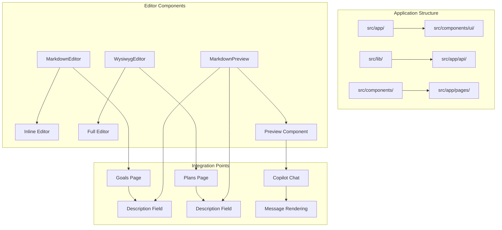
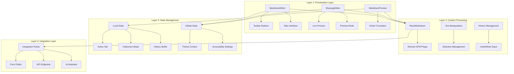
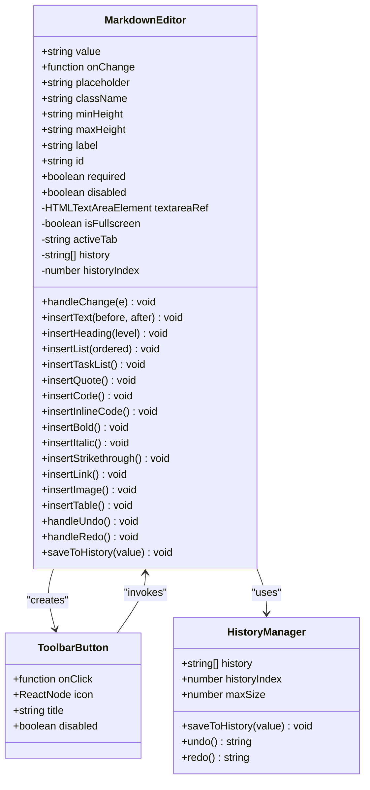
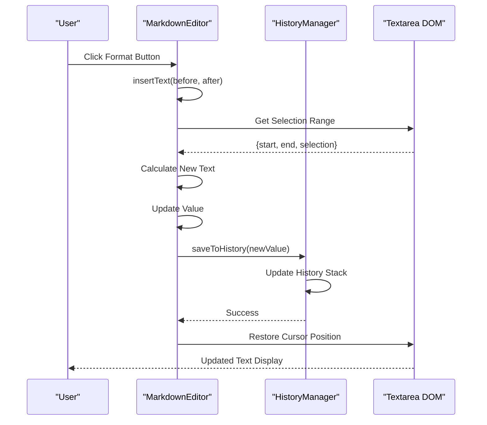
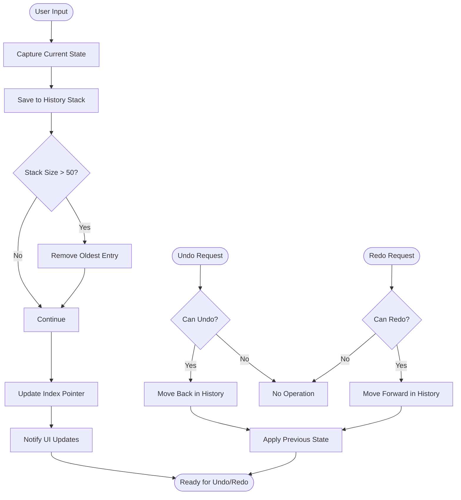
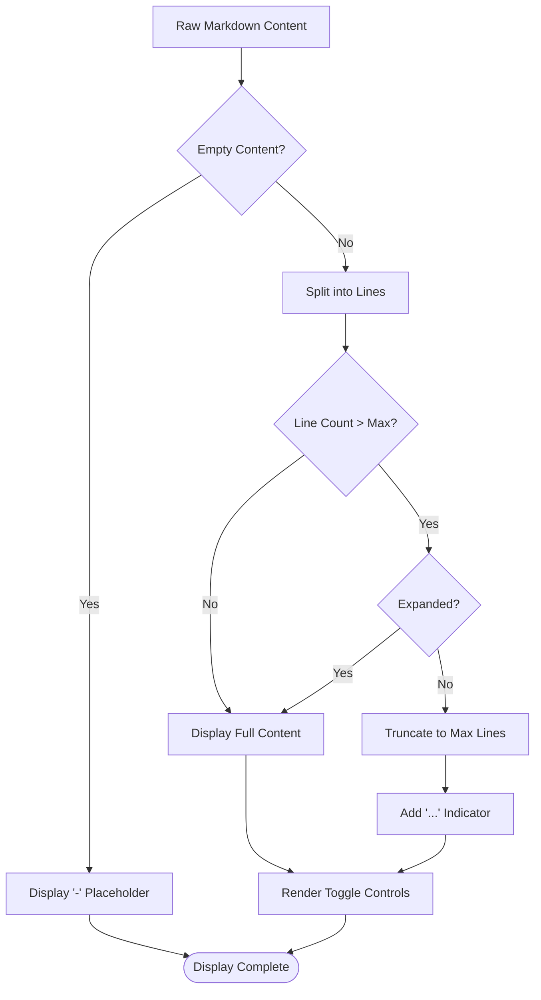

# Markdown Editor

<cite>
**Referenced Files in This Document**
- [markdown-editor.tsx](file://src/components/ui/markdown-editor.tsx)
- [markdown-preview.tsx](file://src/components/ui/markdown-preview.tsx)
- [wysiwyg-editor.tsx](file://src/components/ui/wysiwyg-editor.tsx)
- [page.tsx](file://src/app/goals/page.tsx)
- [page.tsx](file://src/app/plans/page.tsx)
- [chat-wrapper.tsx](file://src/components/chat-wrapper.tsx)
- [copilot-clearing-input.tsx](file://src/components/copilot-clearing-input.tsx)
- [utils.ts](file://src/lib/utils.ts)
- [package.json](file://package.json)
</cite>

## Table of Contents
1. [Introduction](#introduction)
2. [Project Structure](#project-structure)
3. [Core Components](#core-components)
4. [Architecture Overview](#architecture-overview)
5. [Detailed Component Analysis](#detailed-component-analysis)
6. [Dependency Analysis](#dependency-analysis)
7. [Performance Considerations](#performance-considerations)
8. [Troubleshooting Guide](#troubleshooting-guide)
9. [Conclusion](#conclusion)

## Introduction

The Markdown Editor is a sophisticated text editing component suite designed for the Goal Mate application, an AI-powered goal and task management system. This comprehensive editor solution provides developers with flexible, feature-rich markdown editing capabilities while maintaining excellent user experience across different use cases.

The system consists of three primary editor variants: a lightweight inline markdown editor, a full-featured WYSIWYG editor, and a specialized preview component. Each variant serves specific use cases within the application's workflow, from simple text input to complex document authoring with real-time preview capabilities.

Built with modern React patterns and Next.js, the editor components leverage advanced markdown processing libraries, sophisticated undo/redo systems, and responsive design principles to deliver a professional editing experience that seamlessly integrates with the application's AI-assisted workflow.

## Project Structure

The Markdown Editor implementation follows a modular architecture within the Goal Mate application structure:



**Diagram sources**
- [markdown-editor.tsx:1-356](file://src/components/ui/markdown-editor.tsx#L1-L356)
- [wysiwyg-editor.tsx:1-167](file://src/components/ui/wysiwyg-editor.tsx#L1-L167)
- [markdown-preview.tsx:1-99](file://src/components/ui/markdown-preview.tsx#L1-L99)

The editor components are strategically placed within the application's main pages, particularly in areas where rich text content creation and display are essential for user productivity.

**Section sources**
- [markdown-editor.tsx:1-356](file://src/components/ui/markdown-editor.tsx#L1-L356)
- [wysiwyg-editor.tsx:1-167](file://src/components/ui/wysiwyg-editor.tsx#L1-L167)
- [markdown-preview.tsx:1-99](file://src/components/ui/markdown-preview.tsx#L1-L99)

## Core Components

The Markdown Editor system comprises three distinct yet complementary components, each optimized for specific editing scenarios:

### MarkdownEditor (Primary Inline Editor)

The MarkdownEditor component serves as the foundation for inline markdown editing within forms and content areas. It provides a clean, focused editing interface with comprehensive markdown support and intelligent text manipulation capabilities.

**Key Features:**
- Real-time markdown preview with GitHub Flavored Markdown (GFM) support
- Advanced text insertion with automatic cursor positioning
- Full undo/redo history management with 50-step buffer
- Responsive design with fullscreen editing mode
- Comprehensive toolbar with formatting shortcuts
- Character and word count monitoring
- Accessibility-compliant interface design

### WysiwygEditor (Advanced Full Editor)

The WysiwygEditor component delivers a sophisticated editing experience similar to traditional word processors, featuring live preview capabilities and professional-grade formatting tools.

**Key Features:**
- Live preview mode with real-time markdown rendering
- Dedicated preview-only mode for focused reading
- Full-screen editing capabilities
- Professional-grade markdown editor integration
- Custom styling and theming support
- Responsive height adjustment
- Advanced formatting controls

### MarkdownPreview (Content Display)

The MarkdownPreview component specializes in displaying markdown content with intelligent truncation and toggle capabilities, making it ideal for content lists and summary views.

**Key Features:**
- Smart content truncation with expand/collapse functionality
- Toggle between raw and rendered markdown views
- Responsive design with customizable line limits
- Efficient rendering with ReactMarkdown
- Minimal UI footprint for content display

**Section sources**
- [markdown-editor.tsx:33-44](file://src/components/ui/markdown-editor.tsx#L33-L44)
- [wysiwyg-editor.tsx:19-29](file://src/components/ui/wysiwyg-editor.tsx#L19-L29)
- [markdown-preview.tsx:11-16](file://src/components/ui/markdown-preview.tsx#L11-L16)

## Architecture Overview

The Markdown Editor system implements a layered architecture that separates concerns between editing, previewing, and content display:



**Diagram sources**
- [markdown-editor.tsx:67-84](file://src/components/ui/markdown-editor.tsx#L67-L84)
- [wysiwyg-editor.tsx:31-47](file://src/components/ui/wysiwyg-editor.tsx#L31-L47)
- [markdown-preview.tsx:18-25](file://src/components/ui/markdown-preview.tsx#L18-L25)

The architecture ensures separation of concerns while maintaining seamless integration with the broader application ecosystem. Each component maintains its own state management while coordinating with shared utilities and context providers.

**Section sources**
- [markdown-editor.tsx:67-353](file://src/components/ui/markdown-editor.tsx#L67-L353)
- [wysiwyg-editor.tsx:31-164](file://src/components/ui/wysiwyg-editor.tsx#L31-L164)
- [markdown-preview.tsx:18-96](file://src/components/ui/markdown-preview.tsx#L18-L96)

## Detailed Component Analysis

### MarkdownEditor Component Analysis

The MarkdownEditor component represents the most sophisticated editor in the suite, combining inline editing with comprehensive markdown support and advanced text manipulation features.

#### Core Implementation Pattern

The component utilizes React's modern hooks architecture with sophisticated state management for handling complex editing scenarios:



**Diagram sources**
- [markdown-editor.tsx:33-51](file://src/components/ui/markdown-editor.tsx#L33-L51)
- [markdown-editor.tsx:67-94](file://src/components/ui/markdown-editor.tsx#L67-L94)

#### Text Manipulation System

The editor implements a sophisticated text insertion system that intelligently handles user selections and maintains cursor position:



**Diagram sources**
- [markdown-editor.tsx:102-120](file://src/components/ui/markdown-editor.tsx#L102-L120)
- [markdown-editor.tsx:86-94](file://src/components/ui/markdown-editor.tsx#L86-L94)

#### Undo/Redo System

The implementation features a sophisticated history management system with intelligent state preservation:



**Diagram sources**
- [markdown-editor.tsx:86-94](file://src/components/ui/markdown-editor.tsx#L86-L94)
- [markdown-editor.tsx:173-187](file://src/components/ui/markdown-editor.tsx#L173-L187)

**Section sources**
- [markdown-editor.tsx:67-353](file://src/components/ui/markdown-editor.tsx#L67-L353)

### WysiwygEditor Component Analysis

The WysiwygEditor component provides a professional-grade editing experience built on the @uiw/react-md-editor library, offering live preview capabilities and advanced formatting tools.

#### Integration Architecture

The component leverages dynamic imports to handle server-side rendering concerns while providing a rich editing experience:

```mermaid
graph LR
A[WysiwygEditor] --> B[Dynamic Import]
B --> C[@uiw/react-md-editor]
C --> D[Markdown Editor Core]
C --> E[Markdown Preview]
D --> F[Custom Toolbar]
E --> G[Styled Preview]
F --> H[Live Preview Mode]
G --> I[Preview Mode]
H --> J[Fullscreen Mode]
I --> J
```

**Diagram sources**
- [wysiwyg-editor.tsx:14-17](file://src/components/ui/wysiwyg-editor.tsx#L14-L17)
- [wysiwyg-editor.tsx:130-144](file://src/components/ui/wysiwyg-editor.tsx#L130-L144)

#### Preview Modes and Configuration

The editor supports three distinct preview modes optimized for different user workflows:

| Mode | Description | Use Case |
|------|-------------|----------|
| Live | Real-time editing with immediate preview updates | Active writing sessions |
| Preview | Dedicated preview mode for focused reading | Review and editing workflows |
| Edit | Traditional text editing without preview | Simple text input scenarios |

**Section sources**
- [wysiwyg-editor.tsx:31-164](file://src/components/ui/wysiwyg-editor.tsx#L31-L164)

### MarkdownPreview Component Analysis

The MarkdownPreview component focuses on efficient content display with intelligent truncation and toggle capabilities, making it ideal for content lists and summary views.

#### Content Display Strategy

The component implements a smart content display system that balances information density with readability:



**Diagram sources**
- [markdown-preview.tsx:31-35](file://src/components/ui/markdown-preview.tsx#L31-L35)
- [markdown-preview.tsx:77-81](file://src/components/ui/markdown-preview.tsx#L77-L81)

**Section sources**
- [markdown-preview.tsx:18-96](file://src/components/ui/markdown-preview.tsx#L18-L96)

## Dependency Analysis

The Markdown Editor system relies on a carefully curated set of dependencies that balance functionality with performance considerations:

```mermaid
graph TB
subgraph "Core Dependencies"
A[react-markdown] --> B[remark-gfm]
C[react] --> D[react-dom]
E[lucide-react] --> F[Icons Library]
end
subgraph "Editor Libraries"
G[@uiw/react-md-editor] --> H[Markdown Editor Core]
I[@uiw/react-markdown-preview] --> J[Preview Component]
K[styled-jsx] --> L[CSS-in-JS]
end
subgraph "UI Framework"
M[tailwind-merge] --> N[Class Merging]
O[clsx] --> P[Conditional Classes]
Q[shadcn/ui] --> R[Component Library]
end
subgraph "Application Integration"
S[Next.js] --> T[SSR Support]
U[CopilotKit] --> V[AI Integration]
W[Radix UI] --> X[Base Components]
end
A --> G
C --> S
F --> R
H --> T
V --> U
```

**Diagram sources**
- [package.json:16-48](file://package.json#L16-L48)

### External Dependencies and Integration Points

The editor components integrate with several external systems and libraries:

| Dependency | Version | Purpose | Integration Point |
|------------|---------|---------|-------------------|
| react-markdown | ^10.1.0 | Markdown parsing and rendering | All editors |
| remark-gfm | ^4.0.1 | GitHub Flavored Markdown support | Preview components |
| @uiw/react-md-editor | ^4.1.0 | Advanced WYSIWYG editor | WysiwygEditor |
| @uiw/react-markdown-preview | ^5.2.0 | Markdown preview component | WysiwygEditor |
| lucide-react | ^0.511.0 | Icon library | Toolbar buttons |
| styled-jsx | ^5.1.7 | CSS-in-JS styling | Dynamic styles |

**Section sources**
- [package.json:16-48](file://package.json#L16-L48)

## Performance Considerations

The Markdown Editor system implements several performance optimization strategies to ensure smooth user experience across different scenarios:

### Rendering Optimization

The components utilize React.memo patterns and efficient state management to minimize unnecessary re-renders. The MarkdownPreview component specifically implements intelligent content truncation to prevent excessive DOM manipulation during large content rendering.

### Memory Management

The history management system in MarkdownEditor implements automatic garbage collection for older entries, limiting the maximum history stack to 50 entries to prevent memory bloat during extended editing sessions.

### Lazy Loading Strategy

The WysiwygEditor employs dynamic imports to defer loading of heavy editor libraries until they are actually needed, reducing initial bundle size and improving application startup performance.

### Accessibility Considerations

All components implement proper ARIA attributes and keyboard navigation support, ensuring accessibility compliance while maintaining optimal performance characteristics.

## Troubleshooting Guide

### Common Issues and Solutions

#### Editor Not Responding to Input

**Symptoms:** Text changes not reflected in the editor
**Causes:** 
- Missing onChange handler implementation
- Disabled component state
- SSR hydration conflicts

**Solutions:**
- Verify onChange prop is properly passed from parent component
- Check disabled prop state and accessibility requirements
- Ensure proper component mounting order

#### Preview Not Updating

**Symptoms:** Changes not reflected in preview tab
**Causes:**
- ReactMarkdown re-render blocking
- Component unmounting during tab switching
- State synchronization issues

**Solutions:**
- Implement proper key props for ReactMarkdown components
- Use controlled components with proper state management
- Ensure component lifecycle compatibility

#### Performance Issues with Large Documents

**Symptoms:** Slow rendering or input lag
**Causes:**
- Excessive DOM nodes in preview
- Unoptimized state updates
- Memory leaks in history management

**Solutions:**
- Implement virtualization for long content
- Debounce input handlers for large documents
- Monitor and limit history stack size

**Section sources**
- [markdown-editor.tsx:86-94](file://src/components/ui/markdown-editor.tsx#L86-L94)
- [markdown-preview.tsx:31-35](file://src/components/ui/markdown-preview.tsx#L31-L35)

## Conclusion

The Markdown Editor system represents a comprehensive solution for rich text editing within the Goal Mate application. Through its three-component architecture, the system provides flexibility and power while maintaining excellent user experience across diverse editing scenarios.

The implementation demonstrates advanced React patterns, sophisticated state management, and thoughtful integration with the broader application ecosystem. The careful balance between functionality and performance ensures that users can create and manage content efficiently while maintaining system responsiveness.

Key strengths of the implementation include:

- **Modular Design:** Clean separation of concerns allows for independent development and testing
- **Performance Optimization:** Intelligent rendering strategies and memory management
- **Accessibility Compliance:** Proper ARIA attributes and keyboard navigation support
- **Extensibility:** Well-structured APIs enable future enhancements and customizations
- **Integration Capabilities:** Seamless integration with AI assistants and other application features

The Markdown Editor system successfully addresses the complex requirements of modern content creation while maintaining the simplicity and elegance that makes it an integral part of the Goal Mate application's user experience.