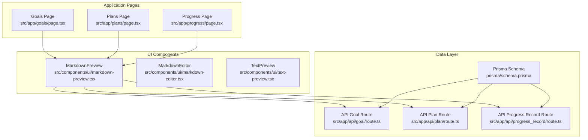
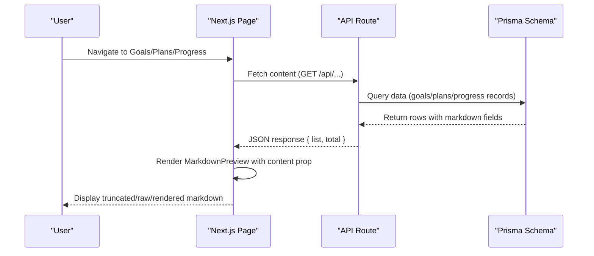
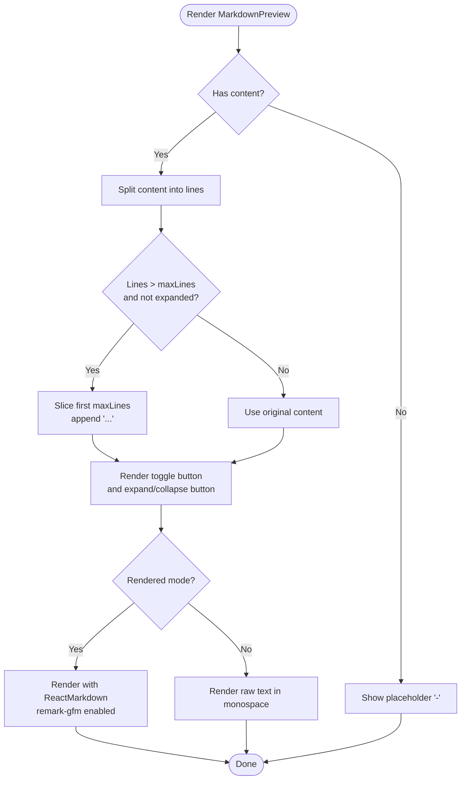
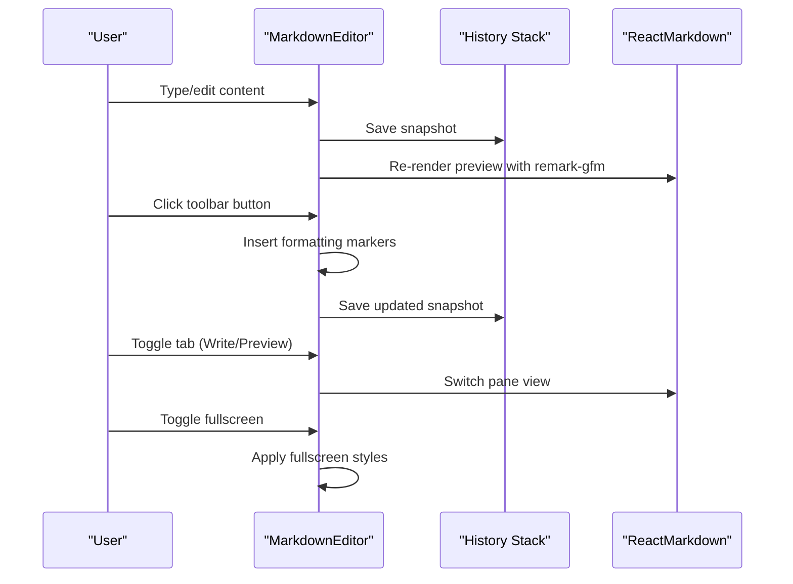
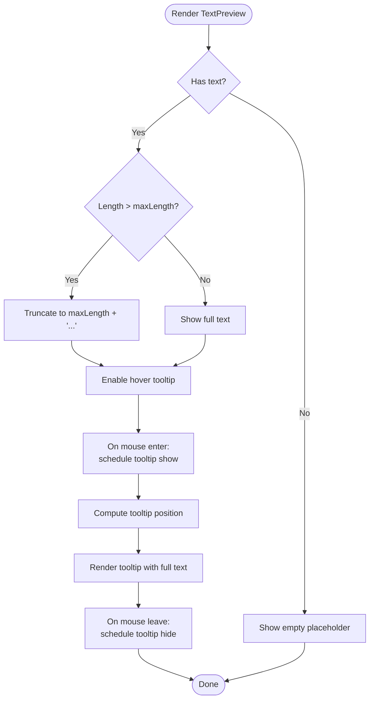
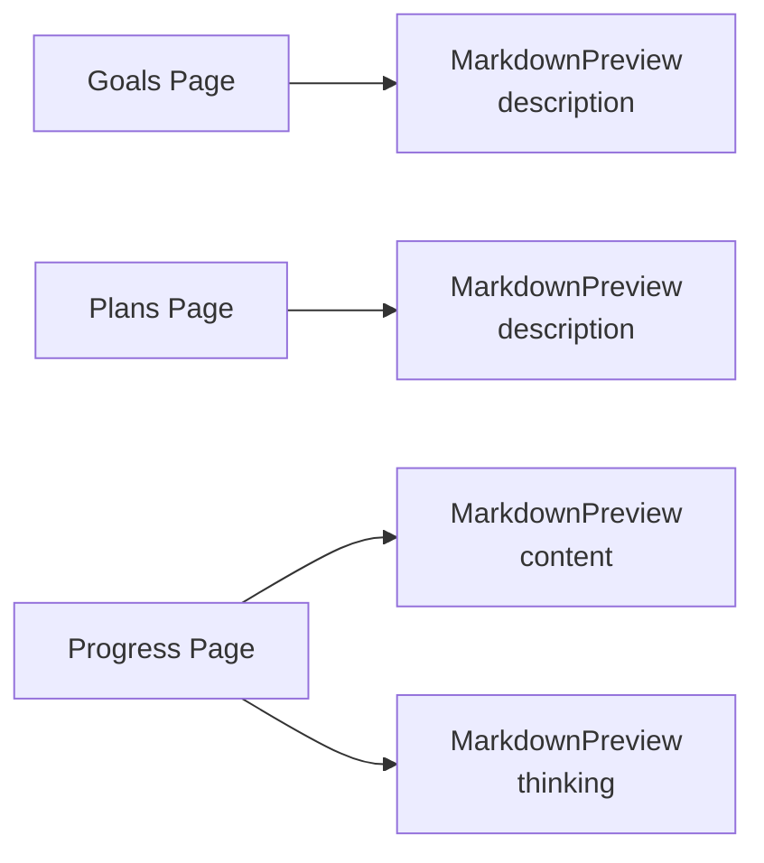
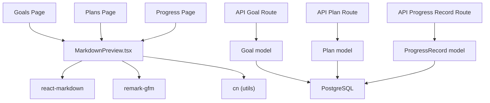

# Markdown Preview

<cite>
**Referenced Files in This Document**
- [markdown-preview.tsx](file://src/components/ui/markdown-preview.tsx)
- [markdown-editor.tsx](file://src/components/ui/markdown-editor.tsx)
- [text-preview.tsx](file://src/components/ui/text-preview.tsx)
- [page.tsx](file://src/app/goals/page.tsx)
- [page.tsx](file://src/app/plans/page.tsx)
- [page.tsx](file://src/app/progress/page.tsx)
- [route.ts](file://src/app/api/goal/route.ts)
- [route.ts](file://src/app/api/plan/route.ts)
- [route.ts](file://src/app/api/progress_record/route.ts)
- [schema.prisma](file://prisma/schema.prisma)
- [utils.ts](file://src/lib/utils.ts)
</cite>

## Table of Contents
1. [Introduction](#introduction)
2. [Project Structure](#project-structure)
3. [Core Components](#core-components)
4. [Architecture Overview](#architecture-overview)
5. [Detailed Component Analysis](#detailed-component-analysis)
6. [Dependency Analysis](#dependency-analysis)
7. [Performance Considerations](#performance-considerations)
8. [Troubleshooting Guide](#troubleshooting-guide)
9. [Conclusion](#conclusion)

## Introduction
This document explains the Markdown Preview component ecosystem in the Goal Mate application. It covers how markdown content is displayed, truncated, toggled between raw and rendered views, and integrated across the application's pages for goals, plans, and progress records. It also documents the underlying data model and API routes that supply markdown content to these previews.

## Project Structure
The Markdown Preview feature spans three main areas:
- UI Components: MarkdownPreview, MarkdownEditor, and TextPreview
- Application Pages: Goals, Plans, and Progress pages that consume MarkdownPreview
- Data Layer: Prisma schema and API routes that persist and serve markdown content

**Diagram sources**
- [markdown-preview.tsx:1-99](file://src/components/ui/markdown-preview.tsx#L1-L99)
- [markdown-editor.tsx:1-356](file://src/components/ui/markdown-editor.tsx#L1-L356)
- [text-preview.tsx:1-241](file://src/components/ui/text-preview.tsx#L1-L241)
- [page.tsx:238-242](file://src/app/goals/page.tsx#L238-L242)
- [page.tsx:813-817](file://src/app/plans/page.tsx#L813-L817)
- [page.tsx:509-520](file://src/app/progress/page.tsx#L509-L520)
- [route.ts:1-51](file://src/app/api/goal/route.ts#L1-L51)
- [route.ts:1-114](file://src/app/api/plan/route.ts#L1-L114)
- [route.ts:1-154](file://src/app/api/progress_record/route.ts#L1-L154)
- [schema.prisma:16-61](file://prisma/schema.prisma#L16-L61)

**Section sources**
- [markdown-preview.tsx:1-99](file://src/components/ui/markdown-preview.tsx#L1-L99)
- [page.tsx:238-242](file://src/app/goals/page.tsx#L238-L242)
- [page.tsx:813-817](file://src/app/plans/page.tsx#L813-L817)
- [page.tsx:509-520](file://src/app/progress/page.tsx#L509-L520)
- [route.ts:1-51](file://src/app/api/goal/route.ts#L1-L51)
- [route.ts:1-114](file://src/app/api/plan/route.ts#L1-L114)
- [route.ts:1-154](file://src/app/api/progress_record/route.ts#L1-L154)
- [schema.prisma:16-61](file://prisma/schema.prisma#L16-L61)

## Core Components
- MarkdownPreview: Renders markdown content with GitHub Flavored Markdown support, optional truncation, and a toggle to switch between raw text and rendered view. It supports a maximum number of visible lines and an expand/collapse button.
- MarkdownEditor: Provides a dual-pane editor with write and preview tabs, toolbar shortcuts, undo/redo history, and fullscreen mode. It renders markdown with GFM in real-time.
- TextPreview: Handles plain text preview with truncation, tooltip-based full-text display, and copy-to-clipboard functionality.

Key integration points:
- Goals page uses MarkdownPreview to display goal descriptions in the table.
- Plans page uses MarkdownPreview for plan descriptions.
- Progress page uses MarkdownPreview for content and thinking fields of progress records.

**Section sources**
- [markdown-preview.tsx:11-99](file://src/components/ui/markdown-preview.tsx#L11-L99)
- [markdown-editor.tsx:33-356](file://src/components/ui/markdown-editor.tsx#L33-L356)
- [text-preview.tsx:7-241](file://src/components/ui/text-preview.tsx#L7-L241)
- [page.tsx:238-242](file://src/app/goals/page.tsx#L238-L242)
- [page.tsx:813-817](file://src/app/plans/page.tsx#L813-L817)
- [page.tsx:509-520](file://src/app/progress/page.tsx#L509-L520)

## Architecture Overview
The Markdown Preview feature follows a unidirectional data flow:
- Data is fetched from API routes (/api/goal, /api/plan, /api/progress_record) based on page needs.
- Components receive content props and render either raw text or rendered markdown via ReactMarkdown with remark-gfm.
- Optional UI controls (toggle buttons, expand/collapse) manage visibility and presentation.

**Diagram sources**
- [page.tsx:39-52](file://src/app/goals/page.tsx#L39-L52)
- [page.tsx:190-212](file://src/app/plans/page.tsx#L190-L212)
- [page.tsx:53-104](file://src/app/progress/page.tsx#L53-L104)
- [route.ts:8-24](file://src/app/api/goal/route.ts#L8-L24)
- [route.ts:7-66](file://src/app/api/plan/route.ts#L7-L66)
- [route.ts:6-22](file://src/app/api/progress_record/route.ts#L6-L22)
- [schema.prisma:16-61](file://prisma/schema.prisma#L16-L61)

## Detailed Component Analysis

### MarkdownPreview Component
MarkdownPreview provides:
- Toggle between raw text and rendered markdown view
- Line-based truncation with expand/collapse
- Responsive styling using Tailwind classes and prose utilities
- Support for GitHub Flavored Markdown via remark-gfm

**Diagram sources**
- [markdown-preview.tsx:18-96](file://src/components/ui/markdown-preview.tsx#L18-L96)

**Section sources**
- [markdown-preview.tsx:11-99](file://src/components/ui/markdown-preview.tsx#L11-L99)

### MarkdownEditor Component
MarkdownEditor offers:
- Dual-pane interface with write and preview tabs
- Toolbar with formatting shortcuts (headings, lists, links, images, code blocks)
- Undo/redo history with bounded storage
- Fullscreen mode for immersive editing
- Real-time markdown rendering with GFM

**Diagram sources**
- [markdown-editor.tsx:67-356](file://src/components/ui/markdown-editor.tsx#L67-L356)

**Section sources**
- [markdown-editor.tsx:33-356](file://src/components/ui/markdown-editor.tsx#L33-L356)

### TextPreview Component
TextPreview focuses on plain text:
- Truncates long text with line clamping
- Shows tooltip with full text on hover
- Supports copying to clipboard
- Detects and links URLs within text

**Diagram sources**
- [text-preview.tsx:14-241](file://src/components/ui/text-preview.tsx#L14-L241)

**Section sources**
- [text-preview.tsx:7-241](file://src/components/ui/text-preview.tsx#L7-L241)

### Integration in Application Pages
- Goals page: Uses MarkdownPreview to display goal descriptions in the table cell with maxLines set to 2 and showToggle enabled.
- Plans page: Uses MarkdownPreview for plan descriptions with similar configuration.
- Progress page: Uses MarkdownPreview for both content and thinking fields of progress records.

**Diagram sources**
- [page.tsx:238-242](file://src/app/goals/page.tsx#L238-L242)
- [page.tsx:813-817](file://src/app/plans/page.tsx#L813-L817)
- [page.tsx:509-520](file://src/app/progress/page.tsx#L509-L520)

**Section sources**
- [page.tsx:238-242](file://src/app/goals/page.tsx#L238-L242)
- [page.tsx:813-817](file://src/app/plans/page.tsx#L813-L817)
- [page.tsx:509-520](file://src/app/progress/page.tsx#L509-L520)

## Dependency Analysis
- MarkdownPreview depends on:
  - ReactMarkdown and remark-gfm for rendering
  - Lucide icons for toggle buttons
  - cn utility for conditional class merging
- Pages depend on MarkdownPreview for displaying markdown content returned by API routes.
- API routes depend on Prisma models to fetch and return markdown fields.

**Diagram sources**
- [markdown-preview.tsx:3-9](file://src/components/ui/markdown-preview.tsx#L3-L9)
- [page.tsx:1-16](file://src/app/goals/page.tsx#L1-L16)
- [page.tsx:1-18](file://src/app/plans/page.tsx#L1-L18)
- [page.tsx:1-17](file://src/app/progress/page.tsx#L1-L17)
- [route.ts:1-51](file://src/app/api/goal/route.ts#L1-L51)
- [route.ts:1-114](file://src/app/api/plan/route.ts#L1-L114)
- [route.ts:1-154](file://src/app/api/progress_record/route.ts#L1-L154)
- [schema.prisma:16-61](file://prisma/schema.prisma#L16-L61)

**Section sources**
- [markdown-preview.tsx:3-9](file://src/components/ui/markdown-preview.tsx#L3-L9)
- [page.tsx:1-16](file://src/app/goals/page.tsx#L1-L16)
- [page.tsx:1-18](file://src/app/plans/page.tsx#L1-L18)
- [page.tsx:1-17](file://src/app/progress/page.tsx#L1-L17)
- [route.ts:1-51](file://src/app/api/goal/route.ts#L1-L51)
- [route.ts:1-114](file://src/app/api/plan/route.ts#L1-L114)
- [route.ts:1-154](file://src/app/api/progress_record/route.ts#L1-L154)
- [schema.prisma:16-61](file://prisma/schema.prisma#L16-L61)

## Performance Considerations
- Rendering large markdown bodies can be expensive. Consider:
  - Limiting maxLines to reduce DOM nodes
  - Debouncing or throttling re-renders when content updates frequently
  - Using virtualized lists for long tables containing MarkdownPreview
  - Avoiding unnecessary re-renders by memoizing content props
- For API-heavy pages (Goals, Plans, Progress), ensure pagination and filtering are used to limit payload sizes.

## Troubleshooting Guide
Common issues and resolutions:
- Content not rendering: Verify that content props are non-empty and properly passed to MarkdownPreview.
- Excessive height: Adjust maxLines prop to truncate content earlier.
- Toggle not working: Ensure showToggle is true and that the component receives a non-empty content string.
- Styling inconsistencies: Confirm Tailwind and prose classes are applied correctly; check for conflicting global styles.
- Data not appearing: Check API routes for correct field names and ensure Prisma schema matches expected fields.

**Section sources**
- [markdown-preview.tsx:27-35](file://src/components/ui/markdown-preview.tsx#L27-L35)
- [route.ts:8-24](file://src/app/api/goal/route.ts#L8-L24)
- [route.ts:41-66](file://src/app/api/plan/route.ts#L41-L66)
- [route.ts:13-22](file://src/app/api/progress_record/route.ts#L13-L22)
- [schema.prisma:16-61](file://prisma/schema.prisma#L16-L61)

## Conclusion
The Markdown Preview feature integrates seamlessly across the application, providing consistent, user-friendly rendering of markdown content in goals, plans, and progress records. Its design balances readability, performance, and usability through truncation, toggles, and responsive styling. The supporting MarkdownEditor enables rich authoring workflows, while the API routes and Prisma schema ensure reliable data persistence and retrieval.