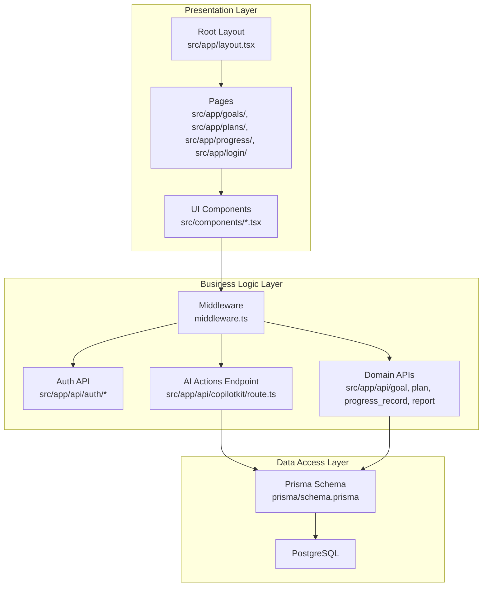
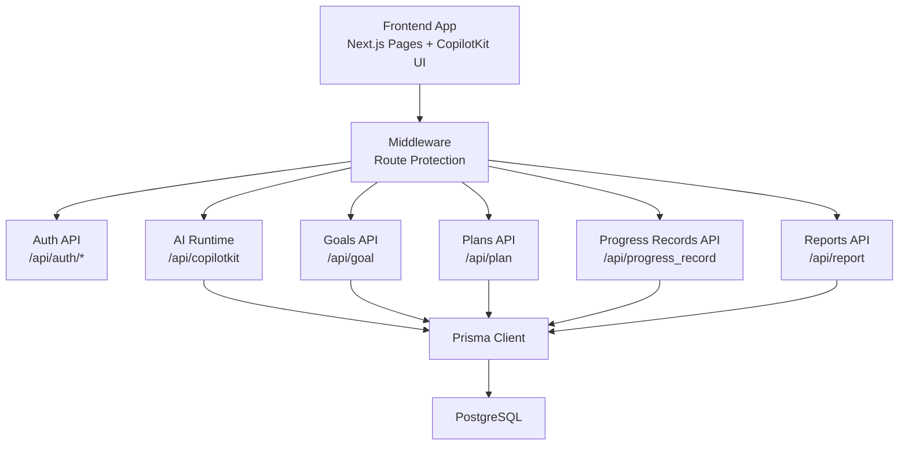
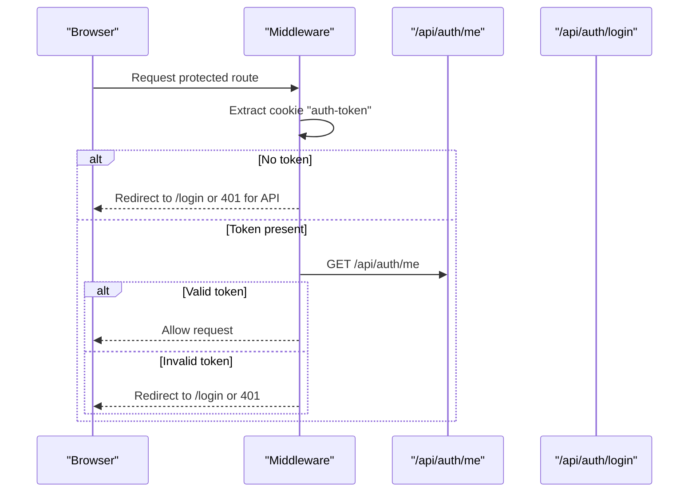
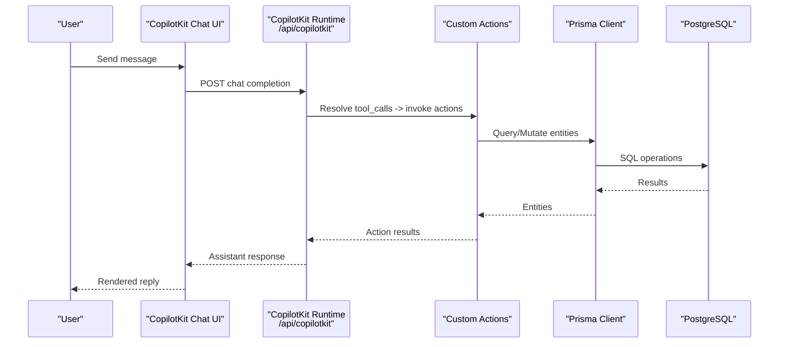
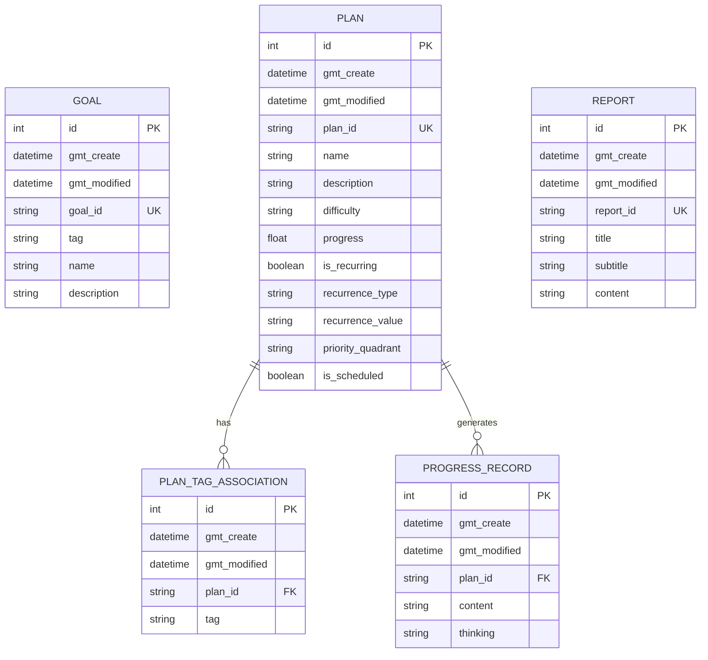
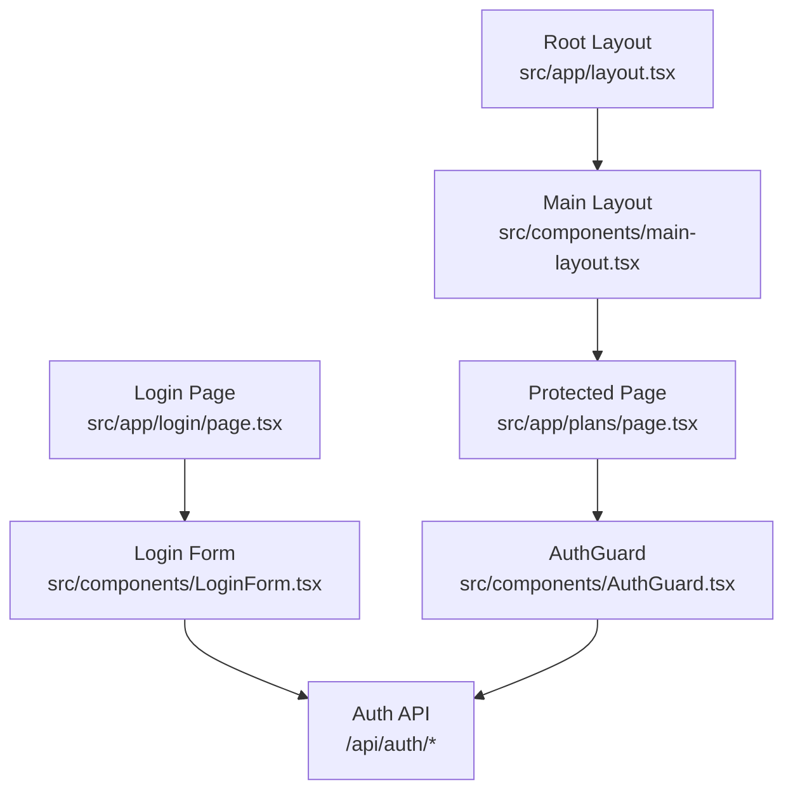
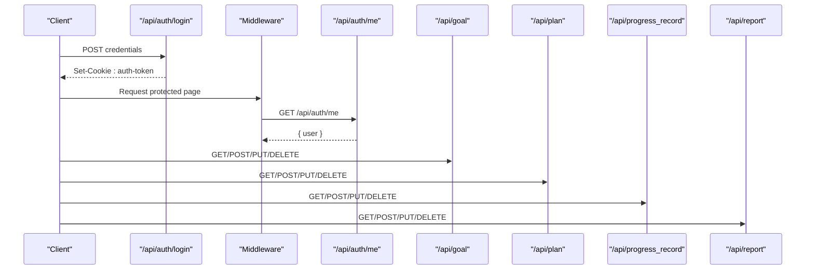
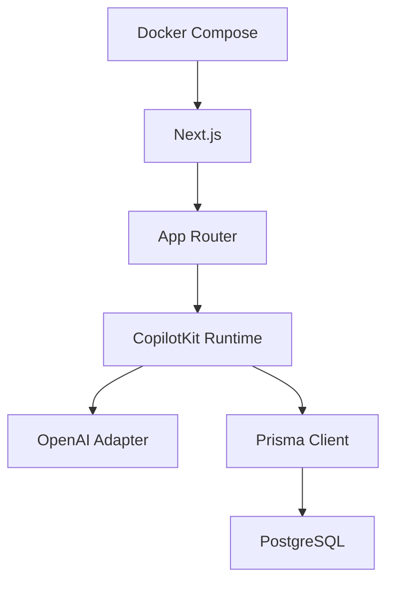

# Architecture Overview

<cite>
**Referenced Files in This Document**
- [README.md](file://README.md)
- [package.json](file://package.json)
- [src/app/layout.tsx](file://src/app/layout.tsx)
- [middleware.ts](file://middleware.ts)
- [prisma/schema.prisma](file://prisma/schema.prisma)
- [src/lib/auth.ts](file://src/lib/auth.ts)
- [src/app/api/auth/login/route.ts](file://src/app/api/auth/login/route.ts)
- [src/app/api/auth/logout/route.ts](file://src/app/api/auth/logout/route.ts)
- [src/app/api/auth/me/route.ts](file://src/app/api/auth/me/route.ts)
- [src/app/api/copilotkit/route.ts](file://src/app/api/copilotkit/route.ts)
- [src/components/main-layout.tsx](file://src/components/main-layout.tsx)
- [src/components/AuthGuard.tsx](file://src/components/AuthGuard.tsx)
- [src/components/LoginForm.tsx](file://src/components/LoginForm.tsx)
- [src/app/api/goal/route.ts](file://src/app/api/goal/route.ts)
- [src/app/api/plan/route.ts](file://src/app/api/plan/route.ts)
- [src/app/api/progress_record/route.ts](file://src/app/api/progress_record/route.ts)
- [src/app/api/report/route.ts](file://src/app/api/report/route.ts)
- [docker-compose.yml](file://docker-compose.yml)
</cite>

## Table of Contents
1. [Introduction](#introduction)
2. [Project Structure](#project-structure)
3. [Core Components](#core-components)
4. [Architecture Overview](#architecture-overview)
5. [Detailed Component Analysis](#detailed-component-analysis)
6. [Dependency Analysis](#dependency-analysis)
7. [Performance Considerations](#performance-considerations)
8. [Troubleshooting Guide](#troubleshooting-guide)
9. [Conclusion](#conclusion)
10. [Appendices](#appendices)

## Introduction
This document presents the high-level architecture of Goal Mate, an AI-powered goal and plan management system built with Next.js and integrated with CopilotKit. The system follows a layered architecture separating presentation, business logic, and data access. It leverages Next.js App Router to organize pages, API routes, and layouts, and uses a middleware pattern to enforce authentication across protected routes. The AI integration centers on a CopilotKit runtime endpoint that exposes a custom action system backed by Prisma ORM and PostgreSQL. Cross-cutting concerns include authentication via JWT cookies, error handling, and data validation. The deployment topology uses Docker containers orchestrated by Docker Compose.

## Project Structure
Goal Mate is organized around Next.js App Router conventions:
- Pages under src/app define UI surfaces (e.g., goals, plans, progress, login).
- API routes under src/app/api implement backend endpoints for authentication, AI actions, and domain operations.
- Shared UI components live under src/components, including layout wrappers and guards.
- Business logic and persistence are encapsulated behind API routes and Prisma models.

**Diagram sources**
- [src/app/layout.tsx:16-30](file://src/app/layout.tsx#L16-L30)
- [middleware.ts:3-35](file://middleware.ts#L3-L35)
- [src/app/api/auth/login/route.ts:5-50](file://src/app/api/auth/login/route.ts#L5-L50)
- [src/app/api/copilotkit/route.ts:1-120](file://src/app/api/copilotkit/route.ts#L1-L120)
- [src/app/api/goal/route.ts:1-51](file://src/app/api/goal/route.ts#L1-L51)
- [prisma/schema.prisma:16-72](file://prisma/schema.prisma#L16-L72)

**Section sources**
- [README.md:157-174](file://README.md#L157-L174)
- [src/app/layout.tsx:16-30](file://src/app/layout.tsx#L16-L30)
- [middleware.ts:3-35](file://middleware.ts#L3-L35)

## Core Components
- Authentication subsystem: JWT-based session via httpOnly cookies, validated by middleware and exposed via /api/auth endpoints.
- AI assistant integration: CopilotKit runtime endpoint exposing a custom action system for goals, plans, progress, and reporting.
- Domain APIs: CRUD endpoints for goals, plans, progress records, and reports, backed by Prisma ORM.
- Presentation layer: Next.js pages and shared UI components, with a main layout wrapper and an AuthGuard for protected routes.
- Middleware: Global route protection enforcing authentication for non-static paths.

**Section sources**
- [src/lib/auth.ts:14-33](file://src/lib/auth.ts#L14-L33)
- [src/app/api/auth/login/route.ts:24-36](file://src/app/api/auth/login/route.ts#L24-L36)
- [src/app/api/copilotkit/route.ts:286-367](file://src/app/api/copilotkit/route.ts#L286-L367)
- [src/app/api/goal/route.ts:7-31](file://src/app/api/goal/route.ts#L7-L31)
- [src/components/main-layout.tsx:11-62](file://src/components/main-layout.tsx#L11-L62)
- [middleware.ts:3-35](file://middleware.ts#L3-L35)

## Architecture Overview
The system architecture is layered and event-driven:
- Presentation: Next.js pages and CopilotKit chat UI rendered within the root layout.
- Business Logic: Middleware enforces auth; API routes implement domain operations and expose AI actions.
- Data Access: Prisma clients connect to PostgreSQL; models define entities and relationships.

**Diagram sources**
- [src/app/layout.tsx:24-26](file://src/app/layout.tsx#L24-L26)
- [middleware.ts:3-35](file://middleware.ts#L3-L35)
- [src/app/api/auth/login/route.ts:5-50](file://src/app/api/auth/login/route.ts#L5-L50)
- [src/app/api/copilotkit/route.ts:1-120](file://src/app/api/copilotkit/route.ts#L1-L120)
- [src/app/api/goal/route.ts:1-51](file://src/app/api/goal/route.ts#L1-L51)
- [src/app/api/plan/route.ts:1-114](file://src/app/api/plan/route.ts#L1-L114)
- [src/app/api/progress_record/route.ts:1-154](file://src/app/api/progress_record/route.ts#L1-L154)
- [src/app/api/report/route.ts:1-48](file://src/app/api/report/route.ts#L1-L48)
- [prisma/schema.prisma:16-72](file://prisma/schema.prisma#L16-L72)

## Detailed Component Analysis

### Authentication Middleware Pattern
The middleware enforces authentication for non-static and non-public paths. It checks for a presence of an httpOnly auth-token cookie and either redirects unauthenticated requests to the login page or returns a 401 for API routes.

**Diagram sources**
- [middleware.ts:3-35](file://middleware.ts#L3-L35)
- [src/app/api/auth/me/route.ts:4-26](file://src/app/api/auth/me/route.ts#L4-L26)
- [src/app/api/auth/login/route.ts:5-50](file://src/app/api/auth/login/route.ts#L5-L50)

**Section sources**
- [middleware.ts:3-35](file://middleware.ts#L3-L35)
- [src/lib/auth.ts:49-69](file://src/lib/auth.ts#L49-L69)
- [src/app/api/auth/me/route.ts:4-26](file://src/app/api/auth/me/route.ts#L4-L26)
- [src/app/api/auth/login/route.ts:24-36](file://src/app/api/auth/login/route.ts#L24-L36)

### AI Integration with CopilotKit Runtime and Custom Actions
The CopilotKit runtime endpoint initializes an OpenAI-compatible adapter and defines a set of custom actions. These actions integrate with Prisma to query and mutate domain entities (goals, plans, progress records, reports). The runtime also injects a system prompt tailored for reading and learning scenarios and enables search capabilities for Qwen models.

**Diagram sources**
- [src/app/layout.tsx:24-26](file://src/app/layout.tsx#L24-L26)
- [src/app/api/copilotkit/route.ts:286-367](file://src/app/api/copilotkit/route.ts#L286-L367)
- [prisma/schema.prisma:16-72](file://prisma/schema.prisma#L16-L72)

**Section sources**
- [src/app/api/copilotkit/route.ts:1-120](file://src/app/api/copilotkit/route.ts#L1-L120)
- [src/app/api/copilotkit/route.ts:286-367](file://src/app/api/copilotkit/route.ts#L286-L367)
- [src/app/api/copilotkit/route.ts:438-518](file://src/app/api/copilotkit/route.ts#L438-L518)
- [src/app/api/copilotkit/route.ts:520-614](file://src/app/api/copilotkit/route.ts#L520-L614)
- [src/app/api/copilotkit/route.ts:616-702](file://src/app/api/copilotkit/route.ts#L616-L702)
- [src/app/api/copilotkit/route.ts:704-808](file://src/app/api/copilotkit/route.ts#L704-L808)

### Database Architecture with Prisma ORM and PostgreSQL
The Prisma schema defines entities for goals, plans, plan-tag associations, progress records, and reports. Relationships include:
- Plan has many PlanTagAssociation entries and ProgressRecord entries.
- ProgressRecord belongs to a Plan.
- PlanTagAssociation belongs to a Plan and carries tag metadata.

**Diagram sources**
- [prisma/schema.prisma:16-72](file://prisma/schema.prisma#L16-L72)

**Section sources**
- [prisma/schema.prisma:16-72](file://prisma/schema.prisma#L16-L72)
- [src/app/api/plan/route.ts:69-105](file://src/app/api/plan/route.ts#L69-L105)
- [src/app/api/progress_record/route.ts:25-70](file://src/app/api/progress_record/route.ts#L25-L70)

### Component Hierarchy: Layout, Pages, and Reusable UI
The main layout composes the application shell and hosts the CopilotKit chat panel. Protected pages render within an AuthGuard that validates the session against /api/auth/me. Login form posts credentials to /api/auth/login and redirects on success.

**Diagram sources**
- [src/app/layout.tsx:16-30](file://src/app/layout.tsx#L16-L30)
- [src/components/main-layout.tsx:11-62](file://src/components/main-layout.tsx#L11-L62)
- [src/components/AuthGuard.tsx:10-53](file://src/components/AuthGuard.tsx#L10-L53)
- [src/components/LoginForm.tsx:6-40](file://src/components/LoginForm.tsx#L6-L40)
- [src/app/api/auth/login/route.ts:5-50](file://src/app/api/auth/login/route.ts#L5-L50)
- [src/app/api/auth/me/route.ts:4-26](file://src/app/api/auth/me/route.ts#L4-L26)

**Section sources**
- [src/components/main-layout.tsx:11-62](file://src/components/main-layout.tsx#L11-L62)
- [src/components/AuthGuard.tsx:10-53](file://src/components/AuthGuard.tsx#L10-L53)
- [src/components/LoginForm.tsx:6-40](file://src/components/LoginForm.tsx#L6-L40)
- [src/app/api/auth/me/route.ts:4-26](file://src/app/api/auth/me/route.ts#L4-L26)
- [src/app/api/auth/login/route.ts:24-36](file://src/app/api/auth/login/route.ts#L24-L36)

### API Workflows: Authentication and Domain Operations
- Authentication flow: Client submits credentials to /api/auth/login; server responds with an httpOnly auth-token cookie. Subsequent requests are validated by middleware and /api/auth/me.
- Domain operations: Goals, plans, progress records, and reports expose CRUD endpoints. Plan endpoints support filtering and pagination and include associated tags and latest progress timestamps.

**Diagram sources**
- [src/app/api/auth/login/route.ts:5-50](file://src/app/api/auth/login/route.ts#L5-L50)
- [src/app/api/auth/me/route.ts:4-26](file://src/app/api/auth/me/route.ts#L4-L26)
- [middleware.ts:3-35](file://middleware.ts#L3-L35)
- [src/app/api/goal/route.ts:7-51](file://src/app/api/goal/route.ts#L7-L51)
- [src/app/api/plan/route.ts:7-114](file://src/app/api/plan/route.ts#L7-L114)
- [src/app/api/progress_record/route.ts:6-154](file://src/app/api/progress_record/route.ts#L6-L154)
- [src/app/api/report/route.ts:7-48](file://src/app/api/report/route.ts#L7-L48)

**Section sources**
- [src/app/api/auth/login/route.ts:5-50](file://src/app/api/auth/login/route.ts#L5-L50)
- [src/app/api/auth/logout/route.ts:4-23](file://src/app/api/auth/logout/route.ts#L4-L23)
- [src/app/api/auth/me/route.ts:4-26](file://src/app/api/auth/me/route.ts#L4-L26)
- [src/app/api/goal/route.ts:7-51](file://src/app/api/goal/route.ts#L7-L51)
- [src/app/api/plan/route.ts:7-114](file://src/app/api/plan/route.ts#L7-L114)
- [src/app/api/progress_record/route.ts:6-154](file://src/app/api/progress_record/route.ts#L6-L154)
- [src/app/api/report/route.ts:7-48](file://src/app/api/report/route.ts#L7-L48)

## Dependency Analysis
Key dependencies and integration points:
- Next.js App Router orchestrates pages and API routes.
- CopilotKit runtime integrates with OpenAI-compatible adapters and exposes custom actions.
- Prisma ORM connects to PostgreSQL; models define entities and relationships.
- Authentication relies on JWT stored in httpOnly cookies and validated by middleware and API endpoints.
- Docker Compose provisions the application container with environment variables and health checks.

**Diagram sources**
- [package.json:16-43](file://package.json#L16-L43)
- [src/app/api/copilotkit/route.ts:1-120](file://src/app/api/copilotkit/route.ts#L1-L120)
- [prisma/schema.prisma:7-14](file://prisma/schema.prisma#L7-L14)
- [docker-compose.yml:1-56](file://docker-compose.yml#L1-L56)

**Section sources**
- [package.json:16-43](file://package.json#L16-L43)
- [docker-compose.yml:14-25](file://docker-compose.yml#L14-L25)

## Performance Considerations
- Middleware evaluation occurs per request; keep cookie parsing lightweight and avoid heavy synchronous work in the middleware chain.
- API routes use Prisma’s client; batch operations where possible and leverage pagination to limit payload sizes.
- CopilotKit actions should minimize round-trips by combining queries and mutations efficiently.
- Use database indexes on frequently filtered fields (e.g., plan_id, goal_id, tag) to improve query performance.

## Troubleshooting Guide
Common issues and remedies:
- Authentication failures: Verify AUTH_SECRET is set and the auth-token cookie is httpOnly and not expired. Confirm middleware matcher excludes static assets and login routes.
- API 401 responses: Ensure /api/auth/me returns a valid user; otherwise middleware redirects to /login or returns 401 for API routes.
- CopilotKit errors: Check OPENAI_API_KEY and OPENAI_BASE_URL environment variables; confirm the runtime endpoint is reachable and actions are properly registered.
- Database connectivity: Validate DATABASE_URL and ensure Prisma migrations are applied before startup.

**Section sources**
- [src/lib/auth.ts:5-11](file://src/lib/auth.ts#L5-L11)
- [middleware.ts:19-30](file://middleware.ts#L19-L30)
- [src/app/api/auth/me/route.ts:8-13](file://src/app/api/auth/me/route.ts#L8-L13)
- [src/app/api/copilotkit/route.ts:72-86](file://src/app/api/copilotkit/route.ts#L72-L86)
- [docker-compose.yml:14-25](file://docker-compose.yml#L14-L25)

## Conclusion
Goal Mate employs a clean layered architecture with Next.js App Router organizing presentation, business logic, and data access. The middleware pattern ensures consistent authentication enforcement, while CopilotKit runtime integrates AI actions with a custom action system. Prisma ORM and PostgreSQL provide robust persistence with clear entity relationships. The deployment topology using Docker Compose streamlines operations and health monitoring.

## Appendices
- Technology stack integration highlights:
  - Frontend: Next.js 15, React 19, TypeScript, Tailwind CSS.
  - Backend: Next.js API Routes, Prisma ORM.
  - Database: PostgreSQL.
  - AI integration: CopilotKit + OpenAI-compatible adapter.
  - UI components: Radix UI + shadcn/ui.
  - Authentication: JWT + httpOnly cookies.
  - Deployment: Docker + Docker Compose.

**Section sources**
- [README.md:24-32](file://README.md#L24-L32)
- [package.json:16-43](file://package.json#L16-L43)
- [docker-compose.yml:1-56](file://docker-compose.yml#L1-L56)