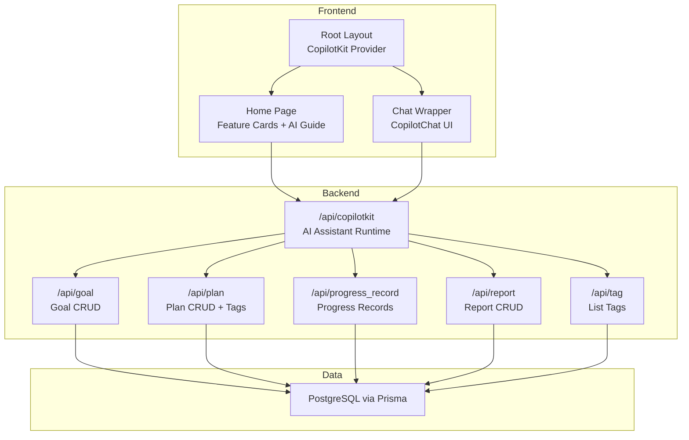
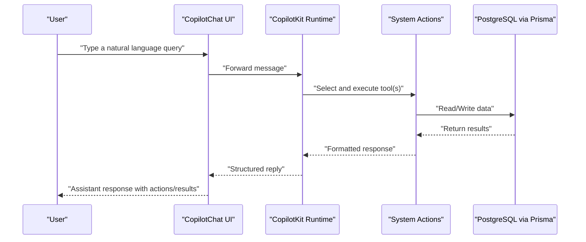
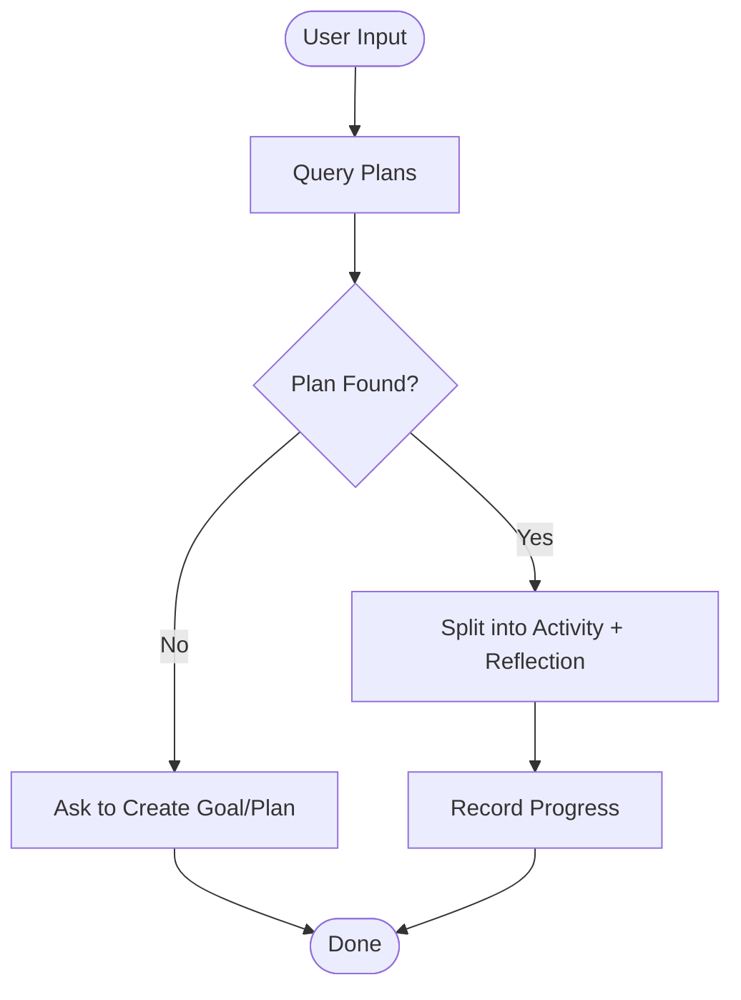
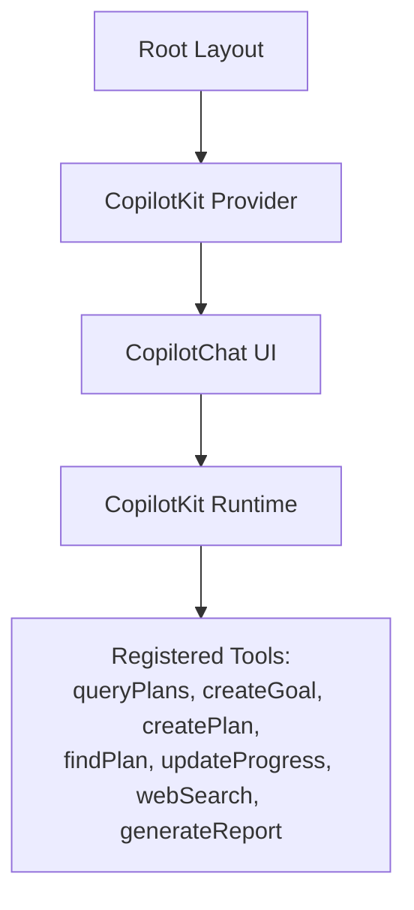
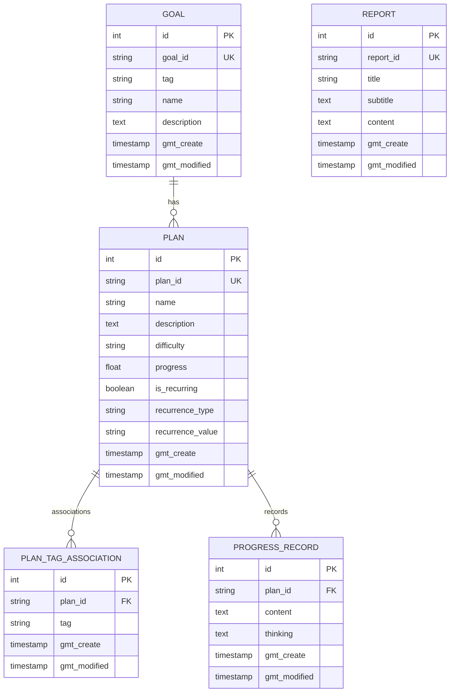
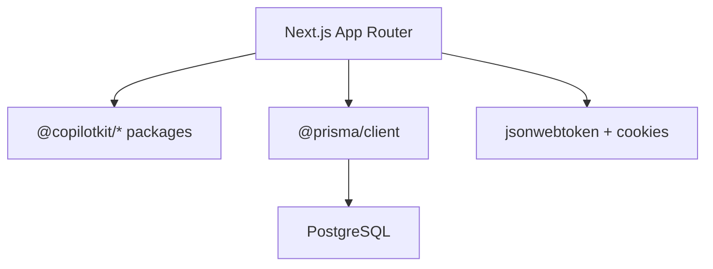

# Introduction

<cite>
**Referenced Files in This Document**
- [README.md](file://README.md)
- [package.json](file://package.json)
- [src/app/layout.tsx](file://src/app/layout.tsx)
- [src/app/page.tsx](file://src/app/page.tsx)
- [src/components/chat-wrapper.tsx](file://src/components/chat-wrapper.tsx)
- [src/app/api/copilotkit/route.ts](file://src/app/api/copilotkit/route.ts)
- [src/app/api/goal/route.ts](file://src/app/api/goal/route.ts)
- [src/app/api/plan/route.ts](file://src/app/api/plan/route.ts)
- [src/app/api/progress_record/route.ts](file://src/app/api/progress_record/route.ts)
- [src/app/api/report/route.ts](file://src/app/api/report/route.ts)
- [src/app/api/tag/route.ts](file://src/app/api/tag/route.ts)
- [prisma/schema.prisma](file://prisma/schema.prisma)
- [src/lib/auth.ts](file://src/lib/auth.ts)
</cite>

## Table of Contents
1. [Introduction](#introduction)
2. [Project Structure](#project-structure)
3. [Core Components](#core-components)
4. [Architecture Overview](#architecture-overview)
5. [Detailed Component Analysis](#detailed-component-analysis)
6. [Dependency Analysis](#dependency-analysis)
7. [Performance Considerations](#performance-considerations)
8. [Troubleshooting Guide](#troubleshooting-guide)
9. [Conclusion](#conclusion)

## Introduction
Goal Mate is an AI-powered intelligent goal and task management system built with Next.js and CopilotKit. It enables users to manage goals, plans, and progress more efficiently through a natural language AI assistant. The system integrates an AI assistant that understands user intent and automatically performs actions such as recommending tasks, creating goals and plans, updating progress, and generating reports. It leverages CopilotKit to expose system APIs as tools that the AI assistant can call, enabling seamless conversational workflows.

Key value propositions:
- Natural language AI assistance: Users interact with an AI assistant to manage goals and tasks without writing code or remembering commands.
- Intelligent automation: The AI assistant intelligently queries existing plans, matches user input to relevant plans, and either updates progress or suggests creating new goals/plans.
- Conversational book search and recommendations: The AI assistant can search for books and present structured, readable information in Markdown format.
- Automated progress tracking: Users can describe their progress naturally, and the AI assistant splits the input into “completed activity” and “reflection,” then records them accordingly.
- Built-in reporting: The AI assistant can generate weekly or monthly reports based on goals and progress records.

Target audience:
- Beginners: People new to AI productivity tools who want a simple way to manage goals and tasks via natural language.
- Experienced developers: Teams or individuals who want to evaluate a modern, extensible AI-assisted productivity stack built on Next.js and CopilotKit.

Use cases:
- Managing long-term goals with associated plans and tags.
- Getting task recommendations based on current energy level or schedule.
- Automatically tracking reading or study progress with reflective notes.
- Generating weekly/monthly progress reports aligned with goal categories.

Competitive advantages:
- CopilotKit integration: Actions are exposed as tools, enabling robust, extensible AI workflows.
- Natural language-first UX: Minimal friction for users who prefer conversational interactions.
- Structured progress recording: Automatic segmentation of factual progress and reflective thoughts.
- Practical integrations: Built-in book search and recommendations powered by web search.

## Project Structure
Goal Mate follows a Next.js app directory structure with API routes under src/app/api and UI components under src/components. The CopilotKit integration is wired at the root layout, enabling the AI assistant to be available across pages. The frontend includes a dedicated chat interface for interacting with the AI assistant.

**Diagram sources**
- [src/app/layout.tsx:16-30](file://src/app/layout.tsx#L16-L30)
- [src/app/page.tsx:16-142](file://src/app/page.tsx#L16-L142)
- [src/components/chat-wrapper.tsx:81-708](file://src/components/chat-wrapper.tsx#L81-L708)
- [src/app/api/copilotkit/route.ts:286-800](file://src/app/api/copilotkit/route.ts#L286-L800)
- [src/app/api/goal/route.ts:7-51](file://src/app/api/goal/route.ts#L7-L51)
- [src/app/api/plan/route.ts:7-103](file://src/app/api/plan/route.ts#L7-L103)
- [src/app/api/progress_record/route.ts:6-154](file://src/app/api/progress_record/route.ts#L6-L154)
- [src/app/api/report/route.ts:7-48](file://src/app/api/report/route.ts#L7-L48)
- [src/app/api/tag/route.ts:6-11](file://src/app/api/tag/route.ts#L6-L11)
- [prisma/schema.prisma:16-70](file://prisma/schema.prisma#L16-L70)

**Section sources**
- [README.md:157-174](file://README.md#L157-L174)
- [src/app/layout.tsx:16-30](file://src/app/layout.tsx#L16-L30)
- [src/app/page.tsx:16-142](file://src/app/page.tsx#L16-L142)
- [src/components/chat-wrapper.tsx:81-708](file://src/components/chat-wrapper.tsx#L81-L708)

## Core Components
- AI assistant runtime: Exposes system actions (query plans, create goals/plans, update progress, search, generate reports) as tools for the AI assistant to call.
- CopilotKit integration: Provides the chat UI and runtime bridge so the AI assistant can communicate with backend actions.
- Authentication: Lightweight JWT-based authentication protecting user sessions.
- Data models: Goals, Plans, Progress Records, Reports, and Tags managed via Prisma and PostgreSQL.

Key capabilities demonstrated in the home page:
- Intelligent workflow: When users mention learning or completion, the AI assistant queries existing plans, matches them, and records progress or suggests creating new goals/plans.
- Book search and recommendations: The AI assistant searches for books and presents structured information in Markdown.
- Task recommendations: Based on user state and plan availability, the AI assistant recommends suitable tasks.
- Goal/plan creation: The AI assistant distinguishes between abstract goals and concrete plans and uses existing tags when possible.

**Section sources**
- [README.md:5-32](file://README.md#L5-L32)
- [README.md:176-188](file://README.md#L176-L188)
- [src/app/page.tsx:64-138](file://src/app/page.tsx#L64-L138)
- [src/app/api/copilotkit/route.ts:131-237](file://src/app/api/copilotkit/route.ts#L131-L237)

## Architecture Overview
The system architecture centers on a CopilotKit runtime that exposes backend actions as tools. The AI assistant uses these tools to perform goal management, plan management, progress tracking, and reporting. The frontend integrates the CopilotKit chat UI and wraps the entire app with the CopilotKit provider.

**Diagram sources**
- [src/app/layout.tsx:24-26](file://src/app/layout.tsx#L24-L26)
- [src/components/chat-wrapper.tsx:698-706](file://src/components/chat-wrapper.tsx#L698-L706)
- [src/app/api/copilotkit/route.ts:286-800](file://src/app/api/copilotkit/route.ts#L286-L800)

## Detailed Component Analysis

### AI Assistant Workflow
The AI assistant follows a deterministic workflow when users describe progress or learning:
- Query existing plans matching the user’s input.
- If a plan is found, record progress and split the input into “completed activity” and “reflection.”
- If no plan is found, ask whether to create a new goal or plan, and use existing tags when available.

**Diagram sources**
- [src/app/api/copilotkit/route.ts:131-237](file://src/app/api/copilotkit/route.ts#L131-L237)

**Section sources**
- [src/app/page.tsx:64-138](file://src/app/page.tsx#L64-L138)
- [src/app/api/copilotkit/route.ts:131-237](file://src/app/api/copilotkit/route.ts#L131-L237)

### CopilotKit Integration Highlights
- Provider setup: The CopilotKit provider is mounted at the root layout to enable the AI assistant across the app.
- Chat UI: The chat wrapper renders the CopilotChat component with custom styles and hydration-safe initialization.
- Tool exposure: Backend actions are registered with the CopilotKit runtime and callable by the AI assistant.

**Diagram sources**
- [src/app/layout.tsx:24-26](file://src/app/layout.tsx#L24-L26)
- [src/components/chat-wrapper.tsx:81-708](file://src/components/chat-wrapper.tsx#L81-L708)
- [src/app/api/copilotkit/route.ts:286-800](file://src/app/api/copilotkit/route.ts#L286-L800)

**Section sources**
- [src/app/layout.tsx:24-26](file://src/app/layout.tsx#L24-L26)
- [src/components/chat-wrapper.tsx:81-708](file://src/components/chat-wrapper.tsx#L81-L708)
- [src/app/api/copilotkit/route.ts:286-800](file://src/app/api/copilotkit/route.ts#L286-L800)

### Data Models Overview
The system uses a relational schema with Goals, Plans, PlanTagAssociations, ProgressRecords, Reports, and Tags.

**Diagram sources**
- [prisma/schema.prisma:16-70](file://prisma/schema.prisma#L16-L70)

**Section sources**
- [prisma/schema.prisma:16-70](file://prisma/schema.prisma#L16-L70)

### Practical Examples
Common scenarios users can perform with the AI assistant:
- Natural language task recommendations: “I’m tired after work, what can I do right now?”
- Progress updates: “I finished Chapter 3 of CSAPP; it was challenging.”
- Goal and plan creation: “I want to improve my programming skills” (goal), “I want to finish CSAPP” (plan).
- Report generation: “Generate a weekly report based on my goals and progress.”

These examples are illustrated in the home page’s AI guide and are backed by the AI assistant’s system prompts and tool definitions.

**Section sources**
- [src/app/page.tsx:64-138](file://src/app/page.tsx#L64-L138)
- [src/app/api/copilotkit/route.ts:131-237](file://src/app/api/copilotkit/route.ts#L131-L237)

## Dependency Analysis
Goal Mate depends on Next.js for the frontend and backend routing, CopilotKit for AI assistant integration, Prisma for database access, and PostgreSQL for persistence. Authentication is handled via JWT cookies.

**Diagram sources**
- [package.json:16-40](file://package.json#L16-L40)
- [src/lib/auth.ts:1-69](file://src/lib/auth.ts#L1-L69)

**Section sources**
- [package.json:16-40](file://package.json#L16-L40)
- [src/lib/auth.ts:1-69](file://src/lib/auth.ts#L1-L69)

## Performance Considerations
- AI assistant tool call sequences: The runtime includes safeguards to repair tool call sequences for compatibility with OpenAI-compatible APIs.
- Hydration and rendering: The chat wrapper includes hydration fixes and styles to ensure smooth rendering and Markdown display.
- Database queries: API routes use pagination and selective field retrieval to minimize payload sizes.

[No sources needed since this section provides general guidance]

## Troubleshooting Guide
- Authentication errors: Ensure AUTH_SECRET, AUTH_USERNAME, and AUTH_PASSWORD are configured correctly; verify tokens and cookie presence.
- AI assistant not responding: Confirm OPENAI_API_KEY and OPENAI_BASE_URL are set; verify the CopilotKit runtime initializes without errors.
- Tool call failures: Review the tool call sequence repair logic and ensure assistant/tool messages are properly formatted.

**Section sources**
- [src/lib/auth.ts:5-46](file://src/lib/auth.ts#L5-L46)
- [src/app/api/copilotkit/route.ts:70-86](file://src/app/api/copilotkit/route.ts#L70-L86)
- [src/app/api/copilotkit/route.ts:19-67](file://src/app/api/copilotkit/route.ts#L19-L67)

## Conclusion
Goal Mate delivers a natural language–driven approach to goal and task management by combining CopilotKit with a Next.js frontend and a PostgreSQL-backed data layer. Its AI assistant automates common workflows—querying plans, recommending tasks, recording progress, and generating reports—while maintaining a clean separation of concerns and extensibility. Whether you are new to AI productivity tools or evaluating a modern stack, Goal Mate offers a practical, developer-friendly foundation for building intelligent personal productivity systems.