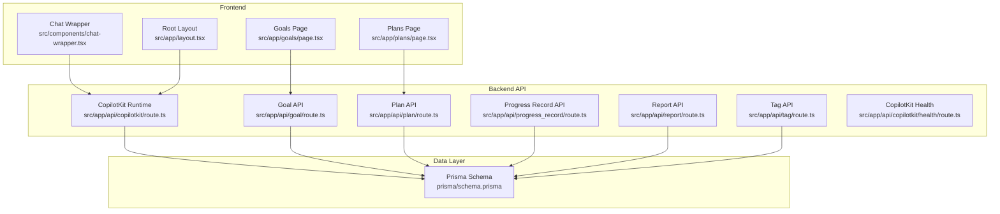
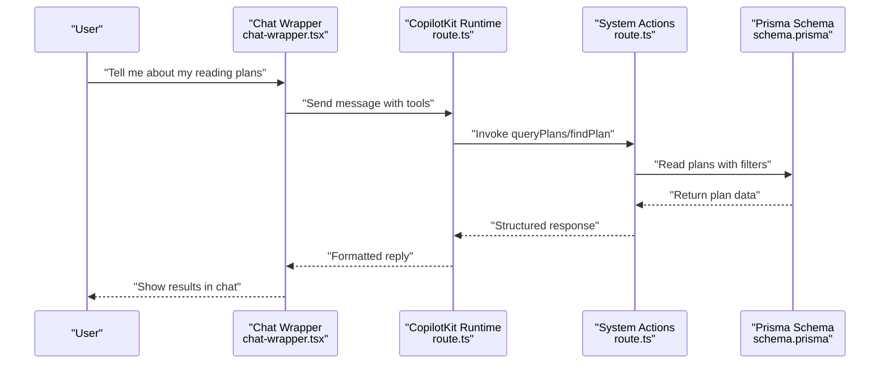
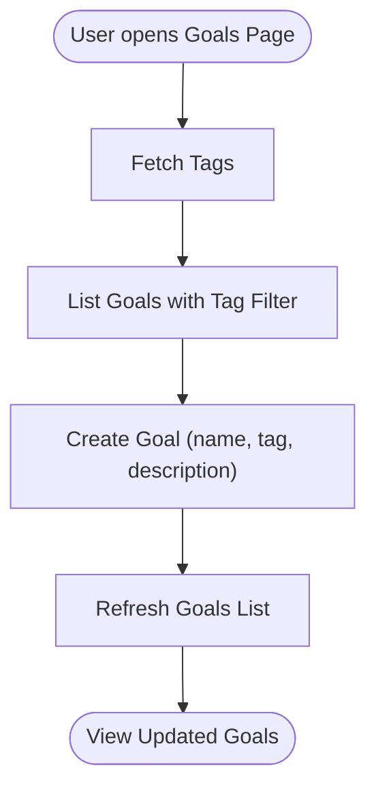
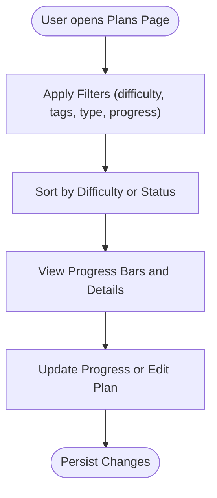
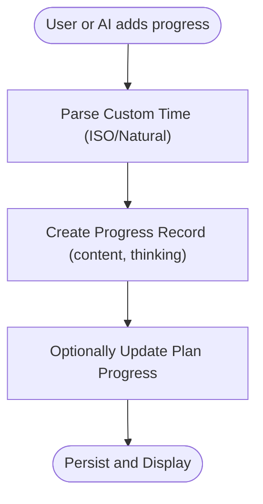
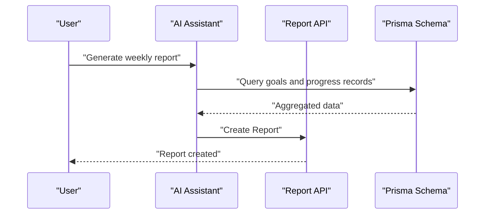
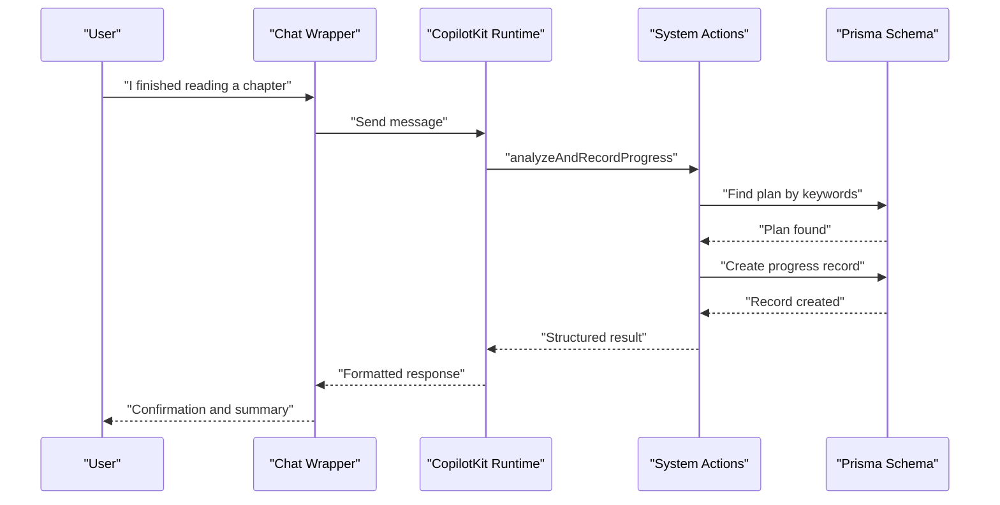
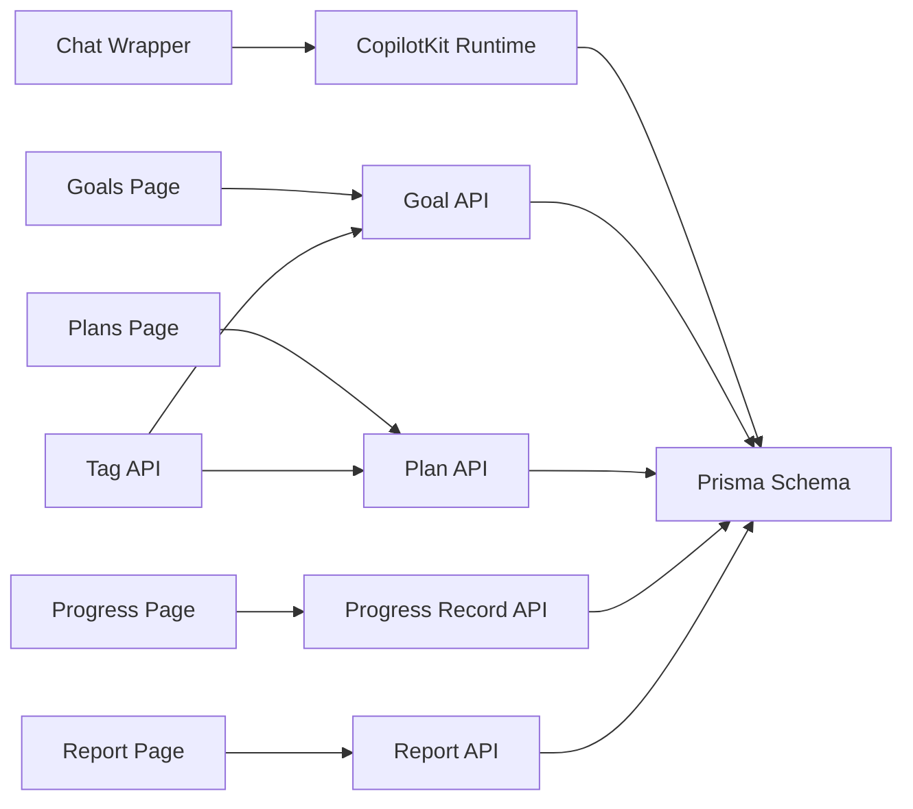

# Key Features

<cite>
**Referenced Files in This Document**
- [README.md](file://README.md)
- [schema.prisma](file://prisma/schema.prisma)
- [layout.tsx](file://src/app/layout.tsx)
- [route.ts](file://src/app/api/goal/route.ts)
- [route.ts](file://src/app/api/plan/route.ts)
- [route.ts](file://src/app/api/progress_record/route.ts)
- [route.ts](file://src/app/api/report/route.ts)
- [route.ts](file://src/app/api/tag/route.ts)
- [route.ts](file://src/app/api/copilotkit/route.ts)
- [health/route.ts](file://src/app/api/copilotkit/health/route.ts)
- [page.tsx](file://src/app/goals/page.tsx)
- [page.tsx](file://src/app/plans/page.tsx)
- [chat-wrapper.tsx](file://src/components/chat-wrapper.tsx)
</cite>

## Table of Contents
1. [Introduction](#introduction)
2. [Project Structure](#project-structure)
3. [Core Components](#core-components)
4. [Architecture Overview](#architecture-overview)
5. [Detailed Component Analysis](#detailed-component-analysis)
6. [Dependency Analysis](#dependency-analysis)
7. [Performance Considerations](#performance-considerations)
8. [Troubleshooting Guide](#troubleshooting-guide)
9. [Conclusion](#conclusion)

## Introduction
This document presents the key features of Goal Mate, focusing on how the system enables AI-assisted goal and plan management. It covers:
- Goal management with tag-based categorization
- Plan management with difficulty ratings and progress tracking
- Progress recording with detailed completion evidence
- Intelligent reporting with automated weekly/monthly reports
- AI assistant with natural language interaction

It explains implementation approaches, user benefits, integration patterns, and practical examples drawn from the codebase to show how features work together in an AI-assisted workflow.

## Project Structure
Goal Mate is a Next.js application with:
- Frontend pages for goals, plans, and progress
- Backend API routes under src/app/api
- AI integration via CopilotKit runtime
- Prisma schema modeling Goals, Plans, Progress Records, and Reports

**Diagram sources**
- [layout.tsx:24-26](file://src/app/layout.tsx#L24-L26)
- [route.ts:1-51](file://src/app/api/goal/route.ts#L1-L51)
- [route.ts:1-103](file://src/app/api/plan/route.ts#L1-L103)
- [route.ts:1-154](file://src/app/api/progress_record/route.ts#L1-L154)
- [route.ts:1-48](file://src/app/api/report/route.ts#L1-L48)
- [route.ts:1-11](file://src/app/api/tag/route.ts#L1-L11)
- [route.ts:1456-1458](file://src/app/api/copilotkit/route.ts#L1456-L1458)
- [health/route.ts:1-32](file://src/app/api/copilotkit/health/route.ts#L1-L32)
- [schema.prisma:16-71](file://prisma/schema.prisma#L16-L71)

**Section sources**
- [README.md:157-174](file://README.md#L157-L174)
- [layout.tsx:24-26](file://src/app/layout.tsx#L24-L26)

## Core Components
This section outlines the five core feature areas and how they are implemented.

- Goal Management with Tag-Based Categorization
  - Implemented via the Goal API supporting list, create, update, and delete operations with tag filtering.
  - The Goals page provides a UI to manage goals, including tag selection and pagination.
  - Benefits: Users can organize long-term goals by tags for easier navigation and filtering.

- Plan Management with Difficulty Ratings and Progress Tracking
  - Implemented via the Plan API supporting list, create, update, and delete operations with filters for difficulty, tag, and goal_id.
  - The Plans page supports difficulty sorting, progress visualization, recurring task configuration, and tag-based filtering.
  - Benefits: Users can define actionable plans with difficulty and progress tracking, and leverage tags for cross-goal categorization.

- Progress Recording with Detailed Completion Evidence
  - Implemented via the Progress Record API supporting list, create, update, and delete operations with custom timestamps and optional thinking reflections.
  - Benefits: Users capture granular evidence of completion and reflect on insights, enabling deeper learning and motivation.

- Intelligent Reporting with Automated Weekly/Monthly Reports
  - Implemented via the Report API supporting list, create, update, and delete operations.
  - The AI assistant integrates with the system to generate reports based on goals and progress records.
  - Benefits: Automated summaries help users review progress over time without manual compilation.

- AI Assistant with Natural Language Interaction
  - Implemented via CopilotKit runtime actions integrated into the frontend chat interface.
  - Actions include intelligent task recommendations, plan queries, goal creation, progress updates, and report generation.
  - Benefits: Users can interact naturally with the system to manage goals, plans, and progress, reducing friction and increasing adoption.

**Section sources**
- [route.ts:7-24](file://src/app/api/goal/route.ts#L7-L24)
- [page.tsx:38-57](file://src/app/goals/page.tsx#L38-L57)
- [route.ts:7-56](file://src/app/api/plan/route.ts#L7-L56)
- [page.tsx:141-163](file://src/app/plans/page.tsx#L141-L163)
- [route.ts:6-23](file://src/app/api/progress_record/route.ts#L6-L23)
- [route.ts:7-21](file://src/app/api/report/route.ts#L7-L21)
- [route.ts:286-1452](file://src/app/api/copilotkit/route.ts#L286-L1452)
- [chat-wrapper.tsx:7-14](file://src/components/chat-wrapper.tsx#L7-L14)

## Architecture Overview
The AI-assisted workflow connects the user’s natural language requests to backend actions and database operations. The CopilotKit runtime exposes system actions that the AI can invoke. These actions call Prisma to read/write data and return structured results to the frontend chat.

**Diagram sources**
- [chat-wrapper.tsx:698-706](file://src/components/chat-wrapper.tsx#L698-L706)
- [route.ts:286-436](file://src/app/api/copilotkit/route.ts#L286-L436)
- [schema.prisma:26-42](file://prisma/schema.prisma#L26-L42)

**Section sources**
- [README.md:14-22](file://README.md#L14-L22)
- [route.ts:131-237](file://src/app/api/copilotkit/route.ts#L131-L237)

## Detailed Component Analysis

### Goal Management with Tag-Based Categorization
- Implementation approach
  - Backend: GET list with tag filtering, POST create, PUT update, DELETE remove.
  - Frontend: Goals page renders paginated list, supports tag selection and search.
  - Tag retrieval: Dedicated Tag API returns unique tags from goals.
- User benefits
  - Organize goals by meaningful categories (e.g., study, health).
  - Quickly filter and discover goals aligned with current interests or life domains.
- Integration patterns
  - Goals page fetches tags and applies tag filters to goal listing.
  - Plan creation can reference a goal’s tag to maintain alignment.

**Diagram sources**
- [page.tsx:38-57](file://src/app/goals/page.tsx#L38-L57)
- [route.ts:6-11](file://src/app/api/tag/route.ts#L6-L11)
- [route.ts:27-31](file://src/app/api/goal/route.ts#L27-L31)

**Section sources**
- [route.ts:7-24](file://src/app/api/goal/route.ts#L7-L24)
- [page.tsx:38-57](file://src/app/goals/page.tsx#L38-L57)
- [route.ts:6-11](file://src/app/api/tag/route.ts#L6-L11)

### Plan Management with Difficulty Ratings and Progress Tracking
- Implementation approach
  - Backend: GET list with difficulty, tag, and goal_id filters; supports pagination and inclusion of progress records; POST/PUT/DELETE for CRUD.
  - Frontend: Plans page supports difficulty sorting, progress bars, recurring task configuration, and tag-based filtering.
  - Progress tracking: Plans store a numeric progress field and can be recurring.
- User benefits
  - Visualize and prioritize tasks by difficulty and progress.
  - Track recurring habits with automatic completion statistics.
- Integration patterns
  - Plan listing integrates with goal tags to ensure alignment.
  - Progress updates feed into progress records for detailed evidence.

**Diagram sources**
- [page.tsx:115-139](file://src/app/plans/page.tsx#L115-L139)
- [page.tsx:246-252](file://src/app/plans/page.tsx#L246-L252)
- [route.ts:7-56](file://src/app/api/plan/route.ts#L7-L56)

**Section sources**
- [route.ts:7-56](file://src/app/api/plan/route.ts#L7-L56)
- [page.tsx:115-139](file://src/app/plans/page.tsx#L115-L139)
- [page.tsx:246-252](file://src/app/plans/page.tsx#L246-L252)

### Progress Recording with Detailed Completion Evidence
- Implementation approach
  - Backend: GET list by plan_id; POST with optional custom timestamps and thinking reflections; PUT supports updating content/thinking/custom_time; DELETE removes records.
  - Frontend: Progress page lists records per plan with pagination.
  - Timestamp handling: Supports ISO or natural language parsing for custom_time.
- User benefits
  - Capture precise completion events with contextual reflection.
  - Maintain historical records for review and reporting.
- Integration patterns
  - AI assistant can add progress records or analyze user reports to extract activities and thoughts.

**Diagram sources**
- [route.ts:25-70](file://src/app/api/progress_record/route.ts#L25-L70)
- [route.ts:72-127](file://src/app/api/progress_record/route.ts#L72-L127)
- [route.ts:129-154](file://src/app/api/progress_record/route.ts#L129-L154)

**Section sources**
- [route.ts:6-23](file://src/app/api/progress_record/route.ts#L6-L23)
- [route.ts:25-70](file://src/app/api/progress_record/route.ts#L25-L70)
- [route.ts:72-127](file://src/app/api/progress_record/route.ts#L72-L127)
- [route.ts:129-154](file://src/app/api/progress_record/route.ts#L129-L154)

### Intelligent Reporting with Automated Weekly/Monthly Reports
- Implementation approach
  - Backend: Report API supports listing, creating, updating, and deleting reports.
  - AI assistant: Can generate reports based on goals and progress records.
- User benefits
  - Automated summaries grouped by goal categories for weekly/monthly reviews.
  - Reduced manual effort in compiling progress insights.
- Integration patterns
  - AI assistant orchestrates data retrieval and synthesis to produce structured reports.

**Diagram sources**
- [route.ts:7-21](file://src/app/api/report/route.ts#L7-L21)
- [route.ts:23-28](file://src/app/api/report/route.ts#L23-L28)

**Section sources**
- [route.ts:7-21](file://src/app/api/report/route.ts#L7-L21)
- [route.ts:23-28](file://src/app/api/report/route.ts#L23-L28)

### AI Assistant with Natural Language Interaction
- Implementation approach
  - Frontend: Chat wrapper integrates CopilotKit with a branded chat UI and markdown rendering.
  - Backend: CopilotKit runtime exposes actions for intelligent task recommendations, plan queries, goal creation, progress updates, and report generation.
  - System prompts: The runtime injects a system prompt guiding the AI to query plans, analyze user reports, and use web search for book-related queries.
- User benefits
  - Natural-language management of goals, plans, and progress.
  - Intelligent suggestions and automated workflows for common tasks.
- Integration patterns
  - The AI can recommend tasks, find plans, add progress records, and generate reports—orchestrating multiple backend APIs seamlessly.

**Diagram sources**
- [chat-wrapper.tsx:7-14](file://src/components/chat-wrapper.tsx#L7-L14)
- [route.ts:1195-1450](file://src/app/api/copilotkit/route.ts#L1195-L1450)
- [schema.prisma:26-42](file://prisma/schema.prisma#L26-L42)

**Section sources**
- [chat-wrapper.tsx:7-14](file://src/components/chat-wrapper.tsx#L7-L14)
- [route.ts:131-237](file://src/app/api/copilotkit/route.ts#L131-L237)
- [route.ts:286-1452](file://src/app/api/copilotkit/route.ts#L286-L1452)

## Dependency Analysis
The system exhibits clear separation of concerns:
- Frontend pages depend on API routes for data operations.
- CopilotKit runtime depends on Prisma for data access and exposes actions to the AI.
- Tag API provides shared tag vocabulary across goals and plans.

**Diagram sources**
- [page.tsx:38-57](file://src/app/goals/page.tsx#L38-L57)
- [page.tsx:141-163](file://src/app/plans/page.tsx#L141-L163)
- [route.ts:6-23](file://src/app/api/progress_record/route.ts#L6-L23)
- [route.ts:7-21](file://src/app/api/report/route.ts#L7-L21)
- [route.ts:6-11](file://src/app/api/tag/route.ts#L6-L11)
- [route.ts:1456-1458](file://src/app/api/copilotkit/route.ts#L1456-L1458)
- [schema.prisma:16-71](file://prisma/schema.prisma#L16-L71)

**Section sources**
- [schema.prisma:16-71](file://prisma/schema.prisma#L16-L71)

## Performance Considerations
- Pagination and filtering: API routes support pagination and targeted filters to limit payload sizes and improve responsiveness.
- Asynchronous operations: Parallel reads (e.g., fetching counts alongside data) reduce round trips.
- Client-side sorting and filtering: The Plans page performs local filtering and sorting for better interactivity and reduced server load.
- Recommendations: The AI assistant’s recommendation logic prioritizes low-progress plans to surface actionable items efficiently.

[No sources needed since this section provides general guidance]

## Troubleshooting Guide
- Environment configuration
  - Verify OPENAI_API_KEY and OPENAI_BASE_URL are set; the CopilotKit health endpoint surfaces environment status.
- Role normalization
  - The runtime intercepts and normalizes message roles to ensure compatibility with downstream adapters.
- Tool call sequences
  - The runtime repairs missing tool call results to maintain API compliance with certain models.

**Section sources**
- [health/route.ts:3-25](file://src/app/api/copilotkit/health/route.ts#L3-L25)
- [route.ts:1456-1458](file://src/app/api/copilotkit/route.ts#L1456-L1458)
- [route.ts:19-67](file://src/app/api/copilotkit/route.ts#L19-L67)

## Conclusion
Goal Mate delivers a cohesive AI-assisted system for managing goals, plans, and progress:
- Tag-based goal management and plan categorization enable intuitive organization.
- Difficulty ratings and progress tracking provide clarity and motivation.
- Detailed progress records capture evidence and reflection.
- Automated reporting simplifies periodic reviews.
- The AI assistant streamlines workflows through natural language interactions, integrating multiple backend actions seamlessly.