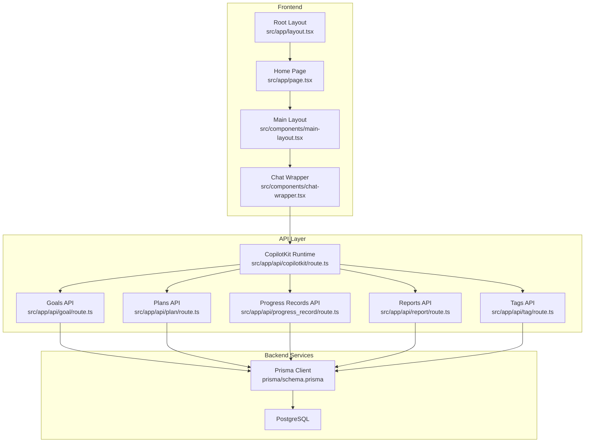
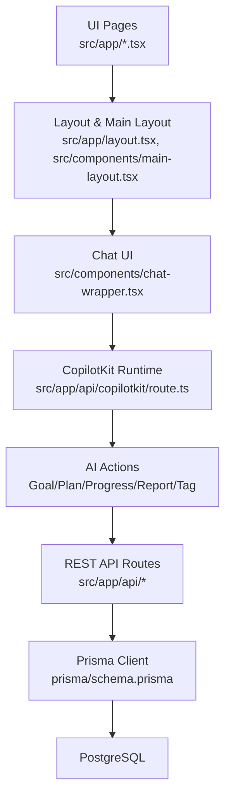
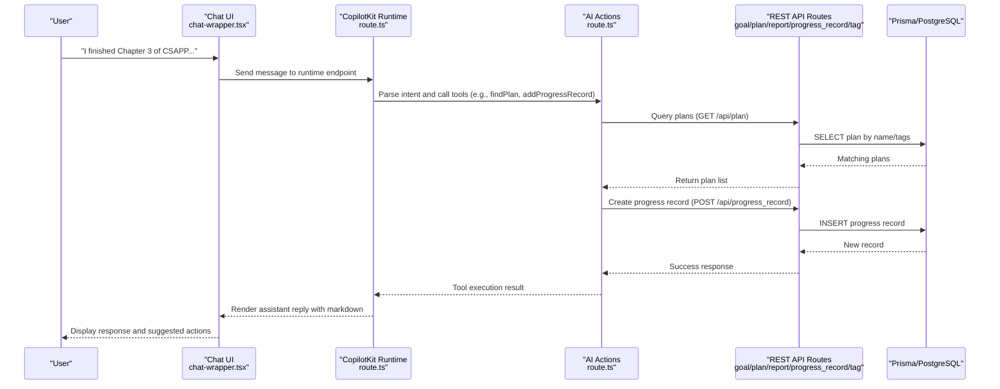
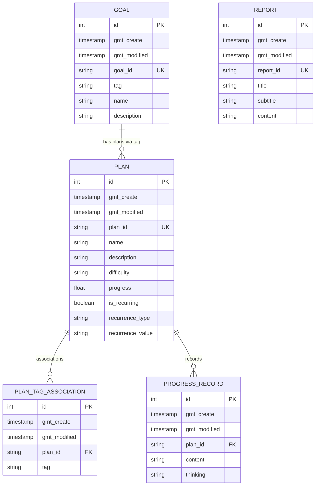
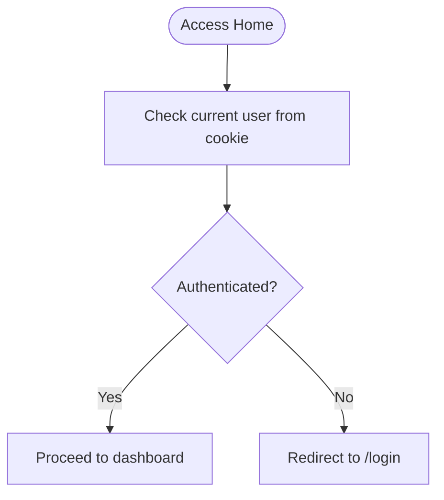
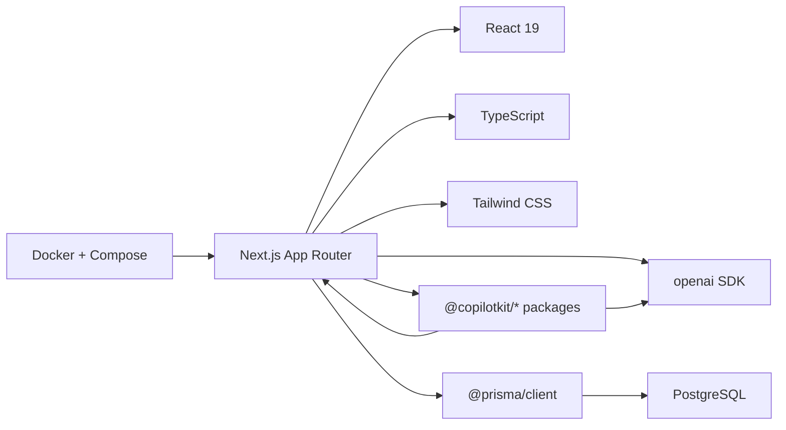

# Project Overview

<cite>
**Referenced Files in This Document**
- [README.md](file://README.md)
- [package.json](file://package.json)
- [layout.tsx](file://src/app/layout.tsx)
- [page.tsx](file://src/app/page.tsx)
- [route.ts](file://src/app/api/copilotkit/route.ts)
- [schema.prisma](file://prisma/schema.prisma)
- [auth.ts](file://src/lib/auth.ts)
- [goal/route.ts](file://src/app/api/goal/route.ts)
- [plan/route.ts](file://src/app/api/plan/route.ts)
- [progress_record/route.ts](file://src/app/api/progress_record/route.ts)
- [report/route.ts](file://src/app/api/report/route.ts)
- [tag/route.ts](file://src/app/api/tag/route.ts)
- [main-layout.tsx](file://src/components/main-layout.tsx)
- [chat-wrapper.tsx](file://src/components/chat-wrapper.tsx)
</cite>

## Table of Contents
1. [Introduction](#introduction)
2. [Project Structure](#project-structure)
3. [Core Components](#core-components)
4. [Architecture Overview](#architecture-overview)
5. [Detailed Component Analysis](#detailed-component-analysis)
6. [Dependency Analysis](#dependency-analysis)
7. [Performance Considerations](#performance-considerations)
8. [Troubleshooting Guide](#troubleshooting-guide)
9. [Conclusion](#conclusion)
10. [Appendices](#appendices)

## Introduction
Goal Mate is an AI-powered intelligent goal and task management system built as a Next.js application. It integrates CopilotKit to deliver a natural language AI assistant that helps users manage goals, create actionable plans, track progress, and generate insights. The system’s core value proposition is enabling personal productivity through conversational AI: users describe what they want to accomplish or how they’ve progressed, and the AI assistant intelligently interprets intent, queries the database, and executes appropriate actions such as recommending tasks, updating progress, or generating reports.

Modern development practices are reflected in the stack and architecture: a React 19 frontend with Next.js App Router, TypeScript for type safety, a PostgreSQL-backed Prisma ORM, and a CopilotKit-integrated AI runtime that exposes system APIs as tools. The assistant supports both local development and containerized deployment via Docker Compose, and includes a lightweight JWT-authenticated admin experience.

## Project Structure
The project follows a conventional Next.js App Router layout with a clear separation between UI pages, API routes, shared components, and database schema. The CopilotKit integration is wired at the root layout level so the AI assistant is available site-wide.

**Diagram sources**
- [layout.tsx:16-30](file://src/app/layout.tsx#L16-L30)
- [page.tsx:1-143](file://src/app/page.tsx#L1-L143)
- [main-layout.tsx:11-62](file://src/components/main-layout.tsx#L11-L62)
- [chat-wrapper.tsx:7-708](file://src/components/chat-wrapper.tsx#L7-L708)
- [route.ts:1-1636](file://src/app/api/copilotkit/route.ts#L1-L1636)
- [goal/route.ts:1-51](file://src/app/api/goal/route.ts#L1-L51)
- [plan/route.ts:1-103](file://src/app/api/plan/route.ts#L1-L103)
- [progress_record/route.ts:1-154](file://src/app/api/progress_record/route.ts#L1-L154)
- [report/route.ts:1-48](file://src/app/api/report/route.ts#L1-L48)
- [tag/route.ts:1-11](file://src/app/api/tag/route.ts#L1-L11)
- [schema.prisma:16-70](file://prisma/schema.prisma#L16-L70)

**Section sources**
- [layout.tsx:16-30](file://src/app/layout.tsx#L16-L30)
- [page.tsx:1-143](file://src/app/page.tsx#L1-L143)
- [main-layout.tsx:11-62](file://src/components/main-layout.tsx#L11-L62)
- [chat-wrapper.tsx:7-708](file://src/components/chat-wrapper.tsx#L7-L708)
- [route.ts:1-1636](file://src/app/api/copilotkit/route.ts#L1-L1636)
- [schema.prisma:16-70](file://prisma/schema.prisma#L16-L70)

## Core Components
- CopilotKit Provider and Runtime: The root layout wraps the app with the CopilotKit provider and exposes a runtime endpoint that serves AI actions. The runtime configures an OpenAI-compatible adapter and defines a suite of system actions for goal, plan, progress, and report management.
- AI Assistant: The assistant is embedded as a persistent sidebar on the main page and powered by a configurable system prompt that governs intent recognition, plan matching, and action execution.
- Database Schema: Prisma models define Goals, Plans, PlanTagAssociations, ProgressRecords, and Reports, enabling structured storage and relationships for goal management and reporting.
- Authentication: Lightweight JWT-based authentication secures the admin experience, with credentials validated server-side before routing to protected pages.
- API Routes: REST endpoints support CRUD operations for goals, plans, progress records, reports, and tags, with pagination and filtering.

Practical examples of AI-assisted workflows:
- Natural language task recommendations: “Just got home tired, what light tasks can I do?”
- Progress updates: “I finished Chapter 3 of CSAPP, it was complex.”
- Report generation: “Generate this week’s report based on goals and progress records.”

**Section sources**
- [layout.tsx:24-26](file://src/app/layout.tsx#L24-L26)
- [route.ts:287-701](file://src/app/api/copilotkit/route.ts#L287-L701)
- [page.tsx:64-138](file://src/app/page.tsx#L64-L138)
- [schema.prisma:16-70](file://prisma/schema.prisma#L16-L70)
- [auth.ts:14-69](file://src/lib/auth.ts#L14-L69)
- [goal/route.ts:7-51](file://src/app/api/goal/route.ts#L7-L51)
- [plan/route.ts:7-103](file://src/app/api/plan/route.ts#L7-L103)
- [progress_record/route.ts:6-154](file://src/app/api/progress_record/route.ts#L6-L154)
- [report/route.ts:7-48](file://src/app/api/report/route.ts#L7-L48)
- [tag/route.ts:6-11](file://src/app/api/tag/route.ts#L6-L11)

## Architecture Overview
Goal Mate adopts a layered architecture:
- Presentation Layer: Next.js App Router pages and CopilotKit chat UI.
- Application Layer: Next.js API routes implementing REST endpoints and CopilotKit runtime actions.
- Domain Layer: Prisma models and relations for goals, plans, tags, progress records, and reports.
- Data Access Layer: Prisma client connecting to PostgreSQL.

**Diagram sources**
- [layout.tsx:16-30](file://src/app/layout.tsx#L16-L30)
- [main-layout.tsx:11-62](file://src/components/main-layout.tsx#L11-L62)
- [chat-wrapper.tsx:7-708](file://src/components/chat-wrapper.tsx#L7-L708)
- [route.ts:1-1636](file://src/app/api/copilotkit/route.ts#L1-L1636)
- [goal/route.ts:1-51](file://src/app/api/goal/route.ts#L1-L51)
- [plan/route.ts:1-103](file://src/app/api/plan/route.ts#L1-L103)
- [progress_record/route.ts:1-154](file://src/app/api/progress_record/route.ts#L1-L154)
- [report/route.ts:1-48](file://src/app/api/report/route.ts#L1-L48)
- [tag/route.ts:1-11](file://src/app/api/tag/route.ts#L1-L11)
- [schema.prisma:16-70](file://prisma/schema.prisma#L16-L70)

## Detailed Component Analysis

### AI-Assisted Workflow Sequence
This sequence illustrates how a user’s natural language input is interpreted and executed by the AI assistant and backend services.

**Diagram sources**
- [chat-wrapper.tsx:698-706](file://src/components/chat-wrapper.tsx#L698-L706)
- [route.ts:131-237](file://src/app/api/copilotkit/route.ts#L131-L237)
- [plan/route.ts:7-56](file://src/app/api/plan/route.ts#L7-L56)
- [progress_record/route.ts:25-70](file://src/app/api/progress_record/route.ts#L25-L70)

**Section sources**
- [chat-wrapper.tsx:698-706](file://src/components/chat-wrapper.tsx#L698-L706)
- [route.ts:131-237](file://src/app/api/copilotkit/route.ts#L131-L237)
- [plan/route.ts:7-56](file://src/app/api/plan/route.ts#L7-L56)
- [progress_record/route.ts:25-70](file://src/app/api/progress_record/route.ts#L25-L70)

### Data Model Overview
The schema models goal management and reporting with explicit relationships and timestamps.

**Diagram sources**
- [schema.prisma:16-70](file://prisma/schema.prisma#L16-L70)

**Section sources**
- [schema.prisma:16-70](file://prisma/schema.prisma#L16-L70)

### Authentication and Authorization
The authentication module provides token creation, verification, and session checks using httpOnly cookies. The home page performs a server-side check to redirect unauthenticated users to the login page.

**Diagram sources**
- [auth.ts:48-69](file://src/lib/auth.ts#L48-L69)
- [page.tsx:8-14](file://src/app/page.tsx#L8-L14)

**Section sources**
- [auth.ts:14-69](file://src/lib/auth.ts#L14-L69)
- [page.tsx:8-14](file://src/app/page.tsx#L8-L14)

## Dependency Analysis
Key technology stack and external dependencies:
- Frontend: Next.js 15, React 19, TypeScript, Tailwind CSS
- Backend: Next.js API Routes, Prisma ORM
- Database: PostgreSQL
- AI Integration: CopilotKit, OpenAI-compatible adapter (Aliyun Bailian/DeepSeek-R1)
- UI Components: Radix UI + shadcn/ui
- Authentication: JWT + httpOnly Cookie
- Deployment: Docker + Docker Compose

**Diagram sources**
- [package.json:16-40](file://package.json#L16-L40)
- [layout.tsx:3-4](file://src/app/layout.tsx#L3-L4)
- [route.ts:1-12](file://src/app/api/copilotkit/route.ts#L1-L12)

**Section sources**
- [package.json:16-40](file://package.json#L16-L40)
- [layout.tsx:3-4](file://src/app/layout.tsx#L3-L4)
- [route.ts:1-12](file://src/app/api/copilotkit/route.ts#L1-L12)

## Performance Considerations
- AI Tool Call Compliance: The runtime injects placeholder tool results when assistant tool call sequences are incomplete, ensuring model compatibility and reducing retries.
- Message Cleanup: Developer role messages are sanitized before forwarding to the model to avoid API errors.
- Pagination and Filtering: API routes implement pagination and efficient filtering to limit payload sizes and improve responsiveness.
- Client-Side Hydration Fixes: Chat UI applies targeted CSS and DOM adjustments to prevent hydration mismatches and improve rendering stability.

[No sources needed since this section provides general guidance]

## Troubleshooting Guide
Common issues and resolutions:
- Missing environment variables for AI or database: Ensure OPENAI_API_KEY and OPENAI_BASE_URL are configured for CopilotKit, and DATABASE_URL points to a reachable PostgreSQL instance.
- Tool call sequence errors: The runtime automatically repairs missing tool results; verify logs for placeholder insertions.
- Authentication failures: Confirm AUTH_SECRET length and correctness; ensure httpOnly cookies are enabled and not blocked by browser policies.
- Chat hydration warnings: The chat wrapper applies fixes for nested block elements inside paragraphs; if issues persist, verify client-side initialization order.

**Section sources**
- [route.ts:72-86](file://src/app/api/copilotkit/route.ts#L72-L86)
- [route.ts:18-67](file://src/app/api/copilotkit/route.ts#L18-L67)
- [auth.ts:5-11](file://src/lib/auth.ts#L5-L11)
- [chat-wrapper.tsx:20-59](file://src/components/chat-wrapper.tsx#L20-L59)

## Conclusion
Goal Mate demonstrates a cohesive blend of modern web development practices and AI-driven productivity. By integrating CopilotKit with a clean Next.js architecture, it enables users to manage goals and tasks through natural language while maintaining robust backend services and a secure authentication layer. The modular API routes, Prisma data models, and embeddable AI assistant provide a strong foundation for extension and customization.

[No sources needed since this section summarizes without analyzing specific files]

## Appendices

### Practical Use Cases
- Natural language task recommendations: Ask the AI to suggest light tasks based on your current energy level.
- Intelligent progress updates: Describe what you accomplished and how you felt; the AI finds related plans and records both the activity and reflection.
- Automated report generation: Request weekly or monthly summaries organized by goal categories.

**Section sources**
- [page.tsx:64-138](file://src/app/page.tsx#L64-L138)
- [route.ts:131-237](file://src/app/api/copilotkit/route.ts#L131-L237)

### Deployment Options
- Local development: Install dependencies, generate Prisma client, apply migrations, and start the dev server.
- Docker deployment: Use provided scripts or compose files to provision containers and configure environment variables.

**Section sources**
- [README.md:34-83](file://README.md#L34-L83)
- [README.md:85-148](file://README.md#L85-L148)