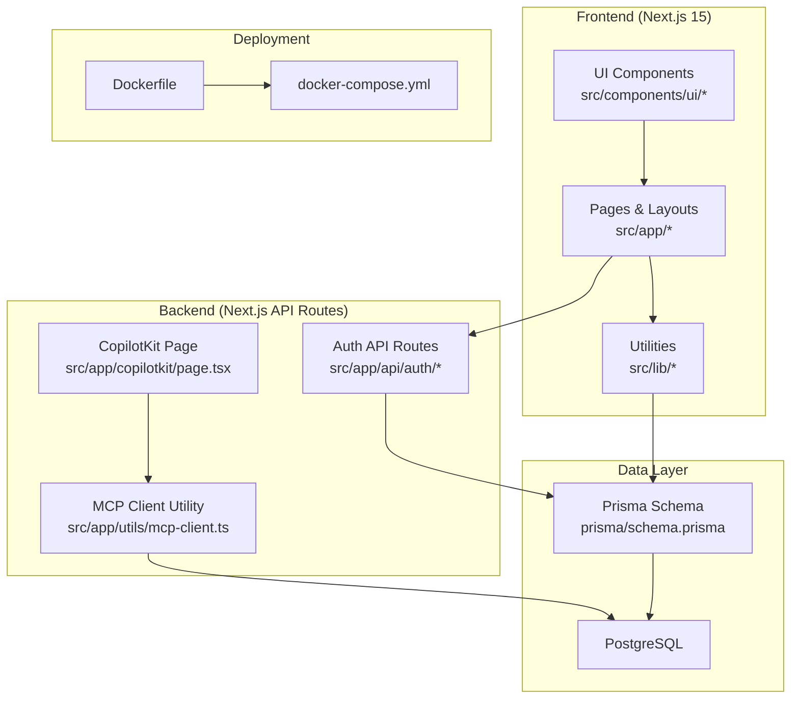
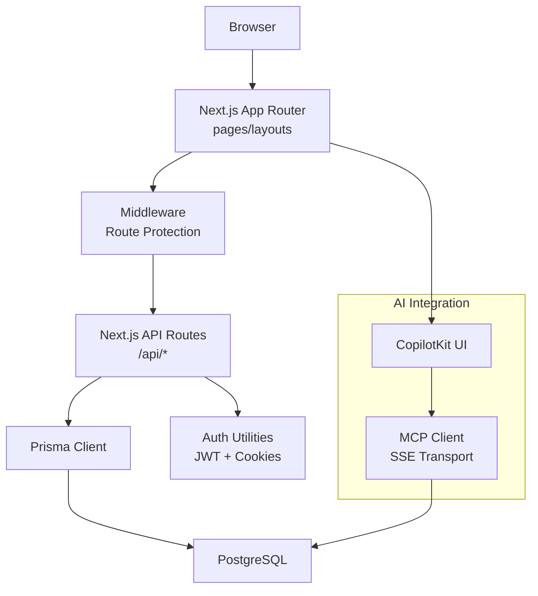
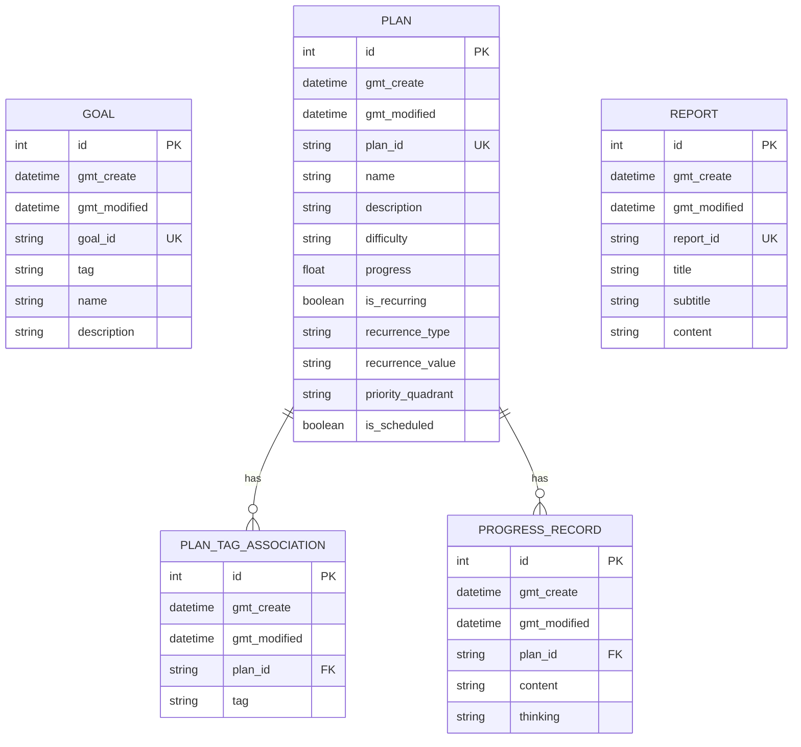
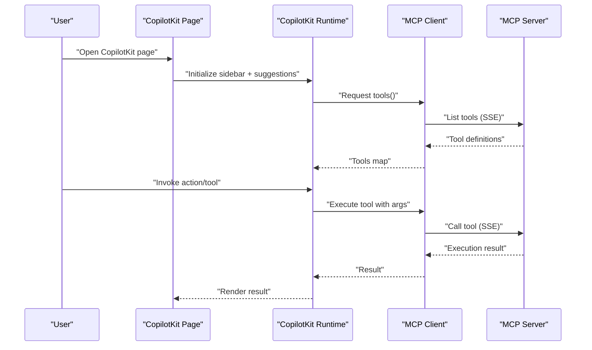
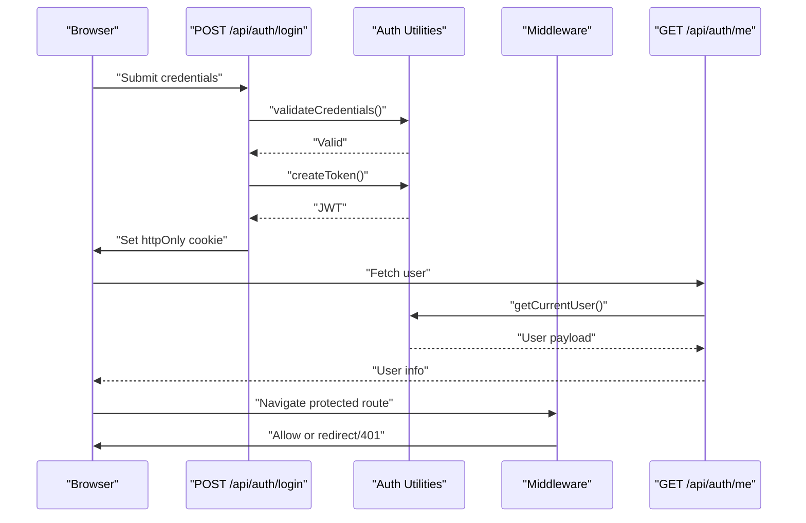
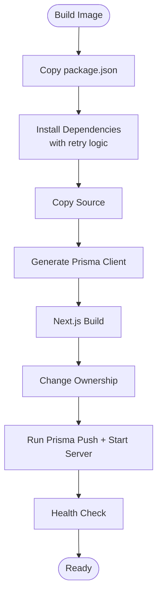
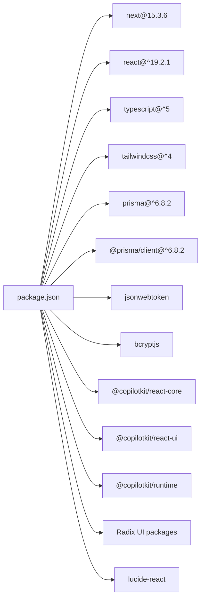

# Technology Stack

<cite>
**Referenced Files in This Document**
- [package.json](file://package.json)
- [next.config.ts](file://next.config.ts)
- [tsconfig.json](file://tsconfig.json)
- [prisma/schema.prisma](file://prisma/schema.prisma)
- [components.json](file://components.json)
- [src/lib/auth.ts](file://src/lib/auth.ts)
- [src/app/api/auth/login/route.ts](file://src/app/api/auth/login/route.ts)
- [src/app/api/auth/logout/route.ts](file://src/app/api/auth/logout/route.ts)
- [src/app/api/auth/me/route.ts](file://src/app/api/auth/me/route.ts)
- [middleware.ts](file://middleware.ts)
- [src/app/copilotkit/page.tsx](file://src/app/copilotkit/page.tsx)
- [src/app/utils/mcp-client.ts](file://src/app/utils/mcp-client.ts)
- [Dockerfile](file://Dockerfile)
- [docker-compose.yml](file://docker-compose.yml)
</cite>

## Table of Contents
1. [Introduction](#introduction)
2. [Project Structure](#project-structure)
3. [Core Components](#core-components)
4. [Architecture Overview](#architecture-overview)
5. [Detailed Component Analysis](#detailed-component-analysis)
6. [Dependency Analysis](#dependency-analysis)
7. [Performance Considerations](#performance-considerations)
8. [Troubleshooting Guide](#troubleshooting-guide)
9. [Conclusion](#conclusion)
10. [Appendices](#appendices)

## Introduction
This document presents the complete technology stack used in Goal Mate, detailing the frontend, backend, AI integration, UI components, authentication, and deployment. It explains the rationale behind each choice, version requirements, and integration patterns, and demonstrates how these technologies collaborate in the system architecture.

## Project Structure
Goal Mate follows a modern Next.js 15 application layout with a clear separation of concerns:
- Frontend pages and layouts under src/app
- Shared UI components under src/components
- Utilities and libraries under src/lib
- Prisma schema for database modeling under prisma
- Authentication utilities and API routes under src/app/api/auth
- AI integration pages and utilities under src/app/copilotkit and src/app/utils

**Diagram sources**
- [next.config.ts:1-29](file://next.config.ts#L1-L29)
- [prisma/schema.prisma:1-72](file://prisma/schema.prisma#L1-L72)
- [src/app/api/auth/login/route.ts:1-50](file://src/app/api/auth/login/route.ts#L1-L50)
- [src/app/copilotkit/page.tsx:1-109](file://src/app/copilotkit/page.tsx#L1-L109)
- [src/app/utils/mcp-client.ts:1-449](file://src/app/utils/mcp-client.ts#L1-L449)
- [Dockerfile:1-68](file://Dockerfile#L1-L68)
- [docker-compose.yml:1-56](file://docker-compose.yml#L1-L56)

**Section sources**
- [next.config.ts:1-29](file://next.config.ts#L1-L29)
- [prisma/schema.prisma:1-72](file://prisma/schema.prisma#L1-L72)

## Core Components
This section documents the primary technologies and their roles in the system.

- Next.js 15
  - Purpose: Full-stack React framework for pages, routing, SSR/SSG, and API routes.
  - Version requirement: 15.3.6
  - Rationale: Provides modern features like App Router, optimized builds, and seamless API route integration.
  - Integration pattern: Uses App Router under src/app, with API routes under src/app/api. The configuration enables standalone output for Docker deployments.

- React 19
  - Purpose: UI library powering components and pages.
  - Version requirement: ^19.2.1
  - Rationale: Latest React features and performance improvements for component development.

- TypeScript
  - Purpose: Type safety and developer productivity.
  - Version requirement: ^5
  - Rationale: Strict typing across frontend, backend, and utilities for maintainability.

- Tailwind CSS v4
  - Purpose: Utility-first CSS framework for rapid UI development.
  - Version requirement: ^4 (via dev dependency)
  - Rationale: Consistent styling with minimal CSS overrides; configured via components.json for shadcn/ui compatibility.

- Prisma ORM with PostgreSQL
  - Purpose: Database modeling, migrations, and type-safe queries.
  - Provider: postgresql
  - Rationale: Developer-friendly schema definition, automatic client generation, and strong typing.

- UI Component Library: Radix UI + shadcn/ui
  - Purpose: Accessible, headless primitives (Radix UI) combined with styled components (shadcn/ui).
  - Configuration: components.json defines aliases and styling preferences.

- Authentication: JWT with httpOnly cookies
  - Purpose: Secure session-like state using signed tokens stored in httpOnly cookies.
  - Implementation: Utilities in src/lib/auth.ts manage token creation, verification, and retrieval; API routes under src/app/api/auth handle login/logout/me endpoints; middleware enforces protection.

- AI Integration: CopilotKit + Model Context Protocol (MCP)
  - Purpose: Chat-enabled AI assistant with tool invocation via MCP servers.
  - Implementation: CopilotKit page under src/app/copilotkit/page.tsx integrates sidebar and suggestions; MCP client under src/app/utils/mcp-client.ts implements SSE transport and tool discovery/execution.

- Deployment: Docker + Docker Compose
  - Purpose: Containerized application with optimized build and production startup.
  - Rationale: Reproducible environments, simplified CI/CD, and health checks.

**Section sources**
- [package.json:16-58](file://package.json#L16-L58)
- [next.config.ts:3-26](file://next.config.ts#L3-L26)
- [tsconfig.json:1-28](file://tsconfig.json#L1-L28)
- [prisma/schema.prisma:7-14](file://prisma/schema.prisma#L7-L14)
- [components.json:1-21](file://components.json#L1-L21)
- [src/lib/auth.ts:1-69](file://src/lib/auth.ts#L1-L69)
- [src/app/api/auth/login/route.ts:1-50](file://src/app/api/auth/login/route.ts#L1-L50)
- [src/app/api/auth/logout/route.ts:1-23](file://src/app/api/auth/logout/route.ts#L1-L23)
- [src/app/api/auth/me/route.ts:1-27](file://src/app/api/auth/me/route.ts#L1-L27)
- [middleware.ts:1-40](file://middleware.ts#L1-L40)
- [src/app/copilotkit/page.tsx:1-109](file://src/app/copilotkit/page.tsx#L1-L109)
- [src/app/utils/mcp-client.ts:1-449](file://src/app/utils/mcp-client.ts#L1-L449)
- [Dockerfile:1-68](file://Dockerfile#L1-L68)
- [docker-compose.yml:1-56](file://docker-compose.yml#L1-L56)

## Architecture Overview
The system architecture centers around Next.js 15’s App Router and API routes, with Prisma ORM managing PostgreSQL persistence. Authentication is handled via JWT stored in httpOnly cookies, enforced by middleware. AI capabilities are integrated through CopilotKit and an MCP client for tool invocation.

**Diagram sources**
- [next.config.ts:3-26](file://next.config.ts#L3-L26)
- [src/lib/auth.ts:1-69](file://src/lib/auth.ts#L1-L69)
- [middleware.ts:1-40](file://middleware.ts#L1-L40)
- [prisma/schema.prisma:7-14](file://prisma/schema.prisma#L7-L14)
- [src/app/copilotkit/page.tsx:1-109](file://src/app/copilotkit/page.tsx#L1-L109)
- [src/app/utils/mcp-client.ts:1-449](file://src/app/utils/mcp-client.ts#L1-L449)

## Detailed Component Analysis

### Frontend Stack: Next.js 15, React 19, TypeScript, Tailwind CSS
- Next.js 15 App Router
  - Pages and layouts are organized under src/app, enabling route-based code splitting and API route integration.
  - Standalone output mode is enabled for efficient Docker packaging.

- React 19
  - Used for building interactive UIs and components across pages.

- TypeScript
  - Strict compiler options, ESNext module resolution, and bundler-based resolution ensure type safety and modern module behavior.

- Tailwind CSS v4
  - PostCSS-based configuration via dev dependency; shadcn/ui is configured through components.json with aliases and theme variables.

**Section sources**
- [next.config.ts:3-26](file://next.config.ts#L3-L26)
- [tsconfig.json:1-28](file://tsconfig.json#L1-L28)
- [components.json:1-21](file://components.json#L1-L21)

### Backend Architecture: Next.js API Routes + Prisma ORM + PostgreSQL
- API Routes
  - Located under src/app/api, these endpoints handle business logic and integrate with Prisma for data access.
  - Example endpoints include authentication (/api/auth/*), health checks, and domain-specific routes (/api/goal, /api/plan, etc.).

- Prisma ORM
  - Client generator and PostgreSQL datasource are defined in the schema.
  - Models represent core entities (Goal, Plan, PlanTagAssociation, ProgressRecord, Report).

- Database
  - PostgreSQL provider with DATABASE_URL sourced from environment variables.

**Diagram sources**
- [prisma/schema.prisma:16-71](file://prisma/schema.prisma#L16-L71)

**Section sources**
- [prisma/schema.prisma:7-14](file://prisma/schema.prisma#L7-L14)
- [prisma/schema.prisma:16-71](file://prisma/schema.prisma#L16-L71)

### AI Integration Stack: CopilotKit + OpenAI/Qwen via MCP
- CopilotKit
  - The CopilotKit page initializes a sidebar with suggestions and integrates a catch-all action renderer for MCP tools.
  - Theming and labels are configured for user experience.

- Model Context Protocol (MCP)
  - The MCP client implements SSE transport, connects to MCP servers, lists tools, and executes tool calls.
  - Includes robust argument normalization and JSON parsing to handle LLM-generated inputs reliably.

**Diagram sources**
- [src/app/copilotkit/page.tsx:12-26](file://src/app/copilotkit/page.tsx#L12-L26)
- [src/app/utils/mcp-client.ts:115-234](file://src/app/utils/mcp-client.ts#L115-L234)

**Section sources**
- [src/app/copilotkit/page.tsx:1-109](file://src/app/copilotkit/page.tsx#L1-L109)
- [src/app/utils/mcp-client.ts:1-449](file://src/app/utils/mcp-client.ts#L1-L449)

### UI Component Library: Radix UI + shadcn/ui
- Radix UI primitives provide accessible, unstyled foundations for components.
- shadcn/ui offers polished, themeable components built on top of Radix UI.
- components.json configures aliases and Tailwind CSS integration for consistent theming.

**Section sources**
- [components.json:1-21](file://components.json#L1-L21)

### Authentication System: JWT with httpOnly Cookies
- Token lifecycle
  - Creation: Signed JWT with a configurable expiration stored in an httpOnly cookie.
  - Verification: Middleware and API routes validate the token via shared secret.
  - Logout: Deletes the auth-token cookie.

- Security posture
  - httpOnly flag prevents client-side script access.
  - SameSite and secure flags enhance CSRF and HTTPS protection.
  - Environment-based cookie security (secure in production).

**Diagram sources**
- [src/app/api/auth/login/route.ts:5-35](file://src/app/api/auth/login/route.ts#L5-L35)
- [src/lib/auth.ts:14-33](file://src/lib/auth.ts#L14-L33)
- [middleware.ts:19-34](file://middleware.ts#L19-L34)
- [src/app/api/auth/me/route.ts:4-18](file://src/app/api/auth/me/route.ts#L4-L18)

**Section sources**
- [src/lib/auth.ts:1-69](file://src/lib/auth.ts#L1-L69)
- [src/app/api/auth/login/route.ts:1-50](file://src/app/api/auth/login/route.ts#L1-L50)
- [src/app/api/auth/logout/route.ts:1-23](file://src/app/api/auth/logout/route.ts#L1-L23)
- [src/app/api/auth/me/route.ts:1-27](file://src/app/api/auth/me/route.ts#L1-L27)
- [middleware.ts:1-40](file://middleware.ts#L1-L40)

### Deployment Stack: Docker + Docker Compose
- Dockerfile
  - Multi-stage build targeting Node.js 18 Alpine.
  - Optimized npm registry mirrors for China environments.
  - Prisma client generation and build steps included.
  - Non-root user execution and exposed port 3000.

- docker-compose.yml
  - Defines the application service with environment variables for database and API keys.
  - Health checks against the health endpoint.
  - Resource limits and custom network configuration.

**Diagram sources**
- [Dockerfile:23-55](file://Dockerfile#L23-L55)
- [docker-compose.yml:29-37](file://docker-compose.yml#L29-L37)

**Section sources**
- [Dockerfile:1-68](file://Dockerfile#L1-L68)
- [docker-compose.yml:1-56](file://docker-compose.yml#L1-L56)

## Dependency Analysis
This section maps key dependencies and their relationships across the stack.

**Diagram sources**
- [package.json:16-42](file://package.json#L16-L42)

**Section sources**
- [package.json:16-42](file://package.json#L16-L42)

## Performance Considerations
- Next.js 15
  - Standalone output reduces container size and improves cold start behavior.
  - Turbopack is available for faster development rebuilds.

- Prisma
  - Use database connection pooling and limit query complexity.
  - Prefer selective field projections and pagination for large datasets.

- Docker
  - Multi-stage builds reduce image size.
  - Health checks enable automated restarts on failure.

- AI Integration
  - Cache tool listings in the MCP client to minimize repeated discovery calls.
  - Use SSE efficiently and implement backpressure handling if scaling.

## Troubleshooting Guide
- Authentication
  - Verify AUTH_SECRET is set; missing secrets cause token creation/verification failures.
  - Ensure httpOnly cookie flags align with environment (secure in production).

- API Routes
  - Check middleware matcher to confirm protected routes are enforced.
  - Validate DATABASE_URL for Prisma connectivity.

- Docker
  - Confirm npm registry mirrors are reachable in your region.
  - Review health check endpoint availability at /api/health.

**Section sources**
- [src/lib/auth.ts:5-11](file://src/lib/auth.ts#L5-L11)
- [middleware.ts:38-40](file://middleware.ts#L38-L40)
- [docker-compose.yml:39-44](file://docker-compose.yml#L39-L44)

## Conclusion
Goal Mate leverages a cohesive stack: Next.js 15 for the full-stack framework, React 19 for UI, TypeScript for type safety, and Tailwind CSS for styling. Prisma ORM with PostgreSQL provides a robust data layer, while CopilotKit and an MCP client enable powerful AI-driven interactions. Authentication relies on JWT stored in httpOnly cookies, enforced by middleware. The deployment pipeline uses Docker and Docker Compose for reliable, reproducible operations.

## Appendices
- Environment variables used across the stack:
  - AUTH_SECRET, AUTH_USERNAME, AUTH_PASSWORD (authentication)
  - DATABASE_URL (Prisma)
  - OPENAI_API_KEY, OPENAI_BASE_URL (AI integrations)
  - NODE_ENV, PORT (runtime)
- Additional scripts for database operations are defined in package.json for local development and CI workflows.