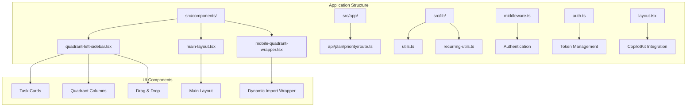
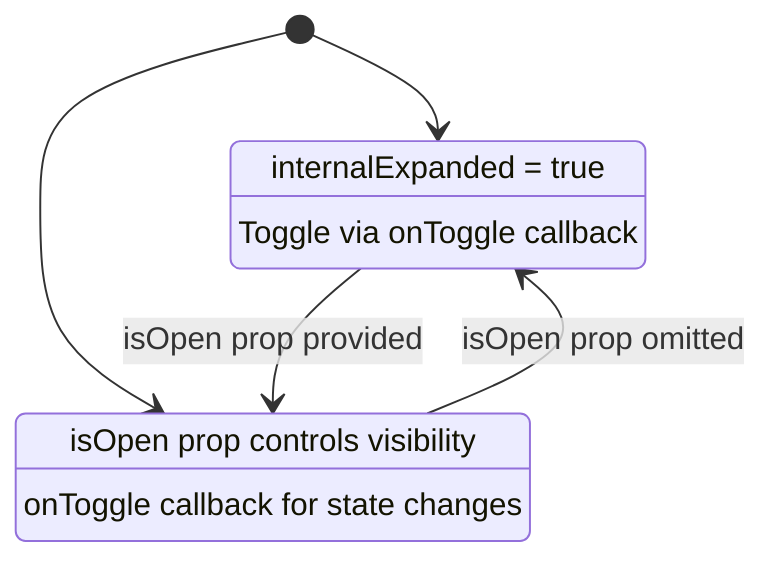
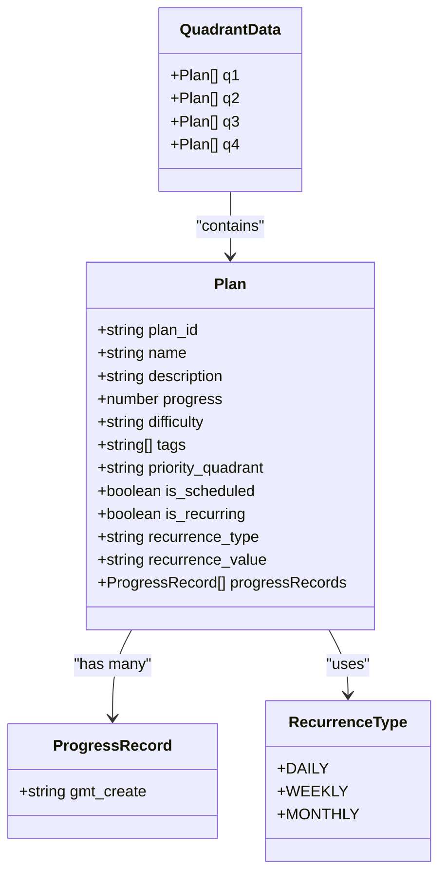
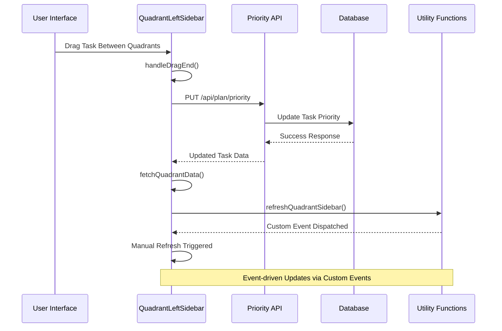
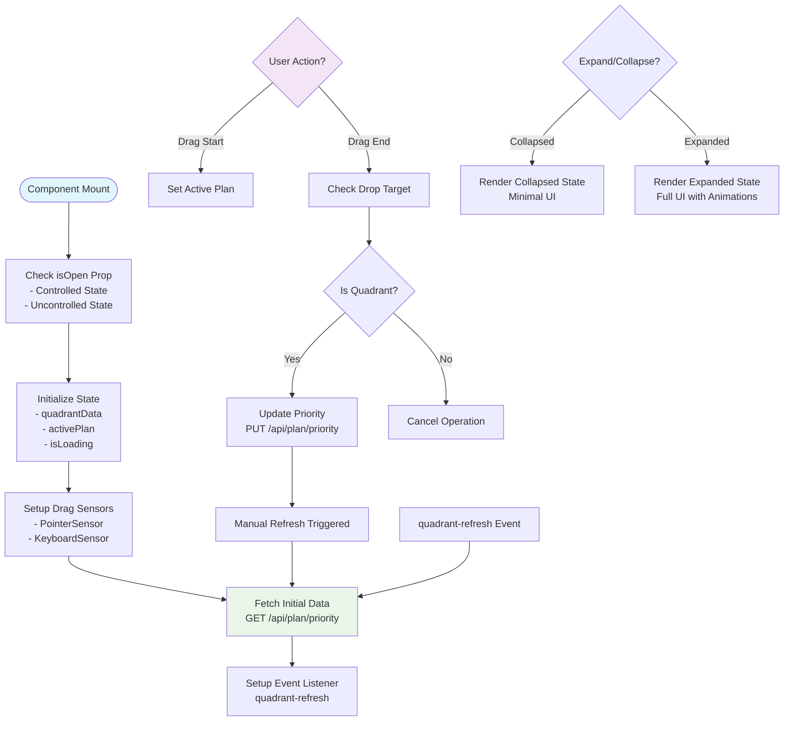
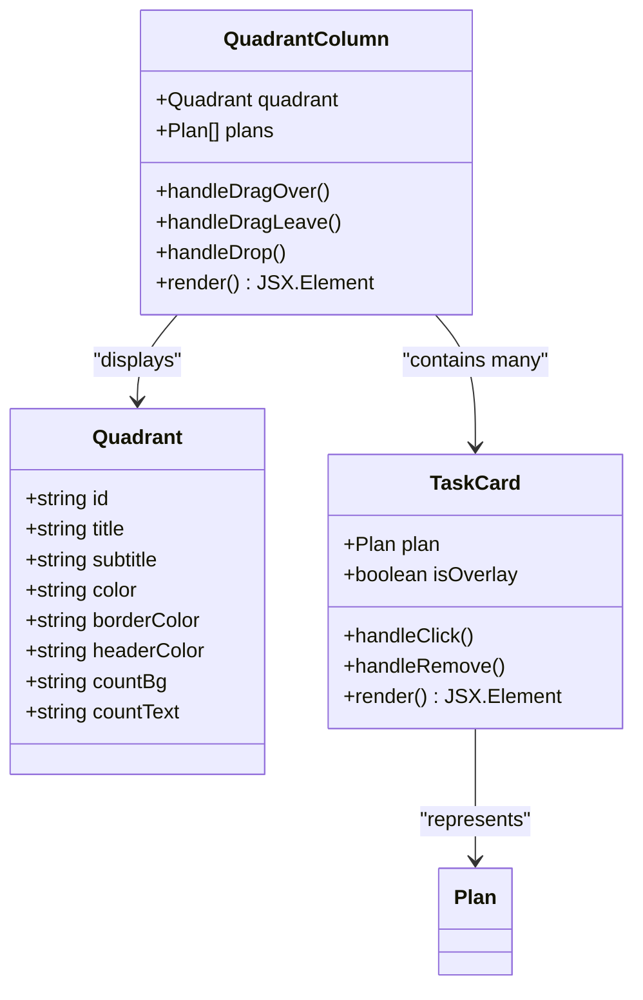
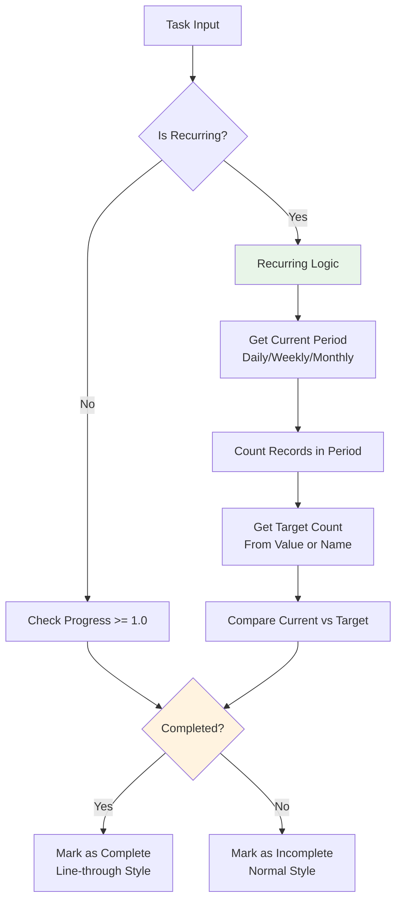
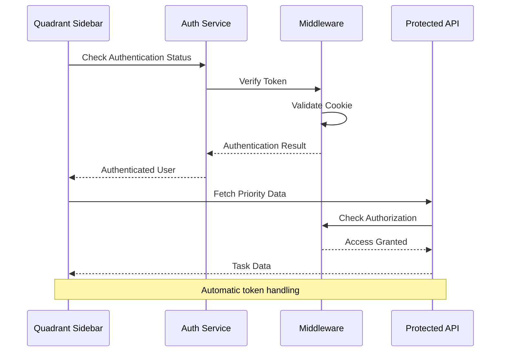
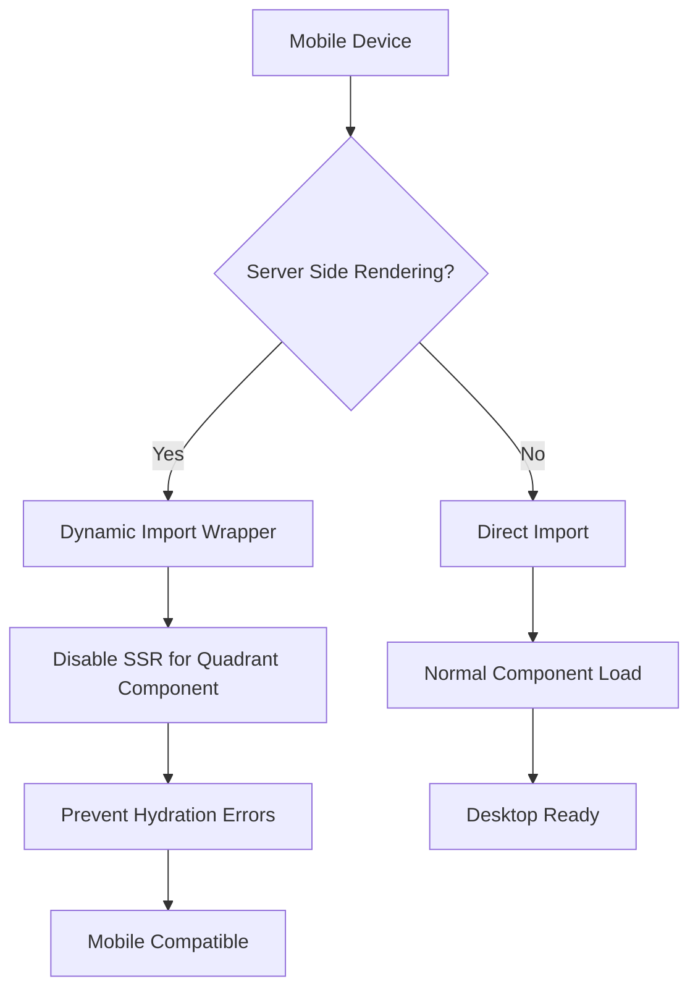
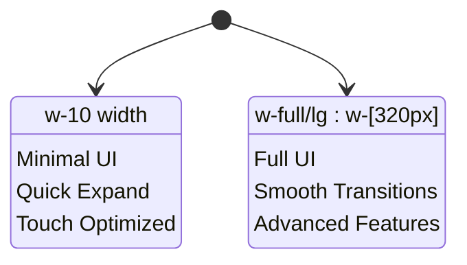

# Quadrant Left Sidebar

<cite>
**Referenced Files in This Document**
- [quadrant-left-sidebar.tsx](file://src/components/quadrant-left-sidebar.tsx)
- [mobile-quadrant-wrapper.tsx](file://src/components/mobile-quadrant-wrapper.tsx)
- [main-layout.tsx](file://src/components/main-layout.tsx)
- [layout.tsx](file://src/app/layout.tsx)
- [route.ts](file://src/app/api/plan/priority/route.ts)
- [page.tsx](file://src/app/progress/page.tsx)
- [utils.ts](file://src/lib/utils.ts)
- [recurring-utils.ts](file://src/lib/recurring-utils.ts)
- [middleware.ts](file://middleware.ts)
- [auth.ts](file://src/lib/auth.ts)
</cite>

## Update Summary
**Changes Made**
- Enhanced expand/collapse state management with controlled/uncontrolled state support
- Improved mobile compatibility with dynamic import wrapper to prevent hydration errors
- Strengthened event-driven refresh system with dedicated utility function
- Updated performance considerations to reflect controlled expand/collapse state management
- Revised component lifecycle to emphasize responsive design and mobile-first approach
- Enhanced troubleshooting guide to address mobile-specific issues

## Table of Contents
1. [Introduction](#introduction)
2. [Project Structure](#project-structure)
3. [Core Components](#core-components)
4. [Architecture Overview](#architecture-overview)
5. [Detailed Component Analysis](#detailed-component-analysis)
6. [Dependency Analysis](#dependency-analysis)
7. [Performance Considerations](#performance-considerations)
8. [Mobile Compatibility](#mobile-compatibility)
9. [Troubleshooting Guide](#troubleshooting-guide)
10. [Conclusion](#conclusion)

## Introduction

The Quadrant Left Sidebar is a core component of the Goal Mate application that implements the Eisenhower Matrix (Important vs. Urgent) productivity framework. This component displays tasks organized into four quadrants based on their importance and urgency, providing an intuitive drag-and-drop interface for task prioritization and management.

The sidebar serves as the primary interface for users to visualize their task workload and strategically organize their daily activities according to productivity principles. It integrates seamlessly with the application's authentication system and provides real-time updates through a custom event-driven refresh mechanism instead of continuous background polling.

**Updated** Enhanced with controlled expand/collapse state management and improved mobile compatibility for better user experience across devices.

## Project Structure

The Quadrant Left Sidebar is part of a larger Next.js application with the following relevant structure:



**Diagram sources**
- [quadrant-left-sidebar.tsx:1-585](file://src/components/quadrant-left-sidebar.tsx#L1-L585)
- [main-layout.tsx:1-164](file://src/components/main-layout.tsx#L1-L164)
- [mobile-quadrant-wrapper.tsx:1-18](file://src/components/mobile-quadrant-wrapper.tsx#L1-L18)

**Section sources**
- [quadrant-left-sidebar.tsx:1-585](file://src/components/quadrant-left-sidebar.tsx#L1-L585)
- [main-layout.tsx:1-164](file://src/components/main-layout.tsx#L1-L164)
- [mobile-quadrant-wrapper.tsx:1-18](file://src/components/mobile-quadrant-wrapper.tsx#L1-L18)

## Core Components

The Quadrant Left Sidebar consists of several interconnected components that work together to provide a comprehensive task management interface:

### Primary Components

1. **QuadrantLeftSidebar**: Main container component that manages state and coordinates all quadrant operations
2. **QuadrantColumn**: Individual quadrant display with drag-and-drop capabilities
3. **TaskCard**: Interactive task representation with completion indicators
4. **DnD Context**: Drag-and-drop system integration using @dnd-kit library

### Enhanced State Management

The component now supports both controlled and uncontrolled state management:



**Diagram sources**
- [quadrant-left-sidebar.tsx:376-389](file://src/components/quadrant-left-sidebar.tsx#L376-L389)

### Data Models

The component works with structured data models:



**Diagram sources**
- [quadrant-left-sidebar.tsx:30-56](file://src/components/quadrant-left-sidebar.tsx#L30-L56)

**Section sources**
- [quadrant-left-sidebar.tsx:30-56](file://src/components/quadrant-left-sidebar.tsx#L30-L56)

## Architecture Overview

The Quadrant Left Sidebar follows a resource-efficient architecture pattern with event-driven synchronization and responsive design:



**Diagram sources**
- [quadrant-left-sidebar.tsx:468-481](file://src/components/quadrant-left-sidebar.tsx#L468-L481)
- [route.ts:66-109](file://src/app/api/plan/priority/route.ts#L66-L109)
- [utils.ts:8-16](file://src/lib/utils.ts#L8-L16)

The architecture implements several key patterns:

1. **Event-driven Synchronization**: Uses custom events to trigger manual refreshes instead of continuous polling
2. **Resource-efficient Loading**: Initial load only approach to minimize network requests
3. **Declarative State Management**: React hooks manage component state efficiently with controlled/uncontrolled state support
4. **API Abstraction**: Clean separation between UI logic and data operations
5. **Authentication Integration**: Seamless integration with the application's auth system
6. **Responsive Design**: Adaptive layouts for desktop and mobile devices

**Section sources**
- [quadrant-left-sidebar.tsx:420-438](file://src/components/quadrant-left-sidebar.tsx#L420-L438)
- [route.ts:6-64](file://src/app/api/plan/priority/route.ts#L6-L64)

## Detailed Component Analysis

### QuadrantLeftSidebar Component

The main component orchestrates the entire quadrant system with an event-driven approach and enhanced state management:



**Diagram sources**
- [quadrant-left-sidebar.tsx:420-438](file://src/components/quadrant-left-sidebar.tsx#L420-L438)
- [quadrant-left-sidebar.tsx:509-530](file://src/components/quadrant-left-sidebar.tsx#L509-L530)
- [quadrant-left-sidebar.tsx:532-582](file://src/components/quadrant-left-sidebar.tsx#L532-L582)

#### Key Features

1. **Enhanced Responsive Design**: Adapts between expanded and collapsed states with smooth transitions
2. **Event-driven Updates**: Manual refresh triggered by custom events instead of automatic polling
3. **Drag-and-Drop**: Full @dnd-kit integration for intuitive task management
4. **Visual Feedback**: Comprehensive loading states and hover effects
5. **Controlled State Management**: Supports both controlled and uncontrolled state patterns
6. **Mobile Optimization**: Responsive width handling and touch-friendly interactions

**Section sources**
- [quadrant-left-sidebar.tsx:376-585](file://src/components/quadrant-left-sidebar.tsx#L376-L585)

### QuadrantColumn Implementation

Each quadrant column provides specialized functionality with enhanced mobile support:



**Diagram sources**
- [quadrant-left-sidebar.tsx:284-369](file://src/components/quadrant-left-sidebar.tsx#L284-L369)

#### Quadrant Specifications

| Quadrant | Title | Subtitle | Color Scheme |
|----------|-------|----------|--------------|
| Q1 | Important & Urgent | Do Now | Red 50 theme |
| Q2 | Important & Not Urgent | Plan | Blue 50 theme |
| Q3 | Not Important & Urgent | Delegate | Yellow 50 theme |
| Q4 | Not Important & Not Urgent | Schedule | Gray 50 theme |

**Section sources**
- [quadrant-left-sidebar.tsx:58-99](file://src/components/quadrant-left-sidebar.tsx#L58-L99)

### Task Completion Logic

The system implements sophisticated completion tracking for both regular and recurring tasks:



**Diagram sources**
- [quadrant-left-sidebar.tsx:182-207](file://src/components/quadrant-left-sidebar.tsx#L182-L207)
- [recurring-utils.ts:88-147](file://src/lib/recurring-utils.ts#L88-L147)

**Section sources**
- [quadrant-left-sidebar.tsx:142-191](file://src/components/quadrant-left-sidebar.tsx#L142-L191)
- [recurring-utils.ts:16-147](file://src/lib/recurring-utils.ts#L16-L147)

### Authentication Integration

The component seamlessly integrates with the application's authentication system:



**Diagram sources**
- [middleware.ts:1-40](file://middleware.ts#L1-L40)
- [auth.ts:49-69](file://src/lib/auth.ts#L49-L69)

**Section sources**
- [middleware.ts:1-40](file://middleware.ts#L1-L40)
- [auth.ts:1-69](file://src/lib/auth.ts#L1-L69)

## Dependency Analysis

The Quadrant Left Sidebar has several key dependencies that affect its functionality and performance:

```mermaid
graph LR
subgraph "External Dependencies"
A[@dnd-kit/core] --> B[Drag & Drop]
C[@dnd-kit/sortable] --> D[Sortable Context]
E[lucide-react] --> F[Icons]
G[next/navigation] --> H[Routing]
I[next/dynamic] --> J[SSR Prevention]
end
subgraph "Internal Dependencies"
K[quadrant-left-sidebar.tsx] --> L[utils.ts]
K --> M[recurring-utils.ts]
K --> N[main-layout.tsx]
O[route.ts] --> P[Prisma Client]
Q[page.tsx] --> K
R[mobile-quadrant-wrapper.tsx] --> K
end
subgraph "Styling"
S[tailwind-merge] --> T[CSS Classes]
U[clsx] --> V[Conditional Classes]
end
K --> A
K --> G
K --> E
K --> L
K --> M
O --> P
```

**Diagram sources**
- [quadrant-left-sidebar.tsx:3-24](file://src/components/quadrant-left-sidebar.tsx#L3-L24)
- [utils.ts:1-6](file://src/lib/utils.ts#L1-L6)
- [mobile-quadrant-wrapper.tsx:3-9](file://src/components/mobile-quadrant-wrapper.tsx#L3-L9)

### Performance Dependencies

1. **@dnd-kit**: Provides smooth drag-and-drop interactions but requires careful optimization
2. **React Hooks**: Efficient state management with proper dependency arrays
3. **Event System**: Custom events for inter-component communication (no polling overhead)
4. **API Calls**: Single initial fetch with manual refresh triggers
5. **Dynamic Imports**: SSR prevention for mobile compatibility

**Section sources**
- [quadrant-left-sidebar.tsx:1-585](file://src/components/quadrant-left-sidebar.tsx#L1-L585)

## Performance Considerations

The Quadrant Left Sidebar implements several performance optimization strategies focused on resource efficiency:

### Memory Management
- **Component Cleanup**: Proper cleanup of event listeners on component unmount
- **State Optimization**: Minimal state updates to reduce re-renders
- **Lazy Loading**: Conditional rendering of expanded/collapsed states
- **Controlled State Pattern**: Reduces unnecessary re-renders when component is controlled externally

### Network Optimization
- **Initial Load Only**: Single fetch on component mount eliminates continuous polling
- **Event-driven Updates**: Custom events trigger manual refreshes when needed
- **Efficient Sorting**: Optimized sorting algorithms for task lists
- **Debounced Updates**: Prevents rapid consecutive API calls

### Resource Efficiency
- **No Background Polling**: Eliminates 30-second interval overhead
- **Manual Refresh Control**: Components decide when to refresh via custom events
- **Reduced API Calls**: Network requests only when user actions or external events occur
- **Responsive Width Handling**: Optimized width calculations for different screen sizes

**Updated** Enhanced with controlled expand/collapse state management to reduce unnecessary re-renders and improve performance

**Section sources**
- [quadrant-left-sidebar.tsx:420-438](file://src/components/quadrant-left-sidebar.tsx#L420-L438)
- [utils.ts:8-16](file://src/lib/utils.ts#L8-L16)

## Mobile Compatibility

The Quadrant Left Sidebar now includes comprehensive mobile compatibility features:

### Dynamic Import Solution

To prevent hydration errors on mobile devices, the component uses a dynamic import wrapper:



**Diagram sources**
- [mobile-quadrant-wrapper.tsx:5-9](file://src/components/mobile-quadrant-wrapper.tsx#L5-L9)

### Responsive Design Enhancements

The component now features improved mobile responsiveness:

1. **Adaptive Width**: Collapsed state uses minimal width (10px) for mobile screens
2. **Touch-Friendly Interactions**: Enhanced touch targets and gestures
3. **Optimized Layout**: Grid-based layout adapts to smaller screens
4. **Performance Optimization**: Reduced complexity in collapsed state

### Mobile-Specific Features



**Diagram sources**
- [quadrant-left-sidebar.tsx:509-530](file://src/components/quadrant-left-sidebar.tsx#L509-L530)
- [quadrant-left-sidebar.tsx:532-582](file://src/components/quadrant-left-sidebar.tsx#L532-L582)

**Section sources**
- [mobile-quadrant-wrapper.tsx:1-18](file://src/components/mobile-quadrant-wrapper.tsx#L1-L18)
- [quadrant-left-sidebar.tsx:509-582](file://src/components/quadrant-left-sidebar.tsx#L509-L582)

## Troubleshooting Guide

### Common Issues and Solutions

#### Drag-and-Drop Not Working
1. **Check Sensor Configuration**: Ensure PointerSensor and KeyboardSensor are properly initialized
2. **Verify Element References**: Confirm DOM elements are properly referenced
3. **Inspect Collision Detection**: Validate rectIntersection collision detection setup

#### Tasks Not Updating
1. **Event Listener Check**: Verify 'quadrant-refresh' event listener is attached during component mount
2. **API Response Validation**: Ensure PUT requests to /api/plan/priority return success
3. **Manual Refresh Trigger**: Confirm refreshQuadrantSidebar() is called after successful updates
4. **Component Lifecycle**: Check that useEffect cleanup properly removes event listeners

#### Authentication Problems
1. **Cookie Validation**: Verify auth-token cookie exists and is valid
2. **Middleware Configuration**: Ensure middleware properly handles protected routes
3. **Token Expiration**: Check JWT token expiration and renewal

#### Mobile Hydration Errors
1. **Dynamic Import Check**: Verify mobile-quadrant-wrapper.tsx is properly importing the component
2. **SSR Configuration**: Ensure dynamic import has ssr: false setting
3. **Component State**: Check that component handles both controlled and uncontrolled state patterns

#### Performance Issues
1. **Event Listener Cleanup**: Ensure event listeners are removed on component unmount
2. **Memory Leaks**: Verify proper cleanup prevents memory accumulation
3. **Network Requests**: Monitor that only initial fetch occurs without background polling
4. **State Management**: Check that controlled state props are properly handled to prevent unnecessary re-renders

**Updated** Added troubleshooting entries for mobile-specific issues including hydration errors and dynamic import configuration

**Section sources**
- [quadrant-left-sidebar.tsx:468-481](file://src/components/quadrant-left-sidebar.tsx#L468-L481)
- [mobile-quadrant-wrapper.tsx:5-9](file://src/components/mobile-quadrant-wrapper.tsx#L5-L9)
- [middleware.ts:19-35](file://middleware.ts#L19-L35)

## Conclusion

The Quadrant Left Sidebar represents a sophisticated implementation of the Eisenhower Matrix within a modern React/Next.js application. Its architecture demonstrates several key principles:

1. **Modular Design**: Clear separation of concerns between components
2. **Event-driven Synchronization**: Efficient manual refresh system via custom events
3. **Resource Optimization**: Initial load only approach minimizes network overhead
4. **User Experience**: Intuitive drag-and-drop interface with comprehensive feedback
5. **Security Integration**: Seamless authentication and authorization handling
6. **Mobile Compatibility**: Dynamic import solution prevents hydration errors
7. **Responsive Design**: Adaptive layouts for desktop and mobile devices
8. **State Management**: Flexible controlled/uncontrolled state patterns

The component successfully balances functionality with performance, providing users with an intuitive interface for task prioritization while maintaining robust backend integration and efficient synchronization capabilities. The shift from continuous polling to event-driven updates demonstrates a commitment to resource efficiency without sacrificing user experience. The addition of controlled expand/collapse state management and mobile compatibility enhancements further improves the overall user experience across different devices and use cases. Its modular architecture ensures maintainability and extensibility for future enhancements.