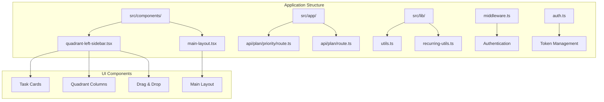
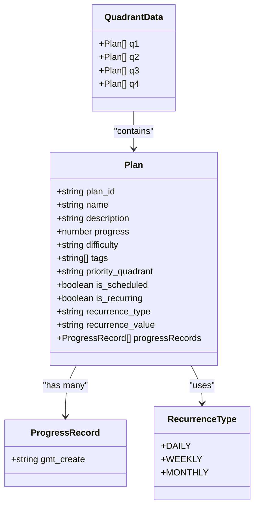
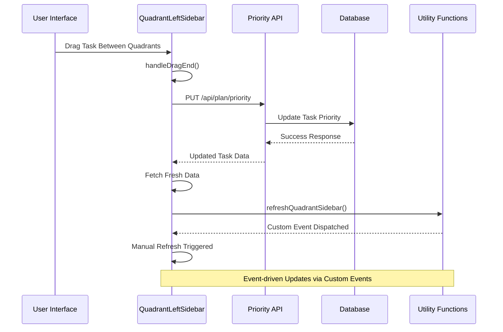
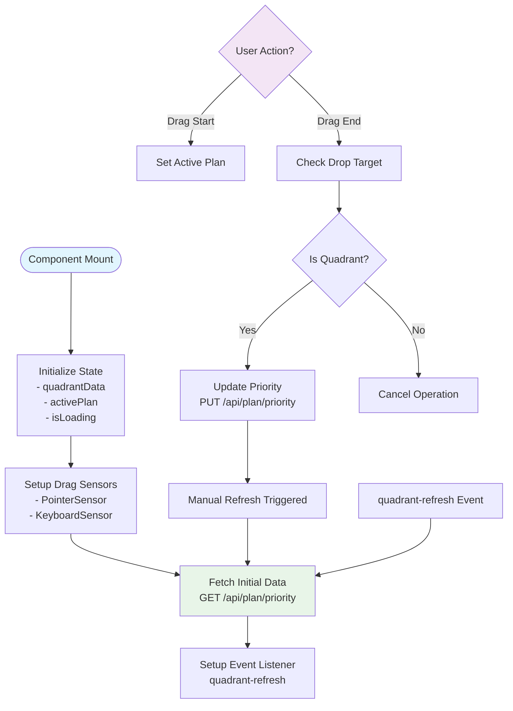
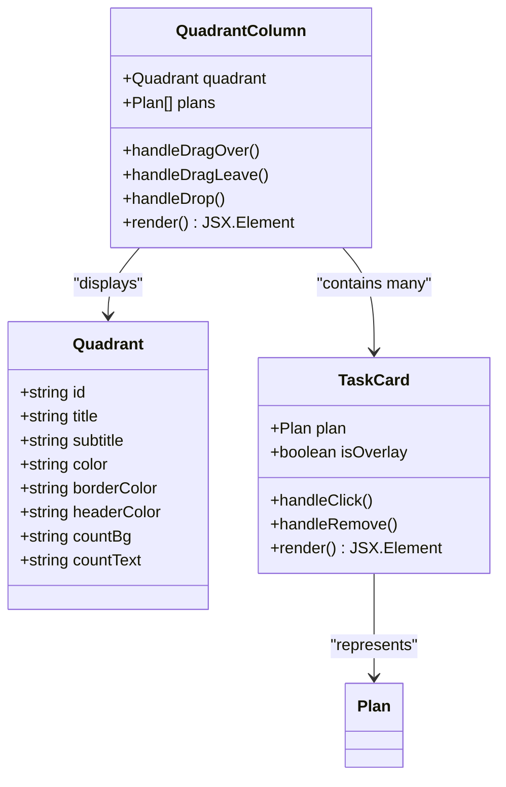
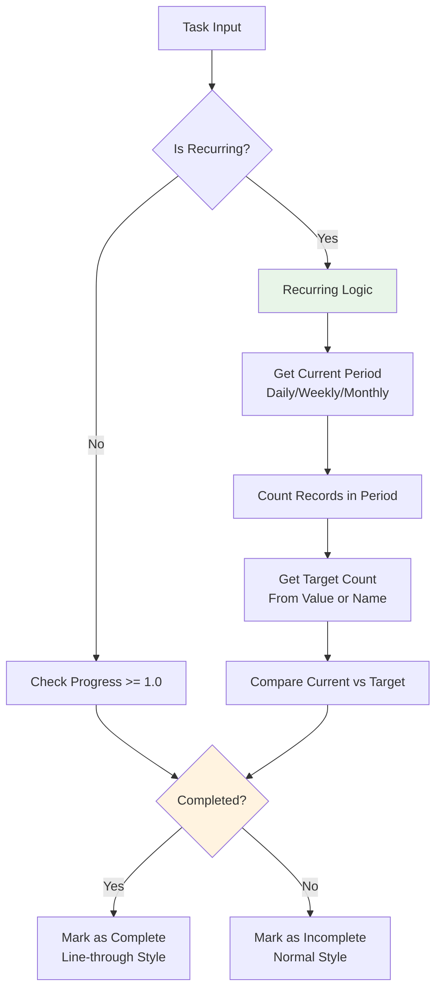
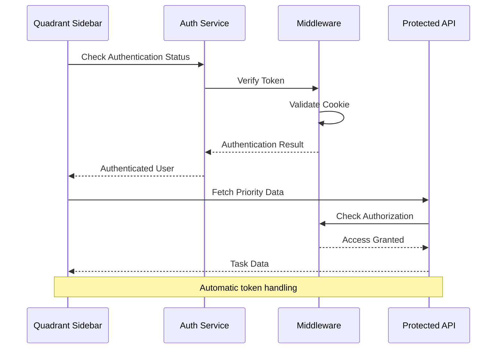

# Quadrant Left Sidebar

<cite>
**Referenced Files in This Document**
- [quadrant-left-sidebar.tsx](file://src/components/quadrant-left-sidebar.tsx)
- [main-layout.tsx](file://src/components/main-layout.tsx)
- [layout.tsx](file://src/app/layout.tsx)
- [route.ts](file://src/app/api/plan/priority/route.ts)
- [route.ts](file://src/app/api/plan/route.ts)
- [page.tsx](file://src/app/progress/page.tsx)
- [utils.ts](file://src/lib/utils.ts)
- [recurring-utils.ts](file://src/lib/recurring-utils.ts)
- [middleware.ts](file://middleware.ts)
- [auth.ts](file://src/lib/auth.ts)
</cite>

## Update Summary
**Changes Made**
- Updated performance considerations to reflect removal of automatic 30-second polling mechanism
- Modified architecture overview to show event-driven refresh instead of continuous polling
- Updated troubleshooting guide to reflect new manual refresh approach
- Revised component lifecycle to emphasize resource-saving initial load only approach

## Table of Contents
1. [Introduction](#introduction)
2. [Project Structure](#project-structure)
3. [Core Components](#core-components)
4. [Architecture Overview](#architecture-overview)
5. [Detailed Component Analysis](#detailed-component-analysis)
6. [Dependency Analysis](#dependency-analysis)
7. [Performance Considerations](#performance-considerations)
8. [Troubleshooting Guide](#troubleshooting-guide)
9. [Conclusion](#conclusion)

## Introduction

The Quadrant Left Sidebar is a core component of the Goal Mate application that implements the Eisenhower Matrix (Important vs. Urgent) productivity framework. This component displays tasks organized into four quadrants based on their importance and urgency, providing an intuitive drag-and-drop interface for task prioritization and management.

The sidebar serves as the primary interface for users to visualize their task workload and strategically organize their daily activities according to productivity principles. It integrates seamlessly with the application's authentication system and provides real-time updates through a custom event-driven refresh mechanism instead of continuous background polling.

## Project Structure

The Quadrant Left Sidebar is part of a larger Next.js application with the following relevant structure:



**Diagram sources**
- [quadrant-left-sidebar.tsx:1-569](file://src/components/quadrant-left-sidebar.tsx#L1-L569)
- [main-layout.tsx:1-69](file://src/components/main-layout.tsx#L1-L69)

**Section sources**
- [quadrant-left-sidebar.tsx:1-569](file://src/components/quadrant-left-sidebar.tsx#L1-L569)
- [main-layout.tsx:1-69](file://src/components/main-layout.tsx#L1-L69)

## Core Components

The Quadrant Left Sidebar consists of several interconnected components that work together to provide a comprehensive task management interface:

### Primary Components

1. **QuadrantLeftSidebar**: Main container component that manages state and coordinates all quadrant operations
2. **QuadrantColumn**: Individual quadrant display with drag-and-drop capabilities
3. **TaskCard**: Interactive task representation with completion indicators
4. **DnD Context**: Drag-and-drop system integration using @dnd-kit library

### Data Models

The component works with structured data models:



**Diagram sources**
- [quadrant-left-sidebar.tsx:26-56](file://src/components/quadrant-left-sidebar.tsx#L26-L56)

**Section sources**
- [quadrant-left-sidebar.tsx:26-56](file://src/components/quadrant-left-sidebar.tsx#L26-L56)

## Architecture Overview

The Quadrant Left Sidebar follows a resource-efficient architecture pattern with event-driven synchronization:



**Diagram sources**
- [quadrant-left-sidebar.tsx:424-444](file://src/components/quadrant-left-sidebar.tsx#L424-L444)
- [route.ts:66-109](file://src/app/api/plan/priority/route.ts#L66-L109)
- [utils.ts:8-16](file://src/lib/utils.ts#L8-L16)

The architecture implements several key patterns:

1. **Event-driven Synchronization**: Uses custom events to trigger manual refreshes instead of continuous polling
2. **Resource-efficient Loading**: Initial load only approach to minimize network requests
3. **Declarative State Management**: React hooks manage component state efficiently
4. **API Abstraction**: Clean separation between UI logic and data operations
5. **Authentication Integration**: Seamless integration with the application's auth system

**Section sources**
- [quadrant-left-sidebar.tsx:408-422](file://src/components/quadrant-left-sidebar.tsx#L408-L422)
- [route.ts:6-64](file://src/app/api/plan/priority/route.ts#L6-L64)

## Detailed Component Analysis

### QuadrantLeftSidebar Component

The main component orchestrates the entire quadrant system with an event-driven approach:



**Diagram sources**
- [quadrant-left-sidebar.tsx:408-422](file://src/components/quadrant-left-sidebar.tsx#L408-L422)
- [quadrant-left-sidebar.tsx:413-417](file://src/components/quadrant-left-sidebar.tsx#L413-L417)

#### Key Features

1. **Responsive Design**: Adapts between expanded and collapsed states
2. **Event-driven Updates**: Manual refresh triggered by custom events instead of automatic polling
3. **Drag-and-Drop**: Full @dnd-kit integration for intuitive task management
4. **Visual Feedback**: Comprehensive loading states and hover effects

**Section sources**
- [quadrant-left-sidebar.tsx:371-569](file://src/components/quadrant-left-sidebar.tsx#L371-L569)

### QuadrantColumn Implementation

Each quadrant column provides specialized functionality:



**Diagram sources**
- [quadrant-left-sidebar.tsx:284-369](file://src/components/quadrant-left-sidebar.tsx#L284-L369)

#### Quadrant Specifications

| Quadrant | Title | Subtitle | Color Scheme |
|----------|-------|----------|--------------|
| Q1 | Important & Urgent | Do Now | Red 50 theme |
| Q2 | Important & Not Urgent | Plan | Blue 50 theme |
| Q3 | Not Important & Urgent | Delegate | Yellow 50 theme |
| Q4 | Not Important & Not Urgent | Schedule | Gray 50 theme |

**Section sources**
- [quadrant-left-sidebar.tsx:58-99](file://src/components/quadrant-left-sidebar.tsx#L58-L99)

### Task Completion Logic

The system implements sophisticated completion tracking for both regular and recurring tasks:



**Diagram sources**
- [quadrant-left-sidebar.tsx:182-207](file://src/components/quadrant-left-sidebar.tsx#L182-L207)
- [recurring-utils.ts:88-147](file://src/lib/recurring-utils.ts#L88-L147)

**Section sources**
- [quadrant-left-sidebar.tsx:142-191](file://src/components/quadrant-left-sidebar.tsx#L142-L191)
- [recurring-utils.ts:16-147](file://src/lib/recurring-utils.ts#L16-L147)

### Authentication Integration

The component seamlessly integrates with the application's authentication system:



**Diagram sources**
- [middleware.ts:1-40](file://middleware.ts#L1-L40)
- [auth.ts:49-69](file://src/lib/auth.ts#L49-L69)

**Section sources**
- [middleware.ts:1-40](file://middleware.ts#L1-L40)
- [auth.ts:1-69](file://src/lib/auth.ts#L1-L69)

## Dependency Analysis

The Quadrant Left Sidebar has several key dependencies that affect its functionality and performance:

```mermaid
graph LR
subgraph "External Dependencies"
A[@dnd-kit/core] --> B[Drag & Drop]
C[@dnd-kit/sortable] --> D[Sortable Context]
E[lucide-react] --> F[Icons]
G[next/navigation] --> H[Routing]
end
subgraph "Internal Dependencies"
I[quadrant-left-sidebar.tsx] --> J[utils.ts]
I --> K[recurring-utils.ts]
I --> L[main-layout.tsx]
M[route.ts] --> N[Prisma Client]
O[page.tsx] --> I
end
subgraph "Styling"
P[tailwind-merge] --> Q[CSS Classes]
R[clsx] --> S[Conditional Classes]
end
I --> A
I --> G
I --> E
I --> J
I --> K
M --> N
```

**Diagram sources**
- [quadrant-left-sidebar.tsx:3-24](file://src/components/quadrant-left-sidebar.tsx#L3-L24)
- [utils.ts:1-6](file://src/lib/utils.ts#L1-L6)

### Performance Dependencies

1. **@dnd-kit**: Provides smooth drag-and-drop interactions but requires careful optimization
2. **React Hooks**: Efficient state management with proper dependency arrays
3. **Event System**: Custom events for inter-component communication (no polling overhead)
4. **API Calls**: Single initial fetch with manual refresh triggers

**Section sources**
- [quadrant-left-sidebar.tsx:1-569](file://src/components/quadrant-left-sidebar.tsx#L1-L569)

## Performance Considerations

The Quadrant Left Sidebar implements several performance optimization strategies focused on resource efficiency:

### Memory Management
- **Component Cleanup**: Proper cleanup of event listeners on component unmount
- **State Optimization**: Minimal state updates to reduce re-renders
- **Lazy Loading**: Conditional rendering of expanded/collapsed states

### Network Optimization
- **Initial Load Only**: Single fetch on component mount eliminates continuous polling
- **Event-driven Updates**: Custom events trigger manual refreshes when needed
- **Efficient Sorting**: Optimized sorting algorithms for task lists

### Resource Efficiency
- **No Background Polling**: Eliminates 30-second interval overhead
- **Manual Refresh Control**: Components decide when to refresh via custom events
- **Reduced API Calls**: Network requests only when user actions or external events occur

**Updated** Removed automatic 30-second polling mechanism in favor of resource-efficient initial load only approach

**Section sources**
- [quadrant-left-sidebar.tsx:408-422](file://src/components/quadrant-left-sidebar.tsx#L408-L422)
- [utils.ts:8-16](file://src/lib/utils.ts#L8-L16)

## Troubleshooting Guide

### Common Issues and Solutions

#### Drag-and-Drop Not Working
1. **Check Sensor Configuration**: Ensure PointerSensor and KeyboardSensor are properly initialized
2. **Verify Element References**: Confirm DOM elements are properly referenced
3. **Inspect Collision Detection**: Validate rectIntersection collision detection setup

#### Tasks Not Updating
1. **Event Listener Check**: Verify 'quadrant-refresh' event listener is attached during component mount
2. **API Response Validation**: Ensure PUT requests to /api/plan/priority return success
3. **Manual Refresh Trigger**: Confirm refreshQuadrantSidebar() is called after successful updates
4. **Component Lifecycle**: Check that useEffect cleanup properly removes event listeners

#### Authentication Problems
1. **Cookie Validation**: Verify auth-token cookie exists and is valid
2. **Middleware Configuration**: Ensure middleware properly handles protected routes
3. **Token Expiration**: Check JWT token expiration and renewal

#### Performance Issues
1. **Event Listener Cleanup**: Ensure event listeners are removed on component unmount
2. **Memory Leaks**: Verify proper cleanup prevents memory accumulation
3. **Network Requests**: Monitor that only initial fetch occurs without background polling

**Updated** Removed troubleshooting entries related to 30-second polling as it's no longer implemented

**Section sources**
- [quadrant-left-sidebar.tsx:413-417](file://src/components/quadrant-left-sidebar.tsx#L413-L417)
- [middleware.ts:19-35](file://middleware.ts#L19-L35)

## Conclusion

The Quadrant Left Sidebar represents a sophisticated implementation of the Eisenhower Matrix within a modern React/Next.js application. Its architecture demonstrates several key principles:

1. **Modular Design**: Clear separation of concerns between components
2. **Event-driven Synchronization**: Efficient manual refresh system via custom events
3. **Resource Optimization**: Initial load only approach minimizes network overhead
4. **User Experience**: Intuitive drag-and-drop interface with comprehensive feedback
5. **Security Integration**: Seamless authentication and authorization handling

The component successfully balances functionality with performance, providing users with an intuitive interface for task prioritization while maintaining robust backend integration and efficient synchronization capabilities. The shift from continuous polling to event-driven updates demonstrates a commitment to resource efficiency without sacrificing user experience. Its modular architecture ensures maintainability and extensibility for future enhancements.