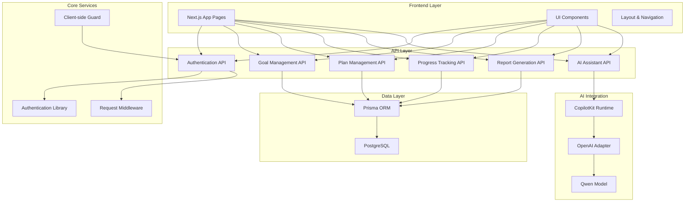
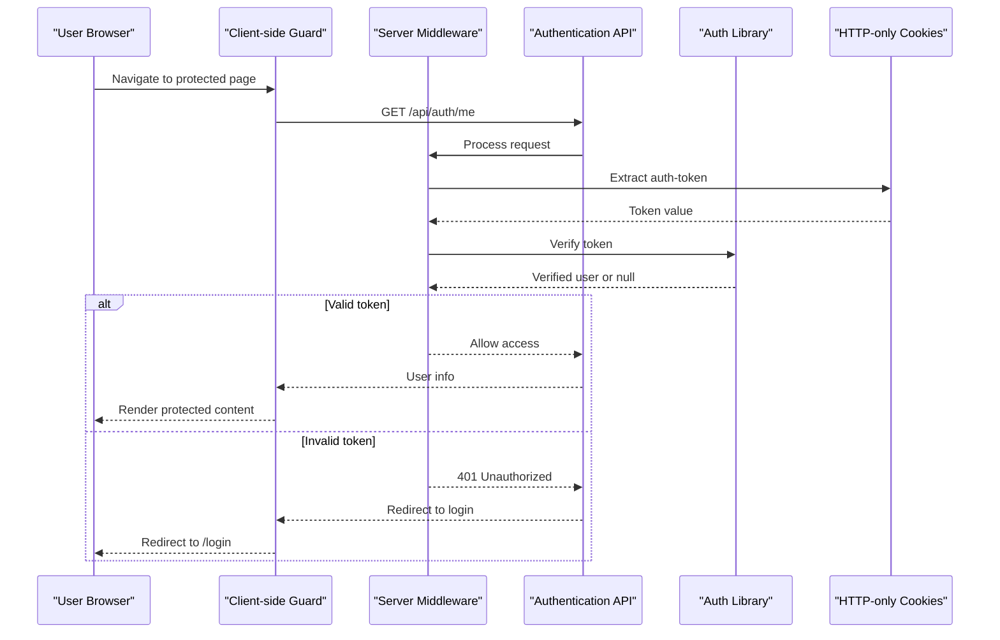
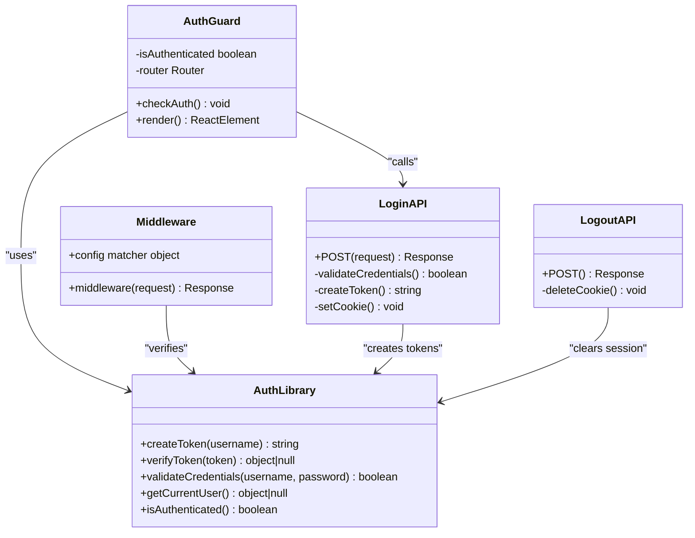
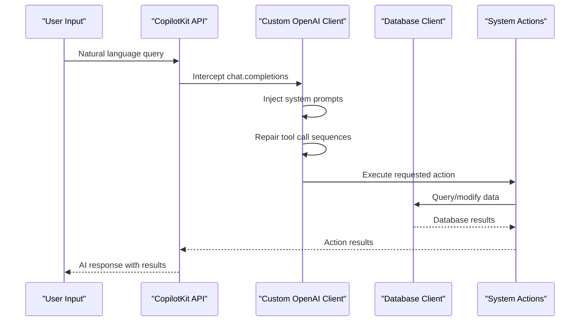
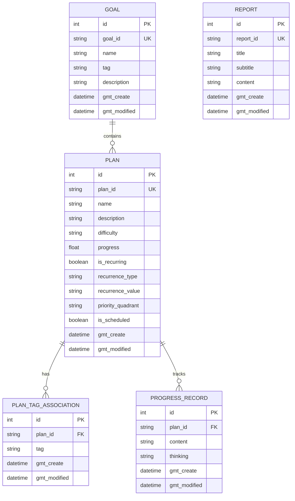
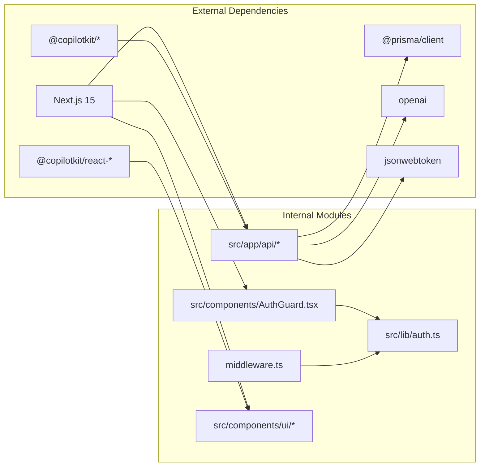

# Text Preview

<cite>
**Referenced Files in This Document**
- [README.md](file://README.md)
- [package.json](file://package.json)
- [prisma/schema.prisma](file://prisma/schema.prisma)
- [src/app/api/copilotkit/route.ts](file://src/app/api/copilotkit/route.ts)
- [src/app/api/goal/route.ts](file://src/app/api/goal/route.ts)
- [src/app/api/plan/route.ts](file://src/app/api/plan/route.ts)
- [src/app/api/progress_record/route.ts](file://src/app/api/progress_record/route.ts)
- [src/app/api/report/route.ts](file://src/app/api/report/route.ts)
- [src/app/api/auth/login/route.ts](file://src/app/api/auth/login/route.ts)
- [src/app/api/auth/logout/route.ts](file://src/app/api/auth/logout/route.ts)
- [src/app/api/auth/me/route.ts](file://src/app/api/auth/me/route.ts)
- [src/lib/auth.ts](file://src/lib/auth.ts)
- [middleware.ts](file://middleware.ts)
- [src/components/AuthGuard.tsx](file://src/components/AuthGuard.tsx)
</cite>

## Table of Contents
1. [Introduction](#introduction)
2. [Project Structure](#project-structure)
3. [Core Components](#core-components)
4. [Architecture Overview](#architecture-overview)
5. [Detailed Component Analysis](#detailed-component-analysis)
6. [Dependency Analysis](#dependency-analysis)
7. [Performance Considerations](#performance-considerations)
8. [Troubleshooting Guide](#troubleshooting-guide)
9. [Conclusion](#conclusion)

## Introduction
Goal Mate is an AI-powered productivity application built with Next.js that helps users manage goals, plans, and progress through natural language interactions. The system integrates CopilotKit with an AI backend (configured via environment variables) to provide intelligent assistance for learning and self-improvement activities. It features a modern frontend with React and TypeScript, a PostgreSQL database managed by Prisma, and a comprehensive authentication system using JWT tokens stored in HTTP-only cookies.

The application supports core workflows including goal creation and management, plan development with difficulty ratings and tagging, progress tracking with reflective journaling, automated reporting capabilities, and intelligent task recommendations powered by AI assistants.

## Project Structure
The project follows a conventional Next.js 15 monorepo structure with clear separation between frontend pages, API routes, shared components, and utility libraries. The architecture emphasizes modularity with dedicated API endpoints for each domain entity and centralized authentication middleware.

**Diagram sources**
- [src/app/api/copilotkit/route.ts](file://src/app/api/copilotkit/route.ts)
- [src/app/api/goal/route.ts](file://src/app/api/goal/route.ts)
- [src/app/api/plan/route.ts](file://src/app/api/plan/route.ts)
- [src/app/api/progress_record/route.ts](file://src/app/api/progress_record/route.ts)
- [src/app/api/report/route.ts](file://src/app/api/report/route.ts)
- [src/lib/auth.ts](file://src/lib/auth.ts)
- [middleware.ts](file://middleware.ts)
- [src/components/AuthGuard.tsx](file://src/components/AuthGuard.tsx)

**Section sources**
- [README.md](file://README.md)
- [package.json](file://package.json)

## Core Components
The system consists of several interconnected components that work together to provide a seamless user experience for goal and productivity management.

### Authentication System
The authentication system provides secure access control using JWT tokens stored in HTTP-only cookies. It includes server-side validation, client-side guards, and comprehensive middleware protection for all application routes.

### AI Assistant Integration
The CopilotKit integration enables natural language interactions with the system, supporting intelligent task recommendations, plan creation, progress tracking, and automated report generation through conversational AI.

### Data Management APIs
Four primary API domains handle the core business logic: Goals for long-term objectives, Plans for executable tasks, Progress Records for activity tracking, and Reports for analytical summaries.

### Frontend Components
The user interface includes specialized components for task management, progress visualization, AI chat interactions, and responsive layouts optimized for productivity workflows.

**Section sources**
- [src/lib/auth.ts](file://src/lib/auth.ts)
- [src/app/api/copilotkit/route.ts](file://src/app/api/copilotkit/route.ts)
- [src/app/api/goal/route.ts](file://src/app/api/goal/route.ts)
- [src/app/api/plan/route.ts](file://src/app/api/plan/route.ts)
- [src/app/api/progress_record/route.ts](file://src/app/api/progress_record/route.ts)
- [src/app/api/report/route.ts](file://src/app/api/report/route.ts)

## Architecture Overview
The application follows a layered architecture pattern with clear separation of concerns between presentation, business logic, data access, and external integrations.

**Diagram sources**
- [src/components/AuthGuard.tsx](file://src/components/AuthGuard.tsx)
- [middleware.ts](file://middleware.ts)
- [src/app/api/auth/me/route.ts](file://src/app/api/auth/me/route.ts)
- [src/lib/auth.ts](file://src/lib/auth.ts)

The architecture ensures robust security through multiple validation layers while maintaining a responsive user experience through efficient caching and optimized API responses.

**Section sources**
- [middleware.ts](file://middleware.ts)
- [src/lib/auth.ts](file://src/lib/auth.ts)
- [src/components/AuthGuard.tsx](file://src/components/AuthGuard.tsx)

## Detailed Component Analysis

### Authentication Component Analysis
The authentication system implements a multi-layered security approach combining server-side middleware, client-side guards, and secure token storage.

**Diagram sources**
- [src/lib/auth.ts](file://src/lib/auth.ts)
- [src/components/AuthGuard.tsx](file://src/components/AuthGuard.tsx)
- [middleware.ts](file://middleware.ts)
- [src/app/api/auth/login/route.ts](file://src/app/api/auth/login/route.ts)
- [src/app/api/auth/logout/route.ts](file://src/app/api/auth/logout/route.ts)

The authentication flow ensures that all sensitive operations require valid JWT tokens stored in HTTP-only cookies, preventing XSS attacks and providing secure session management.

**Section sources**
- [src/lib/auth.ts](file://src/lib/auth.ts)
- [src/components/AuthGuard.tsx](file://src/components/AuthGuard.tsx)
- [middleware.ts](file://middleware.ts)
- [src/app/api/auth/login/route.ts](file://src/app/api/auth/login/route.ts)
- [src/app/api/auth/logout/route.ts](file://src/app/api/auth/logout/route.ts)

### AI Assistant Component Analysis
The CopilotKit integration provides sophisticated conversational AI capabilities with custom prompt engineering and action orchestration.

**Diagram sources**
- [src/app/api/copilotkit/route.ts](file://src/app/api/copilotkit/route.ts)

The AI assistant implements advanced features including automatic task recommendation, intelligent progress tracking, book search capabilities, and automated report generation through carefully crafted system prompts and action handlers.

**Section sources**
- [src/app/api/copilotkit/route.ts](file://src/app/api/copilotkit/route.ts)

### Data Management Component Analysis
The system provides comprehensive CRUD operations for goals, plans, progress records, and reports with sophisticated filtering and pagination capabilities.

**Diagram sources**
- [prisma/schema.prisma](file://prisma/schema.prisma)

Each entity type supports specific operations tailored to productivity management workflows, with plans featuring advanced scheduling and recurrence capabilities.

**Section sources**
- [prisma/schema.prisma](file://prisma/schema.prisma)
- [src/app/api/goal/route.ts](file://src/app/api/goal/route.ts)
- [src/app/api/plan/route.ts](file://src/app/api/plan/route.ts)
- [src/app/api/progress_record/route.ts](file://src/app/api/progress_record/route.ts)
- [src/app/api/report/route.ts](file://src/app/api/report/route.ts)

## Dependency Analysis
The application maintains clean dependency relationships with well-defined interfaces between components, enabling maintainability and extensibility.

**Diagram sources**
- [package.json](file://package.json)
- [src/lib/auth.ts](file://src/lib/auth.ts)
- [src/components/AuthGuard.tsx](file://src/components/AuthGuard.tsx)
- [middleware.ts](file://middleware.ts)

The dependency structure ensures that internal modules remain decoupled from external frameworks, facilitating testing and potential framework migrations.

**Section sources**
- [package.json](file://package.json)

## Performance Considerations
The application implements several performance optimization strategies including database query optimization, efficient caching patterns, and resource-conscious API design.

Key performance characteristics include:
- Asynchronous database operations with concurrent query execution
- Pagination support for large datasets with configurable page sizes
- Efficient filtering and sorting mechanisms for real-time data manipulation
- Optimized API response structures minimizing unnecessary data transfer
- Client-side caching strategies for frequently accessed authentication state

## Troubleshooting Guide
Common issues and their resolutions:

### Authentication Issues
- **Login failures**: Verify environment variables AUTH_USERNAME and AUTH_PASSWORD are correctly configured
- **Session timeouts**: Check JWT token expiration settings and cookie configurations
- **CORS problems**: Ensure cookie settings match deployment environment (secure flag for production)

### Database Connectivity
- **Connection errors**: Verify DATABASE_URL format and PostgreSQL server accessibility
- **Migration issues**: Run `npx prisma db push` after schema changes
- **Query performance**: Monitor slow queries and consider adding appropriate indexes

### AI Integration Problems
- **Model connectivity**: Confirm OPENAI_API_KEY and OPENAI_BASE_URL are properly set
- **Rate limiting**: Implement retry logic for API rate limit responses
- **Prompt errors**: Validate system prompt formatting and tool call sequences

### Deployment Issues
- **Docker container startup**: Check port bindings and volume mounts
- **Environment configuration**: Verify all required environment variables are present
- **Database initialization**: Ensure PostgreSQL service is running before application startup

**Section sources**
- [src/lib/auth.ts](file://src/lib/auth.ts)
- [prisma/schema.prisma](file://prisma/schema.prisma)
- [src/app/api/copilotkit/route.ts](file://src/app/api/copilotkit/route.ts)

## Conclusion
Goal Mate represents a comprehensive productivity application that successfully combines modern web technologies with AI-driven assistance to create an intuitive platform for personal development and goal achievement. The architecture demonstrates strong separation of concerns, robust security practices, and scalable data management capabilities.

The system's strength lies in its integrated approach to productivity management, where AI assistance seamlessly complements traditional task management workflows. The modular design facilitates future enhancements while maintaining code quality and developer experience.

Key architectural strengths include the multi-layered authentication system, sophisticated AI integration through CopilotKit, and well-structured API endpoints that support complex productivity workflows. The application serves as an excellent foundation for further customization and extension based on specific user needs and organizational requirements.