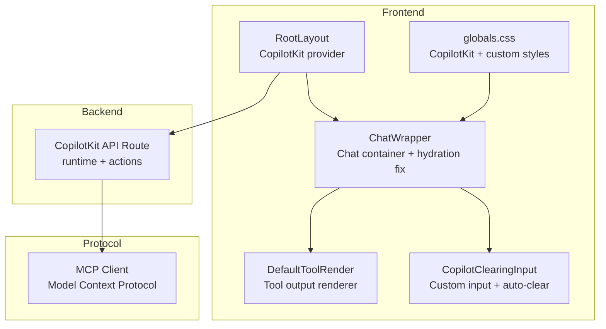
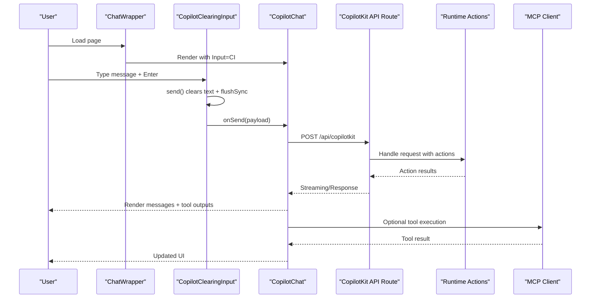
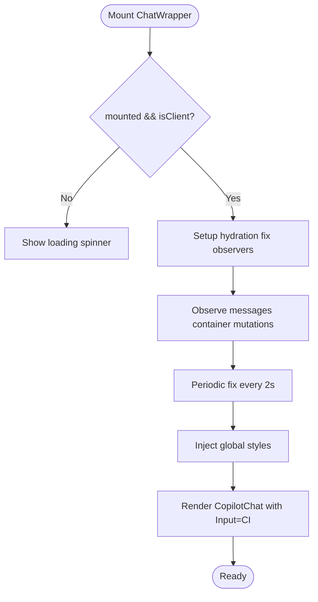
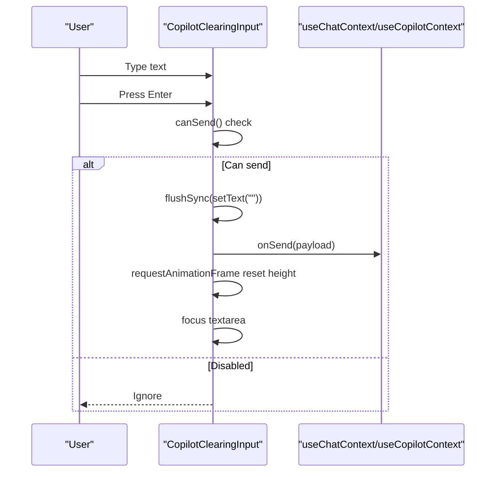
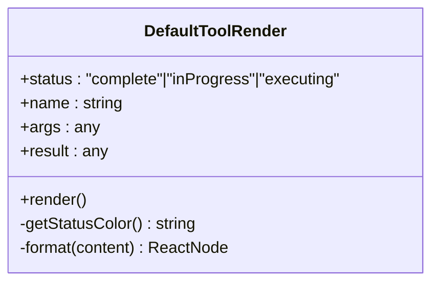
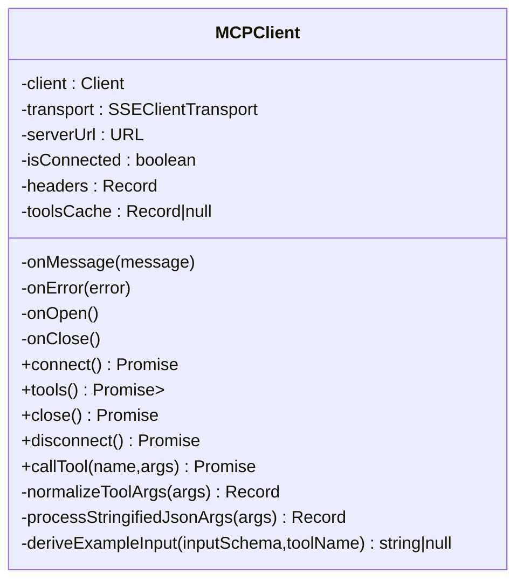
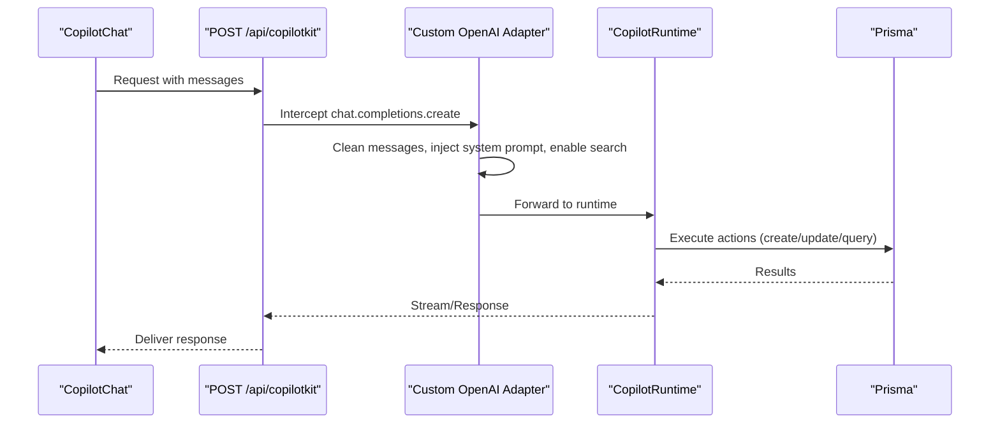
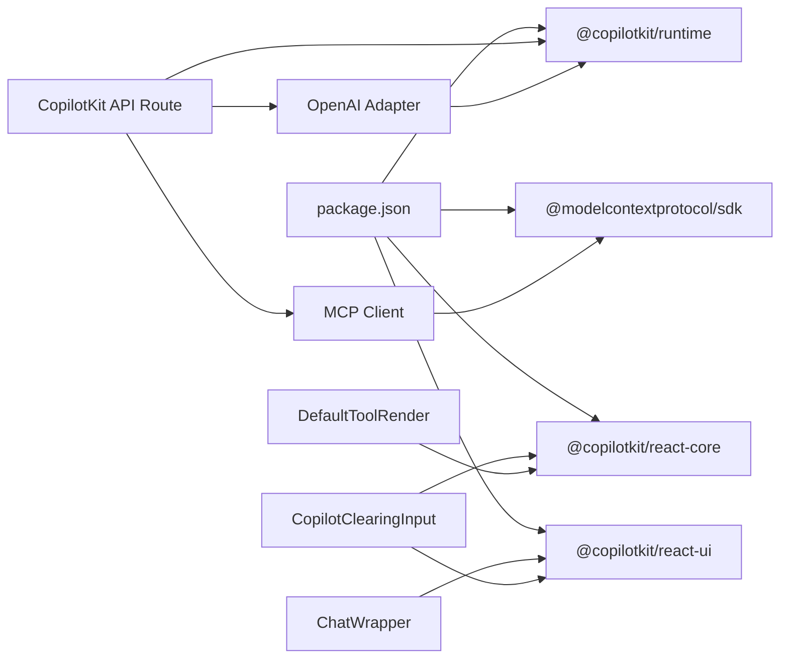

# Chat Interface Components

<cite>
**Referenced Files in This Document**
- [chat-wrapper.tsx](file://src/components/chat-wrapper.tsx)
- [copilot-clearing-input.tsx](file://src/components/copilot-clearing-input.tsx)
- [default-tool-render.tsx](file://src/components/default-tool-render.tsx)
- [mcp-client.ts](file://src/app/utils/mcp-client.ts)
- [page.tsx](file://src/app/copilotkit/page.tsx)
- [layout.tsx](file://src/app/layout.tsx)
- [route.ts](file://src/app/api/copilotkit/route.ts)
- [globals.css](file://src/app/globals.css)
- [test-chat/page.tsx](file://src/app/test-chat/page.tsx)
- [package.json](file://package.json)
</cite>

## Table of Contents
1. [Introduction](#introduction)
2. [Project Structure](#project-structure)
3. [Core Components](#core-components)
4. [Architecture Overview](#architecture-overview)
5. [Detailed Component Analysis](#detailed-component-analysis)
6. [Dependency Analysis](#dependency-analysis)
7. [Performance Considerations](#performance-considerations)
8. [Troubleshooting Guide](#troubleshooting-guide)
9. [Conclusion](#conclusion)
10. [Appendices](#appendices)

## Introduction
This document provides comprehensive documentation for the AI chat interface components in the project. It focuses on:
- ChatWrapper: the main chat container with hydration-safe rendering, styles, and message handling
- CopilotClearingInput: the custom input component with auto-clearing, auto-resize, and submit handling
- DefaultToolRender: the renderer for AI tool outputs and interactive elements
- MCP client integration: Model Context Protocol client for AI communication protocols
- Usage examples: chat initialization, message flow, and error handling
- Guidelines: customization, message formatting, UX optimization, and performance considerations

## Project Structure
The chat UI is built with Next.js and CopilotKit. The key files involved are:
- Frontend components: ChatWrapper, CopilotClearingInput, DefaultToolRender
- Backend integration: CopilotKit API route and runtime actions
- Global styles and layout: CopilotKit provider and CSS
- MCP client utility for protocol communication

**Diagram sources**
- [chat-wrapper.tsx:1-709](file://src/components/chat-wrapper.tsx#L1-L709)
- [copilot-clearing-input.tsx:1-175](file://src/components/copilot-clearing-input.tsx#L1-L175)
- [default-tool-render.tsx:1-104](file://src/components/default-tool-render.tsx#L1-L104)
- [layout.tsx:1-31](file://src/app/layout.tsx#L1-L31)
- [route.ts:1-1636](file://src/app/api/copilotkit/route.ts#L1-L1636)
- [mcp-client.ts:1-449](file://src/app/utils/mcp-client.ts#L1-L449)
- [globals.css:1-380](file://src/app/globals.css#L1-L380)

**Section sources**
- [layout.tsx:16-30](file://src/app/layout.tsx#L16-L30)
- [globals.css:129-184](file://src/app/globals.css#L129-L184)

## Core Components
- ChatWrapper: wraps CopilotChat with hydration-safe DOM mutation handling, global styles, and custom message/input styling. It injects CopilotClearingInput as the Input component and applies a theme.
- CopilotClearingInput: a custom input with auto-resize textarea, controlled clearing after send, keyboard shortcuts, and power-by branding.
- DefaultToolRender: renders tool call status, name, parameters, and results in an expandable UI with animated indicators.
- MCP Client: a Model Context Protocol client that connects via SSE, lists tools, caches tool definitions, and executes tool calls with robust argument normalization.

**Section sources**
- [chat-wrapper.tsx:7-709](file://src/components/chat-wrapper.tsx#L7-L709)
- [copilot-clearing-input.tsx:84-175](file://src/components/copilot-clearing-input.tsx#L84-L175)
- [default-tool-render.tsx:12-104](file://src/components/default-tool-render.tsx#L12-L104)
- [mcp-client.ts:26-449](file://src/app/utils/mcp-client.ts#L26-L449)

## Architecture Overview
The chat architecture integrates frontend UI components with CopilotKit runtime and backend actions, and optionally MCP servers for tool execution.

**Diagram sources**
- [chat-wrapper.tsx:698-706](file://src/components/chat-wrapper.tsx#L698-L706)
- [copilot-clearing-input.tsx:105-119](file://src/components/copilot-clearing-input.tsx#L105-L119)
- [route.ts:1456-1636](file://src/app/api/copilotkit/route.ts#L1456-L1636)
- [mcp-client.ts:115-300](file://src/app/utils/mcp-client.ts#L115-L300)

## Detailed Component Analysis

### ChatWrapper
- Purpose: Provides the chat container, hydration-safe DOM fixes, global styles, and theme injection.
- Hydration fixes: Uses MutationObserver and periodic checks to adjust nested block elements inside paragraphs to prevent hydration mismatches.
- Styles: Applies extensive CopilotKit overrides for messages, input, buttons, and markdown rendering; includes animations and responsive design.
- Integration: Passes CopilotClearingInput as the Input component and sets labels for title, initial message, and placeholder.

**Diagram sources**
- [chat-wrapper.tsx:11-59](file://src/components/chat-wrapper.tsx#L11-L59)
- [chat-wrapper.tsx:82-709](file://src/components/chat-wrapper.tsx#L82-L709)

**Section sources**
- [chat-wrapper.tsx:7-709](file://src/components/chat-wrapper.tsx#L7-L709)

### CopilotClearingInput
- Purpose: A custom input component that ensures the textarea is cleared immediately after sending, with auto-resize behavior and keyboard handling.
- Auto-clear: Uses flushSync to clear state synchronously before invoking onSend, preventing stale UI.
- Auto-resize: Tracks single-row height and limits to maxRows; adjusts height on value change.
- Keyboard handling: Prevents default Enter submission when Shift is pressed; sends on Enter otherwise.
- Send availability: Determines whether send is enabled based on inProgress and text content, and interrupts.
- Controls: Upload button (optional), send/stop button with icons from context.

**Diagram sources**
- [copilot-clearing-input.tsx:105-119](file://src/components/copilot-clearing-input.tsx#L105-L119)
- [copilot-clearing-input.tsx:121-129](file://src/components/copilot-clearing-input.tsx#L121-L129)

**Section sources**
- [copilot-clearing-input.tsx:84-175](file://src/components/copilot-clearing-input.tsx#L84-L175)

### DefaultToolRender
- Purpose: Renders MCP tool call status with collapsible details, showing name, parameters, and results.
- Status indicators: Animated pulse for in-progress/executing; static for complete.
- Expand/collapse: Chevron toggles content visibility with smooth transitions.
- Formatting: JSON-like formatting for parameters/results; monospace font for readability.

**Diagram sources**
- [default-tool-render.tsx:12-104](file://src/components/default-tool-render.tsx#L12-L104)

**Section sources**
- [default-tool-render.tsx:12-104](file://src/components/default-tool-render.tsx#L12-L104)

### MCP Client Integration
- Purpose: Implements Model Context Protocol client for standardized AI tool communication.
- Connection: Establishes SSE transport with optional headers; exposes connect/close/disconnect.
- Tools discovery: Lists tools, caches results, enhances descriptions with required parameters and example usage.
- Execution: Normalizes arguments (handles double-nested params), processes stringified JSON, and calls tools via client.
- Error handling: Logs errors, marks disconnected state, and returns empty tool map on failure.

**Diagram sources**
- [mcp-client.ts:26-449](file://src/app/utils/mcp-client.ts#L26-L449)

**Section sources**
- [mcp-client.ts:26-449](file://src/app/utils/mcp-client.ts#L26-L449)

### Backend Runtime and Actions
- Purpose: Exposes CopilotKit runtime with actions for plan/query/progress management and intelligent parsing.
- Actions: recommendTasks, queryPlans, createGoal, getSystemOptions, createPlan, findPlan, updateProgress, addProgressRecord, analyzeAndRecordProgress.
- Interception: Custom OpenAI adapter intercepts chat completions, cleans developer roles, injects system prompts, enables search, and repairs tool call sequences.
- Endpoint: POST /api/copilotkit handles requests, filters unsupported roles, and delegates to runtime.

**Diagram sources**
- [route.ts:88-271](file://src/app/api/copilotkit/route.ts#L88-L271)
- [route.ts:1456-1636](file://src/app/api/copilotkit/route.ts#L1456-L1636)

**Section sources**
- [route.ts:287-1451](file://src/app/api/copilotkit/route.ts#L287-L1451)
- [route.ts:1456-1636](file://src/app/api/copilotkit/route.ts#L1456-L1636)

## Dependency Analysis
- Frontend dependencies: @copilotkit/react-ui, @copilotkit/react-core, styled-jsx, tailwind-merge.
- Backend dependencies: @copilotkit/runtime, @copilotkit/react-ui styles, @modelcontextprotocol/sdk.
- Global styles: CopilotKit default styles imported and customized overrides for chat containers and markdown.

**Diagram sources**
- [package.json:16-42](file://package.json#L16-L42)
- [chat-wrapper.tsx:3-5](file://src/components/chat-wrapper.tsx#L3-L5)
- [copilot-clearing-input.tsx:10-12](file://src/components/copilot-clearing-input.tsx#L10-L12)
- [default-tool-render.tsx:3-4](file://src/components/default-tool-render.tsx#L3-L4)
- [route.ts:1-10](file://src/app/api/copilotkit/route.ts#L1-L10)
- [mcp-client.ts:1-5](file://src/app/utils/mcp-client.ts#L1-L5)

**Section sources**
- [package.json:16-42](file://package.json#L16-L42)

## Performance Considerations
- Hydration fixes: MutationObserver and periodic intervals ensure DOM stability; avoid excessive reflows by limiting selector scope and batching updates.
- Auto-resize textarea: Compute single-row height once and cap to maxRows to minimize layout thrashing.
- FlushSync usage: Ensures immediate UI state updates after send; use sparingly to avoid blocking.
- Scrollbars and animations: Smooth animations and scrollbars are enabled; consider prefers-reduced-motion media queries for accessibility.
- Network latency: SSE-based MCP client and runtime streaming; debounce user input and throttle frequent updates.
- Tool caching: MCP tools are cached to reduce repeated network calls; invalidate cache on disconnect.

[No sources needed since this section provides general guidance]

## Troubleshooting Guide
- Hydration mismatch: ChatWrapper includes targeted fixes for nested block elements inside paragraphs; if issues persist, verify global styles and ensure hydration runs after mount.
- Input not clearing: Confirm flushSync is invoked before onSend and that canSend() logic permits sending.
- Tool execution failures: MCP client logs errors and marks disconnected; check serverUrl, headers, and network connectivity.
- Backend errors: The API route returns structured 500 responses with error details; inspect logs for stack traces and unsupported roles filtering.
- Missing CopilotKit styles: Ensure @copilotkit/react-ui/styles.css is imported and globals.css overrides are applied.

**Section sources**
- [chat-wrapper.tsx:17-59](file://src/components/chat-wrapper.tsx#L17-L59)
- [copilot-clearing-input.tsx:105-119](file://src/components/copilot-clearing-input.tsx#L105-L119)
- [mcp-client.ts:78-89](file://src/app/utils/mcp-client.ts#L78-L89)
- [route.ts:1621-1634](file://src/app/api/copilotkit/route.ts#L1621-L1634)

## Conclusion
The chat interface combines a robust frontend with CopilotKit and a powerful backend runtime. ChatWrapper ensures hydration safety and polished UI, CopilotClearingInput delivers reliable input behavior, and DefaultToolRender presents tool outputs clearly. The MCP client enables standardized protocol communication, while the backend runtime integrates actions for goal/plan/progress management. Together, these components provide a scalable, customizable, and performant AI chat experience.

[No sources needed since this section summarizes without analyzing specific files]

## Appendices

### Usage Examples

- Chat initialization
  - Wrap your app with the CopilotKit provider and render ChatWrapper or CopilotChat.
  - Reference: [layout.tsx:24-26](file://src/app/layout.tsx#L24-L26), [chat-wrapper.tsx:698-706](file://src/components/chat-wrapper.tsx#L698-L706)

- Message flow
  - User types in CopilotClearingInput, presses Enter, triggers send, and the message is delivered to the backend runtime.
  - Reference: [copilot-clearing-input.tsx:143-149](file://src/components/copilot-clearing-input.tsx#L143-L149), [route.ts:1456-1636](file://src/app/api/copilotkit/route.ts#L1456-L1636)

- Error handling
  - MCP client logs errors and marks disconnected; API route returns structured 500 responses.
  - Reference: [mcp-client.ts:78-89](file://src/app/utils/mcp-client.ts#L78-L89), [route.ts:1621-1634](file://src/app/api/copilotkit/route.ts#L1621-L1634)

- Tool rendering
  - Use DefaultToolRender to display tool call status, parameters, and results.
  - Reference: [default-tool-render.tsx:12-104](file://src/components/default-tool-render.tsx#L12-L104), [page.tsx:53-58](file://src/app/copilotkit/page.tsx#L53-L58)

### Customization Guidelines
- Theming
  - Adjust primary color via CSS variables in the CopilotKit provider or ChatWrapper.
  - Reference: [layout.tsx](file://src/app/layout.tsx#L14), [chat-wrapper.tsx:93-96](file://src/components/chat-wrapper.tsx#L93-L96)

- Message formatting
  - Customize markdown rendering and bubble styles in ChatWrapper’s global styles.
  - Reference: [chat-wrapper.tsx:264-539](file://src/components/chat-wrapper.tsx#L264-L539), [globals.css:187-295](file://src/app/globals.css#L187-L295)

- Input behavior
  - Modify auto-resize limits, placeholder, and keyboard shortcuts in CopilotClearingInput.
  - Reference: [copilot-clearing-input.tsx:16-71](file://src/components/copilot-clearing-input.tsx#L16-L71), [copilot-clearing-input.tsx:136-151](file://src/components/copilot-clearing-input.tsx#L136-L151)

- Tool integration
  - Extend MCP client tools and enhance descriptions with required parameters and examples.
  - Reference: [mcp-client.ts:115-234](file://src/app/utils/mcp-client.ts#L115-L234), [mcp-client.ts:369-413](file://src/app/utils/mcp-client.ts#L369-L413)

### Real-time Updates
- SSE-based MCP client and runtime streaming provide near-real-time updates.
- Monitor onOpen/onMessage/onError callbacks for diagnostics and UI feedback.
- Reference: [mcp-client.ts:43-63](file://src/app/utils/mcp-client.ts#L43-L63), [route.ts:1607-1620](file://src/app/api/copilotkit/route.ts#L1607-L1620)