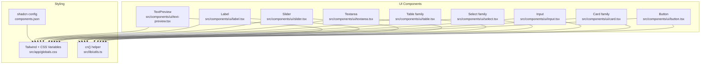
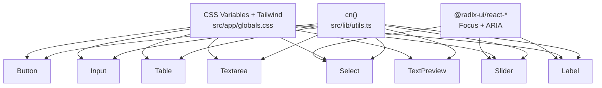
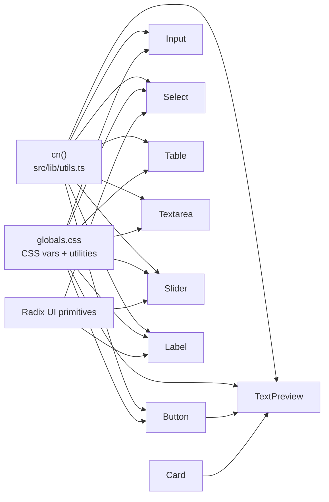

# Core UI Components

<cite>
**Referenced Files in This Document**
- [button.tsx](file://src/components/ui/button.tsx)
- [card.tsx](file://src/components/ui/card.tsx)
- [input.tsx](file://src/components/ui/input.tsx)
- [select.tsx](file://src/components/ui/select.tsx)
- [table.tsx](file://src/components/ui/table.tsx)
- [textarea.tsx](file://src/components/ui/textarea.tsx)
- [slider.tsx](file://src/components/ui/slider.tsx)
- [label.tsx](file://src/components/ui/label.tsx)
- [text-preview.tsx](file://src/components/ui/text-preview.tsx)
- [globals.css](file://src/app/globals.css)
- [utils.ts](file://src/lib/utils.ts)
- [components.json](file://components.json)
- [LoginForm.tsx](file://src/components/LoginForm.tsx)
- [main-layout.tsx](file://src/components/main-layout.tsx)
</cite>

## Table of Contents
1. [Introduction](#introduction)
2. [Project Structure](#project-structure)
3. [Core Components](#core-components)
4. [Architecture Overview](#architecture-overview)
5. [Detailed Component Analysis](#detailed-component-analysis)
6. [Dependency Analysis](#dependency-analysis)
7. [Performance Considerations](#performance-considerations)
8. [Troubleshooting Guide](#troubleshooting-guide)
9. [Conclusion](#conclusion)
10. [Appendices](#appendices)

## Introduction
This document describes the core UI component library used in the application. It focuses on Button, Card, Input, Select, Table, Textarea, Slider, Label, and TextPreview. For each component, we document visual appearance, behavior, user interaction patterns, props/attributes, variants, sizes, customization options, and integration patterns. We also provide guidelines for responsive design, accessibility, cross-browser compatibility, component states, focus management, form validation, error handling, user feedback, style customization, theming, and composition patterns.

## Project Structure
The UI components live under src/components/ui and are styled via Tailwind CSS with CSS variables for theming. Utility helpers merge Tailwind classes safely. The design system is configured with shadcn’s New York style and Lucide icons.

**Diagram sources**
- [button.tsx:1-60](file://src/components/ui/button.tsx#L1-L60)
- [card.tsx:1-93](file://src/components/ui/card.tsx#L1-L93)
- [input.tsx:1-22](file://src/components/ui/input.tsx#L1-L22)
- [select.tsx:1-186](file://src/components/ui/select.tsx#L1-L186)
- [table.tsx:1-117](file://src/components/ui/table.tsx#L1-L117)
- [textarea.tsx:1-19](file://src/components/ui/textarea.tsx#L1-L19)
- [slider.tsx:1-28](file://src/components/ui/slider.tsx#L1-L28)
- [label.tsx:1-25](file://src/components/ui/label.tsx#L1-L25)
- [text-preview.tsx:1-241](file://src/components/ui/text-preview.tsx#L1-L241)
- [globals.css:1-380](file://src/app/globals.css#L1-L380)
- [utils.ts:1-7](file://src/lib/utils.ts#L1-L7)
- [components.json:1-21](file://components.json#L1-L21)

**Section sources**
- [components.json:1-21](file://components.json#L1-L21)
- [globals.css:1-380](file://src/app/globals.css#L1-L380)
- [utils.ts:1-7](file://src/lib/utils.ts#L1-L7)

## Core Components
This section summarizes the primary UI components and their roles in the design system.

- Button: Variants (default, destructive, outline, secondary, ghost, link), sizes (default, sm, lg, icon), focus-visible ring, aria-invalid integration, and optional slot composition.
- Card: Composite layout with header, title, description, action area, content, and footer; responsive grid and container utilities.
- Input: Text input with focus-visible ring, aria-invalid integration, placeholder and selection styles, and responsive typography.
- Select: Composite widget with Trigger, Content, Item, Label, Separator, ScrollUp/Down buttons; supports size and popper positioning.
- Table: Container plus semantic table parts (header/body/footer, rows, cells, caption) with hover and selection states.
- Textarea: Multiline text area with focus-visible ring, aria-invalid integration, and responsive typography.
- Slider: Range slider with track and thumb; focus-visible ring and disabled state handling.
- Label: Accessible label for form controls with group/disabled states and peer-disabled support.
- TextPreview: Interactive preview with truncation, tooltip, copy-to-clipboard, link detection, and responsive behavior.

**Section sources**
- [button.tsx:7-36](file://src/components/ui/button.tsx#L7-L36)
- [card.tsx:5-92](file://src/components/ui/card.tsx#L5-L92)
- [input.tsx:5-19](file://src/components/ui/input.tsx#L5-L19)
- [select.tsx:9-185](file://src/components/ui/select.tsx#L9-L185)
- [table.tsx:7-116](file://src/components/ui/table.tsx#L7-L116)
- [textarea.tsx:5-18](file://src/components/ui/textarea.tsx#L5-L18)
- [slider.tsx:8-27](file://src/components/ui/slider.tsx#L8-L27)
- [label.tsx:8-24](file://src/components/ui/label.tsx#L8-L24)
- [text-preview.tsx:7-241](file://src/components/ui/text-preview.tsx#L7-L241)

## Architecture Overview
The components share a consistent styling approach:
- Class merging via cn() ensures safe composition.
- Focus-visible rings and aria-invalid states are consistently applied for accessibility and validation feedback.
- CSS variables define theme tokens; dark mode toggles via .dark variant.
- Radix UI primitives power interactive widgets (Select, Slider, Label) for robust keyboard navigation and screen reader support.

**Diagram sources**
- [utils.ts:4-6](file://src/lib/utils.ts#L4-L6)
- [globals.css:6-44](file://src/app/globals.css#L6-L44)
- [select.tsx:1-13](file://src/components/ui/select.tsx#L1-L13)
- [slider.tsx:1-11](file://src/components/ui/slider.tsx#L1-L11)
- [label.tsx:1-11](file://src/components/ui/label.tsx#L1-L11)

## Detailed Component Analysis

### Button
- Purpose: Primary action or secondary actions with consistent spacing and focus states.
- Props:
  - className: Additional classes.
  - variant: default, destructive, outline, secondary, ghost, link.
  - size: default, sm, lg, icon.
  - asChild: Render as a slottable child element.
  - Inherits button attributes (onClick, disabled, type, etc.).
- States and Behaviors:
  - Disabled: reduced opacity and pointer-events disabled.
  - Focus-visible: ring around border with configurable ring color.
  - aria-invalid: integrates with form validation by adding destructive ring on invalid states.
  - Icon support: automatic sizing and alignment for SVG children.
- Accessibility:
  - Uses radix Slot for composition.
  - Focus-visible ring and aria-invalid integration.
- Customization:
  - Variant and size tokens controlled by cva; theme tokens via CSS variables.
  - Override className for additional styles.

Usage examples (paths):
- [button.tsx:38-57](file://src/components/ui/button.tsx#L38-L57)

**Section sources**
- [button.tsx:7-36](file://src/components/ui/button.tsx#L7-L36)
- [button.tsx:38-57](file://src/components/ui/button.tsx#L38-L57)
- [globals.css:6-44](file://src/app/globals.css#L6-L44)

### Card
- Purpose: Encapsulate content with header/title/description/action/content/footer segments.
- Composition:
  - Card (outer container).
  - CardHeader (grid layout with optional action column).
  - CardTitle (typographic treatment).
  - CardDescription (muted text).
  - CardAction (aligned to top-right within header).
  - CardContent (inner padding).
  - CardFooter (optional bottom bar).
- Responsive and Layout:
  - Grid-based header adapts to presence of action.
  - Footer supports optional top border.
- Accessibility:
  - No explicit ARIA roles; relies on semantic structure.
- Customization:
  - className composes with default spacing and shadows.

Usage examples (paths):
- [card.tsx:5-92](file://src/components/ui/card.tsx#L5-L92)

**Section sources**
- [card.tsx:5-92](file://src/components/ui/card.tsx#L5-L92)

### Input
- Purpose: Single-line text input with consistent focus and validation styling.
- Props:
  - className: Additional classes.
  - type: HTML input type.
  - Inherits input attributes (onChange, value, placeholder, etc.).
- States and Behaviors:
  - Focus-visible ring and border highlight.
  - aria-invalid integration for validation feedback.
  - Placeholder and selection colors themed.
- Accessibility:
  - Proper labeling via associated Label is recommended.
- Customization:
  - Theme tokens for border, background, foreground, ring.

Usage examples (paths):
- [input.tsx:5-19](file://src/components/ui/input.tsx#L5-L19)

**Section sources**
- [input.tsx:5-19](file://src/components/ui/input.tsx#L5-L19)
- [globals.css:6-44](file://src/app/globals.css#L6-L44)

### Select
- Purpose: Dropdown selection with accessible keyboard navigation and visual indicators.
- Composition:
  - Root, Group, Value.
  - Trigger (supports size sm/default).
  - Content (with portal and popper positioning).
  - Label, Item (with indicator), Separator.
  - ScrollUpButton, ScrollDownButton.
- Props:
  - Trigger accepts size prop; Content accepts position prop.
  - All components accept className and pass-through attributes.
- States and Behaviors:
  - Focus-visible ring on trigger.
  - Items disabled state handled per item.
  - Scroll buttons visible when content overflows.
- Accessibility:
  - Uses @radix-ui/react-select for ARIA roles and keyboard handling.
- Customization:
  - Theme tokens for popover, border, accent, muted.

Usage examples (paths):
- [select.tsx:9-185](file://src/components/ui/select.tsx#L9-L185)

**Section sources**
- [select.tsx:9-185](file://src/components/ui/select.tsx#L9-L185)
- [globals.css:6-44](file://src/app/globals.css#L6-L44)

### Table
- Purpose: Structured tabular data with hover and selection affordances.
- Composition:
  - Table container (horizontal scrolling).
  - TableHeader/TableBody/TableFooter.
  - TableRow, TableHead, TableCell, TableCaption.
- States and Behaviors:
  - Hover and selected states via data attributes.
  - Sticky header/footer and action columns supported via CSS utilities.
- Accessibility:
  - Semantic table structure; ensure captions and labels for complex tables.
- Customization:
  - Theme tokens for borders, muted backgrounds, and accents.

Usage examples (paths):
- [table.tsx:7-116](file://src/components/ui/table.tsx#L7-L116)

**Section sources**
- [table.tsx:7-116](file://src/components/ui/table.tsx#L7-L116)
- [globals.css:321-346](file://src/app/globals.css#L321-L346)

### Textarea
- Purpose: Multi-line text input with consistent focus and validation styling.
- Props:
  - className: Additional classes.
  - Inherits textarea attributes (onChange, value, placeholder, etc.).
- States and Behaviors:
  - Focus-visible ring and border highlight.
  - aria-invalid integration for validation feedback.
- Accessibility:
  - Proper labeling via associated Label is recommended.
- Customization:
  - Theme tokens for border, background, foreground, ring.

Usage examples (paths):
- [textarea.tsx:5-18](file://src/components/ui/textarea.tsx#L5-L18)

**Section sources**
- [textarea.tsx:5-18](file://src/components/ui/textarea.tsx#L5-L18)
- [globals.css:6-44](file://src/app/globals.css#L6-L44)

### Slider
- Purpose: Continuous or discrete numeric selection with visual range.
- Props:
  - className: Additional classes.
  - Inherits SliderPrimitive.Root attributes (value, onValueChange, min, max, step, etc.).
- States and Behaviors:
  - Track and range visuals; thumb supports focus-visible ring.
  - Disabled state prevents interaction.
- Accessibility:
  - Uses @radix-ui/react-slider for native semantics and keyboard support.
- Customization:
  - Track and range colors themed via primary palette.

Usage examples (paths):
- [slider.tsx:8-27](file://src/components/ui/slider.tsx#L8-L27)

**Section sources**
- [slider.tsx:8-27](file://src/components/ui/slider.tsx#L8-L27)
- [globals.css:6-44](file://src/app/globals.css#L6-L44)

### Label
- Purpose: Accessible label for form controls; integrates with disabled and peer states.
- Props:
  - className: Additional classes.
  - Inherits LabelPrimitive.Root attributes.
- States and Behaviors:
  - Supports group disabled and peer disabled states.
  - Select-none and pointer-events adjustments for disabled contexts.
- Accessibility:
  - Uses @radix-ui/react-label for proper association with inputs.
- Customization:
  - Font weight, size, and color via theme tokens.

Usage examples (paths):
- [label.tsx:8-24](file://src/components/ui/label.tsx#L8-L24)

**Section sources**
- [label.tsx:8-24](file://src/components/ui/label.tsx#L8-L24)
- [globals.css:6-44](file://src/app/globals.css#L6-L44)

### TextPreview
- Purpose: Inline preview with optional truncation and a rich tooltip modal for full text, links, and copy.
- Props:
  - text: string to preview.
  - maxLength?: number (default 100).
  - className?: string.
  - truncateLines?: number (default 2).
- Behavior:
  - Truncates text beyond length or line count; shows ellipsis indicator.
  - Tooltip appears on hover with configurable delay and position (above/below).
  - Detects URLs and renders them as clickable links.
  - Provides copy-to-clipboard with temporary feedback.
  - Click outside closes tooltip; tooltips are focusable and hover-aware.
- States:
  - Loading/copying states via internal flags.
  - Tooltip visibility managed with timers to avoid accidental dismissal.
- Accessibility:
  - Tooltip is a fixed-position overlay; ensure sufficient contrast and keyboard navigability.
- Customization:
  - className composes with default hover/background and line clamp utilities.

Usage examples (paths):
- [text-preview.tsx:7-241](file://src/components/ui/text-preview.tsx#L7-L241)

**Section sources**
- [text-preview.tsx:7-241](file://src/components/ui/text-preview.tsx#L7-L241)
- [button.tsx:38-57](file://src/components/ui/button.tsx#L38-L57)
- [card.tsx:5-92](file://src/components/ui/card.tsx#L5-L92)

## Dependency Analysis
Component dependencies and coupling:
- All components depend on cn() for safe class merging.
- Styling depends on CSS variables and Tailwind utilities.
- Interactive components rely on Radix UI primitives for accessibility and behavior.
- TextPreview composes Button and Card internally.

**Diagram sources**
- [utils.ts:4-6](file://src/lib/utils.ts#L4-L6)
- [globals.css:6-44](file://src/app/globals.css#L6-L44)
- [select.tsx:1-13](file://src/components/ui/select.tsx#L1-L13)
- [slider.tsx:1-11](file://src/components/ui/slider.tsx#L1-L11)
- [label.tsx:1-11](file://src/components/ui/label.tsx#L1-L11)
- [button.tsx:38-57](file://src/components/ui/button.tsx#L38-L57)
- [card.tsx:5-92](file://src/components/ui/card.tsx#L5-L92)

**Section sources**
- [utils.ts:4-6](file://src/lib/utils.ts#L4-L6)
- [globals.css:6-44](file://src/app/globals.css#L6-L44)

## Performance Considerations
- Prefer shallow class composition with cn() to minimize re-renders.
- Use default variants and sizes to reduce conditional logic in hot paths.
- For long lists, virtualize or paginate when integrating Table or Select dropdowns.
- Debounce or throttle hover-triggered tooltips (already implemented with timers) to avoid excessive DOM updates.
- Keep maxLength and truncateLines reasonable to limit tooltip content rendering.

## Troubleshooting Guide
Common issues and resolutions:
- Focus ring not visible:
  - Ensure focus-visible ring utilities are present and not overridden by global resets.
  - Verify CSS variables for ring color are defined.
- Select dropdown misaligned:
  - Confirm portal rendering and popper positioning; adjust trigger size if needed.
- Table horizontal overflow:
  - Wrap Table in a container with horizontal scroll; ensure sticky header/column classes are applied.
- TextPreview tooltip cutoff:
  - Tooltip position logic accounts for viewport; ensure no parent clipping and adequate z-index.
- Validation feedback inconsistent:
  - Apply aria-invalid on related inputs; Button and Inputs integrate destructively when aria-invalid is present.

**Section sources**
- [button.tsx:8-8](file://src/components/ui/button.tsx#L8-L8)
- [input.tsx:11-13](file://src/components/ui/input.tsx#L11-L13)
- [select.tsx:58-85](file://src/components/ui/select.tsx#L58-L85)
- [table.tsx:7-20](file://src/components/ui/table.tsx#L7-L20)
- [text-preview.tsx:50-74](file://src/components/ui/text-preview.tsx#L50-L74)

## Conclusion
The core UI components follow a cohesive design system built on Tailwind CSS, CSS variables, and Radix UI primitives. They emphasize accessibility, responsive behavior, and consistent focus states. Variants, sizes, and composition patterns enable flexible customization while maintaining a unified look-and-feel across the application.

## Appendices

### Responsive Design Guidelines
- Use responsive breakpoints and utilities from the design system:
  - Hide elements on small screens with sm-hidden.
  - Adjust typography and spacing for mobile/tablet/desktop.
  - Ensure tables are horizontally scrollable on small screens.
- Example utilities:
  - [globals.css:359-379](file://src/app/globals.css#L359-L379)

**Section sources**
- [globals.css:359-379](file://src/app/globals.css#L359-L379)

### Accessibility Compliance Checklist
- Buttons and inputs:
  - Provide focus-visible rings and aria-invalid integration.
  - [button.tsx:8-8](file://src/components/ui/button.tsx#L8-L8)
  - [input.tsx:11-13](file://src/components/ui/input.tsx#L11-L13)
- Select and Slider:
  - Use Radix primitives for keyboard navigation and ARIA roles.
  - [select.tsx:1-13](file://src/components/ui/select.tsx#L1-L13)
  - [slider.tsx:1-11](file://src/components/ui/slider.tsx#L1-L11)
- Label:
  - Associate labels with inputs using Label primitive.
  - [label.tsx:1-11](file://src/components/ui/label.tsx#L1-L11)
- TextPreview:
  - Tooltip overlays should be keyboard accessible and have sufficient contrast.
  - [text-preview.tsx:197-238](file://src/components/ui/text-preview.tsx#L197-L238)

**Section sources**
- [button.tsx:8-8](file://src/components/ui/button.tsx#L8-L8)
- [input.tsx:11-13](file://src/components/ui/input.tsx#L11-L13)
- [select.tsx:1-13](file://src/components/ui/select.tsx#L1-L13)
- [slider.tsx:1-11](file://src/components/ui/slider.tsx#L1-L11)
- [label.tsx:1-11](file://src/components/ui/label.tsx#L1-L11)
- [text-preview.tsx:197-238](file://src/components/ui/text-preview.tsx#L197-L238)

### Cross-Browser Compatibility Notes
- Focus-visible ring relies on :focus-visible; ensure polyfills if targeting legacy browsers.
- CSS variables are widely supported; verify fallbacks in older environments.
- Radix UI primitives provide cross-browser keyboard and ARIA support.

### Theming and Style Customization
- Theme tokens:
  - CSS variables define primary, secondary, muted, destructive, borders, and ring colors.
  - Dark mode toggles via .dark variant.
  - [globals.css:6-118](file://src/app/globals.css#L6-L118)
- Class merging:
  - cn() merges classes safely; override defaults by appending className.
  - [utils.ts:4-6](file://src/lib/utils.ts#L4-L6)
- shadcn configuration:
  - Style, RSC, TSX, Tailwind config, aliases, and icon library are defined.
  - [components.json:3-21](file://components.json#L3-L21)

**Section sources**
- [globals.css:6-118](file://src/app/globals.css#L6-L118)
- [utils.ts:4-6](file://src/lib/utils.ts#L4-L6)
- [components.json:3-21](file://components.json#L3-L21)

### Form Validation and User Feedback Patterns
- Validation feedback:
  - aria-invalid on inputs/buttons triggers destructive ring.
  - [input.tsx:11-13](file://src/components/ui/input.tsx#L11-L13)
  - [button.tsx:8-8](file://src/components/ui/button.tsx#L8-L8)
- User feedback:
  - TextPreview shows “copied” state for 2 seconds after copy.
  - [text-preview.tsx:105-113](file://src/components/ui/text-preview.tsx#L105-L113)
- Example form integration:
  - LoginForm demonstrates submit flow, loading state, and error display.
  - [LoginForm.tsx:13-40](file://src/components/LoginForm.tsx#L13-L40)

**Section sources**
- [input.tsx:11-13](file://src/components/ui/input.tsx#L11-L13)
- [button.tsx:8-8](file://src/components/ui/button.tsx#L8-L8)
- [text-preview.tsx:105-113](file://src/components/ui/text-preview.tsx#L105-L113)
- [LoginForm.tsx:13-40](file://src/components/LoginForm.tsx#L13-L40)

### Component Composition Patterns
- Slot composition:
  - Button supports asChild to wrap links or other elements.
  - [button.tsx:48-48](file://src/components/ui/button.tsx#L48-L48)
- Internal composition:
  - TextPreview composes Button and Card for actions and content.
  - [text-preview.tsx:4-5](file://src/components/ui/text-preview.tsx#L4-L5)
- Layout composition:
  - Card family enables structured layouts with optional actions and descriptions.
  - [card.tsx:18-62](file://src/components/ui/card.tsx#L18-L62)

**Section sources**
- [button.tsx:48-48](file://src/components/ui/button.tsx#L48-L48)
- [text-preview.tsx:4-5](file://src/components/ui/text-preview.tsx#L4-L5)
- [card.tsx:18-62](file://src/components/ui/card.tsx#L18-L62)

### Usage Examples (Paths)
- Button variants and sizes:
  - [button.tsx:38-57](file://src/components/ui/button.tsx#L38-L57)
- Card layout:
  - [card.tsx:5-92](file://src/components/ui/card.tsx#L5-L92)
- Input and Label pairing:
  - [input.tsx:5-19](file://src/components/ui/input.tsx#L5-L19)
  - [label.tsx:8-24](file://src/components/ui/label.tsx#L8-L24)
- Select usage:
  - [select.tsx:9-185](file://src/components/ui/select.tsx#L9-L185)
- Table usage:
  - [table.tsx:7-116](file://src/components/ui/table.tsx#L7-L116)
- Textarea usage:
  - [textarea.tsx:5-18](file://src/components/ui/textarea.tsx#L5-L18)
- Slider usage:
  - [slider.tsx:8-27](file://src/components/ui/slider.tsx#L8-L27)
- TextPreview usage:
  - [text-preview.tsx:7-241](file://src/components/ui/text-preview.tsx#L7-L241)