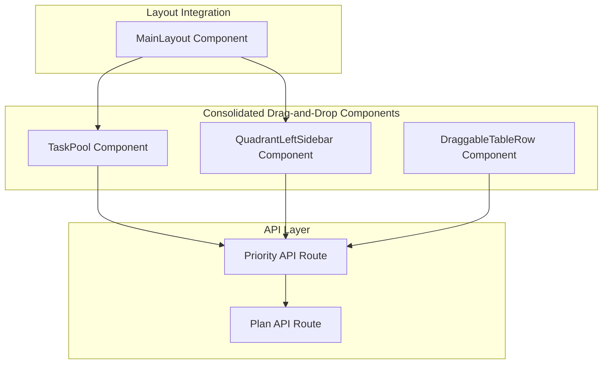
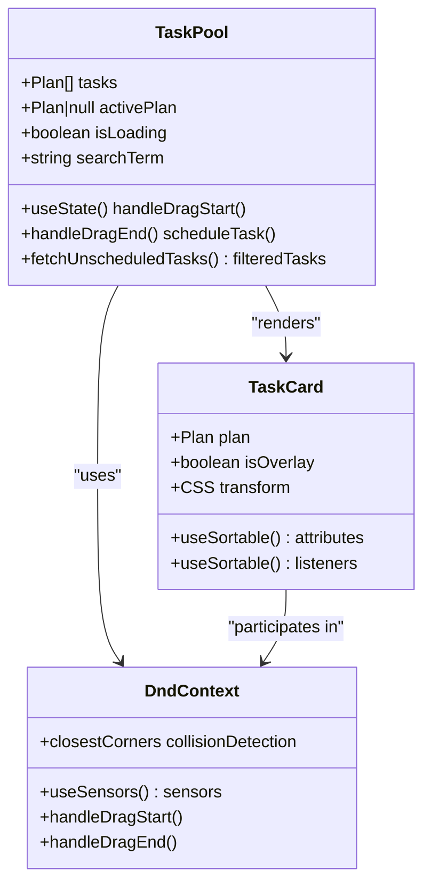
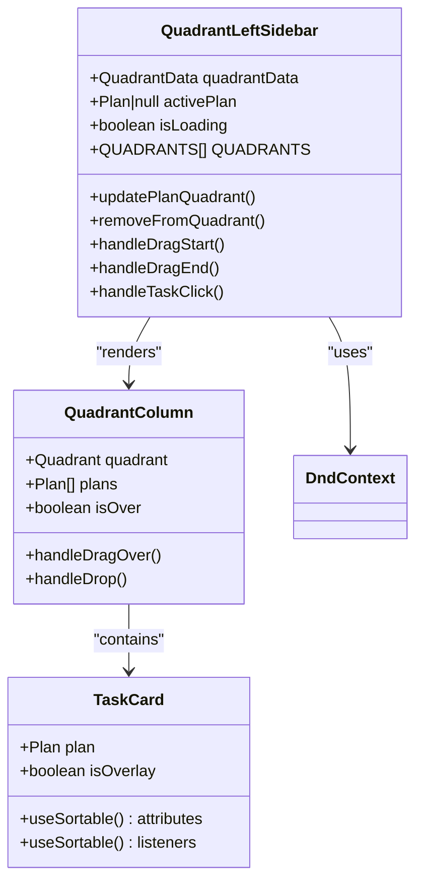
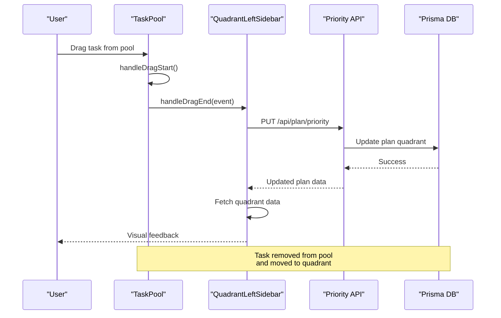
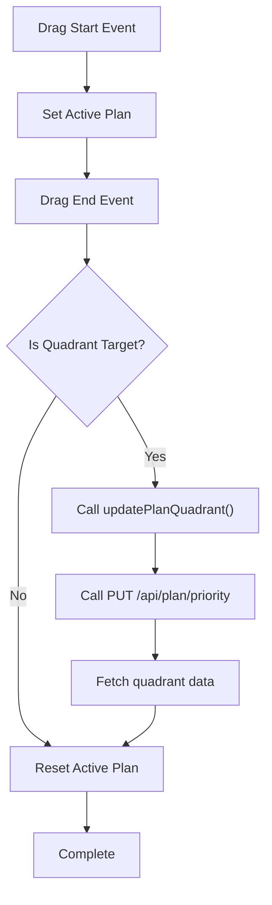
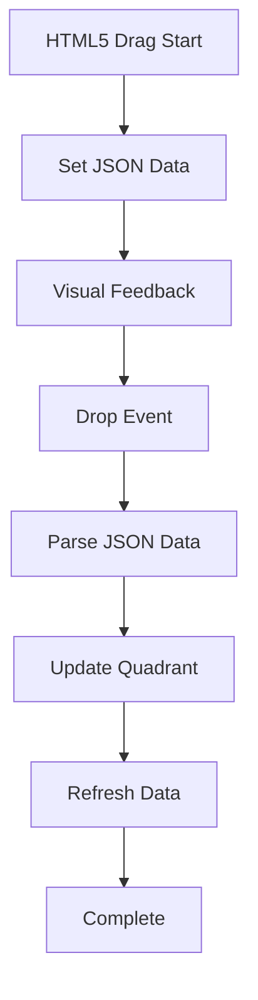
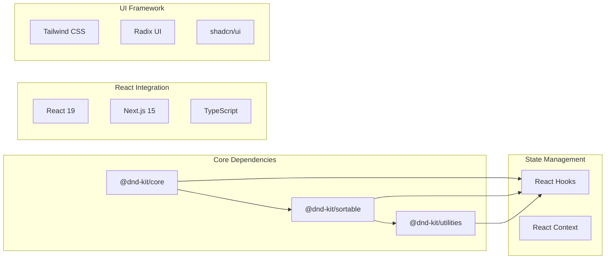

# Drag-and-Drop Functionality

<cite>
**Referenced Files in This Document**
- [task-pool.tsx](file://src/components/task-pool.tsx)
- [quadrant-left-sidebar.tsx](file://src/components/quadrant-left-sidebar.tsx)
- [plans/page.tsx](file://src/app/plans/page.tsx)
- [route.ts](file://src/app/api/plan/priority/route.ts)
- [route.ts](file://src/app/api/plan/route.ts)
- [main-layout.tsx](file://src/components/main-layout.tsx)
- [package.json](file://package.json)
</cite>

## Update Summary
**Changes Made**
- Updated architecture overview to reflect the consolidation of quadrant management into a single component
- Removed references to the non-existent standalone quadrant-sidebar.tsx component
- Updated component analysis to focus on the unified quadrant-left-sidebar.tsx implementation
- Revised diagrams to show the current single-component quadrant management approach
- Added documentation for the legacy HTML5 drag-and-drop implementation in plans page

## Table of Contents
1. [Introduction](#introduction)
2. [Project Structure](#project-structure)
3. [Core Components](#core-components)
4. [Architecture Overview](#architecture-overview)
5. [Detailed Component Analysis](#detailed-component-analysis)
6. [Dependency Analysis](#dependency-analysis)
7. [Performance Considerations](#performance-considerations)
8. [Troubleshooting Guide](#troubleshooting-guide)
9. [Conclusion](#conclusion)

## Introduction

Goal Mate implements a sophisticated drag-and-drop system for managing tasks across four priority quadrants using modern React hooks and the @dnd-kit library. The system provides intuitive task manipulation through both mouse and keyboard interactions, enabling users to efficiently organize their work priorities.

**Updated**: The drag-and-drop functionality has been consolidated into a single, unified component that manages both task scheduling from the pool and quadrant organization within the sidebar.

The drag-and-drop system centers around two primary components: the Task Pool for unassigned tasks and the Priority Quadrant Sidebar for organizing scheduled tasks. Users can drag tasks from the pool into specific quadrants or rearrange tasks within quadrants using familiar drag-and-drop gestures.

## Project Structure

The drag-and-drop implementation has been streamlined to a single cohesive architecture:

**Diagram sources**
- [task-pool.tsx:114-264](file://src/components/task-pool.tsx#L114-L264)
- [quadrant-left-sidebar.tsx:229-395](file://src/components/quadrant-left-sidebar.tsx#L229-L395)

**Section sources**
- [task-pool.tsx:1-264](file://src/components/task-pool.tsx#L1-L264)
- [quadrant-left-sidebar.tsx:1-519](file://src/components/quadrant-left-sidebar.tsx#L1-L519)

## Core Components

### Task Pool Component

The Task Pool serves as the central hub for unassigned tasks, providing a searchable list with drag-and-drop capabilities:

**Diagram sources**
- [task-pool.tsx:114-264](file://src/components/task-pool.tsx#L114-L264)
- [task-pool.tsx:43-112](file://src/components/task-pool.tsx#L43-L112)

### Consolidated Quadrant Sidebar Component

**Updated**: The quadrant management functionality has been consolidated into a single, comprehensive component that handles both task scheduling and quadrant organization:

**Diagram sources**
- [quadrant-left-sidebar.tsx:229-395](file://src/components/quadrant-left-sidebar.tsx#L229-L395)

**Section sources**
- [task-pool.tsx:114-264](file://src/components/task-pool.tsx#L114-L264)
- [quadrant-left-sidebar.tsx:229-395](file://src/components/quadrant-left-sidebar.tsx#L229-L395)

## Architecture Overview

**Updated**: The drag-and-drop system now integrates seamlessly with a unified quadrant management component:

**Diagram sources**
- [task-pool.tsx:149-192](file://src/components/task-pool.tsx#L149-L192)
- [quadrant-left-sidebar.tsx:402-415](file://src/components/quadrant-left-sidebar.tsx#L402-L415)
- [route.ts:50-93](file://src/app/api/plan/priority/route.ts#L50-L93)

The system supports multiple interaction modes:

1. **Mouse-based dragging** using @dnd-kit's PointerSensor
2. **Keyboard navigation** using @dnd-kit's KeyboardSensor
3. **HTML5 drag-and-drop** for cross-component operations
4. **Touch-friendly gestures** for mobile devices

**Section sources**
- [task-pool.tsx:120-129](file://src/components/task-pool.tsx#L120-L129)
- [quadrant-left-sidebar.tsx:342-349](file://src/components/quadrant-left-sidebar.tsx#L342-L349)

## Detailed Component Analysis

### Task Pool Implementation

The Task Pool component provides a comprehensive solution for managing unassigned tasks:

#### Drag-and-Drop Event Handling

**Diagram sources**
- [task-pool.tsx:149-192](file://src/components/task-pool.tsx#L149-L192)

#### Task Card Rendering

Each task card utilizes @dnd-kit's useSortable hook for smooth animations and proper positioning:

| Feature | Implementation | Purpose |
|---------|---------------|---------|
| **Drag Handle** | `useSortable()` hook | Enables drag functionality |
| **Visual Feedback** | CSS transforms | Smooth movement animations |
| **Hover Effects** | Tailwind classes | User interaction cues |
| **Accessibility** | Keyboard navigation | Screen reader support |

**Section sources**
- [task-pool.tsx:43-112](file://src/components/task-pool.tsx#L43-L112)
- [task-pool.tsx:149-192](file://src/components/task-pool.tsx#L149-L192)

### Consolidated Quadrant Sidebar Component

**Updated**: The quadrant management functionality has been consolidated into a single, comprehensive component:

#### Unified Quadrant Management

The QuadrantLeftSidebar component now handles both task scheduling and quadrant organization:

- **Real-time Updates**: Automatic refresh every 30 seconds
- **Visual Indicators**: Color-coded quadrants with task counts
- **Removal Capability**: Individual task removal from quadrants
- **Collapsible Design**: Minimizable sidebar for screen space
- **Direct Navigation**: Click-to-progress routing
- **Loading States**: Optimistic UI updates

#### Drag-and-Drop Event Flow

**Diagram sources**
- [quadrant-left-sidebar.tsx:396-415](file://src/components/quadrant-left-sidebar.tsx#L396-L415)

**Section sources**
- [quadrant-left-sidebar.tsx:229-395](file://src/components/quadrant-left-sidebar.tsx#L229-L395)
- [quadrant-left-sidebar.tsx:396-415](file://src/components/quadrant-left-sidebar.tsx#L396-L415)

### Legacy HTML5 Drag-and-Drop Implementation

**Updated**: The plans page includes a legacy HTML5 drag-and-drop implementation for backward compatibility, operating independently from the main quadrant sidebar:

**Diagram sources**
- [plans/page.tsx:54-97](file://src/app/plans/page.tsx#L54-L97)
- [quadrant-left-sidebar.tsx:159-182](file://src/components/quadrant-left-sidebar.tsx#L159-L182)

**Section sources**
- [plans/page.tsx:54-97](file://src/app/plans/page.tsx#L54-L97)
- [quadrant-left-sidebar.tsx:159-182](file://src/components/quadrant-left-sidebar.tsx#L159-L182)

## Dependency Analysis

The drag-and-drop system relies on several key dependencies:

**Diagram sources**
- [package.json:20-22](file://package.json#L20-L22)
- [package.json:39-42](file://package.json#L39-L42)

### External Dependencies

| Package | Version | Purpose |
|---------|---------|---------|
| **@dnd-kit/core** | ^6.3.1 | Core drag-and-drop functionality |
| **@dnd-kit/sortable** | ^10.0.0 | Sortable list implementation |
| **@dnd-kit/utilities** | ^3.2.2 | Utility functions for drag-and-drop |
| **@prisma/client** | ^6.9.0 | Database client for task persistence |
| **lucide-react** | ^0.511.0 | Icon library for UI elements |

**Section sources**
- [package.json:16-43](file://package.json#L16-L43)

## Performance Considerations

### Optimization Strategies

1. **Efficient State Updates**: Minimal re-renders through targeted state updates
2. **Collision Detection**: Optimized using `closestCorners` for better performance
3. **Lazy Loading**: API data fetched only when components mount
4. **Debounced Updates**: Real-time updates with controlled refresh intervals
5. **Single Source of Truth**: Consolidated quadrant management reduces complexity

### Memory Management

- **Cleanup Functions**: Proper cleanup of event listeners and intervals
- **Conditional Rendering**: Components only render when data is available
- **Optimized Queries**: Database queries limited to necessary fields

### Accessibility Features

- **Keyboard Navigation**: Full keyboard support for drag-and-drop operations
- **Screen Reader Support**: Proper ARIA labels and roles
- **Focus Management**: Logical tab order and focus traps

## Troubleshooting Guide

### Common Issues and Solutions

#### Drag Operation Not Working

**Symptoms**: Tasks don't move when dragged
**Causes**:
- Missing `useSensors` configuration
- Incorrect event handler implementation
- API endpoint errors

**Solutions**:
1. Verify sensor configuration in component initialization
2. Check console for API error messages
3. Ensure proper event handler binding

#### Visual Feedback Missing

**Symptoms**: No visual indication during drag operations
**Causes**:
- CSS transform not applied
- Missing overlay component
- Incorrect state management

**Solutions**:
1. Verify `useSortable` hook implementation
2. Check `DragOverlay` component configuration
3. Ensure proper state updates in drag handlers

#### Data Synchronization Issues

**Symptoms**: UI shows outdated data after drag operations
**Causes**:
- API call failures
- Missing data refresh
- Race conditions in state updates

**Solutions**:
1. Implement proper error handling for API calls
2. Add data refresh after successful operations
3. Use optimistic updates with rollback on failure

**Section sources**
- [task-pool.tsx:172-192](file://src/components/task-pool.tsx#L172-L192)
- [quadrant-left-sidebar.tsx:421-441](file://src/components/quadrant-left-sidebar.tsx#L421-L441)

## Conclusion

The Goal Mate drag-and-drop system demonstrates a comprehensive implementation of modern React state management combined with sophisticated UI interactions. The system successfully balances functionality with performance, providing users with intuitive task management capabilities.

**Updated**: Key strengths of the consolidated implementation include:

- **Unified Architecture**: Single component handles both task scheduling and quadrant management
- **Multiple Interaction Modes**: Support for mouse, keyboard, and touch interactions
- **Real-time Updates**: Seamless synchronization between UI and backend data
- **Accessibility Compliance**: Comprehensive support for assistive technologies
- **Performance Optimization**: Efficient rendering and minimal re-renders
- **Legacy Compatibility**: Maintains backward compatibility with existing implementations

The system's extensibility allows for future enhancements such as multi-quadrant drag operations, batch task management, and enhanced visual feedback systems. The robust error handling and state management provide a solid foundation for continued development and feature expansion.