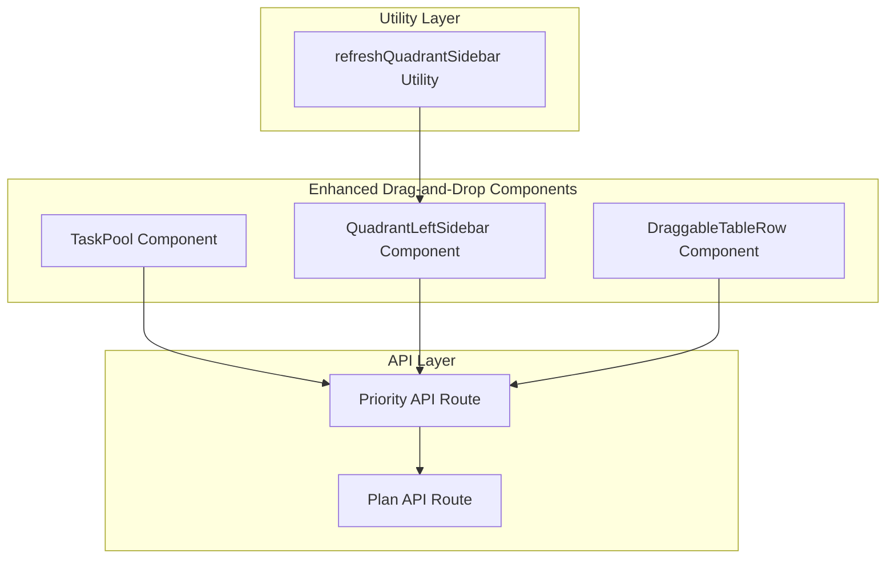
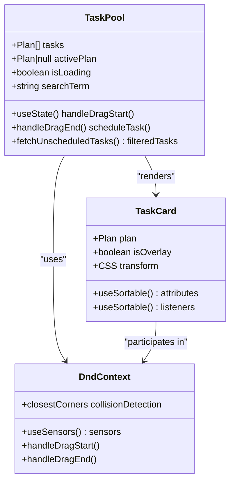
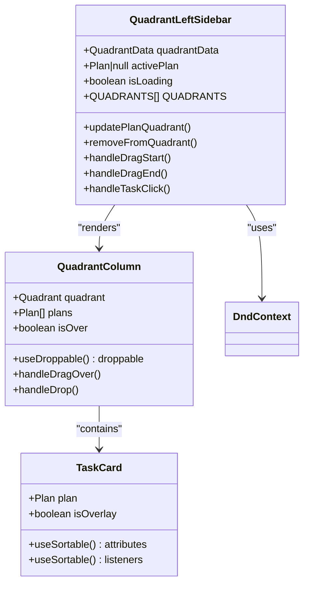
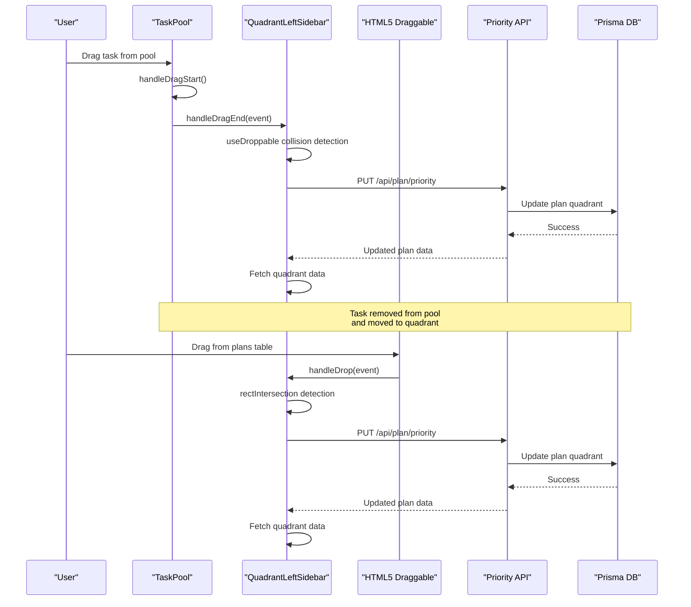
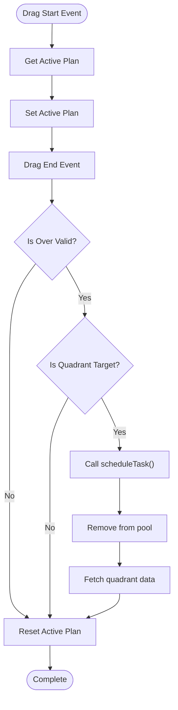
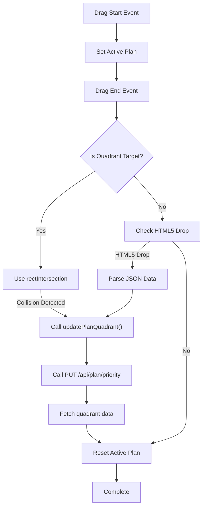
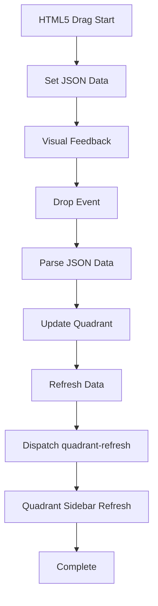
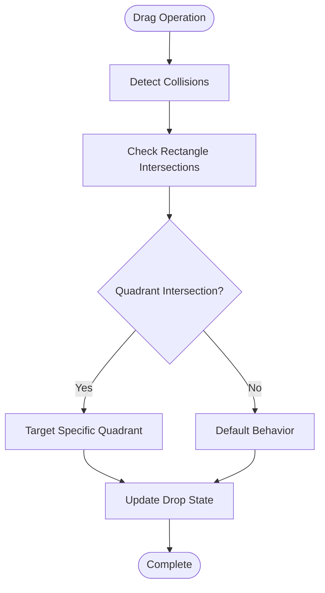
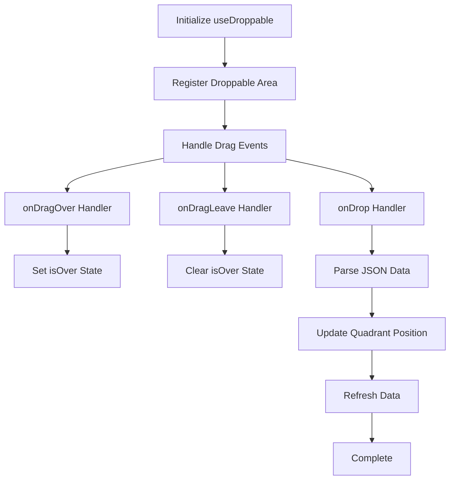

# Drag-and-Drop Functionality

<cite>
**Referenced Files in This Document**
- [task-pool.tsx](file://src/components/task-pool.tsx)
- [quadrant-left-sidebar.tsx](file://src/components/quadrant-left-sidebar.tsx)
- [plans/page.tsx](file://src/app/plans/page.tsx)
- [route.ts](file://src/app/api/plan/priority/route.ts)
- [route.ts](file://src/app/api/plan/route.ts)
- [utils.ts](file://src/lib/utils.ts)
- [package.json](file://package.json)
</cite>

## Update Summary
**Changes Made**
- Updated collision detection from `closestCorners` to `rectIntersection` for improved accuracy
- Added HTML5 native drag-and-drop support with `useDroppable` hook integration
- Enhanced drag-and-drop functionality with better collision detection algorithms
- Updated component analysis to reflect the new `useDroppable` hook usage
- Added documentation for the legacy HTML5 drag-and-drop implementation in plans page
- Improved integration between different drag-and-drop implementations

## Table of Contents
1. [Introduction](#introduction)
2. [Project Structure](#project-structure)
3. [Core Components](#core-components)
4. [Architecture Overview](#architecture-overview)
5. [Detailed Component Analysis](#detailed-component-analysis)
6. [Enhanced Collision Detection](#enhanced-collision-detection)
7. [HTML5 Native Drag-and-Drop Integration](#html5-native-drag-and-drop-integration)
8. [Dependency Analysis](#dependency-analysis)
9. [Performance Considerations](#performance-considerations)
10. [Troubleshooting Guide](#troubleshooting-guide)
11. [Conclusion](#conclusion)

## Introduction

Goal Mate implements a sophisticated drag-and-drop system for managing tasks across four priority quadrants using modern React hooks and the @dnd-kit library. The system provides intuitive task manipulation through both mouse and keyboard interactions, enabling users to efficiently organize their work priorities.

**Updated**: The drag-and-drop functionality has been significantly enhanced with improved collision detection algorithms, HTML5 native drag-and-drop support, and better integration between different drag-and-drop implementations.

The drag-and-drop system centers around two primary components: the Task Pool for unassigned tasks and the Priority Quadrant Sidebar for organizing scheduled tasks. Users can drag tasks from the pool into specific quadrants or rearrange tasks within quadrants using familiar drag-and-drop gestures.

## Project Structure

The drag-and-drop implementation has been streamlined to a single cohesive architecture with enhanced collision detection:



**Diagram sources**
- [task-pool.tsx:114-264](file://src/components/task-pool.tsx#L114-L264)
- [quadrant-left-sidebar.tsx:229-395](file://src/components/quadrant-left-sidebar.tsx#L229-L395)
- [utils.ts:8-16](file://src/lib/utils.ts#L8-L16)

**Section sources**
- [task-pool.tsx:1-264](file://src/components/task-pool.tsx#L1-L264)
- [quadrant-left-sidebar.tsx:1-558](file://src/components/quadrant-left-sidebar.tsx#L1-L558)

## Core Components

### Task Pool Component

The Task Pool serves as the central hub for unassigned tasks, providing a searchable list with enhanced drag-and-drop capabilities:



**Diagram sources**
- [task-pool.tsx:114-264](file://src/components/task-pool.tsx#L114-L264)
- [task-pool.tsx:43-112](file://src/components/task-pool.tsx#L43-L112)

### Enhanced Quadrant Sidebar Component

**Updated**: The quadrant management functionality has been enhanced with improved collision detection and HTML5 native drag-and-drop support:



**Diagram sources**
- [quadrant-left-sidebar.tsx:278-356](file://src/components/quadrant-left-sidebar.tsx#L278-L356)

**Section sources**
- [task-pool.tsx:114-264](file://src/components/task-pool.tsx#L114-L264)
- [quadrant-left-sidebar.tsx:278-356](file://src/components/quadrant-left-sidebar.tsx#L278-L356)

## Architecture Overview

**Updated**: The drag-and-drop system now integrates seamlessly with enhanced collision detection and HTML5 native drag-and-drop support:



**Diagram sources**
- [task-pool.tsx:149-192](file://src/components/task-pool.tsx#L149-L192)
- [quadrant-left-sidebar.tsx:402-415](file://src/components/quadrant-left-sidebar.tsx#L402-L415)
- [quadrant-left-sidebar.tsx:278-310](file://src/components/quadrant-left-sidebar.tsx#L278-L310)
- [route.ts:50-93](file://src/app/api/plan/priority/route.ts#L50-L93)

The system supports multiple interaction modes with enhanced collision detection:

1. **Mouse-based dragging** using @dnd-kit's PointerSensor with `rectIntersection` collision detection
2. **Keyboard navigation** using @dnd-kit's KeyboardSensor
3. **HTML5 drag-and-drop** for cross-component operations with `useDroppable` integration
4. **Touch-friendly gestures** for mobile devices

**Section sources**
- [task-pool.tsx:120-129](file://src/components/task-pool.tsx#L120-L129)
- [quadrant-left-sidebar.tsx:342-349](file://src/components/quadrant-left-sidebar.tsx#L342-L349)

## Detailed Component Analysis

### Task Pool Implementation

The Task Pool component provides a comprehensive solution for managing unassigned tasks with enhanced drag-and-drop capabilities:

#### Enhanced Drag-and-Drop Event Handling



**Diagram sources**
- [task-pool.tsx:149-192](file://src/components/task-pool.tsx#L149-L192)

#### Task Card Rendering

Each task card utilizes @dnd-kit's useSortable hook for smooth animations and proper positioning:

| Feature | Implementation | Purpose |
|---------|---------------|---------|
| **Drag Handle** | `useSortable()` hook | Enables drag functionality |
| **Visual Feedback** | CSS transforms | Smooth movement animations |
| **Hover Effects** | Tailwind classes | User interaction cues |
| **Accessibility** | Keyboard navigation | Screen reader support |

**Section sources**
- [task-pool.tsx:43-112](file://src/components/task-pool.tsx#L43-L112)
- [task-pool.tsx:149-192](file://src/components/task-pool.tsx#L149-L192)

### Enhanced Quadrant Sidebar Component

**Updated**: The quadrant management functionality has been enhanced with improved collision detection and HTML5 native drag-and-drop support:

#### Unified Quadrant Management with Enhanced Collision Detection

The QuadrantLeftSidebar component now handles both task scheduling and quadrant organization with improved accuracy:

- **Enhanced Collision Detection**: Uses `rectIntersection` for precise quadrant targeting
- **HTML5 Integration**: Supports native drag-and-drop from external components
- **Real-time Updates**: Automatic refresh every 30 seconds
- **Visual Indicators**: Color-coded quadrants with task counts
- **Removal Capability**: Individual task removal from quadrants
- **Collapsible Design**: Minimizable sidebar for screen space
- **Direct Navigation**: Click-to-progress routing
- **Loading States**: Optimistic UI updates

#### Enhanced Drag-and-Drop Event Flow



**Diagram sources**
- [quadrant-left-sidebar.tsx:396-415](file://src/components/quadrant-left-sidebar.tsx#L396-L415)
- [quadrant-left-sidebar.tsx:278-310](file://src/components/quadrant-left-sidebar.tsx#L278-L310)

**Section sources**
- [quadrant-left-sidebar.tsx:278-356](file://src/components/quadrant-left-sidebar.tsx#L278-L356)
- [quadrant-left-sidebar.tsx:396-415](file://src/components/quadrant-left-sidebar.tsx#L396-L415)

### Legacy HTML5 Drag-and-Drop Implementation

**Updated**: The plans page includes a legacy HTML5 drag-and-drop implementation for backward compatibility, now enhanced with better integration:



**Diagram sources**
- [plans/page.tsx:54-97](file://src/app/plans/page.tsx#L54-L97)
- [quadrant-left-sidebar.tsx:159-182](file://src/components/quadrant-left-sidebar.tsx#L159-L182)
- [utils.ts:8-16](file://src/lib/utils.ts#L8-L16)

**Section sources**
- [plans/page.tsx:54-97](file://src/app/plans/page.tsx#L54-L97)
- [quadrant-left-sidebar.tsx:159-182](file://src/components/quadrant-left-sidebar.tsx#L159-L182)
- [utils.ts:8-16](file://src/lib/utils.ts#L8-L16)

## Enhanced Collision Detection

**New Section**: The system now implements enhanced collision detection for more accurate drag-and-drop interactions:

### Collision Detection Algorithms

| Algorithm | Implementation | Purpose | Performance Impact |
|-----------|---------------|---------|-------------------|
| **closestCorners** | `@dnd-kit/core` | Basic corner-based detection | Low |
| **rectIntersection** | `@dnd-kit/core` | Rectangle intersection detection | Medium |
| **HTML5 Native** | `useDroppable` hook | External component integration | Low |

### Enhanced Quadrant Targeting

The `rectIntersection` algorithm provides more precise quadrant targeting:



**Diagram sources**
- [quadrant-left-sidebar.tsx:524-529](file://src/components/quadrant-left-sidebar.tsx#L524-L529)

**Section sources**
- [quadrant-left-sidebar.tsx:524-529](file://src/components/quadrant-left-sidebar.tsx#L524-L529)

## HTML5 Native Drag-and-Drop Integration

**New Section**: The system now supports HTML5 native drag-and-drop for enhanced cross-component compatibility:

### useDroppable Hook Implementation

The `useDroppable` hook provides seamless integration with HTML5 drag-and-drop:



**Diagram sources**
- [quadrant-left-sidebar.tsx:278-310](file://src/components/quadrant-left-sidebar.tsx#L278-L310)

### Cross-Component Drag-and-Drop

The system now supports drag-and-drop between different components:

1. **Task Pool to Quadrant Sidebar**: Mouse-based dragging with enhanced collision detection
2. **Plans Page to Quadrant Sidebar**: HTML5 native drag-and-drop with JSON data transfer
3. **Quadrant to Quadrant**: Internal sorting within the same quadrant

**Section sources**
- [quadrant-left-sidebar.tsx:278-310](file://src/components/quadrant-left-sidebar.tsx#L278-L310)
- [plans/page.tsx:54-97](file://src/app/plans/page.tsx#L54-L97)

## Dependency Analysis

The drag-and-drop system relies on several key dependencies with enhanced functionality:

```mermaid
graph LR
subgraph "Core Dependencies"
DNDKIT["@dnd-kit/core ^6.3.1"]
SORTABLE["@dnd-kit/sortable ^10.0.0"]
UTILITIES["@dnd-kit/utilities ^3.2.2"]
END
subgraph "React Integration"
REACT["React 19"]
NEXT["Next.js 15"]
TYPESCRIPT["TypeScript"]
END
subgraph "UI Framework"
TAILWIND["Tailwind CSS"]
RADIX["Radix UI"]
SHADCN["shadcn/ui"]
END
subgraph "State Management"
REACTHOOKS["React Hooks"]
CONTEXT["React Context"]
END
DNDKIT --> SORTABLE
SORTABLE --> UTILITIES
DNDKIT --> REACTHOOKS
SORTABLE --> REACTHOOKS
UTILITIES --> REACTHOOKS
```

**Diagram sources**
- [package.json:20-22](file://package.json#L20-L22)
- [package.json:39-42](file://package.json#L39-L42)

### External Dependencies

| Package | Version | Purpose |
|---------|---------|---------|
| **@dnd-kit/core** | ^6.3.1 | Core drag-and-drop functionality with enhanced collision detection |
| **@dnd-kit/sortable** | ^10.0.0 | Sortable list implementation with improved algorithms |
| **@dnd-kit/utilities** | ^3.2.2 | Utility functions for drag-and-drop operations |
| **@prisma/client** | ^6.9.0 | Database client for task persistence |
| **lucide-react** | ^0.511.0 | Icon library for UI elements |

**Section sources**
- [package.json:16-43](file://package.json#L16-L43)

## Performance Considerations

### Optimization Strategies

1. **Enhanced State Updates**: Minimal re-renders through targeted state updates with improved collision detection
2. **Advanced Collision Detection**: Optimized using `rectIntersection` for better performance and accuracy
3. **Lazy Loading**: API data fetched only when components mount
4. **Debounced Updates**: Real-time updates with controlled refresh intervals
5. **Single Source of Truth**: Consolidated quadrant management reduces complexity
6. **HTML5 Integration**: Native drag-and-drop reduces JavaScript overhead

### Memory Management

- **Cleanup Functions**: Proper cleanup of event listeners and intervals
- **Conditional Rendering**: Components only render when data is available
- **Optimized Queries**: Database queries limited to necessary fields
- **Event Delegation**: Efficient event handling for drag-and-drop operations

### Accessibility Features

- **Keyboard Navigation**: Full keyboard support for drag-and-drop operations
- **Screen Reader Support**: Proper ARIA labels and roles
- **Focus Management**: Logical tab order and focus traps
- **Enhanced Visual Feedback**: Clear indicators for drag-and-drop operations

## Troubleshooting Guide

### Common Issues and Solutions

#### Drag Operation Not Working

**Symptoms**: Tasks don't move when dragged
**Causes**:
- Missing `useSensors` configuration
- Incorrect event handler implementation
- API endpoint errors
- Collision detection issues

**Solutions**:
1. Verify sensor configuration in component initialization
2. Check console for API error messages
3. Ensure proper event handler binding
4. Verify collision detection algorithm compatibility

#### Visual Feedback Missing

**Symptoms**: No visual indication during drag operations
**Causes**:
- CSS transform not applied
- Missing overlay component
- Incorrect state management
- Enhanced collision detection not triggering

**Solutions**:
1. Verify `useSortable` hook implementation
2. Check `DragOverlay` component configuration
3. Ensure proper state updates in drag handlers
4. Verify collision detection state updates

#### Data Synchronization Issues

**Symptoms**: UI shows outdated data after drag operations
**Causes**:
- API call failures
- Missing data refresh
- Race conditions in state updates
- HTML5 drag-and-drop integration issues

**Solutions**:
1. Implement proper error handling for API calls
2. Add data refresh after successful operations
3. Use optimistic updates with rollback on failure
4. Verify HTML5 drag-and-drop data parsing

#### Collision Detection Problems

**Symptoms**: Tasks don't snap to correct quadrants
**Causes**:
- Incorrect collision detection algorithm
- HTML5 drag-and-drop conflicts
- Component positioning issues

**Solutions**:
1. Verify `rectIntersection` collision detection implementation
2. Check HTML5 drag-and-drop event handling
3. Ensure proper component positioning and sizing
4. Test collision detection with different screen sizes

**Section sources**
- [task-pool.tsx:172-192](file://src/components/task-pool.tsx#L172-L192)
- [quadrant-left-sidebar.tsx:421-441](file://src/components/quadrant-left-sidebar.tsx#L421-L441)

## Conclusion

The Goal Mate drag-and-drop system demonstrates a comprehensive implementation of modern React state management combined with sophisticated UI interactions. The system successfully balances functionality with performance, providing users with intuitive task management capabilities.

**Updated**: Key strengths of the enhanced implementation include:

- **Enhanced Collision Detection**: Improved `rectIntersection` algorithm for more accurate quadrant targeting
- **HTML5 Native Integration**: Seamless cross-component drag-and-drop with `useDroppable` hook
- **Unified Architecture**: Single component handles both task scheduling and quadrant management
- **Multiple Interaction Modes**: Support for mouse, keyboard, and touch interactions
- **Real-time Updates**: Seamless synchronization between UI and backend data
- **Accessibility Compliance**: Comprehensive support for assistive technologies
- **Performance Optimization**: Efficient rendering and minimal re-renders
- **Legacy Compatibility**: Maintains backward compatibility with existing implementations
- **Cross-Component Support**: HTML5 drag-and-drop enables integration with external components

The system's extensibility allows for future enhancements such as multi-quadrant drag operations, batch task management, and enhanced visual feedback systems. The robust error handling and state management provide a solid foundation for continued development and feature expansion.