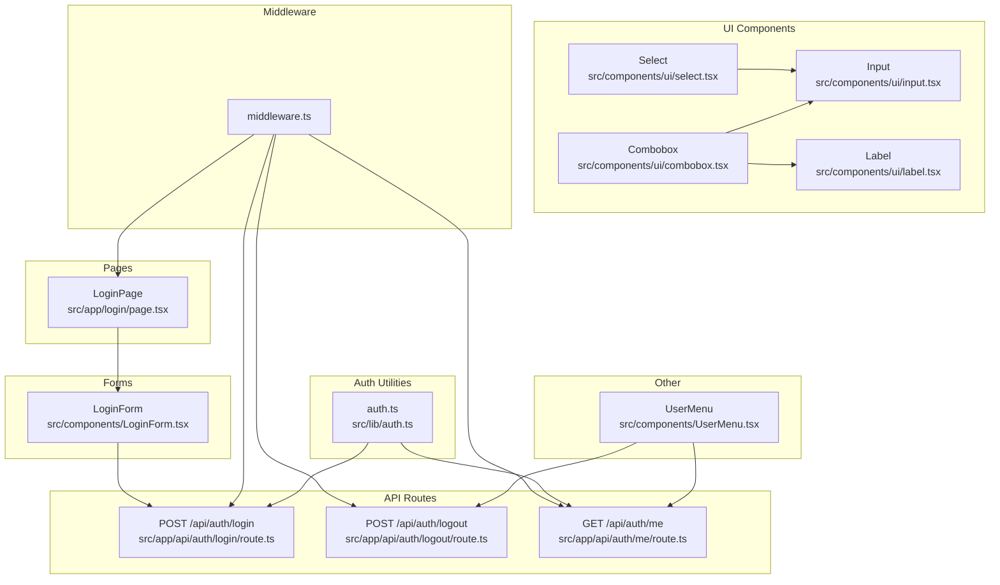
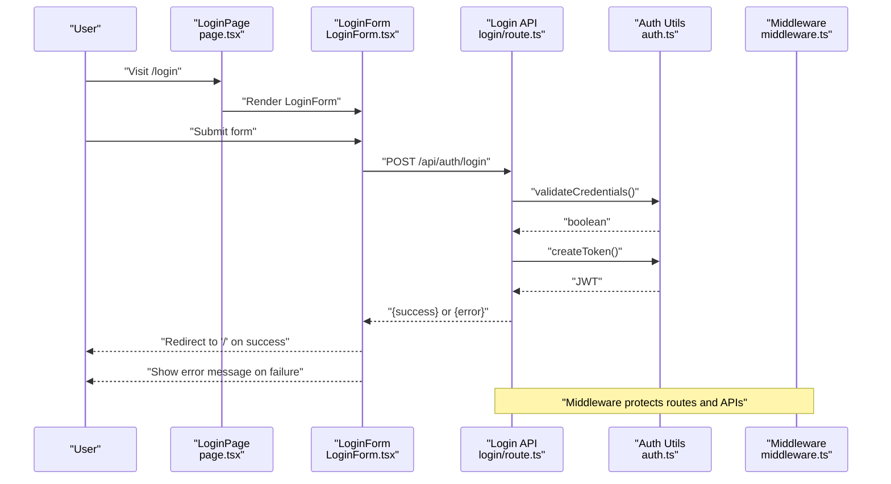
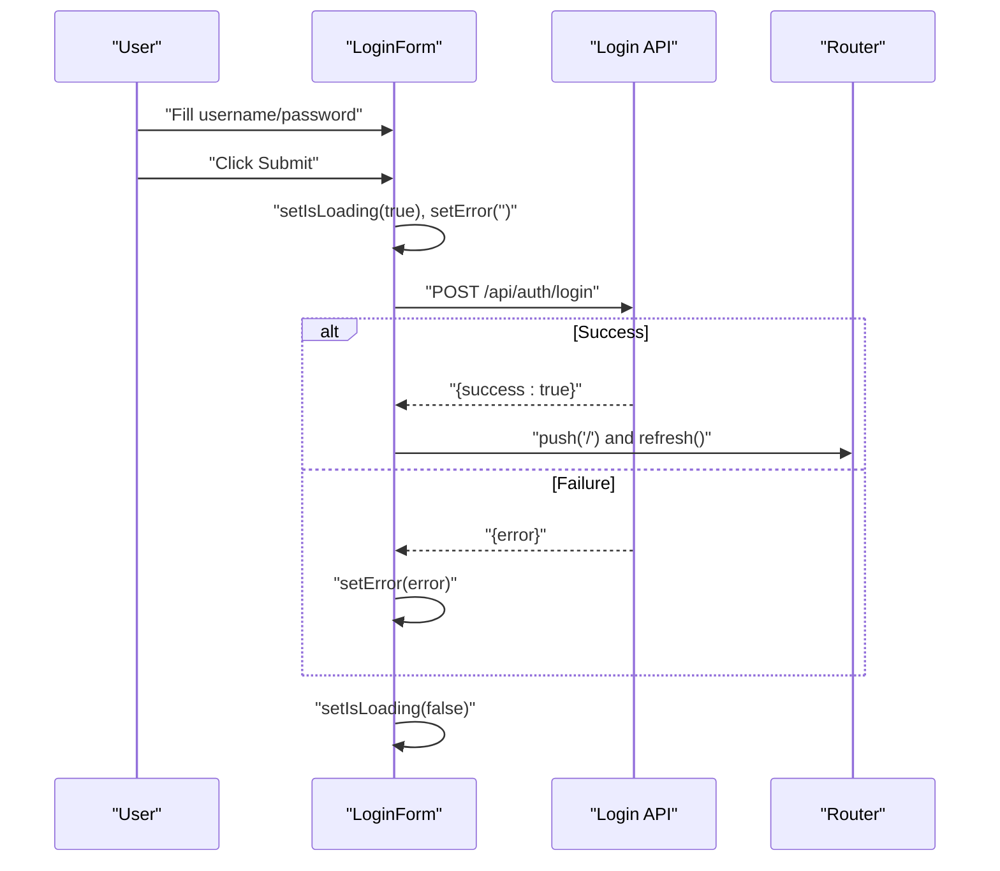
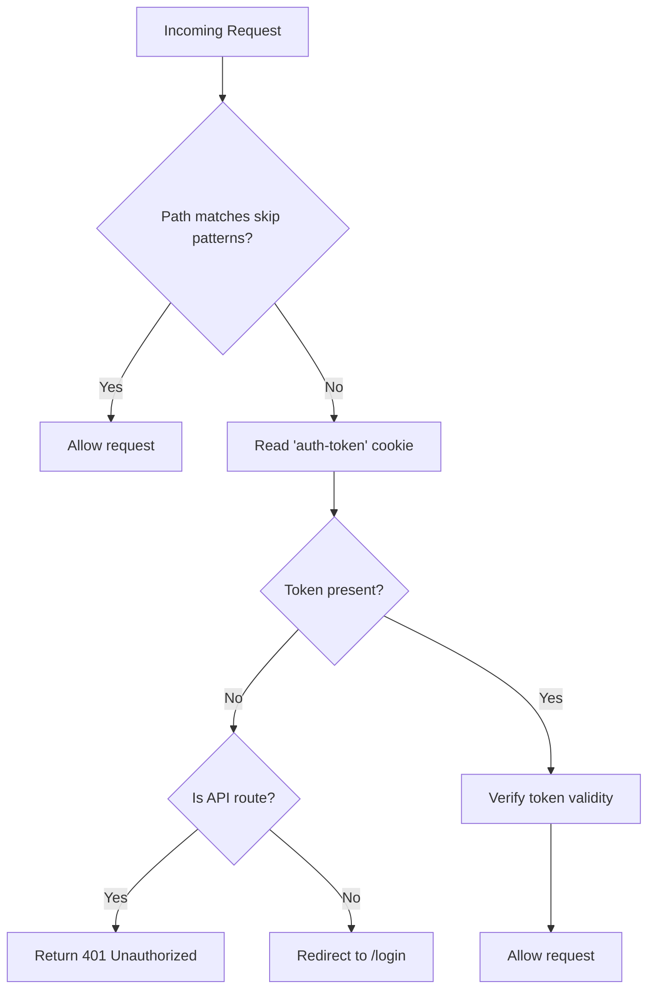
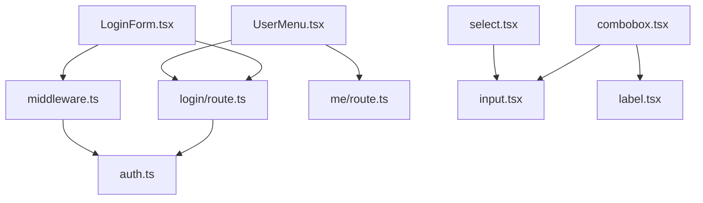

# Form Components

<cite>
**Referenced Files in This Document**
- [combobox.tsx](file://src/components/ui/combobox.tsx)
- [LoginForm.tsx](file://src/components/LoginForm.tsx)
- [login/page.tsx](file://src/app/login/page.tsx)
- [login/route.ts](file://src/app/api/auth/login/route.ts)
- [logout/route.ts](file://src/app/api/auth/logout/route.ts)
- [me/route.ts](file://src/app/api/auth/me/route.ts)
- [auth.ts](file://src/lib/auth.ts)
- [middleware.ts](file://middleware.ts)
- [UserMenu.tsx](file://src/components/UserMenu.tsx)
- [input.tsx](file://src/components/ui/input.tsx)
- [label.tsx](file://src/components/ui/label.tsx)
- [select.tsx](file://src/components/ui/select.tsx)
- [plans/page.tsx](file://src/app/plans/page.tsx)
- [AUTHENTICATION.md](file://AUTHENTICATION.md)
</cite>

## Table of Contents
1. [Introduction](#introduction)
2. [Project Structure](#project-structure)
3. [Core Components](#core-components)
4. [Architecture Overview](#architecture-overview)
5. [Detailed Component Analysis](#detailed-component-analysis)
6. [Dependency Analysis](#dependency-analysis)
7. [Performance Considerations](#performance-considerations)
8. [Troubleshooting Guide](#troubleshooting-guide)
9. [Conclusion](#conclusion)
10. [Appendices](#appendices)

## Introduction
This document provides comprehensive documentation for form-related components and patterns in the project, focusing on:
- Combobox component: search functionality, selection handling, keyboard navigation, and accessibility.
- LoginForm component: authentication flow, form validation, error handling, and user feedback.
- Authentication system integration: server-side routes, middleware protection, and session management via cookies.
- Best practices for form accessibility, validation error display, submission handling, and composition patterns.

## Project Structure
The form-related components and authentication system are organized as follows:
- UI primitives: input, label, select, combobox.
- Application pages: login page and protected routes.
- Authentication utilities: token creation, validation, and user retrieval.
- Middleware: global protection for non-public routes.
- API routes: login, logout, and current user endpoints.
- UserMenu: authenticated user menu with logout integration.

**Diagram sources**
- [combobox.tsx:1-75](file://src/components/ui/combobox.tsx#L1-L75)
- [LoginForm.tsx:1-98](file://src/components/LoginForm.tsx#L1-L98)
- [login/page.tsx:1-12](file://src/app/login/page.tsx#L1-L12)
- [login/route.ts:1-50](file://src/app/api/auth/login/route.ts#L1-L50)
- [logout/route.ts:1-23](file://src/app/api/auth/logout/route.ts#L1-L23)
- [me/route.ts:1-27](file://src/app/api/auth/me/route.ts#L1-L27)
- [auth.ts:1-69](file://src/lib/auth.ts#L1-L69)
- [middleware.ts:1-40](file://middleware.ts#L1-L40)
- [UserMenu.tsx:1-104](file://src/components/UserMenu.tsx#L1-L104)
- [input.tsx:1-22](file://src/components/ui/input.tsx#L1-L22)
- [label.tsx:1-25](file://src/components/ui/label.tsx#L1-L25)
- [select.tsx:1-186](file://src/components/ui/select.tsx#L1-L186)

**Section sources**
- [AUTHENTICATION.md:68-85](file://AUTHENTICATION.md#L68-L85)

## Core Components
This section documents the primary form components and their roles.

- Combobox
  - Purpose: searchable dropdown with dynamic filtering and selection.
  - Key behaviors: open/close toggle, input-driven filtering, Enter to confirm new option, click to select existing option.
  - Accessibility: button with explicit tabindex, input autoFocus when opened, keyboard navigation support.
  - Props: options array, value, onChange callback, placeholder, className.

- LoginForm
  - Purpose: handles username/password submission, loading states, and error messaging.
  - Validation: client-side required fields; server-side validation and credential checks.
  - Feedback: displays error messages and disables submit during loading.
  - Navigation: redirects on successful login.

- Authentication Utilities
  - Token creation and verification.
  - Credential validation against environment variables.
  - Current user retrieval and authentication check.

- Middleware Protection
  - Redirects unauthenticated users to the login page.
  - Returns 401 for unauthorized API requests.

- API Endpoints
  - POST /api/auth/login: validates credentials, creates JWT, sets HttpOnly cookie.
  - POST /api/auth/logout: deletes auth cookie.
  - GET /api/auth/me: returns current user if authenticated.

**Section sources**
- [combobox.tsx:6-12](file://src/components/ui/combobox.tsx#L6-L12)
- [LoginForm.tsx:6-40](file://src/components/LoginForm.tsx#L6-L40)
- [auth.ts:14-46](file://src/lib/auth.ts#L14-L46)
- [middleware.ts:3-35](file://middleware.ts#L3-L35)
- [login/route.ts:5-41](file://src/app/api/auth/login/route.ts#L5-L41)
- [logout/route.ts:4-14](file://src/app/api/auth/logout/route.ts#L4-L14)
- [me/route.ts:4-18](file://src/app/api/auth/me/route.ts#L4-L18)

## Architecture Overview
The authentication and form flow integrates UI components, pages, middleware, and API routes.

**Diagram sources**
- [login/page.tsx:5-11](file://src/app/login/page.tsx#L5-L11)
- [LoginForm.tsx:13-40](file://src/components/LoginForm.tsx#L13-L40)
- [login/route.ts:5-41](file://src/app/api/auth/login/route.ts#L5-L41)
- [auth.ts:36-46](file://src/lib/auth.ts#L36-L46)
- [middleware.ts:3-35](file://middleware.ts#L3-L35)

## Detailed Component Analysis

### Combobox Component
The Combobox implements a controlled dropdown with search and selection capabilities.

Key behaviors:
- State management: open/closed state, input filter, memoized filtered options.
- Filtering: case-insensitive substring match on options.
- Interaction:
  - Toggle open/close on button click.
  - Input updates filter; Enter key confirms free-text input if not present in options.
  - Clicking an item selects it and closes the dropdown.
  - Clicking outside closes the dropdown.
- Accessibility:
  - Button has explicit tabindex for keyboard focus.
  - Input is auto-focused when opened.
  - Clear input when closing if not open.

**Diagram sources**
- [combobox.tsx:14-74](file://src/components/ui/combobox.tsx#L14-L74)

Implementation highlights:
- Props and state: [ComboboxProps:6-12](file://src/components/ui/combobox.tsx#L6-L12), [useState hooks:15-16](file://src/components/ui/combobox.tsx#L15-L16).
- Filtering and memoization: [filtered computation:17-20](file://src/components/ui/combobox.tsx#L17-L20).
- Keyboard handling: [onKeyDown Enter:43-50](file://src/components/ui/combobox.tsx#L43-L50).
- Selection and close: [onChange handlers:63-64](file://src/components/ui/combobox.tsx#L63-L64).

Usage examples:
- Controlled value binding and change callback.
- Placeholder and custom className for styling.
- Integration with forms requiring searchable selections.

Accessibility guidelines:
- Ensure the trigger button is focusable and labeled appropriately.
- Keep dropdown content within viewport and scrollable.
- Announce selected state and available actions to assistive technologies.

**Section sources**
- [combobox.tsx:14-74](file://src/components/ui/combobox.tsx#L14-L74)

### LoginForm Component
The LoginForm manages authentication state and communicates with the backend.

Processing logic:
- Form state: username, password, isLoading, error.
- Submission:
  - Prevent default form submission.
  - Set loading state and clear previous errors.
  - POST to /api/auth/login with JSON body.
  - On success: navigate to home and refresh.
  - On failure: show error message.
  - Always reset loading state in finally.

**Diagram sources**
- [LoginForm.tsx:13-40](file://src/components/LoginForm.tsx#L13-L40)
- [login/route.ts:5-41](file://src/app/api/auth/login/route.ts#L5-L41)

Validation and error handling:
- Client-side: required fields enforced by HTML attributes.
- Server-side: validation and credential checks; returns structured errors.
- Client-side: catch network errors and display user-friendly messages.

User feedback:
- Loading state disables submit button and shows "loading" text.
- Error block renders server-provided messages.

Integration with authentication system:
- Uses environment variables for credentials and JWT secret.
- Relies on middleware to protect routes after login.

**Section sources**
- [LoginForm.tsx:6-40](file://src/components/LoginForm.tsx#L6-L40)
- [login/page.tsx:5-11](file://src/app/login/page.tsx#L5-L11)
- [login/route.ts:9-22](file://src/app/api/auth/login/route.ts#L9-L22)
- [auth.ts:36-46](file://src/lib/auth.ts#L36-L46)

### Authentication Utilities and Middleware
Authentication utilities:
- Token creation and verification using JWT with environment-secret.
- Credential validation against configured environment variables.
- Retrieval of current user from cookie and verification.

Middleware protection:
- Skips static assets and login/me/logout routes.
- Checks for presence of auth-token cookie.
- Redirects to /login for non-API requests if missing.
- Returns 401 for API requests without token.

**Diagram sources**
- [middleware.ts:3-35](file://middleware.ts#L3-L35)
- [auth.ts:19-33](file://src/lib/auth.ts#L19-L33)

**Section sources**
- [auth.ts:14-69](file://src/lib/auth.ts#L14-L69)
- [middleware.ts:3-35](file://middleware.ts#L3-L35)

### API Endpoints
- POST /api/auth/login
  - Validates presence of username/password.
  - Verifies credentials and creates JWT.
  - Sets HttpOnly cookie with security flags.
  - Returns success with user info or error with appropriate status.

- POST /api/auth/logout
  - Deletes auth cookie and returns success.

- GET /api/auth/me
  - Returns current user if authenticated; otherwise 401.

**Section sources**
- [login/route.ts:5-41](file://src/app/api/auth/login/route.ts#L5-L41)
- [logout/route.ts:4-14](file://src/app/api/auth/logout/route.ts#L4-L14)
- [me/route.ts:4-18](file://src/app/api/auth/me/route.ts#L4-L18)

### UserMenu Component
The UserMenu displays the current user and provides logout functionality.

Behavior:
- Fetches current user via GET /api/auth/me on mount.
- Toggles dropdown visibility and handles clicks outside to close.
- Calls POST /api/auth/logout and navigates to /login on success.

**Section sources**
- [UserMenu.tsx:10-61](file://src/components/UserMenu.tsx#L10-L61)
- [me/route.ts:4-18](file://src/app/api/auth/me/route.ts#L4-L18)
- [logout/route.ts:4-14](file://src/app/api/auth/logout/route.ts#L4-L14)

## Dependency Analysis
Form components and authentication dependencies:

**Diagram sources**
- [LoginForm.tsx:1-98](file://src/components/LoginForm.tsx#L1-L98)
- [login/route.ts:1-50](file://src/app/api/auth/login/route.ts#L1-L50)
- [auth.ts:1-69](file://src/lib/auth.ts#L1-L69)
- [middleware.ts:1-40](file://middleware.ts#L1-L40)
- [UserMenu.tsx:1-104](file://src/components/UserMenu.tsx#L1-L104)
- [me/route.ts:1-27](file://src/app/api/auth/me/route.ts#L1-L27)
- [combobox.tsx:1-75](file://src/components/ui/combobox.tsx#L1-L75)
- [input.tsx:1-22](file://src/components/ui/input.tsx#L1-L22)
- [label.tsx:1-25](file://src/components/ui/label.tsx#L1-L25)
- [select.tsx:1-186](file://src/components/ui/select.tsx#L1-L186)

**Section sources**
- [LoginForm.tsx:13-40](file://src/components/LoginForm.tsx#L13-L40)
- [login/route.ts:5-41](file://src/app/api/auth/login/route.ts#L5-L41)
- [auth.ts:14-46](file://src/lib/auth.ts#L14-L46)
- [middleware.ts:3-35](file://middleware.ts#L3-L35)
- [UserMenu.tsx:36-61](file://src/components/UserMenu.tsx#L36-L61)
- [me/route.ts:4-18](file://src/app/api/auth/me/route.ts#L4-L18)
- [combobox.tsx:14-74](file://src/components/ui/combobox.tsx#L14-L74)
- [input.tsx:5-19](file://src/components/ui/input.tsx#L5-L19)
- [label.tsx:8-21](file://src/components/ui/label.tsx#L8-L21)
- [select.tsx:9-13](file://src/components/ui/select.tsx#L9-L13)

## Performance Considerations
- Combobox
  - Memoized filtering reduces re-computation on input changes.
  - Consider debouncing input for very large option lists.
  - Limit visible items with virtualization for long lists.

- LoginForm
  - Avoid unnecessary re-renders by keeping state minimal.
  - Debounce submissions to prevent duplicate requests.

- Middleware
  - Keep token verification lightweight; consider caching verified users per request if scaling.

[No sources needed since this section provides general guidance]

## Troubleshooting Guide
Common issues and resolutions:
- Login fails with invalid credentials
  - Verify environment variables for username/password and JWT secret.
  - Check server logs for detailed error messages.

- Session not persisting
  - Ensure HttpOnly cookie is set and secure flags match deployment environment.
  - Confirm middleware is configured to protect routes.

- Uncaught exceptions during submission
  - LoginForm catches network errors and displays a generic message; inspect browser console for specifics.

- Dropdown not closing or keyboard navigation issues
  - Ensure the open state is toggled correctly and input is auto-focused when opened.

**Section sources**
- [login/route.ts:43-49](file://src/app/api/auth/login/route.ts#L43-L49)
- [LoginForm.tsx:35-38](file://src/components/LoginForm.tsx#L35-L38)
- [middleware.ts:22-30](file://middleware.ts#L22-L30)
- [AUTHENTICATION.md:179-192](file://AUTHENTICATION.md#L179-L192)

## Conclusion
The form components and authentication system demonstrate a cohesive pattern:
- Combobox provides accessible, searchable selection with robust keyboard and mouse interactions.
- LoginForm encapsulates submission, validation, and feedback with clear separation of concerns.
- Authentication utilities and middleware enforce security and session management.
- API endpoints standardize authentication flows and user state retrieval.

These patterns enable scalable form composition, reliable validation, and seamless integration with application state management.

[No sources needed since this section summarizes without analyzing specific files]

## Appendices

### Accessibility Guidelines for Forms
- Labels and inputs
  - Associate labels with inputs using htmlFor/id.
  - Use semantic label components for consistent styling and behavior.
  - Example reference: [Label component:8-21](file://src/components/ui/label.tsx#L8-L21), [Input component:5-19](file://src/components/ui/input.tsx#L5-L19).

- Error presentation
  - Display inline error messages near affected fields.
  - Ensure error messages are announced by screen readers.
  - Example reference: [LoginForm error rendering:81-85](file://src/components/LoginForm.tsx#L81-L85).

- Keyboard navigation
  - Ensure all interactive elements are focusable and operable via keyboard.
  - Example reference: [Combobox button tabindex](file://src/components/ui/combobox.tsx#L30).

- ARIA attributes
  - Use aria-invalid for invalid inputs.
  - Example reference: [Input component ARIA integration](file://src/components/ui/input.tsx#L13).

### Validation Patterns
- Client-side validation
  - Use required attributes and controlled components to manage state.
  - Example reference: [LoginForm controlled fields:7-11](file://src/components/LoginForm.tsx#L7-L11).

- Server-side validation
  - Return structured errors with appropriate HTTP status codes.
  - Example reference: [Login API validation:9-22](file://src/app/api/auth/login/route.ts#L9-L22).

### Submission Handling
- Disable submit during loading to prevent duplicate submissions.
- Example reference: [LoginForm submit disabled state:89-93](file://src/components/LoginForm.tsx#L89-L93).

### Composition Patterns
- Combining inputs and labels
  - Use Label and Input together for consistent spacing and focus styles.
  - Example reference: [LoginForm field structure:50-79](file://src/components/LoginForm.tsx#L50-L79).

- Searchable selections
  - Use Combobox for dynamic filtering and selection.
  - Example reference: [Combobox component:14-74](file://src/components/ui/combobox.tsx#L14-L74).

- Multi-select patterns
  - Use Select for single-choice dropdowns.
  - Example reference: [Select component:9-13](file://src/components/ui/select.tsx#L9-L13).

- Checkbox-based tagging
  - Combine checkboxes with controlled state for tag management.
  - Example reference: [Plans page tag controls:472-494](file://src/app/plans/page.tsx#L472-L494).