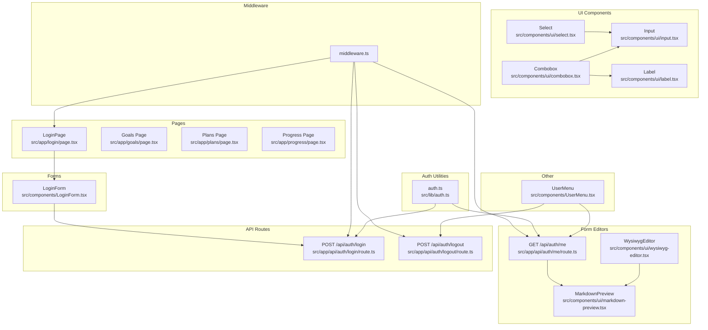
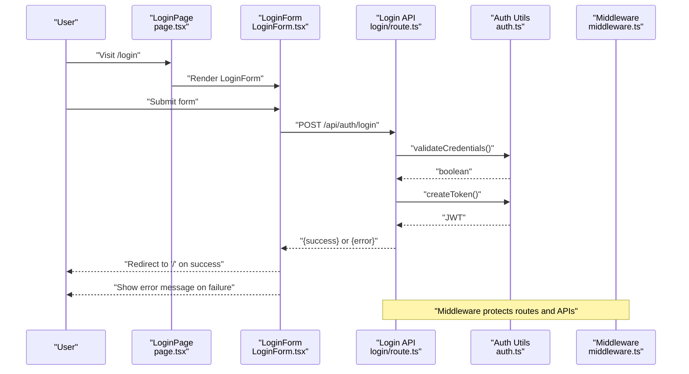
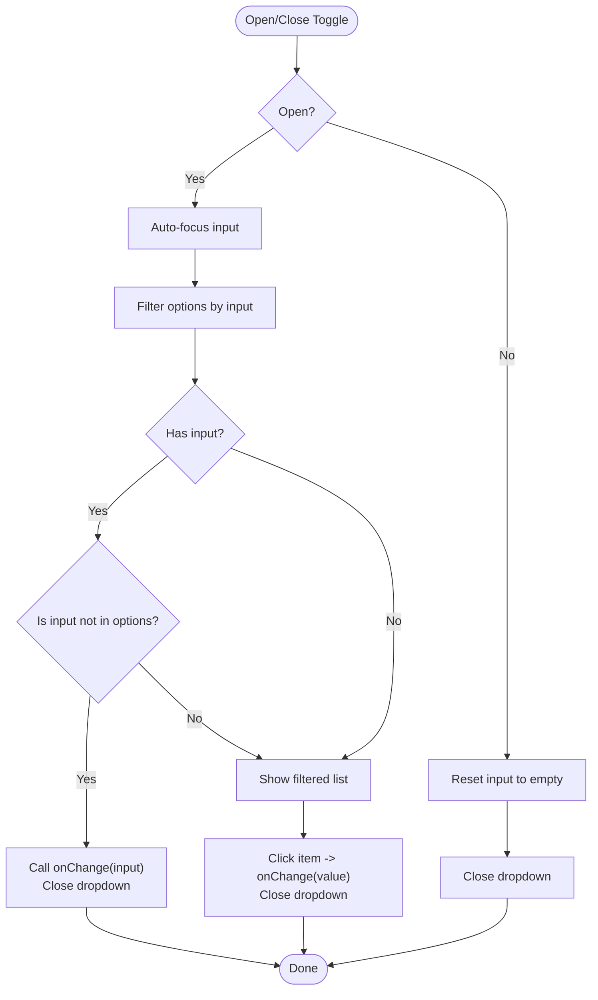
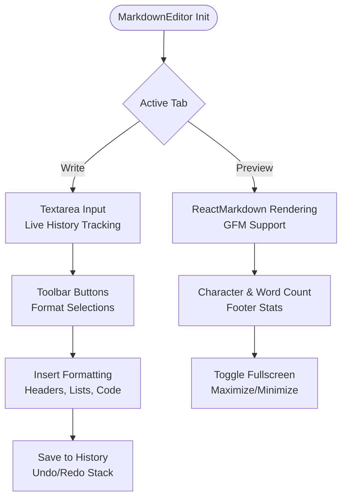
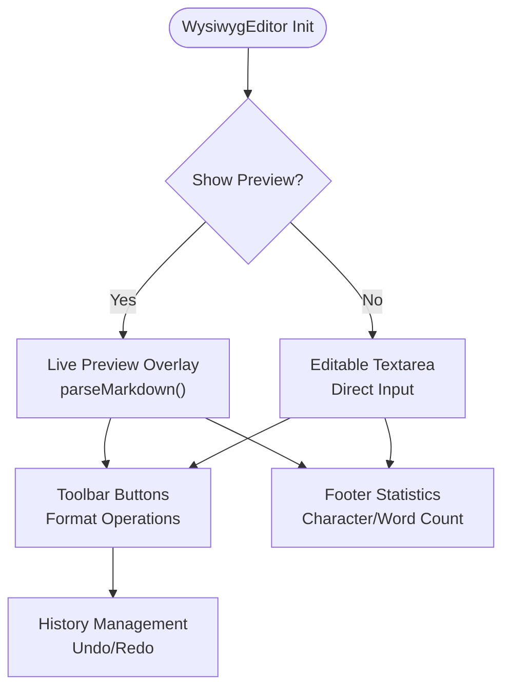
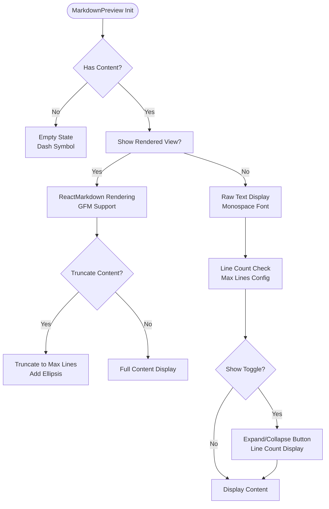
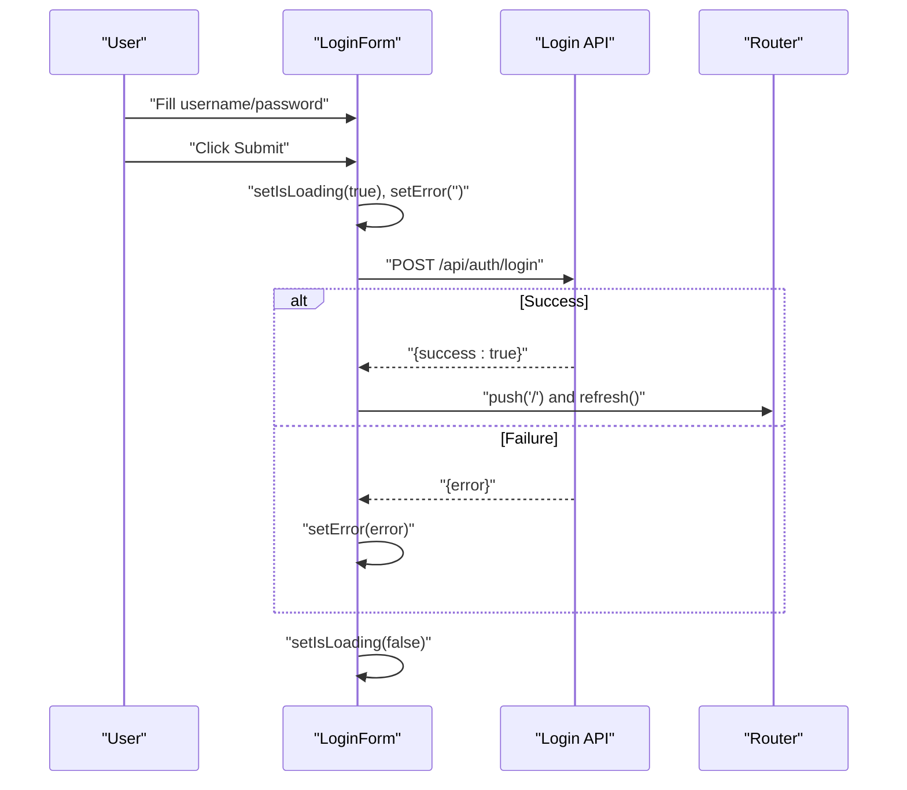
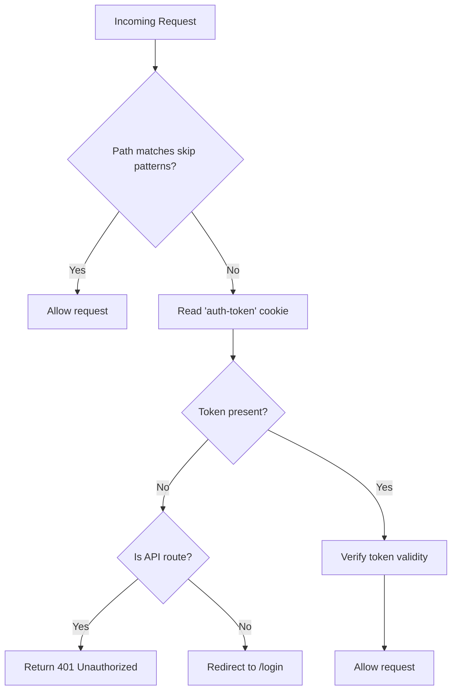
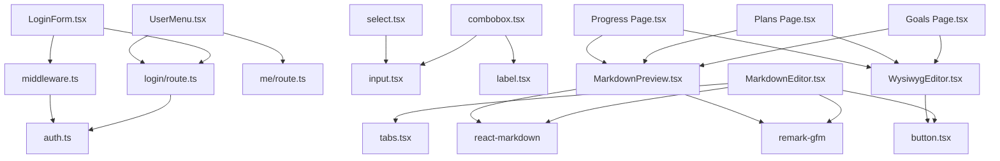

# Form Components

<cite>
**Referenced Files in This Document**
- [combobox.tsx](file://src/components/ui/combobox.tsx)
- [LoginForm.tsx](file://src/components/LoginForm.tsx)
- [login/page.tsx](file://src/app/login/page.tsx)
- [login/route.ts](file://src/app/api/auth/login/route.ts)
- [logout/route.ts](file://src/app/api/auth/logout/route.ts)
- [me/route.ts](file://src/app/api/auth/me/route.ts)
- [auth.ts](file://src/lib/auth.ts)
- [middleware.ts](file://middleware.ts)
- [UserMenu.tsx](file://src/components/UserMenu.tsx)
- [input.tsx](file://src/components/ui/input.tsx)
- [label.tsx](file://src/components/ui/label.tsx)
- [select.tsx](file://src/components/ui/select.tsx)
- [plans/page.tsx](file://src/app/plans/page.tsx)
- [goals/page.tsx](file://src/app/goals/page.tsx)
- [progress/page.tsx](file://src/app/progress/page.tsx)
- [markdown-editor.tsx](file://src/components/ui/markdown-editor.tsx)
- [markdown-preview.tsx](file://src/components/ui/markdown-preview.tsx)
- [wysiwyg-editor.tsx](file://src/components/ui/wysiwyg-editor.tsx)
- [AUTHENTICATION.md](file://AUTHENTICATION.md)
</cite>

## Update Summary
**Changes Made**
- Added comprehensive documentation for the new MarkdownEditor component
- Updated form components section to include MarkdownEditor alongside existing WYSIWYG editor
- Enhanced form composition patterns to include markdown editing capabilities
- Added usage examples for markdown editing in goals, plans, and progress pages
- Updated architecture diagrams to reflect the integration of markdown editing components
- Expanded accessibility guidelines to cover markdown editor components

## Table of Contents
1. [Introduction](#introduction)
2. [Project Structure](#project-structure)
3. [Core Components](#core-components)
4. [Architecture Overview](#architecture-overview)
5. [Detailed Component Analysis](#detailed-component-analysis)
6. [Dependency Analysis](#dependency-analysis)
7. [Performance Considerations](#performance-considerations)
8. [Troubleshooting Guide](#troubleshooting-guide)
9. [Conclusion](#conclusion)
10. [Appendices](#appendices)

## Introduction
This document provides comprehensive documentation for form-related components and patterns in the project, focusing on:
- Combobox component: search functionality, selection handling, keyboard navigation, and accessibility.
- LoginForm component: authentication flow, form validation, error handling, and user feedback.
- **NEW**: MarkdownEditor component: rich markdown editing with live preview, tabbed interface, and advanced formatting capabilities.
- **Enhanced**: Form composition patterns now include markdown editing for goals, plans, and progress tracking.
- Authentication system integration: server-side routes, middleware protection, and session management via cookies.
- Best practices for form accessibility, validation error display, submission handling, and composition patterns.

## Project Structure
The form-related components and authentication system are organized as follows:
- UI primitives: input, label, select, combobox.
- **NEW**: Markdown editing components: MarkdownEditor, MarkdownPreview, WysiwygEditor.
- Application pages: login page and protected routes with enhanced form capabilities.
- Authentication utilities: token creation, validation, and user retrieval.
- Middleware: global protection for non-public routes.
- API routes: login, logout, and current user endpoints.
- UserMenu: authenticated user menu with logout integration.

**Diagram sources**
- [combobox.tsx:1-75](file://src/components/ui/combobox.tsx#L1-L75)
- [LoginForm.tsx:1-98](file://src/components/LoginForm.tsx#L1-L98)
- [markdown-editor.tsx:1-356](file://src/components/ui/markdown-editor.tsx#L1-L356)
- [markdown-preview.tsx:1-99](file://src/components/ui/markdown-preview.tsx#L1-L99)
- [wysiwyg-editor.tsx:1-382](file://src/components/ui/wysiwyg-editor.tsx#L1-L382)
- [login/page.tsx:1-12](file://src/app/login/page.tsx#L1-L12)
- [goals/page.tsx:1-312](file://src/app/goals/page.tsx#L1-L312)
- [plans/page.tsx:1-869](file://src/app/plans/page.tsx#L1-L869)
- [progress/page.tsx:1-567](file://src/app/progress/page.tsx#L1-L567)
- [login/route.ts:1-50](file://src/app/api/auth/login/route.ts#L1-L50)
- [logout/route.ts:1-23](file://src/app/api/auth/logout/route.ts#L1-L23)
- [me/route.ts:1-27](file://src/app/api/auth/me/route.ts#L1-L27)
- [auth.ts:1-69](file://src/lib/auth.ts#L1-L69)
- [middleware.ts:1-40](file://middleware.ts#L1-L40)
- [UserMenu.tsx:1-104](file://src/components/UserMenu.tsx#L1-L104)
- [input.tsx:1-22](file://src/components/ui/input.tsx#L1-L22)
- [label.tsx:1-25](file://src/components/ui/label.tsx#L1-L25)
- [select.tsx:1-186](file://src/components/ui/select.tsx#L1-L186)

**Section sources**
- [AUTHENTICATION.md:68-85](file://AUTHENTICATION.md#L68-L85)

## Core Components
This section documents the primary form components and their roles.

- Combobox
  - Purpose: searchable dropdown with dynamic filtering and selection.
  - Key behaviors: open/close toggle, input-driven filtering, Enter to confirm new option, click to select existing option.
  - Accessibility: button with explicit tabindex, input autoFocus when opened, keyboard navigation support.
  - Props: options array, value, onChange callback, placeholder, className.

- **NEW**: MarkdownEditor
  - Purpose: rich markdown editing with live preview, tabbed interface, and advanced formatting capabilities.
  - Key behaviors: dual-mode editing (write/preview), toolbar with formatting buttons, undo/redo functionality, fullscreen mode.
  - Features: supports GitHub Flavored Markdown (GFM), live preview rendering, character/word counting, tabbed interface.
  - Props: value, onChange, placeholder, label, id, required, disabled, minHeight, maxHeight.

- **Enhanced**: WysiwygEditor
  - Purpose: enhanced WYSIWYG editing with live preview and markdown support.
  - Key behaviors: live preview overlay, toolbar with formatting buttons, undo/redo functionality.
  - Features: real-time markdown parsing, focused state highlighting, character counting.
  - Props: value, onChange, placeholder, label, id, required, disabled, minHeight.

- **NEW**: MarkdownPreview
  - Purpose: renders markdown content with expand/collapse functionality.
  - Key behaviors: toggle between raw text and rendered markdown, truncate long content, expand/collapse functionality.
  - Features: supports GFM, responsive design, toggle button for raw vs rendered view.
  - Props: content, className, maxLines, showToggle.

- LoginForm
  - Purpose: handles username/password submission, loading states, and error messaging.
  - Validation: client-side required fields; server-side validation and credential checks.
  - Feedback: displays error messages and disables submit during loading.
  - Navigation: redirects on successful login.

- Authentication Utilities
  - Token creation and verification.
  - Credential validation against environment variables.
  - Current user retrieval and authentication check.

- Middleware Protection
  - Redirects unauthenticated users to the login page.
  - Returns 401 for unauthorized API requests.

- API Endpoints
  - POST /api/auth/login: validates credentials, creates JWT, sets HttpOnly cookie.
  - POST /api/auth/logout: deletes auth cookie.
  - GET /api/auth/me: returns current user if authenticated.

**Section sources**
- [combobox.tsx:6-12](file://src/components/ui/combobox.tsx#L6-L12)
- [markdown-editor.tsx:33-44](file://src/components/ui/markdown-editor.tsx#L33-L44)
- [wysiwyg-editor.tsx:28-38](file://src/components/ui/wysiwyg-editor.tsx#L28-L38)
- [markdown-preview.tsx:11-16](file://src/components/ui/markdown-preview.tsx#L11-L16)
- [LoginForm.tsx:6-40](file://src/components/LoginForm.tsx#L6-L40)
- [auth.ts:14-46](file://src/lib/auth.ts#L14-L46)
- [middleware.ts:3-35](file://middleware.ts#L3-L35)
- [login/route.ts:5-41](file://src/app/api/auth/login/route.ts#L5-L41)
- [logout/route.ts:4-14](file://src/app/api/auth/logout/route.ts#L4-L14)
- [me/route.ts:4-18](file://src/app/api/auth/me/route.ts#L4-L18)

## Architecture Overview
The authentication and form flow integrates UI components, pages, middleware, and API routes with enhanced markdown editing capabilities.

**Diagram sources**
- [login/page.tsx:5-11](file://src/app/login/page.tsx#L5-L11)
- [LoginForm.tsx:13-40](file://src/components/LoginForm.tsx#L13-L40)
- [login/route.ts:5-41](file://src/app/api/auth/login/route.ts#L5-L41)
- [auth.ts:36-46](file://src/lib/auth.ts#L36-L46)
- [middleware.ts:3-35](file://middleware.ts#L3-L35)

## Detailed Component Analysis

### Combobox Component
The Combobox implements a controlled dropdown with search and selection capabilities.

Key behaviors:
- State management: open/closed state, input filter, memoized filtered options.
- Filtering: case-insensitive substring match on options.
- Interaction:
  - Toggle open/close on button click.
  - Input updates filter; Enter key confirms free-text input if not present in options.
  - Clicking an item selects it and closes the dropdown.
  - Clicking outside closes the dropdown.
- Accessibility:
  - Button has explicit tabindex for keyboard focus.
  - Input is auto-focused when opened.
  - Clear input when closing if not open.

**Diagram sources**
- [combobox.tsx:14-74](file://src/components/ui/combobox.tsx#L14-L74)

Implementation highlights:
- Props and state: [ComboboxProps:6-12](file://src/components/ui/combobox.tsx#L6-L12), [useState hooks:15-16](file://src/components/ui/combobox.tsx#L15-L16).
- Filtering and memoization: [filtered computation:17-20](file://src/components/ui/combobox.tsx#L17-L20).
- Keyboard handling: [onKeyDown Enter:43-50](file://src/components/ui/combobox.tsx#L43-L50).
- Selection and close: [onChange handlers:63-64](file://src/components/ui/combobox.tsx#L63-L64).

Usage examples:
- Controlled value binding and change callback.
- Placeholder and custom className for styling.
- Integration with forms requiring searchable selections.

Accessibility guidelines:
- Ensure the trigger button is focusable and labeled appropriately.
- Keep dropdown content within viewport and scrollable.
- Announce selected state and available actions to assistive technologies.

**Section sources**
- [combobox.tsx:14-74](file://src/components/ui/combobox.tsx#L14-L74)

### **NEW**: MarkdownEditor Component
The MarkdownEditor provides a comprehensive rich text editing experience with markdown support.

Key features:
- Dual-mode interface: write mode (textarea) and preview mode (rendered markdown).
- Advanced toolbar with formatting options: headings, bold, italic, lists, quotes, code blocks, links, images, tables.
- Undo/redo functionality with history management.
- Fullscreen editing mode for distraction-free writing.
- Real-time character and word counting.
- GitHub Flavored Markdown (GFM) support with syntax highlighting.

**Diagram sources**
- [markdown-editor.tsx:67-353](file://src/components/ui/markdown-editor.tsx#L67-L353)

Implementation highlights:
- Props interface: [MarkdownEditorProps:33-44](file://src/components/ui/markdown-editor.tsx#L33-L44).
- State management: [useState hooks:79-83](file://src/components/ui/markdown-editor.tsx#L79-L83).
- History management: [saveToHistory:86-94](file://src/components/ui/markdown-editor.tsx#L86-L94).
- Toolbar functionality: [insertText:102-120](file://src/components/ui/markdown-editor.tsx#L102-L120).
- Preview rendering: [ReactMarkdown:325-328](file://src/components/ui/markdown-editor.tsx#L325-L328).

Usage examples:
- Rich text editing in goals description fields.
- Comprehensive markdown editing in plans and progress records.
- Integration with form validation and submission workflows.

Accessibility guidelines:
- Proper labeling with associated labels.
- Keyboard navigation support for toolbar buttons.
- Screen reader friendly preview rendering.
- Focus management during mode switching.

**Section sources**
- [markdown-editor.tsx:67-353](file://src/components/ui/markdown-editor.tsx#L67-L353)

### **Enhanced**: WysiwygEditor Component
The WysiwygEditor provides enhanced editing capabilities with live preview functionality.

Key features:
- Live preview overlay that renders markdown in real-time.
- Comprehensive toolbar with formatting options.
- Undo/redo functionality with history tracking.
- Toggle between edit and preview modes.
- Character and word counting in footer.

**Diagram sources**
- [wysiwyg-editor.tsx:123-379](file://src/components/ui/wysiwyg-editor.tsx#L123-L379)

Implementation highlights:
- Markdown parsing: [parseMarkdown:66-121](file://src/components/ui/wysiwyg-editor.tsx#L66-L121).
- State management: [useState hooks:134-140](file://src/components/ui/wysiwyg-editor.tsx#L134-L140).
- History management: [saveToHistory:142-150](file://src/components/ui/wysiwyg-editor.tsx#L142-L150).
- Live preview: [renderedContent:270](file://src/components/ui/wysiwyg-editor.tsx#L270).

Usage examples:
- Description fields in goals management.
- Content editing in progress tracking.
- General-purpose rich text editing across the application.

**Section sources**
- [wysiwyg-editor.tsx:123-379](file://src/components/ui/wysiwyg-editor.tsx#L123-L379)

### **NEW**: MarkdownPreview Component
The MarkdownPreview component renders markdown content with expand/collapse functionality.

Key features:
- Toggle between raw text and rendered markdown views.
- Truncation of long content with expand/collapse functionality.
- Responsive design with appropriate typography.
- Support for GitHub Flavored Markdown (GFM).

**Diagram sources**
- [markdown-preview.tsx:18-96](file://src/components/ui/markdown-preview.tsx#L18-L96)

Implementation highlights:
- Props interface: [MarkdownPreviewProps:11-16](file://src/components/ui/markdown-preview.tsx#L11-L16).
- State management: [useState hooks:24-25](file://src/components/ui/markdown-preview.tsx#L24-L25).
- Content truncation: [truncate logic:31-35](file://src/components/ui/markdown-preview.tsx#L31-L35).

Usage examples:
- Displaying goal descriptions in table format.
- Showing progress content and thinking in progress records.
- General-purpose markdown content rendering.

**Section sources**
- [markdown-preview.tsx:18-96](file://src/components/ui/markdown-preview.tsx#L18-L96)

### LoginForm Component
The LoginForm manages authentication state and communicates with the backend.

Processing logic:
- Form state: username, password, isLoading, error.
- Submission:
  - Prevent default form submission.
  - Set loading state and clear previous errors.
  - POST to /api/auth/login with JSON body.
  - On success: navigate to home and refresh.
  - On failure: show error message.
  - Always reset loading state in finally.

**Diagram sources**
- [LoginForm.tsx:13-40](file://src/components/LoginForm.tsx#L13-L40)
- [login/route.ts:5-41](file://src/app/api/auth/login/route.ts#L5-L41)

Validation and error handling:
- Client-side: required fields enforced by HTML attributes.
- Server-side: validation and credential checks; returns structured errors.
- Client-side: catch network errors and display user-friendly messages.

User feedback:
- Loading state disables submit button and shows "loading" text.
- Error block renders server-provided messages.

Integration with authentication system:
- Uses environment variables for credentials and JWT secret.
- Relies on middleware to protect routes after login.

**Section sources**
- [LoginForm.tsx:6-40](file://src/components/LoginForm.tsx#L6-L40)
- [login/page.tsx:5-11](file://src/app/login/page.tsx#L5-L11)
- [login/route.ts:9-22](file://src/app/api/auth/login/route.ts#L9-L22)
- [auth.ts:36-46](file://src/lib/auth.ts#L36-L46)

### Authentication Utilities and Middleware
Authentication utilities:
- Token creation and verification using JWT with environment-secret.
- Credential validation against configured environment variables.
- Retrieval of current user from cookie and verification.

Middleware protection:
- Skips static assets and login/me/logout routes.
- Checks for presence of auth-token cookie.
- Redirects to /login for non-API requests if missing.
- Returns 401 for API requests without token.

**Diagram sources**
- [middleware.ts:3-35](file://middleware.ts#L3-L35)
- [auth.ts:19-33](file://src/lib/auth.ts#L19-L33)

**Section sources**
- [auth.ts:14-69](file://src/lib/auth.ts#L14-L69)
- [middleware.ts:3-35](file://middleware.ts#L3-L35)

### API Endpoints
- POST /api/auth/login
  - Validates presence of username/password.
  - Verifies credentials and creates JWT.
  - Sets HttpOnly cookie with security flags.
  - Returns success with user info or error with appropriate status.

- POST /api/auth/logout
  - Deletes auth cookie and returns success.

- GET /api/auth/me
  - Returns current user if authenticated; otherwise 401.

**Section sources**
- [login/route.ts:5-41](file://src/app/api/auth/login/route.ts#L5-L41)
- [logout/route.ts:4-14](file://src/app/api/auth/logout/route.ts#L4-L14)
- [me/route.ts:4-18](file://src/app/api/auth/me/route.ts#L4-L18)

### UserMenu Component
The UserMenu displays the current user and provides logout functionality.

Behavior:
- Fetches current user via GET /api/auth/me on mount.
- Toggles dropdown visibility and handles clicks outside to close.
- Calls POST /api/auth/logout and navigates to /login on success.

**Section sources**
- [UserMenu.tsx:10-61](file://src/components/UserMenu.tsx#L10-L61)
- [me/route.ts:4-18](file://src/app/api/auth/me/route.ts#L4-L18)
- [logout/route.ts:4-14](file://src/app/api/auth/logout/route.ts#L4-L14)

## Dependency Analysis
Form components and authentication dependencies with enhanced markdown editing:

**Diagram sources**
- [LoginForm.tsx:1-98](file://src/components/LoginForm.tsx#L1-L98)
- [login/route.ts:1-50](file://src/app/api/auth/login/route.ts#L1-L50)
- [auth.ts:1-69](file://src/lib/auth.ts#L1-L69)
- [middleware.ts:1-40](file://middleware.ts#L1-L40)
- [UserMenu.tsx:1-104](file://src/components/UserMenu.tsx#L1-L104)
- [me/route.ts:1-27](file://src/app/api/auth/me/route.ts#L1-L27)
- [combobox.tsx:1-75](file://src/components/ui/combobox.tsx#L1-L75)
- [input.tsx:1-22](file://src/components/ui/input.tsx#L1-L22)
- [label.tsx:1-25](file://src/components/ui/label.tsx#L1-L25)
- [select.tsx:1-186](file://src/components/ui/select.tsx#L1-L186)
- [markdown-editor.tsx:1-356](file://src/components/ui/markdown-editor.tsx#L1-L356)
- [markdown-preview.tsx:1-99](file://src/components/ui/markdown-preview.tsx#L1-L99)
- [wysiwyg-editor.tsx:1-382](file://src/components/ui/wysiwyg-editor.tsx#L1-L382)
- [goals/page.tsx:1-312](file://src/app/goals/page.tsx#L1-L312)
- [plans/page.tsx:1-869](file://src/app/plans/page.tsx#L1-L869)
- [progress/page.tsx:1-567](file://src/app/progress/page.tsx#L1-L567)

**Section sources**
- [LoginForm.tsx:13-40](file://src/components/LoginForm.tsx#L13-L40)
- [login/route.ts:5-41](file://src/app/api/auth/login/route.ts#L5-L41)
- [auth.ts:14-46](file://src/lib/auth.ts#L14-L46)
- [middleware.ts:3-35](file://middleware.ts#L3-L35)
- [UserMenu.tsx:36-61](file://src/components/UserMenu.tsx#L36-L61)
- [me/route.ts:4-18](file://src/app/api/auth/me/route.ts#L4-L18)
- [combobox.tsx:14-74](file://src/components/ui/combobox.tsx#L14-L74)
- [input.tsx:5-19](file://src/components/ui/input.tsx#L5-L19)
- [label.tsx:8-21](file://src/components/ui/label.tsx#L8-L21)
- [select.tsx:9-13](file://src/components/ui/select.tsx#L9-L13)
- [markdown-editor.tsx:8-31](file://src/components/ui/markdown-editor.tsx#L8-L31)
- [markdown-preview.tsx:5-6](file://src/components/ui/markdown-preview.tsx#L5-L6)
- [wysiwyg-editor.tsx:6-26](file://src/components/ui/wysiwyg-editor.tsx#L6-L26)

## Performance Considerations
- Combobox
  - Memoized filtering reduces re-computation on input changes.
  - Consider debouncing input for very large option lists.
  - Limit visible items with virtualization for long lists.

- **NEW**: MarkdownEditor
  - ReactMarkdown rendering can be expensive for large documents; consider lazy loading for very long content.
  - History management limits stack to 50 entries to prevent memory issues.
  - Fullscreen mode requires careful viewport management.
  - Tab switching triggers re-rendering; consider memoization for complex content.

- **Enhanced**: WysiwygEditor
  - Live preview parsing runs on every keystroke; consider debouncing for large documents.
  - parseMarkdown function uses multiple regex operations; optimize for performance.
  - Preview overlay uses dangerouslySetInnerHTML; ensure content sanitization.

- LoginForm
  - Avoid unnecessary re-renders by keeping state minimal.
  - Debounce submissions to prevent duplicate requests.

- Middleware
  - Keep token verification lightweight; consider caching verified users per request if scaling.

## Troubleshooting Guide
Common issues and resolutions:
- Login fails with invalid credentials
  - Verify environment variables for username/password and JWT secret.
  - Check server logs for detailed error messages.

- Session not persisting
  - Ensure HttpOnly cookie is set and secure flags match deployment environment.
  - Confirm middleware is configured to protect routes.

- Uncaught exceptions during submission
  - LoginForm catches network errors and displays a generic message; inspect browser console for specifics.

- Dropdown not closing or keyboard navigation issues
  - Ensure the open state is toggled correctly and input is auto-focused when opened.

- **NEW**: MarkdownEditor issues
  - If preview doesn't render, verify ReactMarkdown and remark-gfm are properly installed.
  - Check for console errors related to markdown parsing or component mounting.
  - Ensure proper cleanup of event listeners when component unmounts.

- **Enhanced**: WysiwygEditor issues
  - Live preview not updating: verify parseMarkdown function is running and textarea value is changing.
  - Toolbar buttons not responding: check event handler bindings and disabled state.
  - History not working: ensure saveToHistory function is called on value changes.

- **NEW**: MarkdownPreview issues
  - Content not truncating: verify maxLines prop and line counting logic.
  - Toggle button not appearing: check showToggle prop and content length.
  - Rendering issues: ensure ReactMarkdown is properly configured with GFM plugin.

**Section sources**
- [login/route.ts:43-49](file://src/app/api/auth/login/route.ts#L43-L49)
- [LoginForm.tsx:35-38](file://src/components/LoginForm.tsx#L35-L38)
- [middleware.ts:22-30](file://middleware.ts#L22-L30)
- [AUTHENTICATION.md:179-192](file://AUTHENTICATION.md#L179-L192)
- [markdown-editor.tsx:325-328](file://src/components/ui/markdown-editor.tsx#L325-L328)
- [wysiwyg-editor.tsx:270](file://src/components/ui/wysiwyg-editor.tsx#L270)
- [markdown-preview.tsx:31-35](file://src/components/ui/markdown-preview.tsx#L31-L35)

## Conclusion
The form components and authentication system demonstrate a cohesive pattern with enhanced markdown editing capabilities:
- Combobox provides accessible, searchable selection with robust keyboard and mouse interactions.
- **NEW**: MarkdownEditor offers comprehensive rich text editing with live preview and advanced formatting.
- **Enhanced**: WysiwygEditor provides real-time markdown preview with extensive formatting options.
- **NEW**: MarkdownPreview enables flexible content display with expand/collapse functionality.
- LoginForm encapsulates submission, validation, and feedback with clear separation of concerns.
- Authentication utilities and middleware enforce security and session management.
- API endpoints standardize authentication flows and user state retrieval.
- Integration across goals, plans, and progress pages demonstrates practical markdown editing applications.

These patterns enable scalable form composition, reliable validation, seamless integration with application state management, and enhanced user experience through rich text editing capabilities.

## Appendices

### Accessibility Guidelines for Forms
- Labels and inputs
  - Associate labels with inputs using htmlFor/id.
  - Use semantic label components for consistent styling and behavior.
  - Example reference: [Label component:8-21](file://src/components/ui/label.tsx#L8-L21), [Input component:5-19](file://src/components/ui/input.tsx#L5-L19).

- **NEW**: MarkdownEditor accessibility
  - Ensure proper ARIA labels for toolbar buttons and mode switches.
  - Maintain keyboard navigation for all editor controls.
  - Provide screen reader announcements for content changes.
  - Support focus management between write and preview modes.

- **Enhanced**: WysiwygEditor accessibility
  - Live preview should announce content changes to screen readers.
  - Toolbar buttons should have descriptive titles and keyboard shortcuts.
  - Toggle button should indicate current state (preview/edit).

- Error presentation
  - Display inline error messages near affected fields.
  - Ensure error messages are announced by screen readers.
  - Example reference: [LoginForm error rendering:81-85](file://src/components/LoginForm.tsx#L81-L85).

- Keyboard navigation
  - Ensure all interactive elements are focusable and operable via keyboard.
  - Example reference: [Combobox button tabindex](file://src/components/ui/combobox.tsx#L30).

- ARIA attributes
  - Use aria-invalid for invalid inputs.
  - Example reference: [Input component ARIA integration](file://src/components/ui/input.tsx#L13).

### Validation Patterns
- Client-side validation
  - Use required attributes and controlled components to manage state.
  - Example reference: [LoginForm controlled fields:7-11](file://src/components/LoginForm.tsx#L7-L11).

- **NEW**: Markdown content validation
  - Validate markdown syntax where appropriate.
  - Check for balanced formatting (e.g., matching brackets, quotes).
  - Ensure content length limits are enforced.

- Server-side validation
  - Return structured errors with appropriate HTTP status codes.
  - Example reference: [Login API validation:9-22](file://src/app/api/auth/login/route.ts#L9-L22).

### Submission Handling
- Disable submit during loading to prevent duplicate submissions.
- Example reference: [LoginForm submit disabled state:89-93](file://src/components/LoginForm.tsx#L89-L93).

- **NEW**: Markdown content submission
  - Ensure markdown content is properly sanitized before storage.
  - Handle encoding/decoding of special characters.
  - Validate content against length and format constraints.

### Composition Patterns
- Combining inputs and labels
  - Use Label and Input together for consistent spacing and focus styles.
  - Example reference: [LoginForm field structure:50-79](file://src/components/LoginForm.tsx#L50-L79).

- Searchable selections
  - Use Combobox for dynamic filtering and selection.
  - Example reference: [Combobox component:14-74](file://src/components/ui/combobox.tsx#L14-L74).

- **NEW**: Markdown editing composition
  - Use MarkdownEditor for comprehensive rich text editing needs.
  - Use WysiwygEditor for simpler live preview requirements.
  - Use MarkdownPreview for displaying formatted content.

- Multi-select patterns
  - Use Select for single-choice dropdowns.
  - Example reference: [Select component:9-13](file://src/components/ui/select.tsx#L9-L13).

- Checkbox-based tagging
  - Combine checkboxes with controlled state for tag management.
  - Example reference: [Plans page tag controls:472-494](file://src/app/plans/page.tsx#L472-L494).

- **NEW**: Form integration examples
  - Goals page uses WysiwygEditor for description fields.
  - Plans page uses WysiwygEditor for description and content fields.
  - Progress page uses WysiwygEditor for content and thinking fields.
  - All pages utilize MarkdownPreview for content display.