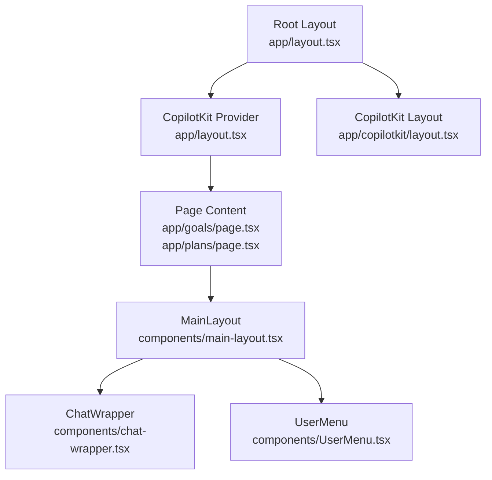
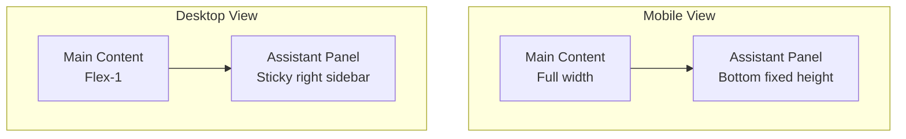
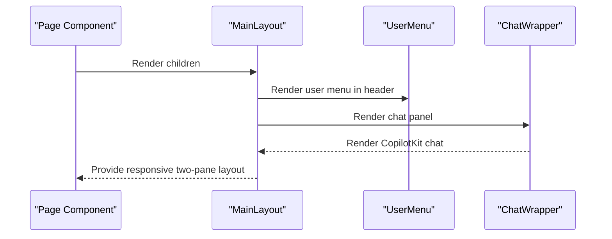
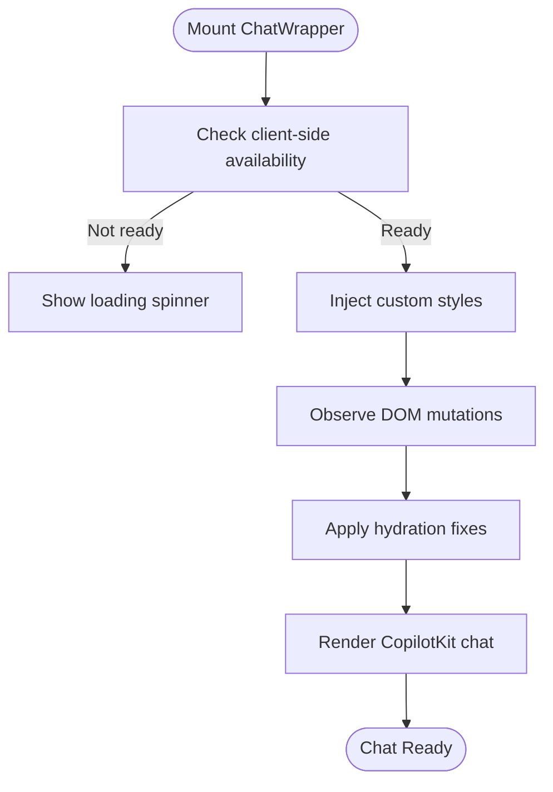
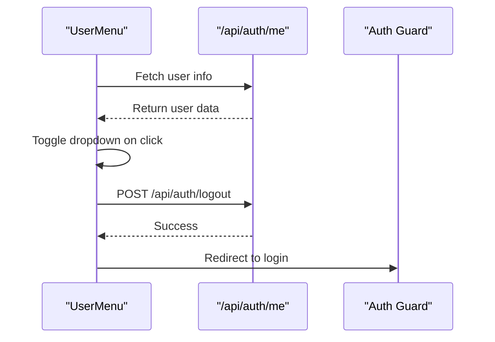
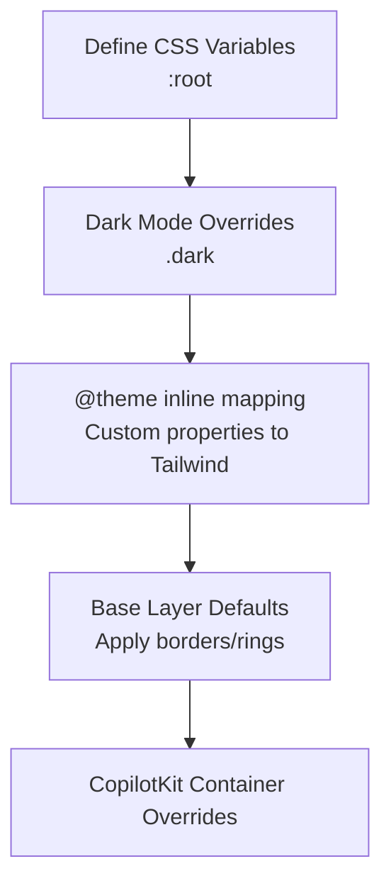
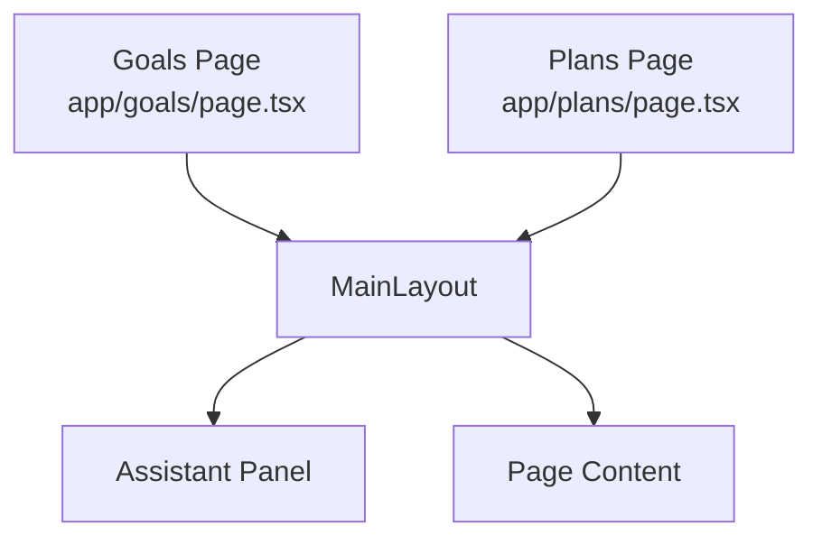
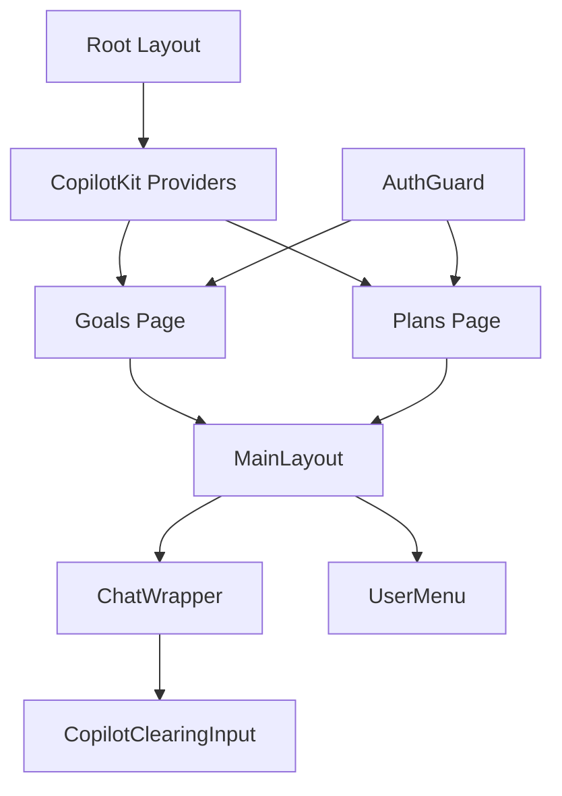

# Layout Components

<cite>
**Referenced Files in This Document**
- [main-layout.tsx](file://src/components/main-layout.tsx)
- [globals.css](file://src/app/globals.css)
- [layout.tsx](file://src/app/layout.tsx)
- [page.tsx (Goals)](file://src/app/goals/page.tsx)
- [page.tsx (Plans)](file://src/app/plans/page.tsx)
- [UserMenu.tsx](file://src/components/UserMenu.tsx)
- [chat-wrapper.tsx](file://src/components/chat-wrapper.tsx)
- [copilot-clearing-input.tsx](file://src/components/copilot-clearing-input.tsx)
- [AuthGuard.tsx](file://src/components/AuthGuard.tsx)
- [middleware.ts](file://middleware.ts)
- [layout.tsx (CopilotKit)](file://src/app/copilotkit/layout.tsx)
- [utils.ts](file://src/lib/utils.ts)
</cite>

## Table of Contents
1. [Introduction](#introduction)
2. [Project Structure](#project-structure)
3. [Core Components](#core-components)
4. [Architecture Overview](#architecture-overview)
5. [Detailed Component Analysis](#detailed-component-analysis)
6. [Dependency Analysis](#dependency-analysis)
7. [Performance Considerations](#performance-considerations)
8. [Troubleshooting Guide](#troubleshooting-guide)
9. [Conclusion](#conclusion)
10. [Appendices](#appendices)

## Introduction
This document provides a comprehensive guide to the layout and structural components of the application. It focuses on the MainLayout component, navigation patterns, sidebar management, and responsive design implementation. It also documents the global layout structure, CSS custom properties, and theme configuration, along with usage examples, customization guidelines, and performance and accessibility considerations.

## Project Structure
The layout system is built around a global root layout that wraps the application with CopilotKit providers, and per-page layouts that compose the MainLayout component. Pages such as Goals and Plans demonstrate how content is wrapped inside MainLayout to benefit from the unified layout and integrated AI assistant panel.

**Diagram sources**
- [layout.tsx:16-30](file://src/app/layout.tsx#L16-L30)
- [page.tsx (Goals):93-310](file://src/app/goals/page.tsx#L93-L310)
- [page.tsx (Plans):309-800](file://src/app/plans/page.tsx#L309-L800)
- [main-layout.tsx:11-62](file://src/components/main-layout.tsx#L11-L62)
- [chat-wrapper.tsx](file://src/components/chat-wrapper.tsx#L7-N)
- [UserMenu.tsx:10-104](file://src/components/UserMenu.tsx#L10-L104)
- [layout.tsx (CopilotKit):10-19](file://src/app/copilotkit/layout.tsx#L10-L19)

**Section sources**
- [layout.tsx:16-30](file://src/app/layout.tsx#L16-L30)
- [page.tsx (Goals):93-310](file://src/app/goals/page.tsx#L93-L310)
- [page.tsx (Plans):309-800](file://src/app/plans/page.tsx#L309-L800)
- [main-layout.tsx:11-62](file://src/components/main-layout.tsx#L11-L62)

## Core Components
- MainLayout: Provides a unified layout with a primary content area and a persistent AI assistant panel. It manages responsive behavior, sticky positioning on larger screens, and integrates UserMenu and ChatWrapper.
- ChatWrapper: Renders the CopilotKit chat interface with custom styles, hydration-safe initialization, and robust markdown rendering fixes.
- UserMenu: Handles user profile display, dropdown interactions, and logout flow.
- Global Styles (globals.css): Defines theme tokens via CSS custom properties, Tailwind theme overrides, dark mode variants, and responsive utilities.
- Root Layout (layout.tsx): Wraps the app with CopilotKit provider and sets up viewport and metadata.
- CopilotKit Layout (app/copilotkit/layout.tsx): Optional wrapper for CopilotKit-specific pages.
- AuthGuard: Protects page-level components by ensuring authentication before rendering.

**Section sources**
- [main-layout.tsx:7-62](file://src/components/main-layout.tsx#L7-L62)
- [chat-wrapper.tsx:7-709](file://src/components/chat-wrapper.tsx#L7-L709)
- [UserMenu.tsx:10-104](file://src/components/UserMenu.tsx#L10-L104)
- [globals.css:6-118](file://src/app/globals.css#L6-L118)
- [layout.tsx:16-30](file://src/app/layout.tsx#L16-L30)
- [layout.tsx (CopilotKit):10-19](file://src/app/copilotkit/layout.tsx#L10-L19)
- [AuthGuard.tsx:10-53](file://src/components/AuthGuard.tsx#L10-L53)

## Architecture Overview
The layout architecture centers on a two-pane structure:
- Primary content area: Full-width on mobile, flex-1 on larger screens.
- Assistant panel: Fixed-height bottom sheet on mobile; right-side sticky panel on desktop.

**Diagram sources**
- [main-layout.tsx:13-20](file://src/components/main-layout.tsx#L13-L20)

**Section sources**
- [main-layout.tsx:11-62](file://src/components/main-layout.tsx#L11-L62)

## Detailed Component Analysis

### MainLayout Component
MainLayout orchestrates the global layout:
- Responsive container: Uses flexbox and media queries to switch between stacked and split layouts.
- Assistant panel: Implements dynamic height with viewport units and clamp-like sizing to balance usability across devices.
- Sticky behavior: On desktop, the assistant panel becomes sticky and top-aligned to improve focus on the main content.
- Integration: Embeds UserMenu in the assistant header and renders ChatWrapper in the chat area.

**Diagram sources**
- [main-layout.tsx:11-62](file://src/components/main-layout.tsx#L11-L62)
- [UserMenu.tsx:10-104](file://src/components/UserMenu.tsx#L10-L104)
- [chat-wrapper.tsx:7-709](file://src/components/chat-wrapper.tsx#L7-L709)

**Section sources**
- [main-layout.tsx:7-62](file://src/components/main-layout.tsx#L7-L62)

### ChatWrapper and CopilotKit Integration
ChatWrapper initializes the CopilotKit chat safely:
- Hydration guard: Prevents rendering until client-side detection is confirmed.
- Markdown fixes: Observes DOM mutations and applies targeted CSS classes to resolve hydration mismatches.
- Theming and responsiveness: Applies custom CSS variables and media queries to adapt chat visuals across devices.
- Input customization: Uses a custom input component that clears reliably after sending.

**Diagram sources**
- [chat-wrapper.tsx:11-59](file://src/components/chat-wrapper.tsx#L11-L59)

**Section sources**
- [chat-wrapper.tsx:7-709](file://src/components/chat-wrapper.tsx#L7-L709)
- [copilot-clearing-input.tsx:84-175](file://src/components/copilot-clearing-input.tsx#L84-L175)

### UserMenu Component
UserMenu handles user identity and actions:
- Fetches current user on mount.
- Dropdown toggles with click-outside detection.
- Logout flow navigates to login and refreshes the route.

**Diagram sources**
- [UserMenu.tsx:36-61](file://src/components/UserMenu.tsx#L36-L61)
- [AuthGuard.tsx:14-32](file://src/components/AuthGuard.tsx#L14-L32)

**Section sources**
- [UserMenu.tsx:10-104](file://src/components/UserMenu.tsx#L10-L104)
- [AuthGuard.tsx:10-53](file://src/components/AuthGuard.tsx#L10-L53)

### Theme Configuration and CSS Custom Properties
The global stylesheet defines a theming system:
- CSS custom properties: Tokens for colors, typography, radii, and chart palettes mapped to Tailwind theme variables.
- Dark mode: Scoped variants adjust tokens for dark backgrounds and contrast.
- Base layer: Applies border and ring defaults to all elements.
- CopilotKit overrides: Ensures chat containers adopt the app’s theme and scroll behavior.

**Diagram sources**
- [globals.css:6-118](file://src/app/globals.css#L6-L118)
- [globals.css:120-183](file://src/app/globals.css#L120-L183)

**Section sources**
- [globals.css:6-118](file://src/app/globals.css#L6-L118)
- [globals.css:120-183](file://src/app/globals.css#L120-L183)

### Page-Level Composition Examples
- Goals page composes MainLayout and uses responsive grid utilities for forms and tables.
- Plans page demonstrates advanced filtering, sorting, and pagination within MainLayout.

**Diagram sources**
- [page.tsx (Goals):93-310](file://src/app/goals/page.tsx#L93-L310)
- [page.tsx (Plans):309-800](file://src/app/plans/page.tsx#L309-L800)
- [main-layout.tsx:11-62](file://src/components/main-layout.tsx#L11-L62)

**Section sources**
- [page.tsx (Goals):93-310](file://src/app/goals/page.tsx#L93-L310)
- [page.tsx (Plans):309-800](file://src/app/plans/page.tsx#L309-L800)

## Dependency Analysis
- Root layout depends on CopilotKit providers to enable chat features across pages.
- Pages depend on MainLayout to maintain consistent layout and assistant panel.
- MainLayout depends on ChatWrapper and UserMenu for assistant and user controls.
- ChatWrapper depends on CopilotKit UI and custom input component.
- AuthGuard ensures pages are protected and redirects unauthenticated users.

**Diagram sources**
- [layout.tsx:16-30](file://src/app/layout.tsx#L16-L30)
- [page.tsx (Goals):93-310](file://src/app/goals/page.tsx#L93-L310)
- [page.tsx (Plans):309-800](file://src/app/plans/page.tsx#L309-L800)
- [main-layout.tsx:11-62](file://src/components/main-layout.tsx#L11-L62)
- [chat-wrapper.tsx:7-709](file://src/components/chat-wrapper.tsx#L7-L709)
- [copilot-clearing-input.tsx:84-175](file://src/components/copilot-clearing-input.tsx#L84-L175)
- [AuthGuard.tsx:10-53](file://src/components/AuthGuard.tsx#L10-L53)

**Section sources**
- [layout.tsx:16-30](file://src/app/layout.tsx#L16-L30)
- [page.tsx (Goals):93-310](file://src/app/goals/page.tsx#L93-L310)
- [page.tsx (Plans):309-800](file://src/app/plans/page.tsx#L309-L800)
- [main-layout.tsx:11-62](file://src/components/main-layout.tsx#L11-L62)
- [chat-wrapper.tsx:7-709](file://src/components/chat-wrapper.tsx#L7-L709)
- [copilot-clearing-input.tsx:84-175](file://src/components/copilot-clearing-input.tsx#L84-L175)
- [AuthGuard.tsx:10-53](file://src/components/AuthGuard.tsx#L10-L53)

## Performance Considerations
- Hydration safety: ChatWrapper defers rendering until client-side detection to avoid hydration mismatches.
- Minimal reflows: Assistant panel uses sticky positioning and clamp-like sizing to prevent layout thrashing.
- Scroll optimization: Chat messages container uses efficient scrolling with thin scrollbars and mutation observers for minimal DOM churn.
- Conditional rendering: Loading states and guards prevent unnecessary work while initializing.

[No sources needed since this section provides general guidance]

## Troubleshooting Guide
- Authentication redirection: If users are redirected to login, verify middleware checks and token presence.
- Chat not rendering: Ensure CopilotKit providers are present in the root layout and that ChatWrapper mounts after client detection.
- Hydration warnings: Confirm ChatWrapper’s hydration guards and mutation observer logic are active.
- Responsive layout shifts: Verify media query classes and clamp-based sizing are applied consistently.

**Section sources**
- [middleware.ts:3-35](file://middleware.ts#L3-L35)
- [layout.tsx:16-30](file://src/app/layout.tsx#L16-L30)
- [chat-wrapper.tsx:11-59](file://src/components/chat-wrapper.tsx#L11-L59)
- [main-layout.tsx:13-20](file://src/components/main-layout.tsx#L13-L20)

## Conclusion
The layout system combines a responsive two-pane structure with a robust theme and assistant panel. MainLayout centralizes navigation and assistant integration, while globals.css provides a consistent design system. Pages compose MainLayout to deliver cohesive experiences, and guards ensure secure access. The system balances performance, accessibility, and customization through thoughtful use of CSS custom properties, responsive utilities, and hydration-safe patterns.

[No sources needed since this section summarizes without analyzing specific files]

## Appendices

### Usage Examples
- Wrap page content with MainLayout to inherit the layout and assistant panel.
- Use responsive grid utilities inside pages to adapt to different screen sizes.
- Apply clamp-based sizing for assistant panel heights to maintain usability across devices.

**Section sources**
- [page.tsx (Goals):93-310](file://src/app/goals/page.tsx#L93-L310)
- [page.tsx (Plans):309-800](file://src/app/plans/page.tsx#L309-L800)
- [main-layout.tsx:13-20](file://src/components/main-layout.tsx#L13-L20)

### Customization Guidelines
- Theme tokens: Adjust CSS variables in :root and .dark blocks to change colors and radii globally.
- Spacing system: Use Tailwind utilities and clamp-based sizing for consistent margins and paddings.
- Grid patterns: Employ responsive grid classes to structure forms and tables across breakpoints.
- Assistant panel: Customize width, min/max heights, and sticky behavior via Tailwind classes on the assistant container.

**Section sources**
- [globals.css:6-118](file://src/app/globals.css#L6-L118)
- [main-layout.tsx:13-20](file://src/components/main-layout.tsx#L13-L20)

### Accessibility Considerations
- Focus management: Ensure assistant panel does not trap focus; maintain keyboard navigation.
- Contrast and readability: Leverage theme tokens to preserve sufficient contrast in light and dark modes.
- Reduced motion: Respect prefers-reduced-motion by disabling or softening animations in chat components.
- Semantic markup: Use proper labels and roles for interactive elements in UserMenu and ChatWrapper.

[No sources needed since this section provides general guidance]