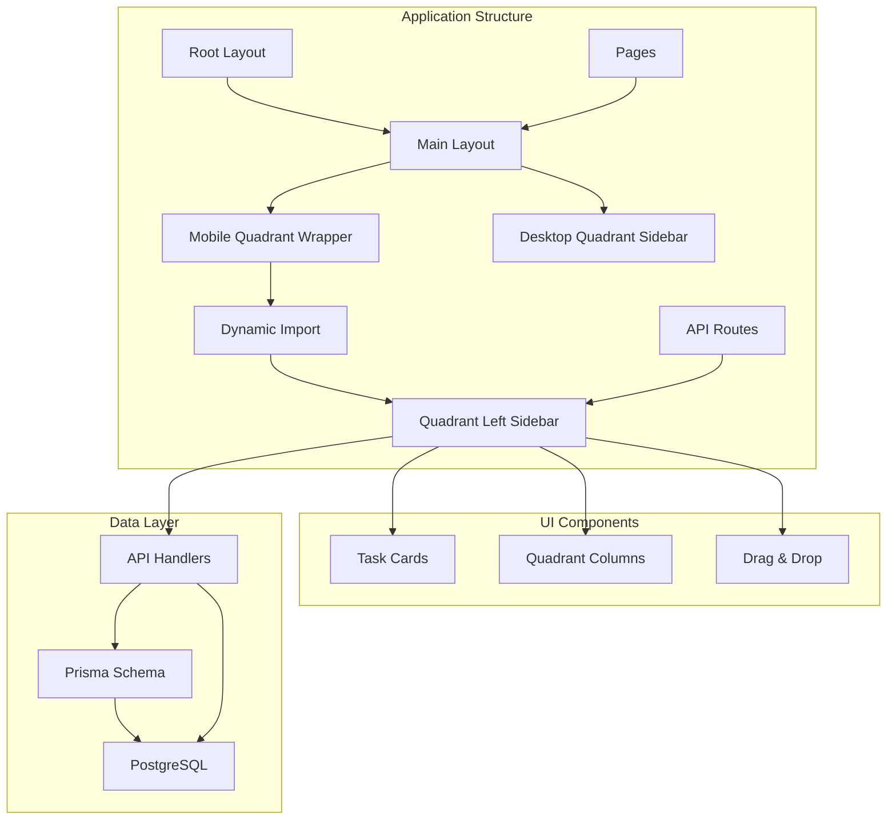
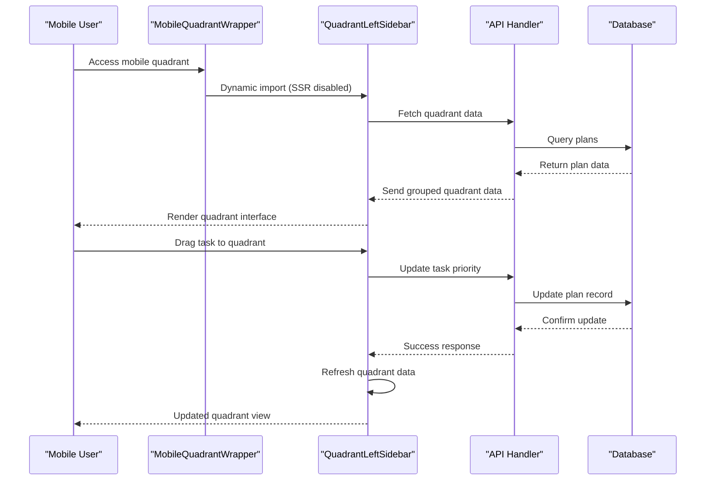
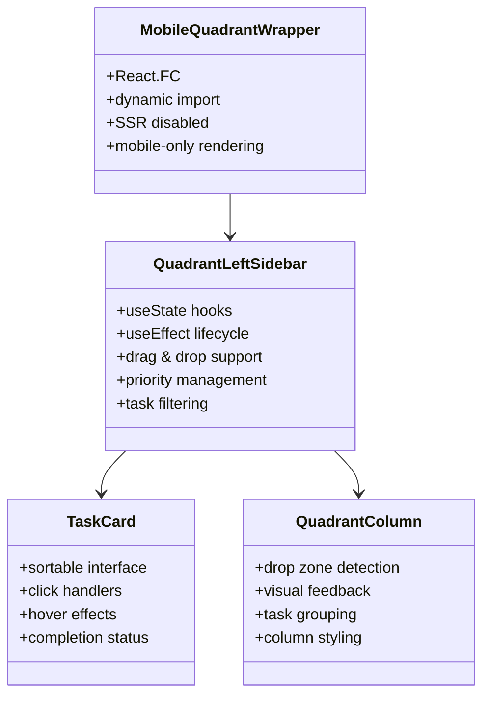
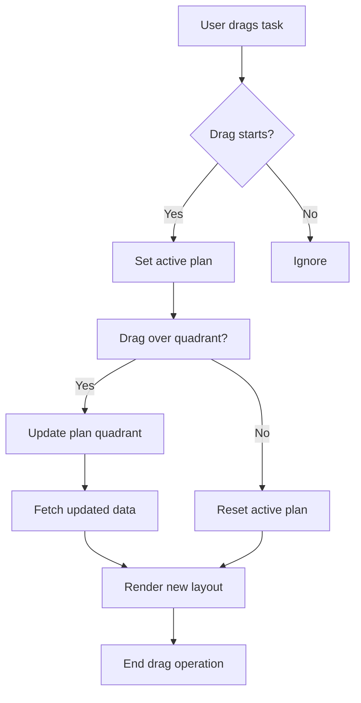
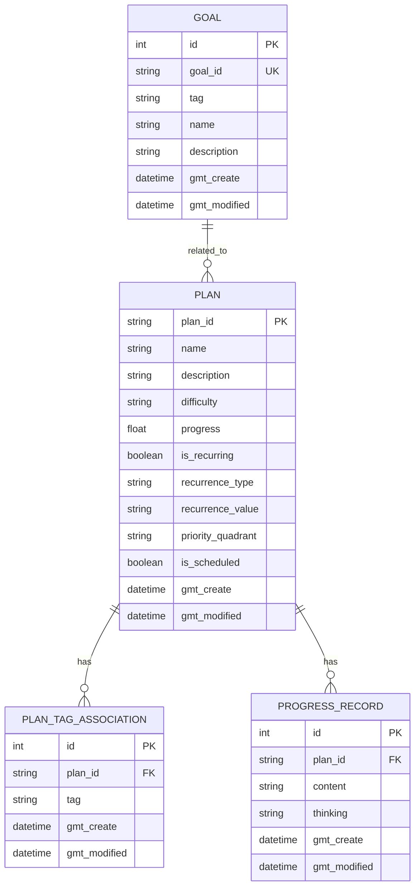

# Mobile Quadrant Wrapper

<cite>
**Referenced Files in This Document**
- [mobile-quadrant-wrapper.tsx](file://src/components/mobile-quadrant-wrapper.tsx)
- [quadrant-left-sidebar.tsx](file://src/components/quadrant-left-sidebar.tsx)
- [main-layout.tsx](file://src/components/main-layout.tsx)
- [page.tsx](file://src/app/page.tsx)
- [layout.tsx](file://src/app/layout.tsx)
- [route.ts](file://src/app/api/plan/priority/route.ts)
- [route.ts](file://src/app/api/plan/route.ts)
- [utils.ts](file://src/lib/utils.ts)
- [recurring-utils.ts](file://src/lib/recurring-utils.ts)
- [schema.prisma](file://prisma/schema.prisma)
</cite>

## Table of Contents
1. [Introduction](#introduction)
2. [Project Structure](#project-structure)
3. [Core Components](#core-components)
4. [Architecture Overview](#architecture-overview)
5. [Detailed Component Analysis](#detailed-component-analysis)
6. [Dependency Analysis](#dependency-analysis)
7. [Performance Considerations](#performance-considerations)
8. [Troubleshooting Guide](#troubleshooting-guide)
9. [Conclusion](#conclusion)

## Introduction

The Mobile Quadrant Wrapper is a specialized React component designed to provide mobile-optimized access to the Eisenhower Matrix (Four Quadrants) task management system. This component serves as a bridge between desktop and mobile experiences, allowing users to access their priority-based task management on smaller screens while maintaining the full functionality of the desktop version.

The wrapper dynamically loads the quadrant sidebar component only on mobile devices, preventing hydration errors that would occur if the component were rendered during server-side rendering. This approach ensures optimal performance and user experience across different device sizes.

## Project Structure

The Mobile Quadrant Wrapper is part of a larger Next.js application built with TypeScript and Tailwind CSS. The project follows a component-based architecture with clear separation of concerns between UI components, business logic, and data management.



**Diagram sources**
- [layout.tsx:16-30](file://src/app/layout.tsx#L16-L30)
- [main-layout.tsx:13-50](file://src/components/main-layout.tsx#L13-L50)
- [mobile-quadrant-wrapper.tsx:11-17](file://src/components/mobile-quadrant-wrapper.tsx#L11-L17)

**Section sources**
- [layout.tsx:1-31](file://src/app/layout.tsx#L1-L31)
- [main-layout.tsx:1-164](file://src/components/main-layout.tsx#L1-L164)
- [mobile-quadrant-wrapper.tsx:1-18](file://src/components/mobile-quadrant-wrapper.tsx#L1-L18)

## Core Components

The Mobile Quadrant Wrapper consists of several interconnected components that work together to provide a seamless mobile experience:

### MobileQuadrantWrapper Component
The primary component responsible for rendering the mobile-optimized quadrant sidebar. It uses Next.js dynamic imports with SSR disabled to prevent hydration conflicts on mobile devices.

### QuadrantLeftSidebar Component
The core quadrant management component that handles:
- Four-quadrant layout with color-coded sections
- Drag-and-drop task management
- Real-time task filtering and sorting
- Priority assignment and scheduling
- Progress tracking for recurring tasks

### MainLayout Component
Provides the overall application layout with responsive design patterns that adapt between desktop and mobile views.

**Section sources**
- [mobile-quadrant-wrapper.tsx:11-17](file://src/components/mobile-quadrant-wrapper.tsx#L11-L17)
- [quadrant-left-sidebar.tsx:376-585](file://src/components/quadrant-left-sidebar.tsx#L376-L585)
- [main-layout.tsx:13-164](file://src/components/main-layout.tsx#L13-L164)

## Architecture Overview

The Mobile Quadrant Wrapper follows a modular architecture that separates concerns between presentation, data management, and business logic:



**Diagram sources**
- [mobile-quadrant-wrapper.tsx:6-9](file://src/components/mobile-quadrant-wrapper.tsx#L6-L9)
- [quadrant-left-sidebar.tsx:399-418](file://src/components/quadrant-left-sidebar.tsx#L399-L418)
- [route.ts:6-64](file://src/app/api/plan/priority/route.ts#L6-L64)

The architecture implements several key design patterns:

### Responsive Design Pattern
The wrapper uses CSS media queries to automatically adapt between mobile and desktop layouts, ensuring optimal user experience across all device sizes.

### Lazy Loading Pattern
Dynamic imports with SSR disabled prevent unnecessary server-side rendering and improve initial page load performance on mobile devices.

### Event-Driven Architecture
Custom events enable communication between components, allowing the quadrant sidebar to refresh automatically when related data changes.

**Section sources**
- [main-layout.tsx:19-50](file://src/components/main-layout.tsx#L19-L50)
- [utils.ts:12-16](file://src/lib/utils.ts#L12-L16)

## Detailed Component Analysis

### MobileQuadrantWrapper Implementation

The MobileQuadrantWrapper component demonstrates several important React patterns and best practices:



**Diagram sources**
- [mobile-quadrant-wrapper.tsx:11-17](file://src/components/mobile-quadrant-wrapper.tsx#L11-L17)
- [quadrant-left-sidebar.tsx:209-282](file://src/components/quadrant-left-sidebar.tsx#L209-L282)
- [quadrant-left-sidebar.tsx:284-369](file://src/components/quadrant-left-sidebar.tsx#L284-L369)

#### Key Features

**Dynamic Import with SSR Control**
The component uses Next.js dynamic imports with `{ ssr: false }` to prevent server-side rendering issues on mobile devices. This ensures that the quadrant sidebar component only renders on the client side, avoiding hydration mismatches.

**Mobile-First Design**
The wrapper applies Tailwind CSS classes that automatically hide the component on large screens (`lg:hidden`), ensuring it only appears on mobile devices where it's needed.

**Integration with Main Layout**
The component integrates seamlessly with the MainLayout component, which manages the overall application structure and provides responsive navigation.

**Section sources**
- [mobile-quadrant-wrapper.tsx:1-18](file://src/components/mobile-quadrant-wrapper.tsx#L1-L18)
- [page.tsx:24-25](file://src/app/page.tsx#L24-L25)

### QuadrantLeftSidebar Advanced Functionality

The QuadrantLeftSidebar component implements sophisticated task management features:

#### Drag and Drop Implementation
The component uses the `@dnd-kit` library to provide smooth drag-and-drop functionality:



**Diagram sources**
- [quadrant-left-sidebar.tsx:462-481](file://src/components/quadrant-left-sidebar.tsx#L462-L481)

#### Task Management Logic
The component handles complex task management scenarios including:

**Priority Assignment System**
- Four-quadrant matrix (Important/Urgent, Important/Not Urgent, etc.)
- Color-coded visual indicators
- Automatic task sorting by completion status

**Recurring Task Support**
Advanced logic for managing periodic tasks with automatic completion tracking:

**Section sources**
- [quadrant-left-sidebar.tsx:182-191](file://src/components/quadrant-left-sidebar.tsx#L182-L191)
- [recurring-utils.ts:138-147](file://src/lib/recurring-utils.ts#L138-L147)

### Data Flow and API Integration

The Mobile Quadrant Wrapper integrates with the backend through well-defined API endpoints:



**Diagram sources**
- [schema.prisma:26-61](file://prisma/schema.prisma#L26-L61)

**Section sources**
- [route.ts:6-64](file://src/app/api/plan/priority/route.ts#L6-L64)
- [route.ts:7-67](file://src/app/api/plan/route.ts#L7-L67)

## Dependency Analysis

The Mobile Quadrant Wrapper has several key dependencies that contribute to its functionality:

### External Dependencies

**Next.js Dynamic Imports**
- Enables client-side only rendering
- Prevents SSR hydration issues
- Optimizes bundle loading

**@dnd-kit Library**
- Provides drag-and-drop functionality
- Handles touch events for mobile devices
- Manages drag state and positioning

**Tailwind CSS**
- Utility-first styling framework
- Responsive design capabilities
- Mobile-first approach

### Internal Dependencies

**MainLayout Integration**
The wrapper depends on the MainLayout component for overall application structure and responsive behavior.

**API Route Integration**
Direct integration with the `/api/plan/priority` endpoint for real-time data synchronization.

**Utility Functions**
Uses refreshQuadrantSidebar utility for cross-component communication.

```mermaid
graph LR
subgraph "External Dependencies"
A[Next.js]
B[@dnd-kit]
C[Tailwind CSS]
end
subgraph "Internal Dependencies"
D[MainLayout]
E[API Routes]
F[Utils]
end
subgraph "MobileQuadrantWrapper"
G[Dynamic Import]
H[Quadrant Sidebar]
end
A --> G
B --> H
C --> H
D --> G
E --> H
F --> H
```

**Diagram sources**
- [mobile-quadrant-wrapper.tsx:3](file://src/components/mobile-quadrant-wrapper.tsx#L3)
- [quadrant-left-sidebar.tsx:16](file://src/components/quadrant-left-sidebar.tsx#L16)

**Section sources**
- [mobile-quadrant-wrapper.tsx:1-18](file://src/components/mobile-quadrant-wrapper.tsx#L1-L18)
- [quadrant-left-sidebar.tsx:1-24](file://src/components/quadrant-left-sidebar.tsx#L1-L24)

## Performance Considerations

The Mobile Quadrant Wrapper is designed with several performance optimizations:

### Bundle Size Optimization
- Dynamic imports reduce initial bundle size
- SSR disabled prevents unnecessary server-side rendering
- Lazy loading ensures components are only loaded when needed

### Rendering Performance
- Efficient state management with React hooks
- Minimal re-renders through proper state updates
- Optimized drag-and-drop performance

### Memory Management
- Proper cleanup of event listeners
- Cleanup of observers and intervals
- Efficient component unmounting

### Mobile-Specific Optimizations
- Touch-friendly drag interactions
- Optimized touch event handling
- Reduced memory footprint on mobile devices

**Section sources**
- [mobile-quadrant-wrapper.tsx:6-9](file://src/components/mobile-quadrant-wrapper.tsx#L6-L9)
- [quadrant-left-sidebar.tsx:420-438](file://src/components/quadrant-left-sidebar.tsx#L420-L438)

## Troubleshooting Guide

### Common Issues and Solutions

**Hydration Errors**
- **Problem**: React hydration mismatch on mobile devices
- **Solution**: Ensure SSR is disabled for dynamic imports
- **Prevention**: Use `{ ssr: false }` in dynamic imports

**Drag and Drop Not Working**
- **Problem**: Touch events not properly handled on mobile
- **Solution**: Verify `@dnd-kit` sensors are properly configured
- **Debug**: Check browser console for sensor initialization errors

**API Communication Failures**
- **Problem**: Network requests failing for quadrant data
- **Solution**: Verify API endpoint accessibility and authentication
- **Debug**: Check network tab for failed requests

**Performance Issues**
- **Problem**: Slow rendering on mobile devices
- **Solution**: Optimize component structure and reduce unnecessary re-renders
- **Prevention**: Use React.memo for expensive components

**Section sources**
- [mobile-quadrant-wrapper.tsx:6-9](file://src/components/mobile-quadrant-wrapper.tsx#L6-L9)
- [quadrant-left-sidebar.tsx:390-397](file://src/components/quadrant-left-sidebar.tsx#L390-L397)

## Conclusion

The Mobile Quadrant Wrapper represents a well-architected solution for providing mobile-optimized access to advanced task management functionality. Through careful consideration of mobile-specific challenges, the component successfully bridges the gap between desktop and mobile experiences while maintaining performance and usability.

Key strengths of the implementation include:

- **Responsive Design**: Seamless adaptation between mobile and desktop layouts
- **Performance Optimization**: Strategic use of lazy loading and SSR control
- **User Experience**: Intuitive drag-and-drop interactions optimized for touch devices
- **Maintainability**: Clean separation of concerns and modular component architecture

The component serves as an excellent example of how to effectively implement mobile-first design patterns in modern React applications, particularly for complex interactive systems like task management interfaces.

Future enhancements could include additional mobile-specific features such as gesture-based interactions, improved offline support, and enhanced accessibility features for users with disabilities.