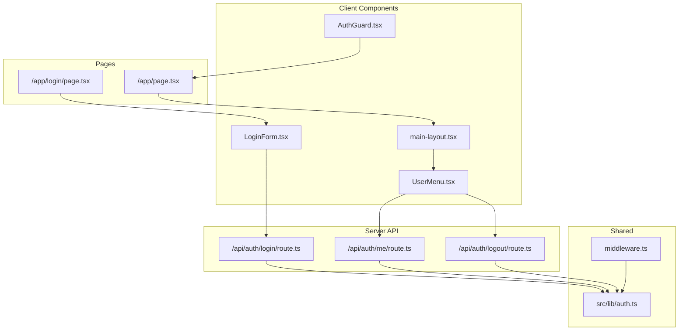
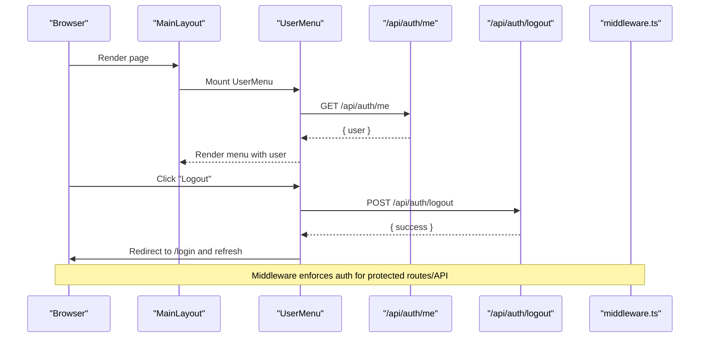
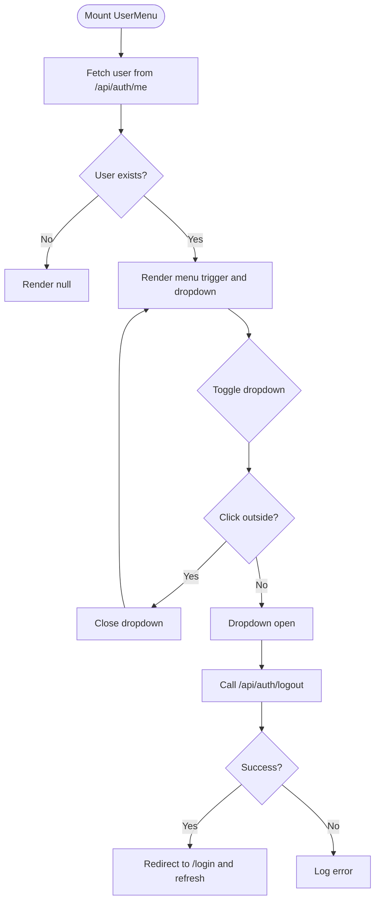
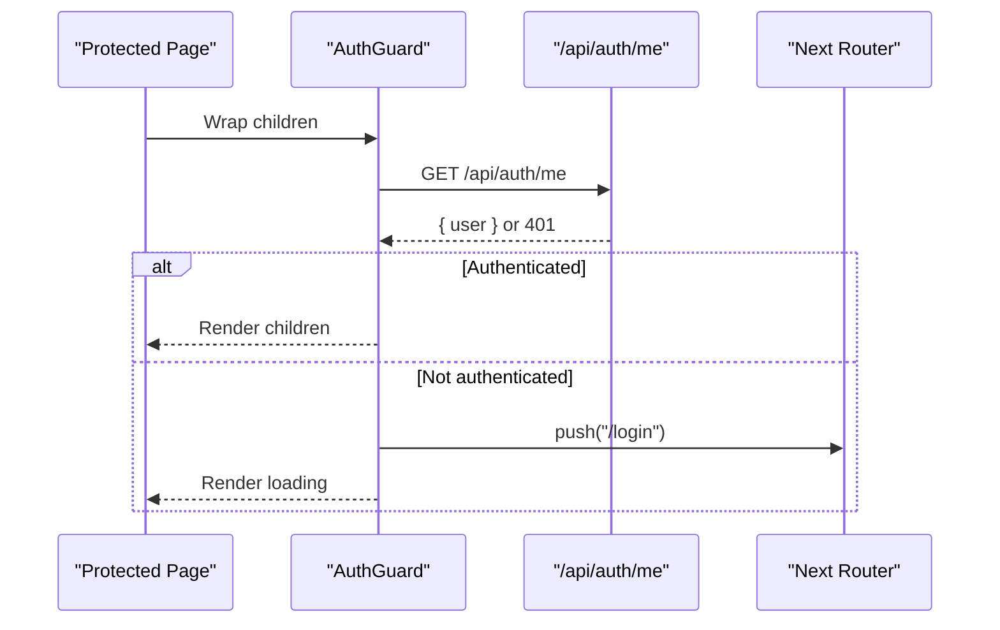
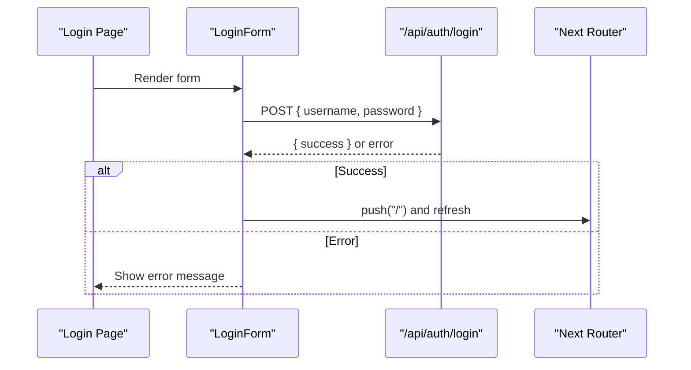
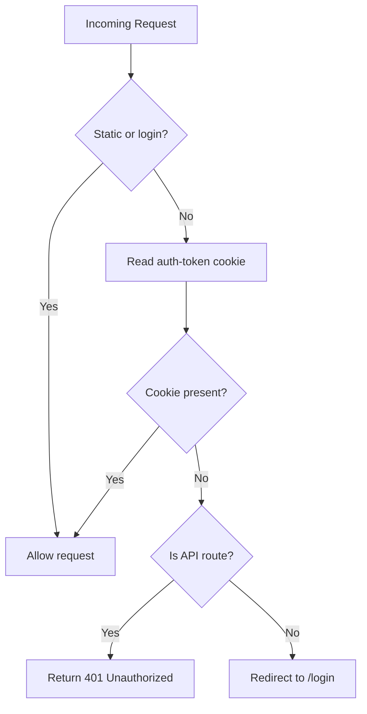
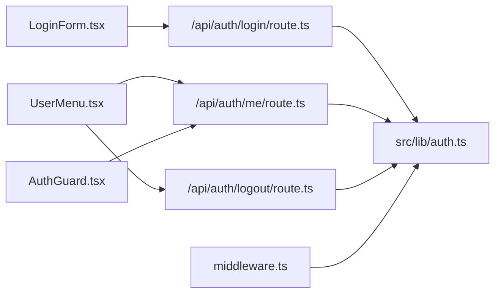

# Navigation Components

<cite>
**Referenced Files in This Document**
- [UserMenu.tsx](file://src/components/UserMenu.tsx)
- [AuthGuard.tsx](file://src/components/AuthGuard.tsx)
- [auth.ts](file://src/lib/auth.ts)
- [middleware.ts](file://middleware.ts)
- [login/route.ts](file://src/app/api/auth/login/route.ts)
- [logout/route.ts](file://src/app/api/auth/logout/route.ts)
- [me/route.ts](file://src/app/api/auth/me/route.ts)
- [LoginForm.tsx](file://src/components/LoginForm.tsx)
- [login/page.tsx](file://src/app/login/page.tsx)
- [page.tsx](file://src/app/page.tsx)
- [main-layout.tsx](file://src/components/main-layout.tsx)
- [AUTHENTICATION.md](file://AUTHENTICATION.md)
</cite>

## Table of Contents
1. [Introduction](#introduction)
2. [Project Structure](#project-structure)
3. [Core Components](#core-components)
4. [Architecture Overview](#architecture-overview)
5. [Detailed Component Analysis](#detailed-component-analysis)
6. [Dependency Analysis](#dependency-analysis)
7. [Performance Considerations](#performance-considerations)
8. [Troubleshooting Guide](#troubleshooting-guide)
9. [Conclusion](#conclusion)
10. [Appendices](#appendices)

## Introduction
This document focuses on navigation and authentication-related components in the Goal-Mate application. It covers:
- UserMenu: dropdown menu for user profile display and logout actions
- AuthGuard: route protection and authentication state checking
- Authentication flow integration and session management
- Navigation patterns, customization, accessibility, keyboard shortcuts, and responsive behavior
- Security considerations and best practices

## Project Structure
The navigation and authentication system spans client-side components, server-side API routes, middleware, and shared authentication utilities. The main layout integrates the user menu and provides a responsive container for the main content and AI assistant panel.

**Diagram sources**
- [UserMenu.tsx:1-104](file://src/components/UserMenu.tsx#L1-L104)
- [AuthGuard.tsx:1-53](file://src/components/AuthGuard.tsx#L1-L53)
- [LoginForm.tsx:1-98](file://src/components/LoginForm.tsx#L1-L98)
- [main-layout.tsx:1-63](file://src/components/main-layout.tsx#L1-L63)
- [login/route.ts:1-50](file://src/app/api/auth/login/route.ts#L1-L50)
- [logout/route.ts:1-23](file://src/app/api/auth/logout/route.ts#L1-L23)
- [me/route.ts:1-27](file://src/app/api/auth/me/route.ts#L1-L27)
- [auth.ts:1-69](file://src/lib/auth.ts#L1-L69)
- [middleware.ts:1-40](file://middleware.ts#L1-L40)
- [login/page.tsx:1-12](file://src/app/login/page.tsx#L1-L12)
- [page.tsx:1-156](file://src/app/page.tsx#L1-L156)

**Section sources**
- [main-layout.tsx:11-62](file://src/components/main-layout.tsx#L11-L62)
- [AUTHENTICATION.md:68-85](file://AUTHENTICATION.md#L68-L85)

## Core Components
- UserMenu: Displays the logged-in username, avatar placeholder, and a dropdown with logout action. Handles fetching user info and logout via API endpoints.
- AuthGuard: Protects routes by checking authentication state on mount and redirecting unauthenticated users to the login page.
- LoginForm: Provides a form to submit credentials to the login API endpoint.
- Authentication utilities: JWT creation/verification, credential validation, and current user retrieval.
- Middleware: Enforces authentication for non-API routes and returns 401 for unauthorized API requests.

**Section sources**
- [UserMenu.tsx:10-104](file://src/components/UserMenu.tsx#L10-L104)
- [AuthGuard.tsx:10-53](file://src/components/AuthGuard.tsx#L10-L53)
- [LoginForm.tsx:6-98](file://src/components/LoginForm.tsx#L6-L98)
- [auth.ts:14-69](file://src/lib/auth.ts#L14-L69)
- [middleware.ts:3-40](file://middleware.ts#L3-L40)

## Architecture Overview
The navigation and authentication system follows a layered pattern:
- UI layer: UserMenu and AuthGuard encapsulate user interactions and route protection.
- Layout layer: MainLayout integrates the user menu and organizes content and assistant panels responsively.
- API layer: Login, logout, and user info endpoints manage session creation and validation.
- Shared utilities: Authentication library centralizes JWT and credential handling.
- Middleware: Global enforcement of authentication for protected routes and API endpoints.

**Diagram sources**
- [main-layout.tsx:51-52](file://src/components/main-layout.tsx#L51-L52)
- [UserMenu.tsx:36-61](file://src/components/UserMenu.tsx#L36-L61)
- [me/route.ts:4-27](file://src/app/api/auth/me/route.ts#L4-L27)
- [logout/route.ts:4-23](file://src/app/api/auth/logout/route.ts#L4-L23)
- [middleware.ts:3-40](file://middleware.ts#L3-L40)

## Detailed Component Analysis

### UserMenu Component
- Purpose: Renders a user avatar and username, toggles a dropdown menu, displays current user, and triggers logout.
- Key behaviors:
  - Fetches user info via GET /api/auth/me on mount.
  - Uses click-outside detection to close the dropdown.
  - Calls POST /api/auth/logout and redirects to /login upon success.
- Accessibility and responsiveness:
  - Uses semantic button elements and aria-friendly markup.
  - Responsive truncation for the username label.
  - Rotation animation for the chevron icon indicating open/closed state.
- Integration points:
  - Consumes authentication state from the backend via /api/auth/me.
  - Works within MainLayout header alongside the AI assistant panel.

**Diagram sources**
- [UserMenu.tsx:16-61](file://src/components/UserMenu.tsx#L16-L61)
- [me/route.ts:4-18](file://src/app/api/auth/me/route.ts#L4-L18)
- [logout/route.ts:4-14](file://src/app/api/auth/logout/route.ts#L4-L14)

**Section sources**
- [UserMenu.tsx:10-104](file://src/components/UserMenu.tsx#L10-L104)
- [main-layout.tsx:51-52](file://src/components/main-layout.tsx#L51-L52)

### AuthGuard Component
- Purpose: Protects pages by verifying authentication state during client-side initialization.
- Key behaviors:
  - On mount, checks /api/auth/me and sets authenticated state.
  - Redirects to /login if not authenticated.
  - Shows a loading spinner while checking authentication.
- Integration points:
  - Used around protected pages to enforce access control.
  - Works in tandem with middleware for comprehensive protection.

**Diagram sources**
- [AuthGuard.tsx:14-32](file://src/components/AuthGuard.tsx#L14-L32)
- [me/route.ts:4-18](file://src/app/api/auth/me/route.ts#L4-L18)

**Section sources**
- [AuthGuard.tsx:10-53](file://src/components/AuthGuard.tsx#L10-L53)

### LoginForm Component
- Purpose: Provides a form to submit credentials to the login API endpoint.
- Key behaviors:
  - Submits POST /api/auth/login with username/password.
  - Handles success (redirect to home) and error responses.
  - Displays loading state and error messages.
- Integration points:
  - Used on the login page to authenticate users.
  - Sets the auth cookie on successful login.

**Diagram sources**
- [LoginForm.tsx:13-40](file://src/components/LoginForm.tsx#L13-L40)
- [login/route.ts:5-50](file://src/app/api/auth/login/route.ts#L5-L50)

**Section sources**
- [LoginForm.tsx:6-98](file://src/components/LoginForm.tsx#L6-L98)
- [login/page.tsx:5-11](file://src/app/login/page.tsx#L5-L11)

### Authentication Utilities and Middleware
- Authentication utilities:
  - JWT creation and verification with expiration.
  - Credential validation against environment variables.
  - Retrieval of current user from cookie.
- Middleware:
  - Skips authentication for static assets and login routes.
  - Checks for presence of auth cookie; redirects to /login or returns 401 for API routes.

**Diagram sources**
- [middleware.ts:3-40](file://middleware.ts#L3-L40)
- [auth.ts:49-69](file://src/lib/auth.ts#L49-L69)

**Section sources**
- [auth.ts:14-69](file://src/lib/auth.ts#L14-L69)
- [middleware.ts:3-40](file://middleware.ts#L3-L40)

## Dependency Analysis
- UserMenu depends on:
  - /api/auth/me for user info
  - /api/auth/logout for logout
  - Next.js router for navigation
- AuthGuard depends on:
  - /api/auth/me for authentication check
  - Next.js router for redirection
- LoginForm depends on:
  - /api/auth/login for authentication
- Middleware depends on:
  - Cookie parsing and environment configuration
- Shared auth utilities underpin all authentication flows.

**Diagram sources**
- [UserMenu.tsx:36-61](file://src/components/UserMenu.tsx#L36-L61)
- [AuthGuard.tsx:17-23](file://src/components/AuthGuard.tsx#L17-L23)
- [LoginForm.tsx:19-34](file://src/components/LoginForm.tsx#L19-L34)
- [login/route.ts:1-50](file://src/app/api/auth/login/route.ts#L1-L50)
- [logout/route.ts:1-23](file://src/app/api/auth/logout/route.ts#L1-L23)
- [me/route.ts:1-27](file://src/app/api/auth/me/route.ts#L1-L27)
- [auth.ts:14-69](file://src/lib/auth.ts#L14-L69)
- [middleware.ts:1-40](file://middleware.ts#L1-L40)

**Section sources**
- [UserMenu.tsx:36-61](file://src/components/UserMenu.tsx#L36-L61)
- [AuthGuard.tsx:17-23](file://src/components/AuthGuard.tsx#L17-L23)
- [LoginForm.tsx:19-34](file://src/components/LoginForm.tsx#L19-L34)
- [login/route.ts:1-50](file://src/app/api/auth/login/route.ts#L1-L50)
- [logout/route.ts:1-23](file://src/app/api/auth/logout/route.ts#L1-L23)
- [me/route.ts:1-27](file://src/app/api/auth/me/route.ts#L1-L27)
- [auth.ts:14-69](file://src/lib/auth.ts#L14-L69)
- [middleware.ts:1-40](file://middleware.ts#L1-L40)

## Performance Considerations
- Minimize re-renders: Keep UserMenu state local and avoid unnecessary props passing.
- Debounce or cache: Consider caching user info to reduce repeated fetches.
- Lazy loading: Defer non-critical UI updates until after hydration.
- Network efficiency: Use compact request/response payloads and handle errors gracefully.

## Troubleshooting Guide
Common issues and resolutions:
- Login fails:
  - Verify environment variables for credentials and JWT secret.
  - Confirm network connectivity to /api/auth/login.
- Session expired or not recognized:
  - Ensure the auth cookie is being sent with requests.
  - Check middleware configuration and cookie attributes.
- Protected route redirects unexpectedly:
  - Confirm /api/auth/me returns a valid user object.
  - Review middleware matcher configuration.
- Logout does not work:
  - Verify /api/auth/logout clears the cookie and returns success.

**Section sources**
- [AUTHENTICATION.md:179-192](file://AUTHENTICATION.md#L179-L192)
- [login/route.ts:9-22](file://src/app/api/auth/login/route.ts#L9-L22)
- [logout/route.ts:8-9](file://src/app/api/auth/logout/route.ts#L8-L9)
- [me/route.ts:8-13](file://src/app/api/auth/me/route.ts#L8-L13)
- [middleware.ts:19-30](file://middleware.ts#L19-L30)

## Conclusion
The navigation and authentication system combines client-side components (UserMenu, AuthGuard) with server-side APIs and middleware to provide a cohesive, secure, and user-friendly experience. Proper configuration of environment variables, middleware, and UI components ensures reliable session management and seamless navigation.

## Appendices

### Usage Examples and Patterns
- Integrating UserMenu in the main layout:
  - Place UserMenu inside the layout header alongside the AI assistant panel.
  - Ensure the menu fetches user info and handles logout.
- Using AuthGuard for route protection:
  - Wrap protected pages with AuthGuard to enforce authentication checks.
  - Combine with middleware for global protection.
- Customizing navigation:
  - Extend UserMenu to include additional options (e.g., profile settings).
  - Add more protected routes behind AuthGuard and rely on middleware for API protection.

**Section sources**
- [main-layout.tsx:51-52](file://src/components/main-layout.tsx#L51-L52)
- [AuthGuard.tsx:10-53](file://src/components/AuthGuard.tsx#L10-L53)
- [AUTHENTICATION.md:149-171](file://AUTHENTICATION.md#L149-L171)

### Accessibility Guidelines
- Keyboard navigation:
  - Ensure dropdown toggle is focusable and operable via Enter/Space.
  - Manage focus after closing the dropdown to return focus to the trigger.
- Screen readers:
  - Use descriptive labels for buttons and dropdown items.
  - Announce state changes (open/close) for assistive technologies.
- Responsive behavior:
  - Test dropdown visibility and click-outside behavior across devices.
  - Ensure sufficient touch target sizes for mobile users.

### Security Considerations
- Environment variables:
  - Store AUTH_USERNAME, AUTH_PASSWORD, and AUTH_SECRET securely.
  - Avoid exposing secrets in client-side code.
- Cookie security:
  - Use HttpOnly, Secure, and SameSite attributes for auth tokens.
  - Set appropriate maxAge and path.
- Token validation:
  - Verify JWT signatures server-side and enforce expiration.
- Middleware enforcement:
  - Ensure middleware applies to all non-public routes and API endpoints.

**Section sources**
- [AUTHENTICATION.md:51-66](file://AUTHENTICATION.md#L51-L66)
- [AUTHENTICATION.md:172-178](file://AUTHENTICATION.md#L172-L178)
- [login/route.ts:28-35](file://src/app/api/auth/login/route.ts#L28-L35)
- [middleware.ts:19-30](file://middleware.ts#L19-L30)