# UI Components

<cite>
**Referenced Files in This Document**
- [button.tsx](file://src/components/ui/button.tsx)
- [card.tsx](file://src/components/ui/card.tsx)
- [input.tsx](file://src/components/ui/input.tsx)
- [select.tsx](file://src/components/ui/select.tsx)
- [table.tsx](file://src/components/ui/table.tsx)
- [combobox.tsx](file://src/components/ui/combobox.tsx)
- [slider.tsx](file://src/components/ui/slider.tsx)
- [label.tsx](file://src/components/ui/label.tsx)
- [textarea.tsx](file://src/components/ui/textarea.tsx)
- [text-preview.tsx](file://src/components/ui/text-preview.tsx)
- [chat-wrapper.tsx](file://src/components/chat-wrapper.tsx)
- [copilot-clearing-input.tsx](file://src/components/copilot-clearing-input.tsx)
- [default-tool-render.tsx](file://src/components/default-tool-render.tsx)
- [page.tsx](file://src/app/copilotkit/page.tsx)
- [test-chat/page.tsx](file://src/app/test-chat/page.tsx)
- [utils.ts](file://src/lib/utils.ts)
</cite>

## Table of Contents
1. [Introduction](#introduction)
2. [Project Structure](#project-structure)
3. [Core Components](#core-components)
4. [Architecture Overview](#architecture-overview)
5. [Detailed Component Analysis](#detailed-component-analysis)
6. [Dependency Analysis](#dependency-analysis)
7. [Performance Considerations](#performance-considerations)
8. [Troubleshooting Guide](#troubleshooting-guide)
9. [Conclusion](#conclusion)
10. [Appendices](#appendices)

## Introduction
This document describes the reusable React component library and form handling patterns used in the project. It focuses on:
- Visual appearance, behavior, and user interaction patterns for core components
- Props/attributes, events, and customization options for Button, Card, Input, Select, Table, Combobox, Slider, Label, Textarea, and TextPreview
- Usage examples via code snippet paths
- Responsive design, accessibility, and cross-browser compatibility guidelines
- Component states, animations, and integration patterns
- Form validation, error handling, and user feedback mechanisms
- Style customization, theming, and composition patterns
- Chat interface components and AI interaction elements

## Project Structure
The UI components are organized under a dedicated ui folder and integrated with shared utilities and application pages. The chat UI leverages CopilotKit and is customized with styles and behavior.

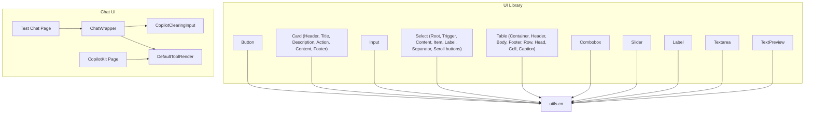

**Diagram sources**
- [button.tsx:1-60](file://src/components/ui/button.tsx#L1-L60)
- [card.tsx:1-93](file://src/components/ui/card.tsx#L1-L93)
- [input.tsx:1-22](file://src/components/ui/input.tsx#L1-L22)
- [select.tsx:1-186](file://src/components/ui/select.tsx#L1-L186)
- [table.tsx:1-117](file://src/components/ui/table.tsx#L1-L117)
- [combobox.tsx:1-75](file://src/components/ui/combobox.tsx#L1-L75)
- [slider.tsx:1-28](file://src/components/ui/slider.tsx#L1-L28)
- [label.tsx:1-25](file://src/components/ui/label.tsx#L1-L25)
- [textarea.tsx:1-19](file://src/components/ui/textarea.tsx#L1-L19)
- [text-preview.tsx:1-241](file://src/components/ui/text-preview.tsx#L1-L241)
- [chat-wrapper.tsx:1-709](file://src/components/chat-wrapper.tsx#L1-L709)
- [copilot-clearing-input.tsx:1-175](file://src/components/copilot-clearing-input.tsx#L1-L175)
- [default-tool-render.tsx:1-104](file://src/components/default-tool-render.tsx#L1-L104)
- [page.tsx:1-109](file://src/app/copilotkit/page.tsx#L1-L109)
- [test-chat/page.tsx:1-25](file://src/app/test-chat/page.tsx#L1-L25)
- [utils.ts:1-7](file://src/lib/utils.ts#L1-L7)

**Section sources**
- [button.tsx:1-60](file://src/components/ui/button.tsx#L1-L60)
- [card.tsx:1-93](file://src/components/ui/card.tsx#L1-L93)
- [input.tsx:1-22](file://src/components/ui/input.tsx#L1-L22)
- [select.tsx:1-186](file://src/components/ui/select.tsx#L1-L186)
- [table.tsx:1-117](file://src/components/ui/table.tsx#L1-L117)
- [combobox.tsx:1-75](file://src/components/ui/combobox.tsx#L1-L75)
- [slider.tsx:1-28](file://src/components/ui/slider.tsx#L1-L28)
- [label.tsx:1-25](file://src/components/ui/label.tsx#L1-L25)
- [textarea.tsx:1-19](file://src/components/ui/textarea.tsx#L1-L19)
- [text-preview.tsx:1-241](file://src/components/ui/text-preview.tsx#L1-L241)
- [chat-wrapper.tsx:1-709](file://src/components/chat-wrapper.tsx#L1-L709)
- [copilot-clearing-input.tsx:1-175](file://src/components/copilot-clearing-input.tsx#L1-L175)
- [default-tool-render.tsx:1-104](file://src/components/default-tool-render.tsx#L1-L104)
- [page.tsx:1-109](file://src/app/copilotkit/page.tsx#L1-L109)
- [test-chat/page.tsx:1-25](file://src/app/test-chat/page.tsx#L1-L25)
- [utils.ts:1-7](file://src/lib/utils.ts#L1-L7)

## Core Components
This section documents the primary UI primitives and composite components used across the application.

- Button
  - Purpose: Standard action control with variants and sizes.
  - Key props: className, variant, size, asChild.
  - Variants: default, destructive, outline, secondary, ghost, link.
  - Sizes: default, sm, lg, icon.
  - Accessibility: Inherits native button semantics; supports focus-visible ring and aria-invalid for invalid states.
  - Customization: Uses class variance authority for variants and sizes; integrates with radix slot for semantic composition.

- Card
  - Purpose: Container with header, title, description, action, content, and footer segments.
  - Composition: CardHeader, CardTitle, CardDescription, CardAction, CardContent, CardFooter.
  - Accessibility: Uses data-slot attributes for testing and styling hooks.

- Input
  - Purpose: Text input with focus-visible ring and aria-invalid styling for validation states.
  - Accessibility: Focus-visible outline and selection highlighting.

- Select
  - Purpose: Accessible dropdown with trigger, content, items, labels, separators, and scroll buttons.
  - Props: Root accepts primitive props; Trigger supports size; Content supports position.
  - Accessibility: Radix UI primitives; keyboard navigation; focus management.

- Table
  - Purpose: Scrollable table container with standardized header/body/footer/row/cell/caption.
  - Accessibility: Hover and selected states; checkbox alignment helpers.

- Combobox
  - Purpose: Free-text input with filtered dropdown; supports creating new values.
  - Props: options, value, onChange, placeholder, className.
  - Behavior: Open/close state, filtering, Enter to confirm new option.

- Slider
  - Purpose: Range slider with track and thumb.
  - Accessibility: Focus-visible ring; disabled state handling.

- Label
  - Purpose: Label for form controls with group and peer disabled states.

- Textarea
  - Purpose: Multi-line text input with focus-visible ring and aria-invalid styling.

- TextPreview
  - Purpose: Truncated preview with tooltip, copy, and link detection.
  - Props: text, maxLength, className, truncateLines.
  - Behavior: Tooltip positioning, click-outside dismissal, copy feedback.

**Section sources**
- [button.tsx:7-36](file://src/components/ui/button.tsx#L7-L36)
- [card.tsx:5-92](file://src/components/ui/card.tsx#L5-L92)
- [input.tsx:5-19](file://src/components/ui/input.tsx#L5-L19)
- [select.tsx:9-185](file://src/components/ui/select.tsx#L9-L185)
- [table.tsx:7-116](file://src/components/ui/table.tsx#L7-L116)
- [combobox.tsx:6-75](file://src/components/ui/combobox.tsx#L6-L75)
- [slider.tsx:8-28](file://src/components/ui/slider.tsx#L8-L28)
- [label.tsx:8-24](file://src/components/ui/label.tsx#L8-L24)
- [textarea.tsx:5-18](file://src/components/ui/textarea.tsx#L5-L18)
- [text-preview.tsx:7-241](file://src/components/ui/text-preview.tsx#L7-L241)

## Architecture Overview
The UI library composes Tailwind utility classes with class variance authority for variants and sizes. Components use a shared cn utility for merging classes. The chat UI integrates CopilotKit with custom input and styling, and renders tool call outputs with a default renderer.

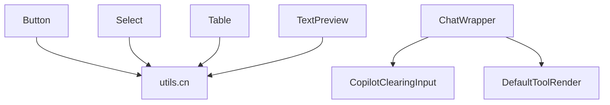

**Diagram sources**
- [utils.ts:4-6](file://src/lib/utils.ts#L4-L6)
- [button.tsx:5-56](file://src/components/ui/button.tsx#L5-L56)
- [select.tsx:7-185](file://src/components/ui/select.tsx#L7-L185)
- [table.tsx:5-116](file://src/components/ui/table.tsx#L5-L116)
- [text-preview.tsx:1-241](file://src/components/ui/text-preview.tsx#L1-L241)
- [chat-wrapper.tsx:1-709](file://src/components/chat-wrapper.tsx#L1-L709)
- [copilot-clearing-input.tsx:1-175](file://src/components/copilot-clearing-input.tsx#L1-L175)
- [default-tool-render.tsx:1-104](file://src/components/default-tool-render.tsx#L1-L104)

## Detailed Component Analysis

### Button
- Visual appearance: Rounded, shadowed, with variant-specific colors and hover effects; supports icons with size adjustments.
- Behavior: Disabled state prevents interaction and reduces opacity; focus-visible ring highlights active button.
- Interaction: Supports asChild to render as another element (e.g., Link).
- Props/events: className, variant, size, asChild; forwards button props; aria-invalid influences ring color.
- Customization: Extend variants/sizes via class variance authority; integrate icons via slots.

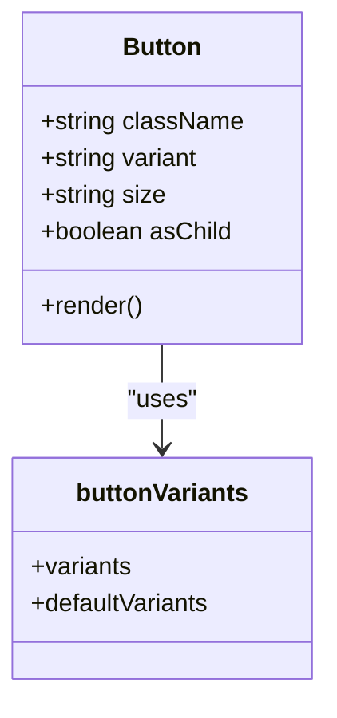

**Diagram sources**
- [button.tsx:38-57](file://src/components/ui/button.tsx#L38-L57)

**Section sources**
- [button.tsx:7-36](file://src/components/ui/button.tsx#L7-L36)
- [button.tsx:38-57](file://src/components/ui/button.tsx#L38-L57)

### Card
- Visual appearance: Card container with rounded corners, border, and shadow; header grid layout with optional action column.
- Behavior: Semantic segments compose a cohesive card layout; action placement controlled via grid.
- Interaction: None; relies on parent composition.
- Props/events: All segments accept className and spread props.
- Customization: Use data-slot attributes for styling hooks; adjust spacing and typography via className.

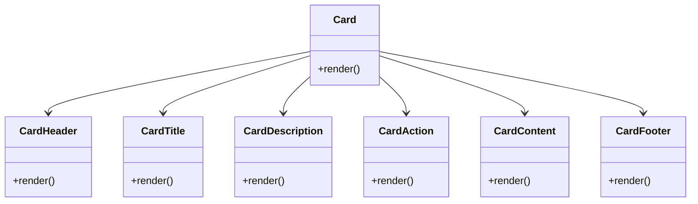

**Diagram sources**
- [card.tsx:5-92](file://src/components/ui/card.tsx#L5-L92)

**Section sources**
- [card.tsx:5-92](file://src/components/ui/card.tsx#L5-L92)

### Input
- Visual appearance: Clean border, placeholder styling, focus-visible ring, and destructive ring for invalid states.
- Behavior: Disabled state prevents editing and reduces opacity.
- Interaction: Standard input semantics; supports aria-invalid for validation feedback.
- Props/events: type and className forwarded; focus-visible and invalid states styled.
- Customization: Override base styles via className; integrate with forms for validation.

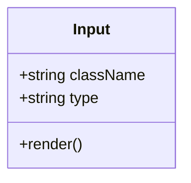

**Diagram sources**
- [input.tsx:5-19](file://src/components/ui/input.tsx#L5-L19)

**Section sources**
- [input.tsx:5-19](file://src/components/ui/input.tsx#L5-L19)

### Select
- Visual appearance: Trigger with chevron; content with popper positioning and scroll buttons; item indicators.
- Behavior: Controlled open/close; viewport sizing matches trigger; keyboard navigation supported by Radix UI.
- Interaction: Click trigger to toggle; arrow keys navigate items; Enter/Escape to confirm/close.
- Props/events: Root, Trigger, Content, Item, Label, Separator, ScrollUp/Down accept primitive props; size affects trigger height.
- Customization: Adjust position, size, and item styling via className; animate transitions handled by data-state attributes.

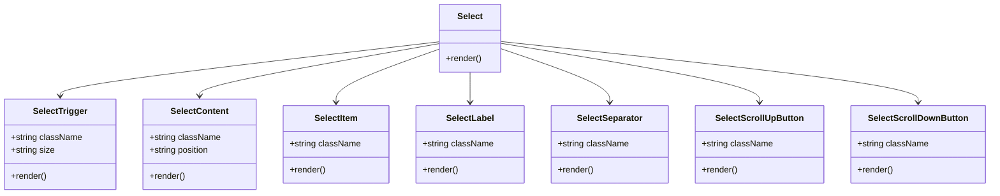

**Diagram sources**
- [select.tsx:9-185](file://src/components/ui/select.tsx#L9-L185)

**Section sources**
- [select.tsx:9-185](file://src/components/ui/select.tsx#L9-L185)

### Table
- Visual appearance: Scrollable container with striped hover and selected states; aligned checkbox support.
- Behavior: Responsive horizontal scrolling; hover and selection states.
- Interaction: None; designed for data presentation.
- Props/events: All segments accept className and spread props.
- Customization: Adjust caption, head, cell, and row spacing via className; maintain accessibility with role-aware markup.

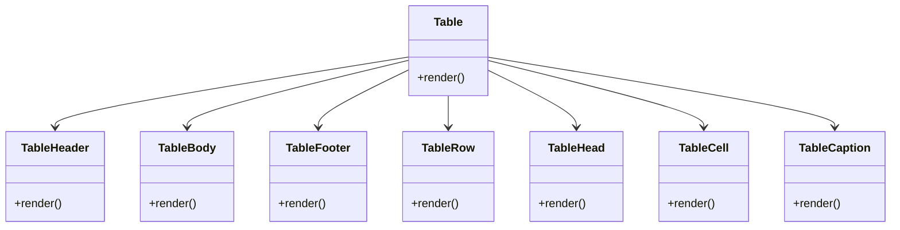

**Diagram sources**
- [table.tsx:7-116](file://src/components/ui/table.tsx#L7-L116)

**Section sources**
- [table.tsx:7-116](file://src/components/ui/table.tsx#L7-L116)

### Combobox
- Visual appearance: Trigger with chevron; dropdown with input and filtered list; checkmark for selected item.
- Behavior: Toggle open/close; filter options; allow creating new values on Enter; click outside closes.
- Interaction: Keyboard navigation within dropdown; Enter confirms new option if not existing.
- Props/events: options[], value, onChange(value), placeholder?, className?.
- Customization: Control styling via className; adjust input behavior and filtering logic.

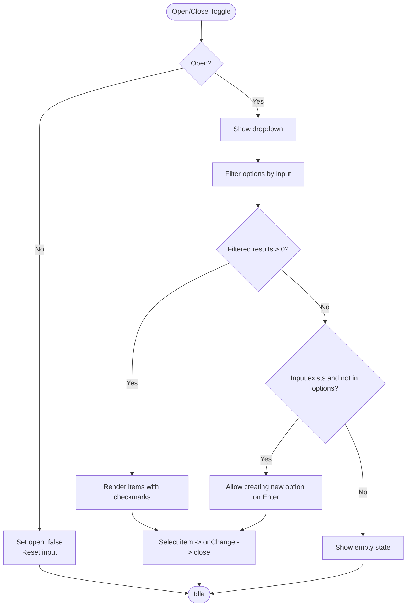

**Diagram sources**
- [combobox.tsx:14-75](file://src/components/ui/combobox.tsx#L14-L75)

**Section sources**
- [combobox.tsx:6-75](file://src/components/ui/combobox.tsx#L6-L75)

### Slider
- Visual appearance: Track with range; draggable thumb with focus ring.
- Behavior: Controlled via Radix UI; disabled state prevents interaction.
- Interaction: Keyboard and mouse interaction handled by Radix UI; focus-visible ring for accessibility.
- Props/events: Accepts all SliderPrimitive.Root props; className override supported.
- Customization: Adjust track and thumb visuals via className; integrate with forms for numeric input.

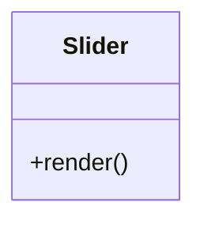

**Diagram sources**
- [slider.tsx:8-25](file://src/components/ui/slider.tsx#L8-L25)

**Section sources**
- [slider.tsx:8-25](file://src/components/ui/slider.tsx#L8-L25)

### Label
- Visual appearance: Inline label with group and peer disabled states.
- Behavior: Associates with form controls; respects disabled groups and peer-disabled states.
- Interaction: None; used for labeling.
- Props/events: Accepts LabelPrimitive.Root props; className override supported.
- Customization: Combine with inputs and selects for accessible labeling.

```mermermaid
classDiagram
  class Label {
    +render()
  }
```

**Diagram sources**
- [label.tsx:8-21](file://src/components/ui/label.tsx#L8-L21)

**Section sources**
- [label.tsx:8-24](file://src/components/ui/label.tsx#L8-L24)

### Textarea
- Visual appearance: Multi-line input with focus-visible ring and aria-invalid styling.
- Behavior: Disabled state prevents editing; auto-resize patterns can be implemented externally.
- Interaction: Standard textarea semantics; supports aria-invalid for validation feedback.
- Props/events: Accepts textarea props; className override supported.
- Customization: Integrate with autosize libraries or custom resize logic.

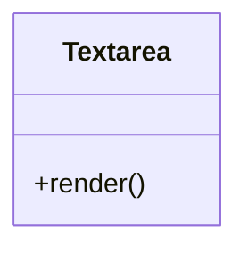

**Diagram sources**
- [textarea.tsx:5-15](file://src/components/ui/textarea.tsx#L5-L15)

**Section sources**
- [textarea.tsx:5-18](file://src/components/ui/textarea.tsx#L5-L18)

### TextPreview
- Visual appearance: Truncated text with ellipsis; tooltip overlay with copy and close actions.
- Behavior: Tooltip appears after delay; positioned above/below based on viewport; click outside closes.
- Interaction: Hover triggers tooltip; copy button writes to clipboard; close button dismisses.
- Props/events: text, maxLength, className, truncateLines; renders links as clickable anchors.
- Customization: Adjust truncation length and lines; customize tooltip size and actions.

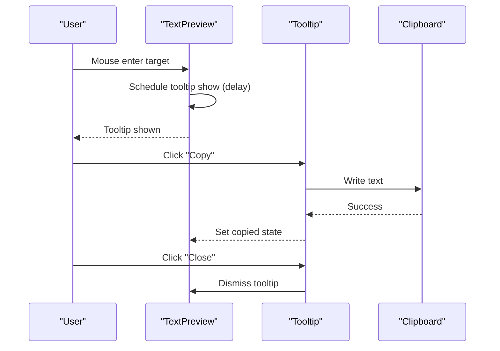

**Diagram sources**
- [text-preview.tsx:105-113](file://src/components/ui/text-preview.tsx#L105-L113)
- [text-preview.tsx:197-238](file://src/components/ui/text-preview.tsx#L197-L238)

**Section sources**
- [text-preview.tsx:7-241](file://src/components/ui/text-preview.tsx#L7-L241)

### Chat UI Components and AI Interactions
- ChatWrapper
  - Purpose: Renders CopilotKit chat with hydration-safe initialization and extensive custom styles.
  - Features: Hydration fixes via MutationObserver and periodic checks; message animations; scrollbars; markdown rendering enhancements; theming variables; responsive breakpoints.
  - Props/events: No props; manages internal mounted/isClient state; integrates CopilotClearingInput as Input.
  - Customization: Global styles scoped to CopilotKit containers; theming via CSS variables; animations respect prefers-reduced-motion.

- CopilotClearingInput
  - Purpose: Enhanced input with auto-resizing textarea, reliable clearing after send, and send/stop controls.
  - Features: flushSync for immediate UI updates; maxRows auto-resize; Enter to send; powered-by line conditionally shown.
  - Props/events: inProgress, onSend, onStop, onUpload; exposes canSend logic; integrates with CopilotKit context.
  - Customization: Adjust maxRows, placeholder, and styling via className; integrate upload handler.

- DefaultToolRender
  - Purpose: Renders MCP tool call status with collapsible details and formatted output.
  - Features: Status indicators (pulse for inProgress/executing), collapsible sections, JSON formatting, chevron toggle.
  - Props/events: status ("complete" | "inProgress" | "executing"), name, args, result.
  - Customization: Modify sections, colors, and formatting; integrate with tool call handlers.

- CopilotKit Page and Test Chat Page
  - Purpose: Demonstrates sidebar integration and basic chat embedding.
  - Features: Sidebar with suggestions and catch-all tool rendering; themed primary color; MCP server management UI.

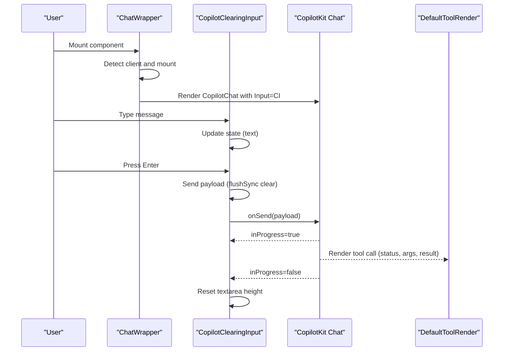

**Diagram sources**
- [chat-wrapper.tsx:7-709](file://src/components/chat-wrapper.tsx#L7-L709)
- [copilot-clearing-input.tsx:84-175](file://src/components/copilot-clearing-input.tsx#L84-L175)
- [default-tool-render.tsx:12-104](file://src/components/default-tool-render.tsx#L12-L104)
- [page.tsx:12-26](file://src/app/copilotkit/page.tsx#L12-L26)
- [test-chat/page.tsx:5-25](file://src/app/test-chat/page.tsx#L5-L25)

**Section sources**
- [chat-wrapper.tsx:1-709](file://src/components/chat-wrapper.tsx#L1-L709)
- [copilot-clearing-input.tsx:84-175](file://src/components/copilot-clearing-input.tsx#L84-L175)
- [default-tool-render.tsx:12-104](file://src/components/default-tool-render.tsx#L12-L104)
- [page.tsx:12-26](file://src/app/copilotkit/page.tsx#L12-L26)
- [test-chat/page.tsx:5-25](file://src/app/test-chat/page.tsx#L5-L25)

## Dependency Analysis
- Component coupling
  - UI components depend on shared cn utility for class merging.
  - Select, Button, Input, Table, TextPreview use cn for consistent styling.
- External dependencies
  - Button uses class-variance-authority and radix slot.
  - Select uses @radix-ui/react-select; Slider uses @radix-ui/react-slider; Label uses @radix-ui/react-label.
  - Chat UI depends on @copilotkit/react-ui and @copilotkit/react-core.
- Integration points
  - ChatWrapper integrates CopilotClearingInput and DefaultToolRender.
  - CopilotKit page demonstrates sidebar and tool rendering integration.

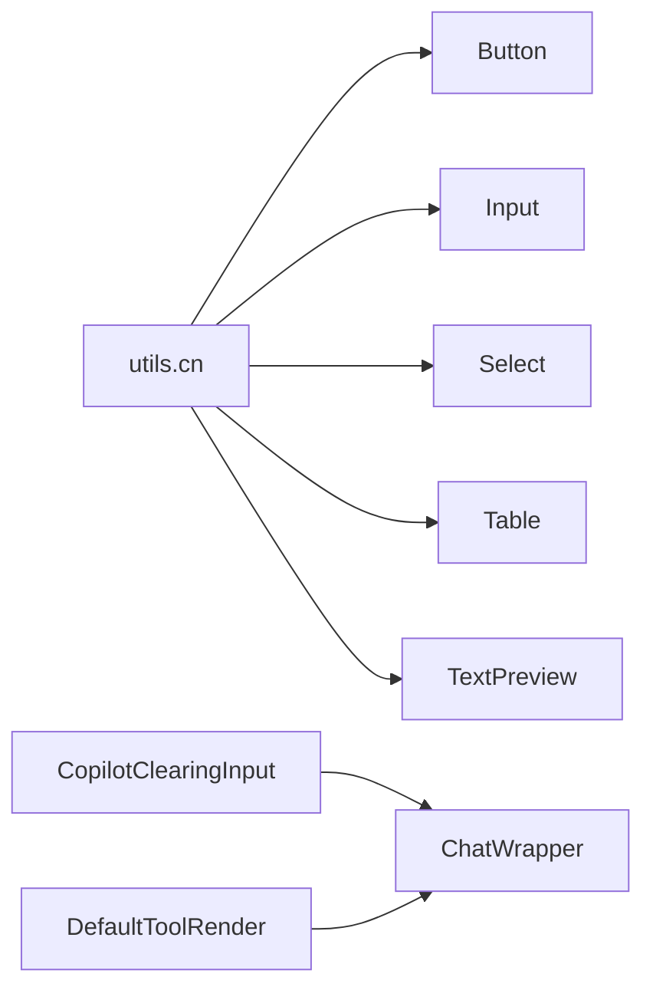

**Diagram sources**
- [utils.ts:4-6](file://src/lib/utils.ts#L4-L6)
- [button.tsx:5-56](file://src/components/ui/button.tsx#L5-L56)
- [input.tsx:3-19](file://src/components/ui/input.tsx#L3-L19)
- [select.tsx:4-185](file://src/components/ui/select.tsx#L4-L185)
- [table.tsx:5-116](file://src/components/ui/table.tsx#L5-L116)
- [text-preview.tsx:1-241](file://src/components/ui/text-preview.tsx#L1-L241)
- [copilot-clearing-input.tsx:1-175](file://src/components/copilot-clearing-input.tsx#L1-L175)
- [chat-wrapper.tsx:1-709](file://src/components/chat-wrapper.tsx#L1-L709)
- [default-tool-render.tsx:1-104](file://src/components/default-tool-render.tsx#L1-L104)

**Section sources**
- [utils.ts:4-6](file://src/lib/utils.ts#L4-L6)
- [button.tsx:5-56](file://src/components/ui/button.tsx#L5-L56)
- [input.tsx:3-19](file://src/components/ui/input.tsx#L3-L19)
- [select.tsx:4-185](file://src/components/ui/select.tsx#L4-L185)
- [table.tsx:5-116](file://src/components/ui/table.tsx#L5-L116)
- [text-preview.tsx:1-241](file://src/components/ui/text-preview.tsx#L1-L241)
- [copilot-clearing-input.tsx:1-175](file://src/components/copilot-clearing-input.tsx#L1-L175)
- [chat-wrapper.tsx:1-709](file://src/components/chat-wrapper.tsx#L1-L709)
- [default-tool-render.tsx:1-104](file://src/components/default-tool-render.tsx#L1-L104)

## Performance Considerations
- Prefer memoized computations for large lists (e.g., Combobox filtering).
- Defer heavy DOM mutations to requestAnimationFrame (as seen in chat hydration fixes).
- Use CSS containment and transforms for smooth animations; avoid layout thrashing.
- Limit re-renders by keeping state minimal and using shallow comparisons where appropriate.
- Optimize table rendering by virtualizing long lists when applicable.

## Troubleshooting Guide
- Hydration mismatches in chat
  - Symptoms: Console warnings about mismatched HTML during SSR.
  - Resolution: ChatWrapper applies MutationObserver and periodic fixes; ensure client-side initialization guards are respected.
- Input clearing reliability
  - Symptoms: Text persists after send.
  - Resolution: CopilotClearingInput uses flushSync to immediately clear state; verify onSend is invoked and textarea ref is focused.
- Tool rendering
  - Symptoms: Tool call details not visible.
  - Resolution: Ensure useCopilotAction registers DefaultToolRender for catch-all actions; verify status and payload are passed correctly.
- Accessibility
  - Ensure labels are associated with inputs; use Label component; verify focus-visible rings and aria-invalid states.
- Cross-browser compatibility
  - Test CSS Grid and Flexbox fallbacks; verify @supports usage for advanced features; ensure polyfills for Clipboard API if needed.

**Section sources**
- [chat-wrapper.tsx:17-59](file://src/components/chat-wrapper.tsx#L17-L59)
- [copilot-clearing-input.tsx:105-119](file://src/components/copilot-clearing-input.tsx#L105-L119)
- [default-tool-render.tsx:12-104](file://src/components/default-tool-render.tsx#L12-L104)
- [label.tsx:8-24](file://src/components/ui/label.tsx#L8-L24)
- [input.tsx:5-19](file://src/components/ui/input.tsx#L5-L19)

## Conclusion
The UI library provides a consistent, accessible, and customizable foundation for building forms and interactive surfaces. The chat UI extends this foundation with CopilotKit, offering rich AI interaction patterns, robust input handling, and polished visual feedback. By leveraging shared utilities, class variance authority, and Radix UI primitives, components remain flexible and maintainable while supporting responsive and accessible experiences.

## Appendices
- Usage examples (paths only)
  - Button: [button.tsx:38-57](file://src/components/ui/button.tsx#L38-L57)
  - Card: [card.tsx:5-92](file://src/components/ui/card.tsx#L5-L92)
  - Input: [input.tsx:5-19](file://src/components/ui/input.tsx#L5-L19)
  - Select: [select.tsx:9-185](file://src/components/ui/select.tsx#L9-L185)
  - Table: [table.tsx:7-116](file://src/components/ui/table.tsx#L7-L116)
  - Combobox: [combobox.tsx:14-75](file://src/components/ui/combobox.tsx#L14-L75)
  - Slider: [slider.tsx:8-25](file://src/components/ui/slider.tsx#L8-L25)
  - Label: [label.tsx:8-24](file://src/components/ui/label.tsx#L8-L24)
  - Textarea: [textarea.tsx:5-18](file://src/components/ui/textarea.tsx#L5-L18)
  - TextPreview: [text-preview.tsx:14-241](file://src/components/ui/text-preview.tsx#L14-L241)
  - ChatWrapper: [chat-wrapper.tsx:7-709](file://src/components/chat-wrapper.tsx#L7-L709)
  - CopilotClearingInput: [copilot-clearing-input.tsx:84-175](file://src/components/copilot-clearing-input.tsx#L84-L175)
  - DefaultToolRender: [default-tool-render.tsx:12-104](file://src/components/default-tool-render.tsx#L12-L104)
  - CopilotKit Page: [page.tsx:12-26](file://src/app/copilotkit/page.tsx#L12-L26)
  - Test Chat Page: [test-chat/page.tsx:5-25](file://src/app/test-chat/page.tsx#L5-L25)
  - Utility: [utils.ts:4-6](file://src/lib/utils.ts#L4-L6)